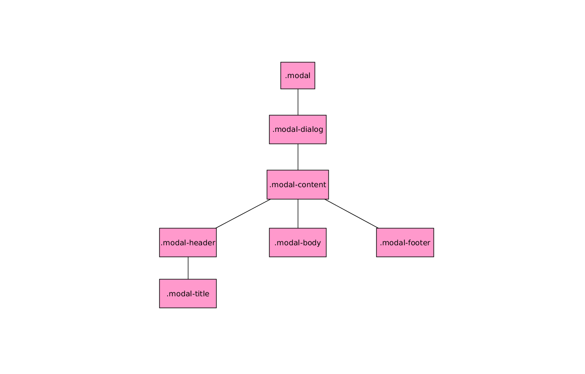

# Componente Modal

El componente *Modal* es la típica ventana flotante que se posiciona sobre el resto de los elementos oscureciendo y deshabilitando el resto de nuestra página web.

La estructura del DOM y las clases BootStrap 4 que deben tener una ventana modal son las siguientes:



No debemos tener todos los elementos, algunos son opcionales. Para más información visitar la documentación.

Un ejemplo de esta estructura sería:

```html

    <div class="modal">
      <div class="modal-dialog">
        <div class="modal-content">
          <div class="modal-header">
            <div class="modal-title">
              Título
            </div>            
          </div>
          <div class="modal-body">
            Contenido de la venta modal
          </div>
          <div class="modal-footer">
            Pie de la ventana modal
          </div>
        </div>
      </div>
    </div>
```

Además de esta estructura necesitaremos un elemento que sirva para mostrar dicha ventana *Modal*. Un ejemplo de ello sería:

```html

  <div class="btn btn-info" data-toggle="modal" data-target="#my_modal_ID">
    Mostrar ventana modal
  </div>

```

Siendo:

* ***data-toggle:*** Atributo BootStrap 4 que indica que el elemento interaccionará mostrando las ventanas modales.
* ***data-target:*** Que enlace con ID del elemento de nuestro árbol que se comportará como ventana modal.

Podemos comprobar que cuando hacemos click sobre el resto de la página la ventana modal se ocultará.

### Fundido al aparecer / desaparecer

Si queremos que la aparición/desaparición sea mediante un efecto de fundido debemos añadir la clase ***fade*** al elemento padre que tiene la clase ***modal***.

### Scroll
Es importante destacar que si el contenido de la ventana es muy grande hace que esta tenga un **scroll independiente** del resto de la página.

### Centrado vertical

Si queremos centrar verticalmente la ventana modal debemos añadir la clase ***modal-dialog-centered*** al elemento que tiene la clase ***modal-dialog***.

### Elementos de la venta para forzar el cierre de la misma

Si queremos añadir elementos dentro de la ventana que fuercen el cierre de la misma debemos añadir a esos elementos el siguiente atributo-valor ***data-dismiss="modal"*** .


###Otras apreciaciones

* Todos los *tooltipss* y *popover* que contenga la ventana modal se cerrarán al cerrarla.
* Puedo hacer más ancha o más estrecha la ventana modal añadiendo la clase ***modal-sm*** (más estrecha) o ***modal-lg*** al elemento que tiene la clase ***modal-dialog***

## Funciones asociadas

Las más importantes son, bajo mi punto de vista:

* ***.modal(options)*** Habilita un elemento como ventana modal. Para más información sobre las posibles opciones visitar el manual.
* ***.modal('show')*** Muestra la ventana modal.
* ***.modal('hide')*** Oculta la ventana modal.
* ***modal.('toogle')*** Cambio el estado de visibilidad de la ventana modal.

## Eventos asociados

La interacción con este tipo de elementos genera 4 nuevos tipos de eventos, bastante auto explicativos por su nombre y de los cuáles, para saber más detalles deberemos visitar el manual de referencia.

* ***show.bs.modal***
* ***shown.bs.modal***
* ***hide.bs.modal***
* ***hidden.bs.modal***
