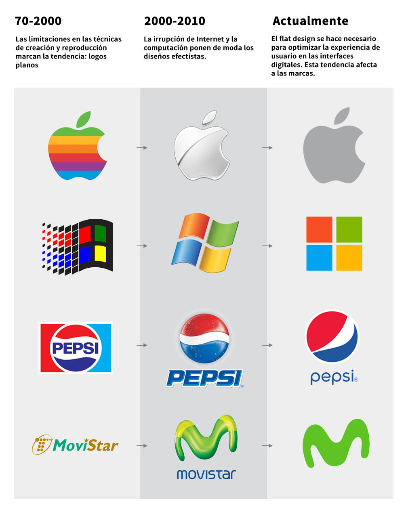

# 1. Evolución del diseño web

Tabla de contenidos

-   [1.1. Evolución del diseño web](#1.1.-Evolución-del-diseño-web)
-   [1.2. Evolución del diseño de los logotipos](#1.2.-Evolución-del-diseño-de-los-logotipos)
-   [1.3. Inspiración para el diseño web: recursos online](1.3.-Inspiración-para-el-diseño-web:-recursos-online)

## 1.1. Evolución del diseño web

Cuando hablamos de la historia del diseño web, el momento inicial lo encontramos en 1990, cuando nace la **primera versión de [HTML](https://www.w3schools.com/html/)**, en dónde el texto dominaba el espacio. Desde los orígenes hasta nuestros días, son muchos los avances dirigidos a mejorar la navegación de los usuarios. Te contamos **cómo ha evolucionado desde entonces el diseño web.**

#### **De la primera página web a la animación Flash**

En 1991, un año más tarde de la creación de la primera versión de HTML, [**Tim Berners-Lee**](https://es.wikipedia.org/wiki/Tim_Berners-Lee) **crea el primer sitio web** con el objetivo de informar de los avances sobre las características del hipertexto o de los requisitos técnicos para diseñar nuevas páginas. Sin embargo, por entonces únicamente los miembros del CERN (Organización Europea para la Investigación Nuclear) tenían acceso a esta página, por lo que su **difusión fue mínima**. 

**Curiosidad sobre la primera foto subida a Internet:**

Se trataba de un grupo de música aficionado llamado **Les Horribles Cernettes**. Este nombre ha pasado a la historia porque su fotografía, tomada el 18 de julio de 1992, tiene el mérito de haber sido la primera subida a Internet.

El creador de la World Wide Web, **Tim Berners Lee**, fue el que tuvo la idea de subir la foto a la nueva red. Sus compañeros se extrañaron porque en esos momentos Internet estaba compuesto exclusivamente de texto y sólo lo utilizaban físicos.

[**Leer noticia completa en ABC**](https://www.abc.es/tecnologia/abci-primera-foto-subida-internet-201207110000_noticia.html)

En el 1992, con la aparición de los navegadores, las tablas fueron una revolución, un gran avance con respecto a la visualización de los documentos y la experiencia\
ofrecida a los usuarios. Más adelante, otros elementos reemplazarán su función, permitiendo lograr lo mismo con menos código, facilitando la creación, permitiendo portabilidad y ayudando al mantenimiento de los sitios web.

Pocos años después, en 1994, se conformó el [World Wide Web Consortium](https://www.w3c.es/).

A mediados de los noventa, **Flash y Javascript** dieron lugar a las animaciones con efectos visuales, haciendo posible resolver las limitaciones del HTML. A partir de ese momento, el problema era la larga espera que experimentaban los navegantes cuando cargaban estas páginas tan sumamente animadas.

#### **La llegada de CSS y PHP**

Alrededor de 1998, se experimentó con **[CSS](https://www.w3schools.com/css/) y PHP** para crear páginas webs dinámicas y de carga más rápida.

La **Web 2.0** llegó en 2003, con nuevas funcionalidades CSS3 y una información basada directamente en el usuario. En este punto, las redes sociales y los blogs empezaron a hacerse más notables.

#### **Web responsive con la llegada de los smartphones**

En 2008 los smartphones comienzan a pedir diseño web propio y en el año 2012 se presenta el **Diseño Web Responsive**. Las webs se optimizaron para todo tipo de dispositivos y pantallas. Desde aquel momento, se presenta la información al usuario de una manera operativa, bajo el lema "**el contenido por encima de todo**". Atrás dejamos los efectos de sombra y recuperamos las fotografías, las fuentes sencillas y las líneas.

#### **El diseño web en la actualidad**

En la actualidad, están en alza los desarrolladores de sitios web como herramienta práctica para diseñarlos, junto con el **diseño 3D** (representación tridimensional de datos geométricos) y el dominio de los **gráficos vectoriales**, que pueden ser escalados ilimitadamente sin perder su calidad.

En el futuro, ¿cuál crees que serán los avances en diseño web? Lo que es seguro es que esta materia seguirá en constante transformación y con un progreso impredecible. 

**Ver ejemplos de diseños increíbles:**

-   [Ejemplo de página solo con CSS](https://codepen.io/ivorjetski/pen/xMJoYO)
-   [An experiment in creating 3D environments using CSS and HTML and JavaScript](https://keithclark.co.uk/labs/css-fps/desktop/)
-   [Simulación de fluidos](https://paveldogreat.github.io/WebGL-Fluid-Simulation/)

#### **Ejemplo de evolución del diseño web**

En la página web [archive.org](http://archive.org/) puedes ver la evolución de casi cualquier web a lo largo de los años. Pincha en los siguientes enlaces para ver la evolución de las distintas webs. Utiliza la barra de selección superior para navegar entre las distintas páginas.

-   [Evolución web de Google](https://web.archive.org/web/19981202230410/http://www.google.com/)
-   [Evolución web Universidad Alicante](https://web.archive.org/web/19981203081855/http://www.ua.es/)
-   [Evolución web Marca.com](https://web.archive.org/web/19981207003841/http://www.marca.com/)

## 1.2. Evolución del diseño de los logotipos
---------------------------------------------

Veamos ahora el siguiente tablero en el que se ha recogido la **evolución del diseño de varios logotipos** a lo largo del tiempo.

EniunEvolucion de los logotiposSeguir en

## 1.3. Inspiración para el diseño web: recursos online
-------------------------------------------------------

A la hora de encontrar inspiración y **trabajar la creatividad,** es muy útil ver ejemplos de diseños web profesionales y conocer las últimas tendencias. Para conseguir este objetivo hemos seleccionado las **[páginas web más interesantes para estar al día de las últimas noticias y novedades del sector del diseño web](https://www.eniun.com/inspiracion-diseno-web-recursos-imprescindibles/)**.