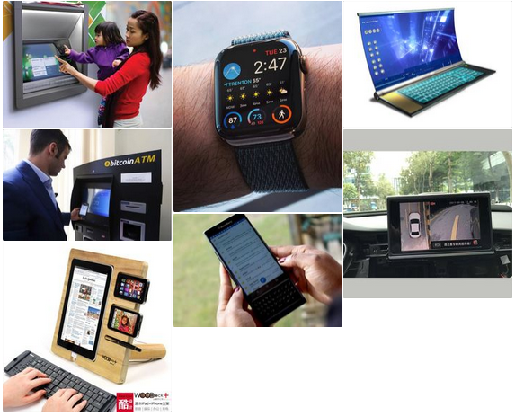

# Interacción persona-ordenador (IPO)

Tabla de contenidos

-   [2. Interacción persona-ordenador](#Interacción-persona-ordenador)
-   [2.1. ¿Por qué es importante estudiar la interfaz de usuario?](2.1.-Por-que-es-importante-estudiar-la-interfaz-de-usuario)

# 2. Interacción persona-ordenador
---------------------------------

La **interacción persona-ordenador (IPO),** también conocida como Human-Computer Interaction (HCI) o Computer-Human Interaction (CHI), es la disciplina dedicada a estudiar cómo se produce la **interacción entre las personas y los sistemas informáticos** para tratar de mejorar esta relación por medio del diseño gráfico.

Su objetivo principal es **incrementar la productividad de los equipos y minimizar los errores al tiempo que se dota a los usuarios de una experiencia segura, confortable y satisfactoria.**

> La Interacción persona-ordenador es la disciplina relacionada con el diseño, evaluación y implementación de sistemas informáticos interactivos para el uso de seres humanos, y con el estudio de los fenómenos más importantes con los que está relacionado.
>
> ACM, Association for Computer Machinery.

## 2.1. ¿Por qué es importante estudiar la interfaz de usuario?

Generalmente, los **sistemas informáticos** son interactivos e **involucran al usuario** en la resolución de tareas. Para conseguir esta interacción o diálogo entre persona-ordenador se utiliza la interfaz. Esta **interfaz** de usuario determina, en gran medida, la **percepción que el usuario tendrá de una aplicación** y es un factor de gran importancia para conseguir una **aplicación exitosa**.

Ejemplos de interfaces

Los estudios realizados por **Myers y Rosson [MYE92]** en una encuesta hecha a diferentes desarrolladores, demuestran que alrededor del **48% del código de una aplicación está dedicado a la interfaz**.

Otros estudios demuestran que el **80% de los costes de mantenimiento** de una aplicación son debidos a **problemas del usuario con el sistema y no con errores de código o bugs**. Entre ellos, alrededor del **64% son problemas de usabilidad**.

**A pesar de su importancia** la interacción persona-ordenador es una disciplina a la que **no se le da el suficiente valor en los estudios de informática** y, muchas veces, no se utiliza en el momento de hacer la documentación de un proyecto.

Leer más información en la página web de la **[Asociación Interacción Persona-Ordenador](https://aipo.es/content/libro-aipo)**.