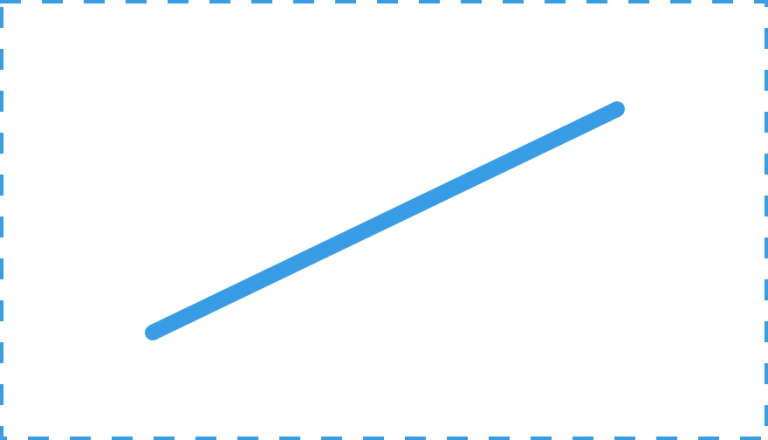
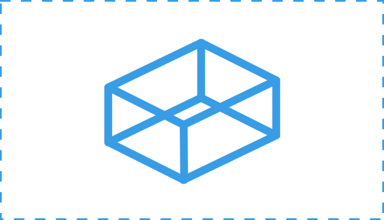

# 3. Elementos conceptuales: punto, línea, plano y volumen

Tabla de contenidos

-   [3.1. El punto](#31-El-punto)
-   [3.2. La línea](#32-La-linea)
-   [3.3. El plano](#33-El-plano)
-   [3.4. El volumen](#34-El-volumen)

Un diseñador de interfaces web debe conocer los elementos conceptuales básicos del diseño y utilizar un lenguaje común que describa de manera genérica las acciones y los elementos, incluso antes de que estos sean visibles en la interfaz.

Los elementos conceptuales se utilizan durante las primeras etapas del diseño, cuando aún se está prototipando. Son efímeros e invisibles, ya que son utilizados únicamente para plasmar una idea, una posición o una dirección dentro de un determinado espacio visual.

## 3.1. El punto
-------------

Cuando se habla de un punto se hace para indicar una posición dentro de un espacio determinado. Cuando hacemos foco en un punto concreto tenemos que tener en cuenta los elementos adyacentes y su influencia.

-   No posee ninguna dimensión.
-   No tiene posición en el espacio.
-   **I**ndica una dirección.
-   Es el principio y el fin de una línea.
-   Es donde dos líneas se encuentran o se cruzan.

**Transformación:** Cuando un punto se mueve, su recorrido se transforma en una línea o puede considerarse también una sucesión de puntos.

## 3.2. La línea

Es un ente invisible, es la traza que deja un punto al moverse. Es, por lo tanto, un producto que surge del movimiento.

-   Posee una sola dimensión, largo.
-   Tiene posición y dirección en el espacio.
-   Está limitada por puntos y forma los bordes de un plano.

**Transformación:** El recorrido de una línea en movimiento crea un plano.

## 3.3. El plano

Como elemento icónico, tienen una naturaleza absolutamente espacial. Nos permite imaginar un contenedor de una sola dimensión con superficie material.

-   Posee dos dimensiones, largo y ancho.
-   Tiene posición y dirección en el espacio.
-   Está limitado por líneas.
-   Define los límites extremos de un volumen.

**Transformación:** El recorrido de un plano en movimiento da lugar a la aparición del volumen.

## 3.4. El volumen

Este concepto facilita la representación más realista de los elementos del diseño. Nos permite fragmentar el espacio plástico de la imagen sugiriendo una tercera dimensión a partir de la articulación de planos bidimensionales superpuestos.

-   Posee tres 3 dimensiones, largo, ancho y profundidad.
-   Tiene posición en el espacio.
-   No tiene dirección.
-   Está limitado por planos.

**Transformación:** No tiene ninguna transformación.