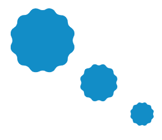
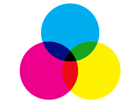
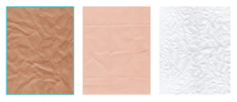

# 4. Elementos visuales: forma, medida, color, textura

Tabla de contenidos

-   [4.1. La forma](#41-La-forma)
-   [4.2. La medida](#42-La-medida)
-   [4.3. El color](#43-El-color)
-   [4.4. La textura](#44-La-textura)

En el artículo anterior vimos los elementos básicos conceptuales que nos permiten crear formas de todo tipo. Estos elementos básicos con los que podemos crear elementos más complejos tienen unas características visuales, que son la forma, la medida, el color y la textura.

## 4.1. La forma
La forma tiene lugar cuando una línea se une con otra cerrando un plano. El área encerrada destaca con respecto al espacio que le rodea.

Figura 4.1. FORMA

## 4.2. La medida

Todos los elementos tienen un tamaño que se puede establecer por comparación con el resto de elementos presentes. Por tanto, se puede decir si un elemento es más grande o más pequeño que otro. Además, los elementos son físicamente medibles.

Figura 4.2. MEDIDA

## 4.3. El color
Los diferentes elementos no sólo se diferencian por su forma o tamaño, sino también por su color. En este sentido, es posible utilizar cualquier color, en cualquier variación tonal y cromática.

Figura 4.3. COLOR

## 4.4. La textura

La textura se refiere a la apariencia de la superficie de un elemento, que puede ser plana, con relieve, suave, áspera, homogénea, rugosa, etc.

Figura 4.4. TEXTURA