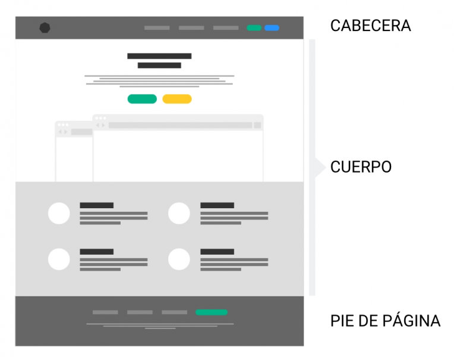
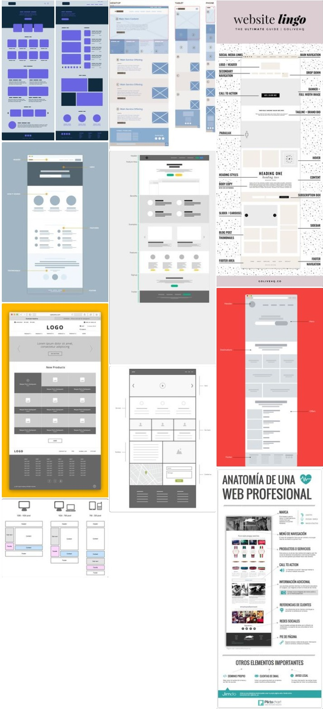

# 9. Componentes de una interfaz web

Tabla de contenidos

-   [9.1. Cabecera o header](#91-Cabecera-o-header)
-   [9.2. Cuerpo de la página](#92-Cuerpo-de-la-pagina)
-   [9.3. Pie de página o footer](#93-Pie-de-pagina-o-footer)
-   [9.4. Otros elementos](#94-Otros-elementos)
-   [9.5. Ejemplos](#95-Ejemplos)

En prácticamente todas las páginas web hay elementos que son comunes. Algunos ejemplos son: la cabecera, el menú de navegación, el cuerpo o el pie de página. Conocer el nombre de cada una de las partes de un sitio web es esencial ya que forma parte del vocabulario utilizado por los desarrolladores y diseñadores. La siguiente figura muestra la estructura general de un sitio web.

Figura 9.1. Componentes de una interfaz web

## 9.1. Cabecera o *header*

La cabecera o header es la zona de la interfaz web situada en la parte superior y que sirve para identificar la empresa o marca. Normalmente se utiliza para mostrar el logotipo de la empresa o su nombre. Además, este espacio da cabida a textos descriptivos, imágenes, paneles de acceso o banners publicitarios, entre otras cosas. Aunque la cabecera no es obligatoria, es utilizada en prácticamente todos los desarrollos de sitios web.

Debido a nuestra lectura visual, de arriba a abajo y de izquierda a derecha, el primer elemento que vemos en toda interfaz web es la parte superior izquierda de la página. Por este motivo, no es de extrañar que se aproveche este espacio para posicionar el logotipo y el nombre de la marca.

## 9.2. Cuerpo de la página

El cuerpo de la página es donde se muestran los contenidos. Puede verse acompañado de uno o varios *sidebars* (o menús laterales de navegación). Se sitúa bajo de la cabecera o header o bajo del *navbar* (o menú de navegación principal).

Generalmente, el cuerpo de la página cuenta con un título descriptivo. Todos los elementos del cuerpo de página deben seguir la guía de estilo del resto de la web.

## 9.3. Pie de página o *footer*

El pie de página o *footer* se sitúa en la parte inferior de una interfaz web, bajo el cuerpo de la página. Generalmente, suele utilizarse para para mostrar enlaces a servicios, formulario de contacto, *banners* publicitarios, políticas de privacidad y *cookies*, entre otras cosas.

## 9.4. Otros elementos

-   Menú de navegación o *navbar*
-   *Sidebar*
-   Carrusel o Slider
-   *Action bar*
-   Anuncio, *Banner* o *Ad*
-   Ventana *popup*
-   *Tooltip*
-   Pestañas o *Tab*
-   Formulario de contacto o *Contact form*
-   Barras de progreso o *Progress bars*
-   Menú hamburguesa o *Togle*
-   etc.

## 9.5. Ejemplos

Veamos ahora el siguiente tablero de Pinterest en el que se han recogido diferentes páginas web con la descripción de sus componentes.

Figura 9.2. Ejemplos de una interfaz web