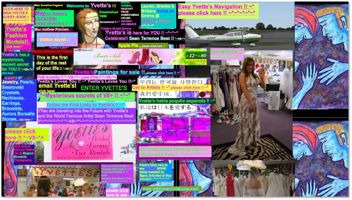
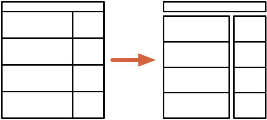
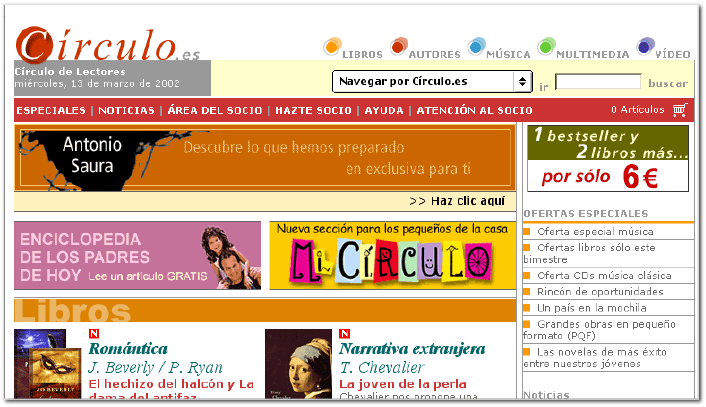
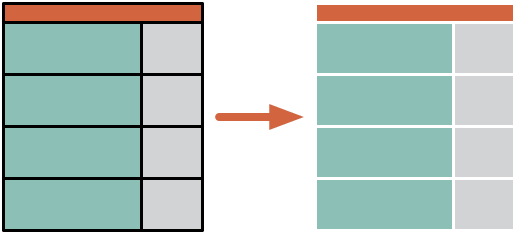
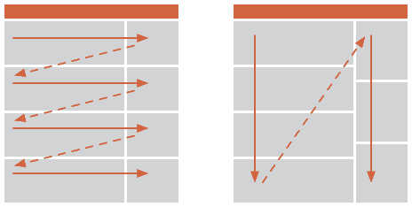
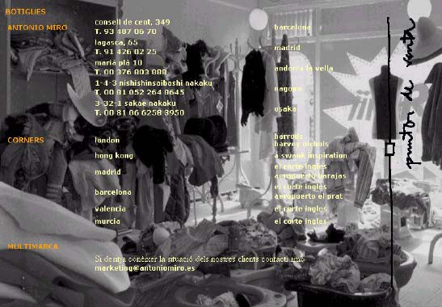

# 10. Leyes Gestalt en el diseño de interfaces digitales

Tabla de contenidos

-   [10.1. Ley de la proximidad](#101-Ley-de-la-proximidad)
-   [10.2. Ley de la semejanza](#102-Ley-de-la-semejanza)
-   [10.3. Ley del cierre](#103-Ley-del-cierre)
-   [10.4. Ley de continuidad o destino común](#104-Ley-de-continuidad-o-destino-común)
-   [10.5. Ley del contraste](105-Ley-del-contraste)
-   [10.6. Ley de la experiencia](106-Ley-de-la-experiencia)

**¿Cómo podemos aplicarlas para conseguir simplicidad y claridad en nuestros diseños?**

Los diseñadores saben de la gran importancia que tienen aspectos de diseño como el uso de márgenes, la distancia entre los diferentes elementos de la página, el contraste entre las figuras y el fondo, la aplicación de diferentes patrones gráficos de diseño para diferenciar elementos, etc. Me atrevería a decir que aplican estos recursos sobre todo basándose en su experiencia, de una manera instintiva, y con el objetivo de conseguir un diseño claro. En el fondo, lo que están aplicando de una manera más o menos consciente son algunas de las Leyes Gestalt. En este *post* vamos a reflexionar sobre cómo podemos aplicar las Leyes Gestalt para conseguir un diseño claro.

Estas leyes, que a nivel general explican cómo debe ser la figura, el fondo y la buena forma, fueron descritas a principios del siglo XX por la corriente de la psicología Gestalt. Esta corriente defiende que la percepción se rige por unas leyes que se basan en que la interpretación y significación de la obra (página web, pintura, música...) depende de la relación que se establece entre los elementos que la forman, relación condicionada por los atributos (gráficos, auditivos, táctiles...) de cada elemento individual.

**¿Pero por qué un diseño claro?**

¿Alguna vez te has preguntado qué es lo primero que realizamos al fijar la atención en una imagen? El psicólogo [Rudolph Arnheim](https://es.wikipedia.org/wiki/Rudolph_Arnheim) nos lo explica:

> Lo que percibimos en primera instancia en una imagen es su esquema organizativo global, el conjunto, donde residen una serie de fuerzas que determinan el equilibrio y las zonas de atracción máxima.

Lo que necesitamos como espectadores o usuarios es claridad, porque sino se dificulta este proceso de percepción del esquema global, que debe durar fracciones de segundo, y es imprescindible para que podamos plantearnos objetivos en base a lo que se nos presenta delante.

**¿Por qué percibimos la siguiente página web desconcertante y fea?**

Porque cuesta horrores percibir un esquema organizativo global. Como diseñadores, cuando aplicamos las Leyes Gestalt, éstas nos ayudan a construir un esquema organizativo global.

# Aplicando las Leyes Gestalt

## 10.1. Ley de la proximidad

La ley de proximidad nos dice que los elementos próximos tendemos a percibirlos como una unidad. Por lo tanto, al componer una página, debemos agrupar los elementos que tienen relación entre ellos, y separarlos del resto como indica la siguiente figura:

En el siguiente ejemplo, podemos ver que no se aplica la ley de la distancia, obteniendo un diseño abigarrado y tosco, y cuesta más tiempo de lo normal entender el esquema en el que se basa la composición de la página:

## 10.2. Ley de la semejanza

Esta ley, como la anterior, nos permitirá relacionar los elementos que deben percibirse como una unidad, utilizando las diferencias de atributos gráficos. En la siguiente figura podemos observar como sin utilizar la ley de proximidad podemos igualmente relacionar elementos aplicando los mimos atributos a aquellos que deseamos agrupar.

En el siguiente ejemplo -web de [eDreams](http://www.edreams.com/) de bastantes años atrás- vemos cómo se aplica esta ley de manera correcta y consistente, aunque al no usarse la ley de proximidad para agrupar elementos el resultado es algo abigarrado y pesado.

Fijémonos que los tres bloques de la parte inferior se perciben como un conjunto: tres bloques que tienen "algo" en común, en este caso que pertenecen a listas de "Ofertas". Lo mismo sucede con los *banners* publicitarios, que tienen un tratamiento muy parecido, aunque con la aplicación de la ley a la inversa, que consigue que el elemento principal, el buscador, destaque por encima de los demás.

## 10.3. Ley del cierre

Es evidente que contorneando unos elementos con una línea se percibirán agrupados, tal como esta ley indica. De todas formas, me gustaría aprovechar para aconsejar que en caso de que deseemos utilizar la ley del cierre, no lo hagamos utilizando líneas, porque como resultado obtendremos un diseño muy estático y sobrecargado. En su lugar podemos utilizar figuras de fondo coloreado, de modo que el contorno de la figura realizará la misma función que las líneas, tal como se ilustra en la siguiente figura:

## 10.4. Ley de continuidad o destino común

Esta ley nos dice que los elementos que se sitúan siguiendo algún tipo de alineación, se perciben como un conjunto. Como ejemplo, en las siguientes figuras podemos observar cómo el ritmo de lectura o visualización de los elementos puede cambiar según cómo se alineen los elementos:

Esta ley se aplica en multitud de casos, como por ejemplo en la alineación de textos, elementos de formularios y etiquetas, etc. Incluso vale la pena destacar que también podemos utilizarla como ley de cierre en elementos alineados, como se puede observar en las siguientes figuras: en la primera se utiliza el cierre mediante líneas, mientras la segunda versión muestra sólo el texto alineado, cumpliendo la función de elemento de cierre:

## 10.5. Ley del contraste

Si no respetamos un contraste mínimo entre figura y fondo, ésta no se percibirá con la suficiente claridad. Esta ley parece bastante evidente, pero aún así no resulta complicado encontrar páginas web en las que el texto no tiene la suficiente [legibilidad](https://www.interactius.com/general/la-visibilidad-en-el-diseno-de-la-interaccion/) por culpa de un contraste insuficiente entre ésta y el fondo, tal como sucede en el siguiente ejemplo:

## 10.6. Ley de la experiencia

Esta ley describe, como no, la importancia de tener en cuenta la experiencia previa del usuario. La percepción no depende sólo de los estímulos que nos llegan al sistema nervioso central, sino también del conocimiento previo que tenemos sobre los conceptos relacionados con los nuevos estímulos.

De esta forma las leyes Gestalt también nos recuerdan que las interfaces deben tener una adaptación cognitiva y cultural según su público objetivo. Además, debén contemplar un mínimo de flexibilidad para adaptarse a diferentes niveles de experiencia de los usuarios, teniendo en cuenta los convencionalismos preestablecidos por los propios usuarios.

Leyes Gestalt para mejorar el criterio en el diseño
---------------------------------------------------

Otras leyes Gestalt como la de [pregnancia](https://joseluis817.wordpress.com/2013/09/08/ley-de-la-pregnancia-de-la-gestalt/) o enmascaramiento nos ayudan a entender los procesos psicológicos de la percepción y procesamiento de la información, pero no son aplicables directamente en el diseño visual de interfaces desde el punto de vista gráfico.

En conclusión, las leyes Gestalt representan una ayuda para mejorar los criterios de evaluación de diseños, sobre todo para diseñadores menos experimentados, como también para aquellas personas que deban, por ejemplo, coordinar y gestionar equipos multidisciplinares en los que se encuentren profesionales del diseño. Para aquellos más experimentados, no deja de constituir una ayuda para distanciarse un poco del diseño propio y analizarlo con perspectiva, de manera objetiva.

Fuente:  [https://blog.interactius.com/leyes-gestalt-en-el-dise%C3%B1o-de-interfaces-digitales](https://blog.interactius.com/leyes-gestalt-en-el-dise%C3%B1o-de-interfaces-digitales-168e82c1475f)