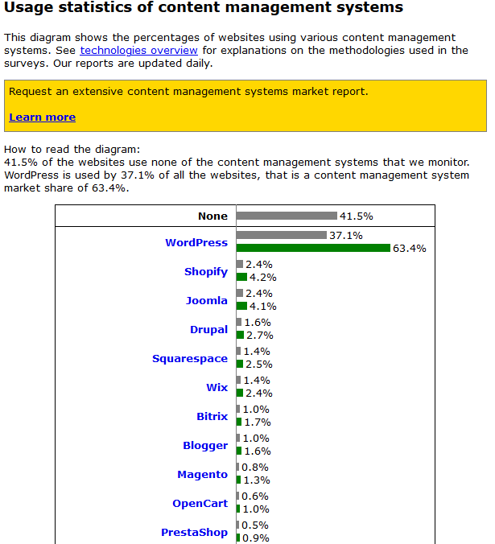

# 15. Gestores de contenido: los CMS más utilizados actualmente

En el punto anterior vimos las herramientas para la creación de contenidos web, pero además de ellas, tenemos a nuestra disposición numerosas herramientas para la **gestión de contenidos, comúnmente conocidas como CMS (** ***Content Management System*****)**.

Estas herramientas nos dan la **facilidad de crear, editar y publicar contenido** a través de una interfaz gráfica **sin disponer conocimientos de programación**, ya que todo funciona mediante menús y campos a rellenar tipo **WYSIWYG** (*What You See Is What You Ge*t o Lo que Ves Es Lo Que Obtienes).

Los gestores de contenido permiten instalar plantillas de webs ya prediseñadas, en las que solo es necesario rellenar los datos necesarios. Utilizar un gestor de contenido es la forma más fácil de crear un sitio web.

## ¿Qué gestores de contenido o CMS son los más utilizados en la actualidad?

Según [W3Techs](https://w3techs.com/technologies/overview/content_management/all) los **10 gestores de contenido o CMS más populares son WordPress, Joomla, Drupal, Shopify, Squarespace, Wix, Magento, Blogger, Bitrix y PrestaShop**.

> Gestores de contenido más utilizados en 2020

Las cifras pueden variar si vemos otros portales de estadísticas, pero **los gestores de contenido más importantes se mantienen** en su puesto.

