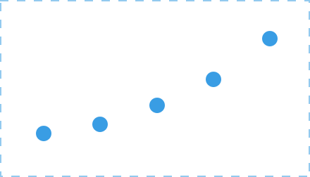
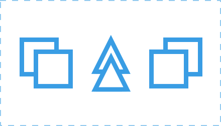

# 5. Elementos de relación: dirección, posición, espacio, gravedad

Tabla de contenidos

-   [5.1. La dirección](#51-La-dirección)
-   [5.2. La posición](#52-La-posición)
-   [5.3. El espacio](#53-El-espacio)
-   [5.4. La gravedad](#54-La-gravedad)

En los dos artículos anteriores vimos los [elementos básicos conceptuales](https://github.com/Sergio-Rey-Personal/DIW/blob/master/UD01_Disenyo_web_Caractaristicas_elementos_basicos_y_etapas_para_su_desarrollo/UD01_03_ElementosConceputales.md) que nos permiten crear formas de todo tipo y las [características visuales](https://github.com/Sergio-Rey-Personal/DIW/blob/master/UD01_Disenyo_web_Caractaristicas_elementos_basicos_y_etapas_para_su_desarrollo/UD01_04_ElementosVisuales.md) que las definen. Ahora vamos a ver los elementos de relación que nos ayudan a definir la ubicación y la relación entre las distintas formas.

Los elementos de relación son la **dirección, la posición, el espacio y la gravedad**.

## 5.1. La dirección

Indica la dirección de un elemento con respecto al resto de elementos presentes en el sistema.

Figura 5.1. Elementos de relación: Dirección.

## 5.2. La posición

Define la posición exacta de un elemento respecto a la estructura en el que se encuentra ubicado.

Figura 5.2. Elementos de relación: Posición

## 5.3. El espacio

Todos los elementos presentes en un sistema ocupan un espacio. Sin embargo, este espacio puede ofrecer diferentes sensaciones en cuanto a su profundidad.

Figura 5.3: Elementos de relación: Espacio

## 5.4. La gravedad

Gracias a la sensación de gravedad podemos dar diferentes sensaciones a los elementos: pesadez, estabilidad, inestabilidad, etc.

Figura 5.4: Elementos de relación: Gravedad