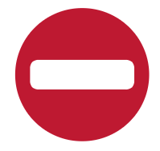

# 6. **Elementos prácticos del diseño: representación, significado y función**

Tabla de contenidos

- [6. **Elementos prácticos del diseño: representación, significado y función**](#6-elementos-prácticos-del-diseño-representación-significado-y-función)
  - [6.1. Representación](#61-representación)
  - [6.2. Significado](#62-significado)
  - [6.3. Función](#63-función)

Los elementos prácticos son aquellos que tienen una interpretación subjetiva y a los que podemos dotar de un significado. Los elementos prácticos son la representación, el significado y la función.

## 6.1. Representación

Un elemento es representativo cuando se ha creado a partir de un objeto presente en el mundo real.

Figura 6.1 REPRESENTACION.

*Representación de la luna.*

## 6.2. Significado

Un elemento tiene un significado cuando transmite un mensaje.

Figura 6.2. SIGNIFICADO.

*Yin yang: Describe las dos fuerzas fundamentales opuestas y complementarias, que se encuentran en todas las cosas.*

## 6.3. Función

Un elemento tiene una función cuando es capaz de transmitir el propósito para el cual ha sido creado.

Figura 6.3. FUNCION.

*Señal de prohibido: Hace la función de prohibir el paso.*