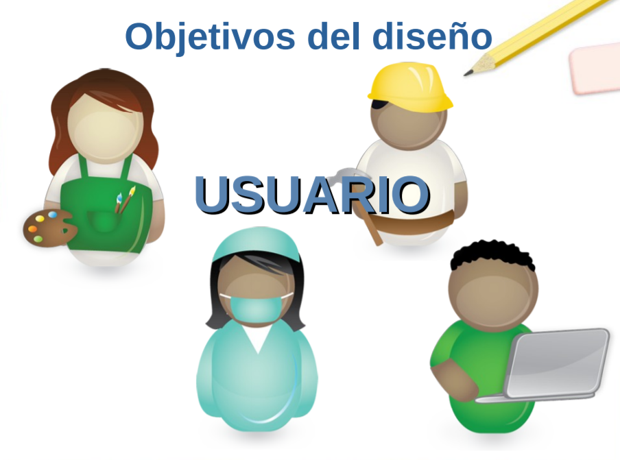

# 11. **Objetivos del diseño.**

Aunque cuando estudiemos la [usabilidad](https://es.wikipedia.org/wiki/Usabilidad) web abordaremos de nuevo el tema de los objetivos conviene ahora que establezcamos unas ideas generales.

*¿Sabes cuántas cosas hay que tener en cuenta a la hora de comenzar a elaborar una interfaz Web? ¿Tienes claro a qué tipo de público irá dirigida tu página? ¿Quieres obtener un rendimiento económico con cada visita? ¿Quieres contentar a todo el mundo que te visite o prefieres especializarte en un tema y tener menos seguidores?*

Cuando comenzamos a diseñar una interfaz Web tenemos que tener en cuenta las respuestas a las preguntas anteriores, ya que dichas repuestas nos darán una idea clara de cuáles son los objetivos de nuestra Web y nos orientarán sobre el enfoque que debemos darle al diseño de nuestra interfaz.

Si comienzas un proyecto Web sin pensar en los usuarios a los que va a ir dirigido, es probable que no tengas la acogida que esperabas en un principio.

Una interfaz Web es un sistema gráfico que permite acceder a los usuarios a los contenidos de la Web mediante el uso de elementos gráficos, los cuales son conocidos por la mayor parte de los usuarios que acceden a nuestra página.

El objetivo principal en el *diseño de una interfaz* Web es que sus potenciales usuarios *puedan acceder a todos su contenidos de la forma más rápida y sencilla posible.*

*Para que un diseño Web sea efectivo debemos diseñar una interfaz que cubra todos nuestros objetivos. Este diseño debe lograr que los usuarios de nuestro sitio puedan acceder con facilidad a sus contenidos, puedan interactuar con eficacia con todos sus componentes y, se sientan cómodos haciéndolo.*

Para conseguir dicho objetivo deberemos tener en cuenta varias cosas:

-   La paciencia de las personas no es ilimitada. Cuando una persona busca una información y, entra en una página después de haber realizado una búsqueda, no permanecerá mucho tiempo en ella si no encuentra rápidamente lo que busca.
-   El gusto, considerado como una cuestión de preferencias personales en materia de estética, varía mucho de unas personas a otras, pero no debemos olvidar que, un diseño cuidadoso, una interfaz agradable y, un empleo coherente de los elementos gráficos, nunca nos hará perder visitantes.
-   Los enlaces que no funcionan o que, sencillamente, no conducen a la información que prometían, provocan en el usuario una sensación de rechazo, con la consiguiente pérdida de confianza en nuestra página, pudiendo llegar, incluso, a la determinación de no visitarla de nuevo.