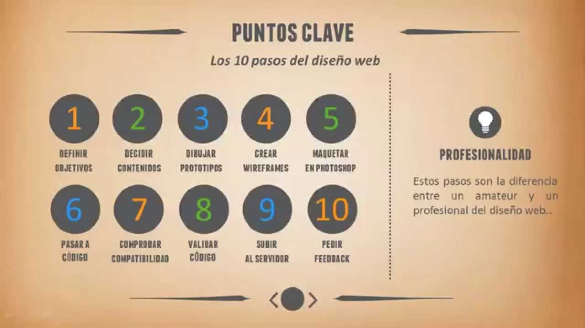
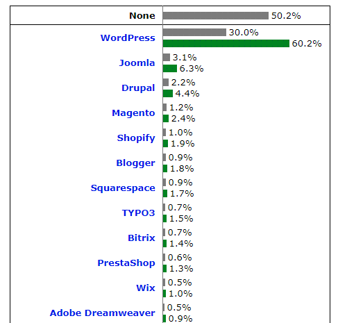

# 13. Generación de documentos y sitios web
-------------------------------------

Cuando nos enfrentamos a nuevo proyecto Web debemos tener muy claro que es tan importante el resultado final, visible para el usuario, como todo el trabajo previo de diseño y toda la documentación que habrá que realizar durante el proceso.\
Como en cualquier proyecto de software, el proceso de generación de un sitio Web pasa por unas fases. Estas fases, que pueden ser más o menos complejas dependiendo de la envergadura del sitio, son:

-   Análisis. En esta fase, después de recabar la información necesaria, establecemos los requisitos que deberá cumplir el sitio Web, su sistema de navegación y su funcionalidad, y se eligen las herramientas necesarias y los lenguajes con los que será implementado el sitio Web. También establecemos unas pautas que todos los miembros del equipo de diseño deberán tener en cuenta durante la generación del sitio y durante su mantenimiento. Estas pautas incluyen: tipografía, colores, iconografía, distribución de los elementos, etcétera.
-   Desarrollo. En esta fase, se emplean las herramientas y lenguajes seleccionados en la fase anterior y se implementa el sitio Web atendiendo a las pautas establecidas en la fase anterior.
-   Pruebas y Depuración. En esta fase, que se debe ir realizando de forma paralela a la fase de desarrollo, se comprueba que todos los enlaces funcionan y que los usuarios pueden interactuar correctamente con todas las páginas del sitio. Es importante, sobre todo en sitios de gran tamaño, ir probando que el diseño ya desarrollado es operativo.
-   Documentación. Esta fase se realiza de forma paralela a las demás. Hay que documentar los requisitos establecidos en la fase de análisis. También hay que documentar el código lo que sea necesario durante la fase de implementación para facilitar el mantenimiento posterior. Si además creamos un código correctamente tabulado, no sólo podremos realizar modificaciones sin depender de programas especiales de edición de sitios Web sino que, además, nuestros visitantes podrán aprender mirando el código. Pero lo más importante en el diseño de sitios Web es, quizás, la documentación de las pautas a seguir durante la generación del sitio Web. Estas pautas, recogidas en una guía de estilo, servirán al equipo de diseño durante la generación y el mantenimiento del sitio.

En la siguiente imagen puedes ver una propuesta de fases a seguir en el desarrollo de un sitio web. No obstante el uso de todas éstas fases, algunas o incluso más dependerá de la envergadura de nuestro sitio web.

## Gestores de contenidos

Como se ha comentado antes, crear sitios web no tiene que ser en todos los casos algo que se empiece desde cero. Desde que aparecieron en escena los Gestores de Contenidos, conocidos por CMS (Content Management Systems), muchas son las empresas o instituciones que tienen creados sitios web con ellos, sin partir de cero. En España, a día de hoy se puede afirmar que WordPress, J*oomla o Drupal* son unos de los gestores de contenidos más extendidos.

Un gestor de contenidos se define como una interfaz que controla una o varias bases de datos donde se aloja el contenido del sitio. El sistema permite manejar de manera independiente el contenido y el diseño. De esa manera, es posible manejar el contenido y darle en cualquier momento un diseño distinto al sitio sin tener que darle formato al contenido de nuevo, además de permitir la fácil y controlada publicación en el sitio a varios editores.

El éxito de los gestores de contenido radica principalmente en que alejan los aspectos técnicos de desarrollo del diseño de la interfaz y, ambos, de la generación de la información y documentación que se quiere comunicar en el sitio. De alguna manera, se puede afirmar que con un gestor de contenidos, un administrador puede crear contenidos sin necesidad de saber nada más allá que manejar un procesador de textos.

Los gestores de contenidos más extendidos suelen estar basados en tecnología web con lenguaje PHP/HTML y gestores de bases de datos MySQL. Esto hace que estos CMS sean de código y licencia libre (Joomla, por ejemplo, es GPL). Además, esta tecnología hace que su funcionalidad se puede extender para adaptarse a las necesidades de un determinado negocio. Más concretamente, los gestores de contenidos guardan tanto los elementos de las páginas web como las especificaciones del diseño en bases de datos. La construcción de un sitio web se hace utilizando elementos de diseño predefinidos, llamados [plantillas](https://srey.moodlecloud.com/mod/page/view.php?id=173 "Plantillas"). Todos los elementos son leídos desde la base de datos, cargados automáticamente, puestos en el sitio preciso del diseño y presentados al usuario como página web. Esto garantiza aislar el diseño de los contenidos y la distribución de los componentes, pudiendo así cambiar el diseño sin tocar ninguno de los otros aspectos .

Aunque los gestores de contenidos están muy extendidos como base de sitios web, es un error pensar que al existir este tipo de plataformas el desarrollo web, como negocio, no tiene sentido. En contra de lo que se pueda pensar, este tipo de plataformas no hace otra cosa que potenciar la necesidad de desarrolladores y diseñadores web. Actualmente, existen muchas empresas software que desarrollan componentes y módulos concretos para ser usados en estos gestores de contenidos y, al mismo tiempo, existen también empresas interesadas en diseñar [plantillas](https://srey.moodlecloud.com/mod/page/view.php?id=173 "Plantillas") (templates) para ser incluidas en estos entornos. Sin duda, el uso extendido de los gestores de contenidos ha abierto un abanico de posibilidades para los desarrolladores web.