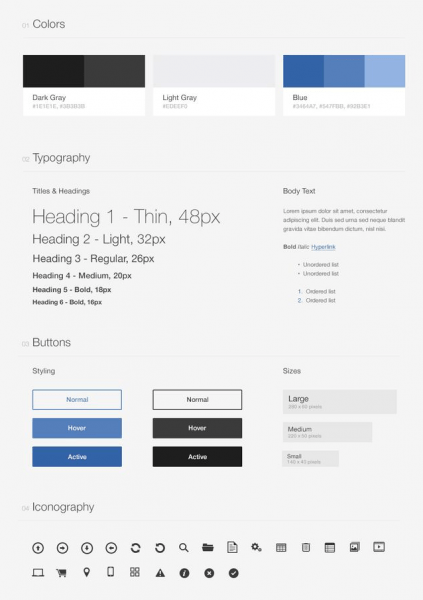

# 2. Elementos de una guia de estilos

Tabla de contenidos

-   [2.1. Cómo crear el manual de estilo ideal](#21-Cómo-crear-el-manual-de-estilo-ideal)
-   [2.2. Analizar al público objetivo y determinar la filosofía empresarial](#22-Analizar-al-público-objetivo-y-determinar-la-filosofía-empresarial)
-   [2.3. Definir la terminología, los colores y la tipografía](#23-Definir-la-terminología-los-colores-y-la-tipografía)
-   [2.4. La guía de estilo también debe entrar en detalles](#24-La-guía-de-estilo-también-debe-entrar-en-detalles)
-   [2.5. Mantenimiento y actualización](#25-Mantenimiento-y-actualización)
-   [2.6. En resumen](#26-En-resumen)

Las guías de estilo recogen los criterios y normas que deben seguir los desarrolladores de un sitio web para que tenga una apariencia uniforme y atractiva para el usuario.

Desde el punto de vista de los programadores y los diseñadores, estas guías de estilo son esenciales para favorecer el desarrollo de una página web tanto en el diseño como en su posterior mantenimiento. Este aspecto es muy importante ya que el mantenimiento puede ser llevado cada vez por una persona.

En las guías de estilo se recogen datos como la gama de colores utilizada, los iconos, la tipografía, el tamaño de las letras, etc.

## 2.1. Cómo crear el manual de estilo ideal

Para elaborar una buena guía de estilo es indispensable tener en cuenta al público objetivo de la página web. Un ejemplo de ello es que un proveedor de servicios financieros nunca tutearía a sus clientes. En el sector servicios se suele tratar de “usted” a los clientes en un tono formal y serio, lo cual hace que la comunicación cara a cara se transmita al contenido de la página web: si en la empresa se utiliza mayoritariamente la forma “usted”, esto también se ha de aplicar a la página web y se advertirá expresamente en la guía de estilo. Si, por el contrario, se quiere crear un portal para adolescentes, la forma “usted” resultará demasiado formal y, por tanto, inadecuada. Esto puede espantar a la audiencia principal debido a que no se siente identificada, por lo que abandonará el portal y buscará otro.

## 2.2. Analizar al público objetivo y determinar la filosofía empresarial

A la hora de crear una guía de estilo web se deben tener en cuenta tanto la filosofía empresarial o la identidad corporativa como el público objetivo al que va dirigida. Para averiguar cuál es, se necesita una amplia recopilación de datos, así como un extenso análisis de los mismos. En este caso, entran en juego la edad, el género, la educación, las circunstancias vitales y los intereses de la audiencia y estos se deben definir de la manera más exacta posible. Solo quien conozca a sus clientes o lectores podrá crear páginas web destinadas a un público específico y con los contenidos adecuados. Asimismo, la guía de estilo también debe dejar patente cuál es la filosofía empresarial, sus objetivos o la terminología que se tiene que emplear. ¿Qué representa la empresa y qué términos es esencial utilizar en la página web para transmitirles sus propios ideales a los clientes y a los lectores?

## 2.3. Definir la terminología, los colores y la tipografía

La imagen corporativa y los datos sobre el público objetivo también deben formar parte de las especificaciones relativas al diseño de las páginas web. Para que aumente el valor de reconocimiento, la mayoría de páginas web incorporan, por ejemplo, colores en el logo de la empresa. El público objetivo, por su parte, es otro de los factores que influyen en el color. De esta manera, las páginas web dirigidas a un público joven recurren en la mayoría de los casos a colores más llamativos que las que van destinadas a uno más mayor. En el caso de este último grupo, se tiende a recurrir a un diseño sencillo con colores más apagados. Habitualmente, se puede despertar el interés de un público objetivo joven mediante el uso de una tipografía inusual, mientras que, por el contrario, el estilo más clásico es sinónimo de seriedad. Aun así, la legibilidad resulta mucho más importante que las consideraciones anteriores, y es que un tipo de letra extravagante que sea difícil de leer tampoco llama la atención de los visitantes más jóvenes.

Las guías de estilo deben contener información acerca de los colores, las palabras, los iconos, y otros factores que no deben usarse bajo ningún concepto. Algunos términos con una connotación negativa pueden despertar en los lectores ciertas asociaciones de las que es recomendable que la página web o la empresa responsable se distancien. Lo mismo es de aplicación en el caso de los colores y de los gráficos, con respecto a los que surgen preguntas en torno a las combinaciones de colores no deseadas y a los contenidos de imagen a evitar.

## 2.4. La guía de estilo también debe entrar en detalles

Cuanto más exactas sean las normas, menor será el número de rectificaciones necesarias, las cuales requieren mucho tiempo y muchos costes. En este sentido, el libro de estilo de la empresa debe establecer las normas de la manera más detallada posible: en el caso de los colores, por ejemplo, estos tienen que definirse con códigos hexadecimales, valores RGB y otros gráficos adjuntos. Mediante una pequeña descripción se puede averiguar rápidamente cuál es el efecto que tienen los colores previstos en la audiencia. Además, es preciso aclarar qué colores están destinados a qué elementos. Por consiguiente, se debe establecer el lugar en el que se van a colocar los iconos, los botones, los banners o los logos y los colores que deben contener.

En este contexto, un esquema gráfico puede resultar más aclaratorio que una explicación escrita, y es que un gráfico también puede ofrecer datos sobre el ancho de columna y la altura de las filas. De esta manera, los diseñadores pueden ver directamente la apariencia que más o menos puede tener la totalidad de la página web. También son de utilidad los datos relativos al tamaño de las imágenes, de los iconos y del logo.

Del mismo modo, se debe asignar una finalidad y un tamaño de fuente determinado a los tipos de letra correspondientes. ¿Dónde y de qué manera se pueden utilizar unos determinados tipos de letra? Lo ideal sería que la guía de estilo también recopilara ejemplos concretos para su uso, los cuales explican cuál es la fuente escogida para los epígrafes principales, para los epígrafes secundarios y para el texto. Del mismo modo, también deben incluirse los datos relativos al espaciado entre líneas, al sangrado y a los espacios entre cada uno de elementos de la página.

## 2.5. Mantenimiento y actualización

Una vez se ha creado la guía de estilo, esta tiene que adaptarse a las actualizaciones y revisiones de la página web. Solo así se puede garantizar la unidad a largo plazo en todos los canales de comunicación. La uniformidad es esencial para el branding, lo que no significa que estos manuales no se puedan modificar nunca. Mejor dicho, tienen que modificarse regularmente para comprobar, por ejemplo, si los diseños son todavía actuales, los tipos de letra están a la última o si el logo puede actualizarse. El ejemplo de Mozilla muestra que los logos pueden cambiar con el paso del tiempo y que, de hecho, tienen que cambiar. Finalmente, las preferencias del público objetivo también pueden variar. Por lo tanto, para las páginas web resulta importante permanecer fieles a la unidad definida en la guía de estilo, pero también mantener las especificaciones actualizadas y adaptarse al paso del tiempo.

## 2.6. En resumen

| **Áreas de la guía de estilo** | **Preguntas más importantes** |
|--------------------------------|-------------------------------|
| Principios de diseño básicos | ¿Por qué se caracteriza la empresa? ¿Cuáles son los objetivos de la página web? ¿Cuáles son los principios de diseño propios de la filosofía de la empresa? |
| Público objetivo/Buyer personas | ¿A quién debe ir dirigida la página? ¿Cómo puede delimitar el público objetivo? ¿Cuáles son sus preferencias, deseos e intereses? |
| Tono y terminología | ¿Cómo se tiene que tratar a los clientes, lectores o visitantes? ¿Qué términos son tabú o no deben usarse? |
| Logo y marca denominativa | ¿Qué apariencia tienen el logo y la marca denominativa? ¿Cuándo, cómo y dónde se deben/tienen que utilizar? |
| Estructura básica de la página web | ¿Cómo se tiene que estructurar la página web? ¿Qué anchura tienen las columnas y qué altura tienen las filas? ¿Cómo se tienen que organizar los elementos? ¿Qué estructura de menú tiene que ofrecerse? |
| Colores | ¿Qué colores realzan la intención de la página web y se dirigen al público objetivo? ¿Cómo se pueden integrar los valores RGB y los códigos hexadecimales? |
| Tipo de letra | ¿Qué tipo de letra tiene que utilizarse para qué tipo de textos y elementos? ¿Cuál es el tamaño que tiene que tener la letra y de qué color tiene que ser? |
| Iconos | ¿Qué iconos deben utilizarse? ¿Dónde se tienen que insertar y qué significan? |
| Contenido | ¿Qué contenido debe integrarse en la página web? ¿Cómo tiene que plasmarse de manera gráfica, textual o multimedia? |

Por último cabe decir que la guía de estilo puede ser un documento vivo. Es decir nada te impide ir ajustándola según se vaya avanzando en el diseño del sitio.