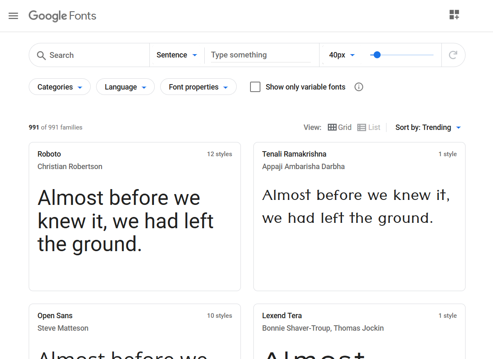

# Tipografías

Los **textos son la base de la mayoría de sitios web** ya que lo más normal es transmitir la información mediante letras. Por este motivo, debemos prestar mucha atención en hacer una correcta elección de fuentes para nuestro sitio web.

A la hora de elegir un tipo de tipografía es muy importante verificar si puede **visualizarse correctamente en los distintos navegadores y no abusar de negrita, cursiva y subrayado**.

Inicialmente, se utilizaban las fuentes típicas que los usuarios tenían instaladas en sus dispositivos. Actualmente, gracias a que los navegadores soportan la directiva `@font-face`, es posible utilizar casi cualquier tipo de tipografía sin necesidad de que esté instalada en el dispositivo. En la unidad 4 veremos como fuentes del tipo *TruType* y *OpenTYpe* pueden convertirse en otros formatos.

A continuación, puedes ver algunas recomendaciones que hay que tener en cuenta a la hora de elegir la tipografía para un sitio web:

-   **No utilizar más de tres tipografías** distintas.
-   Utilizar **fuentes legibles**.
-   Elegir un **buen contraste entre el fondo y la letra**.
-   Utilizar un **interlineado de 1,5 puntos por el tamaño** de la letra.
-   **No abusar de los subrayados** ya que suelen utilizarse para los hipervínculos.
-   **No escribir todo en mayúsculas** porque ralentiza la lectura. Se debe utilizar solo para destacar mensajes cortos como títulos, subtítulos o conceptos importantes.
-   Los **espacios en blanco entre párrafos** ayudan a descansar la mirada y a mejorar la concentración gracias a la mejor comprensión de la separación entre ellos. Así pues, es necesario añadir un poco más de espaciado entre párrafos y no dejar la misma separación que con el interlineado.
-   La **longitud recomendada para un párrafo está comprendida entre 45 y 75 caracteres**. (aunque esto puede depender del tamaño de la pantalla)

> Esta demostrado que tan sólo se lee un 25% del contenido completo de una web

- [Como elegir, utilizar y combinar las fuente en tu web](https://www.arturogarcia.com/elegir-combinar-tipografias-web/)
- [El significado que transmiten las fuentes tipográficas](topicflower.com/blog/el-significado-que-transmiten-las-fuentes-tipograficas/)

## Páginas para descargar fuentes:
- [Google Fonts](https://fonts.google.com/)
- [FreeFonts](https://www.1001freefonts.com/es/)
- [DaFont](https://www.dafont.com/es/)

