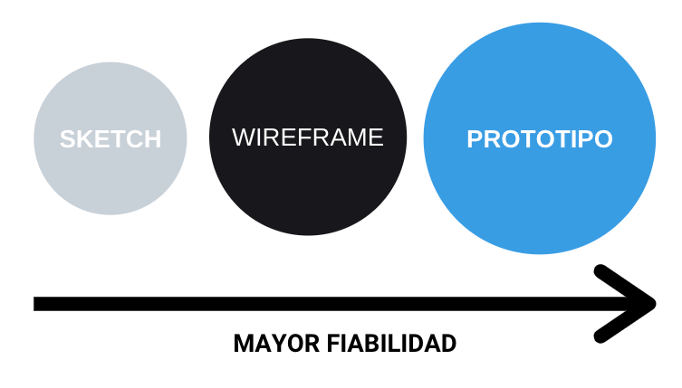

# 8. Prototipos en el diseño de interfaces web

Tabla de contenidos

-   [8.1. Sketching](#81-Sketching)
-   [8.2. Wireframing](#82-Wireframing)
-   [8.3. Prototipo y mockup](#83-Prototipo-y-mockup)

Los **prototipos web son dibujos o diseños de las diferentes páginas y secciones que van a componer un sitio web**. El prototipado es una parte esencial a la hora de definir los menús y los diferentes elementos que constituyen una web.

Es **más sencillo realizar un cambio sobre un prototipo que sobre el código** de un página web desarrollada. Además, el uso de prototipos nos ayuda a **involucrar al cliente** en la fase previa al desarrollo y así adecuar el proyecto a sus necesidades.

Existen diferentes formas de realizar el prototipo de una web: **esquemas, bocetos, *sketches*, *wireframes*, *mockups*, diagramas,** etc. Sin embargo, en proyectos profesionales el prototipado suele componerse de tres fases en las que se va incrementando la fiabilidad del producto.

> Fases del prototipado

## 8.1. Sketching

Es el **dibujo o boceto inicial de un sitio web**. Los diseños no son muy detallados y se realizan de forma esquemática. Es esta fase inicial se suelen utilizar **pizarras o folios de papel.**

<iframe width="560" height="315" src="https://www.youtube.com/embed/4xsATP-X3vM" frameborder="0" allow="accelerometer; autoplay; encrypted-media; gyroscope; picture-in-picture" allowfullscreen></iframe>

## 8.2. Wireframing

Es un **dibujo** en el que se **especifican los elementos de forma más detallada.** Se establece claramente la jerarquía de la información, las llamadas de acción y la organización de los contenidos. En esta segunda fase se suelen utilizar herramientas como [**Balsamiq Mockups**](https://balsamiq.com/)**.**

<iframe width="560" height="315" src="https://www.youtube.com/embed/v8AjVL4ZdS0" frameborder="0" allow="accelerometer; autoplay; encrypted-media; gyroscope; picture-in-picture" allowfullscreen></iframe>

# 8.3. Prototipo y *mockup*

Los **prototipos y los *mockups***son los que representan el **diseño con más detalle**. De hecho, en este tipo de diseños ya se incluyen detalles visuales como el **color, la tipografía o las imágenes**. En esta fase se utilizan herramientas de diseño avanzadas como por ejemplo [**Sketch**](https://www.sketch.com/).

Los prototipos, además, simulan la **interacción con la interfaz**. Por este motivo, en esta representación los usuarios pueden comprobar cómo se comporta la web y podrán **experimentar la experiencia de uso**.

<iframe width="560" height="315" src="https://www.youtube.com/embed/GVnxuWzab7M" frameborder="0" allow="accelerometer; autoplay; encrypted-media; gyroscope; picture-in-picture" allowfullscreen></iframe>
