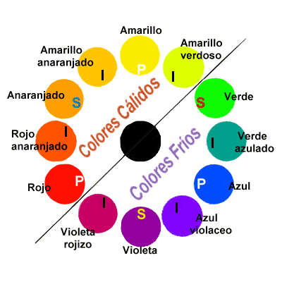
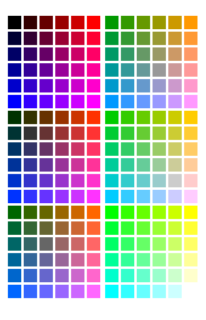

# 5. **Colores**

Tabla de contenidos 

- [5. **Colores**](#5-colores)
  - [5.1. Teoria del color](#51-teoria-del-color)
  - [5.2. El sistema RGB. Colores Seguros](#52-el-sistema-rgb-colores-seguros)
    - [5.2.1. El Sistema RGB](#521-el-sistema-rgb)
    - [5.2.2. Colores seguros](#522-colores-seguros)

En una guía de estilo deben figurar los colores a emplear en el sitio Web en todos los textos, fondos, e imágenes según sea su ubicación y finalidad. La información debe suministrarse aportando los valores para el modelo RGB tanto en hexadecimal como en decimal.

Ya vimos en el apartado Tipografía que la guía de estilos debe reflejar el color de la fuente y el color del fondo sobre el que va escrita según sea su funcionalidad. En muchos sitios Web, se utilizan colores distintos en los enlaces del sistema de navegación de su página principal. Estos mismos colores se emplean después para representar las diferentes secciones del sitio.

En este caso, la guía de estilos debería reflejar, entre otras, las combinaciones hexadecimales para el color de:

-   Las fuentes en el bloque central de la página principal (la que está en el centro de la imagen).
-   Los fondos de los títulos de las secciones de la página principal (mencionadas en el párrafo anterior).
-   Las fuentes del menú de navegación y del título del contenido en cada una de las páginas de las secciones (las cuatro que están alrededor de la principal).
-   Los fondos de las opciones del menú de navegación y de su título en cada una de las páginas de las secciones.

Por último, una serie de consejos que te pueden ser útiles:

-   Si vas a emplear los colores como sistema de codificación, es decir, para que el usuario haga una distinción de la finalidad de los elementos según su color, asegúrate de que sea fácil de comprender.
-   Ser consistentes en el uso de los colores. Usar un color siempre para lo mismo.
-   No excederse en el uso de colores distintos.
-   Utilizar combinaciones de colores que transmitan armonía.
-   Utilizar correctamente el contraste de colores para destacar las partes relevantes del sitio.

## 5.1. Teoria del color

El color es un aspecto esencial en el diseño Web. Una elección inadecuada de los colores puede ser motivo de la pérdida de visitantes de un sitio Web. ¿Qué deberías tener en cuenta a la hora de elegir un color?

Ten en cuenta que una misma página se puede ver de distinta forma según la plataforma, sistema operativo, navegador y monitor empleados.

Los colores están relacionados entre sí. La rueda de color formada por 12 colores es una herramienta gráfica importante para crear combinaciones cromáticas y que nos permite hacer distintas clasificaciones de los colores:

**Colores primarios, secundarios y terciarios.**

-   Hay **tres colores primarios**: **rojo, amarillo** y a**z**ul, que están dispuestos en la rueda formando un triángulo equilátero.
-   En el **lado** de la rueda **opuesto** a cada uno de los colores primarios se sitúan los **tres colores secundarios**: **verde, púrpura** y **naranja.**
-   Cada uno de los colores secundarios se consigue con la mezcla de sus dos colores primarios adyacentes.
    -   El verde viene de la mezcla del amarillo y el azul.
    -   El púrpura viene de la mezcla del azul y el rojo.
    -   El naranja viene de la mezcla del rojo y el amarillo.
-   Los tres colores secundarios forman también un triángulo equilátero.
-   Por último, están los **seis colores terciarios** que son los que se consiguen con la mezcla del color primario y del color secundario adyacente al mismo. Así, tenemos el azul-verdoso, el amarillo-verdoso, el amarillo-anaranjado, el rojo-anaranjado, el rojo-púrpura y el azul-púrpura.

**Colores fríos y colores cálidos.**

-   Son **colores fríos** todos los colores situados en la rueda de color entre el verde y el púrpura-rojizo.
-   Son **colores cálidos,** todos los colores situados en la rueda de color entre el rojo y el amarillo-verdoso.

**Colores complementarios, análogos y monocromáticos.**

-   Los colores complementarios son los colores que están en lados opuestos de la rueda de color. Se utilizan para crear contraste.
-   Los colores análogos son los colores que se encuentran juntos en la rueda de color. Se suelen usar para crear la armonía del color.
-   Los colores monocrómáticos son todos los tonos y matices de un mismo color.

En los siguientes enlaces puedes ver una página Web donde podrás ir comprobando la información que te daremos sobre los colores. Además te serán de gran ayuda cuando diseñes los colores de tu sitio Web:

-   <http://colorschemedesigner.com>/  *(inglés)*
-   <http://colorschemedesigner.com/previous/colorscheme2/index-es.html>*(español)*

## 5.2. El sistema RGB. Colores Seguros

### 5.2.1. El Sistema RGB

El ojo humano percibe los colores: rojo, verde y azul y, el resto de los colores se consiguen con la adición de estos tres colores en diferentes proporciones. El blanco se consigue con la mezcla de los tres colores puros y se considera el negro como la ausencia de color. A estos colores se les llama colores aditivos y el ordenador se basa en este sistema para la representación de los colores dando lugar a lo que conocemos como Modo de color RGB. RGB es el acrónimo de los nombres de los colores rojo, verde y azul en inglés: Red, Green, Blue.

Los ordenadores emplean estos tres colores para representar cualquier color de la escala cromática. Pero ¿cómo lo hace? El ordenador utiliza 8 bits de información para representar cada color. La escala monocromática de un color viene dada por todas las posibles combinaciones de estos 8 bits, en total 256. Si tenemos en cuenta que tenemos una escala de 0 a 255 para representar cada color, es decir, 256 grados de cada color y, que el resto de los colores se consiguen mezclando estos tres ¿cuántos colores tenemos en total? Para saberlo tenemos que calcular todas las combinaciones que existen multiplicando tres veces el número de grados de cada color: 256 x 256 x 256, lo que nos da 16.777.216 colores.

A la hora de representar cada color utilizamos este modelo RGB y lo podemos hacer empleando tanto el sistema de numeración decimal como el sistema de numeración hexadecimal.

### 5.2.2. Colores seguros

Recuerda que una misma página se puede ver de distinta forma según la plataforma, sistema operativo, navegador y monitor empleados. ¿Acaso los colores no son siempre los mismos?

El color rojo siempre es y será rojo. Pero, ¿es posible que quede algún usuario con un monitor muy antiguo o con una versión del navegador muy anticuada? Sí, es posible y debemos tenerlo en cuenta. Hay monitores que sólo permiten visualizar 256 colores. Hay navegadores que poseen una paleta de sólo 216 colores conocidos en el ámbito del diseño web como colores seguros. Emplear estos colores seguros es una forma de garantizar que nuestro sitio Web se verá del mismo modo en todos los navegadores.

Los colores seguros son los que se forman con las combinaciones de los tres colores rojo, verde y azul pero sólo con los valores hexadecimales: 00, 33, 66, 99, CC y FF. Son seis grados distintos de cada color y por eso hay 216 colores en total ya que 216 es el resultado de multiplicar 6 x 6 x 6.

**Enlaces Extra colores seguros**

- [Tabla de colores seguros](https://htmlcolorcodes.com/es/tabla-de-colores/tabla-de-colores-web-seguros/)
- [Colores Seguros en la Wikipedia](https://es.wikipedia.org/wiki/Colores_web)