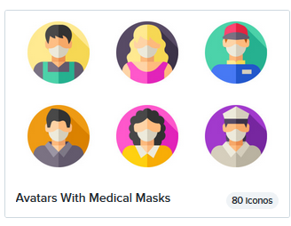
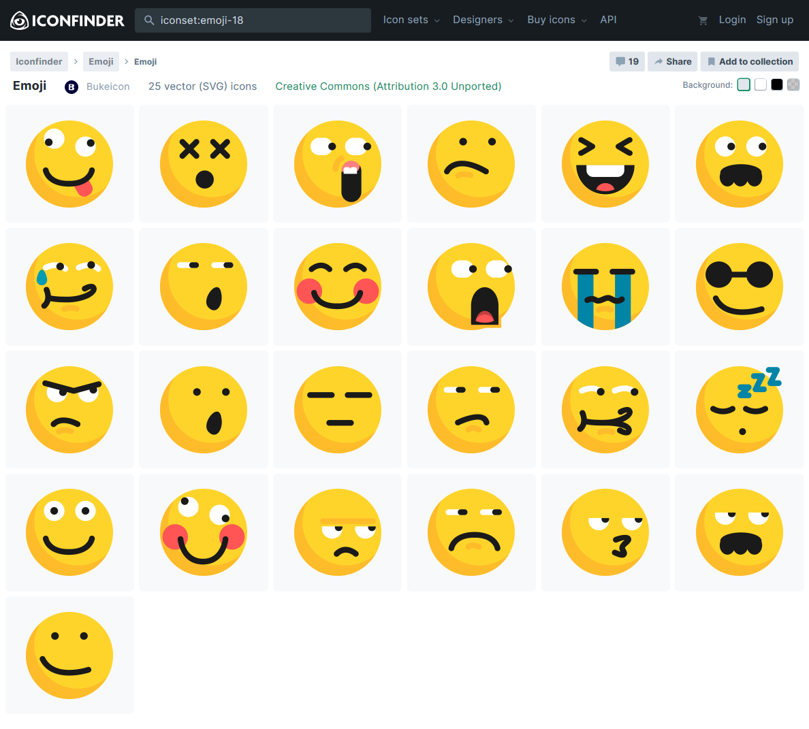

# 6. **Iconografía**

Los **iconos** de los sitios web **representan acciones** y **evitan el uso excesivo de textos**. Elegir correctamente los iconos es necesario para que los usuarios interpreten fácilmente su significado y así ahorrar tiempo en la visualización del sitio web. Es importante respetar una apariencia similar entre todos los iconos para disponer de una buena armonía y navegabilidad.

Los elementos prácticos del diseño son: **Representación**, **Significado** y Fun**ción.

La iconografía es la aplicación práctica de los elementos prácticos del diseño. Según la Real Academia Española, un icono es un signo que mantiene una relación de semejanza con el objeto representado.

La Wikipedia dice que, desde el punto de vista informático, un icono es un pequeño gráfico en pantalla que identifica y representa a algún objeto, usualmente con algún simbolismo gráfico, para establecer una asociación.

Un icono es una aplicación del elemento Representación porque es una forma representativa de algo del mundo real; es una aplicación del elemento Significado porque el mensaje transmitido por el icono genera en nuestra mente una imagen conceptual y, es una aplicación del elemento Función porque logra atraer la atención del usuario que percibe de forma más rápida el mensaje que se intenta transmitir y, de esta forma no tiene necesidad de leer el texto al que acompañan.

Los iconos se suelen emplear para complementar los textos de los enlaces en la página de portada.

Un icono debe contener la menor cantidad de detalle posible sin perder significado. La elección de los iconos es muy importante, puesto que si un usuario no es capaz de determinar su significado a simple vista, entonces no habremos conseguido nuestro propósito de ahorrarle tiempo en la visualización de la página.

Es importante hacer uso de iconos a los que el usuario está ya acostumbrado.

En la guía de estilos se especificarán los iconos a emplear en el sitio web, dónde se van a emplear y con qué finalidad.

Resulta muy arriesgado emplear iconos por el mero hecho de adornar nuestras páginas pero que no aportan ningún significado por sí solos.

## Páginas para descargar iconos

- [Flatico](https://www.flaticon.es/)
- [IconFinder](https://www.iconfinder.com/free_icons)
- [Freepik](https://www.freepik.es/iconos-populares)

