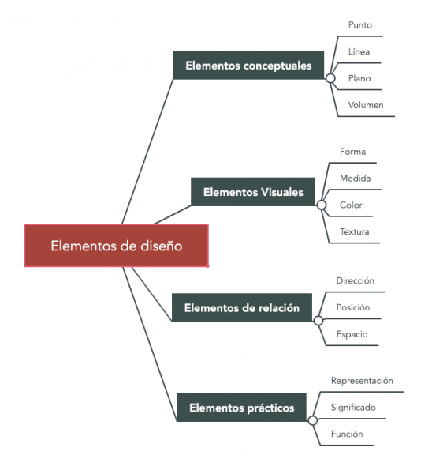
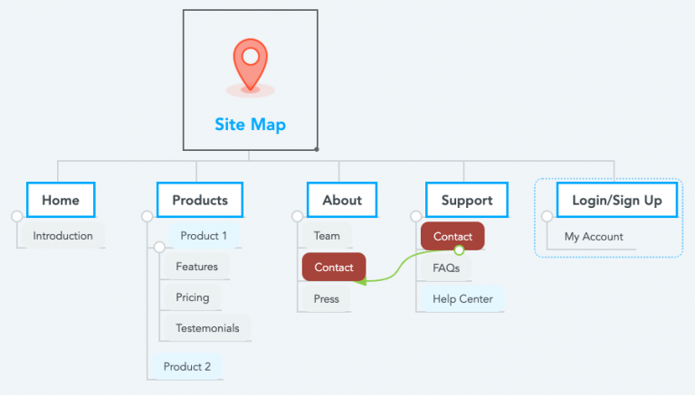
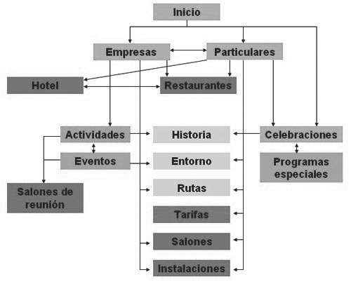
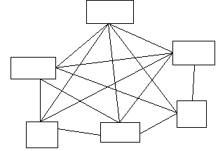
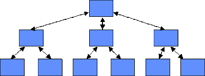
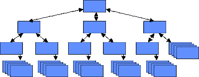

# 7. **Mapas conceptuales, mapas de navegación y sitemaps**

Tabla de contenidos

- [7. **Mapas conceptuales, mapas de navegación y sitemaps**](#7-mapas-conceptuales-mapas-de-navegación-y-sitemaps)
  - [7.1. Mapas conceptuales](#71-mapas-conceptuales)
    - [7.1.1. Herramientas para hacer mapas conceptuales](#711-herramientas-para-hacer-mapas-conceptuales)
  - [7.2. Mapas de navegación](#72-mapas-de-navegación)
  - [7.3. *Sitemaps* o mapas para motores de búsqueda](#73-sitemaps-o-mapas-para-motores-de-búsqueda)
    - [7.3.1. ¿Es necesario un *sitemap*?](#731-es-necesario-un-sitemap)
  - [7.4. Herramientas para la generación de mapas](#74-herramientas-para-la-generación-de-mapas)

En una guía de estilos debe quedar reflejada no sólo la disposición de estos bloques en cada una de las páginas del sitio, sino también el esquema de navegación que va a existir entre las diferentes páginas del sitio.

Es muy común en los sitios Web de gran tamaño que la página de portada o principal tenga un diseño diferente al de las demás, pero, tanto si todas las páginas son iguales como si tenemos grupos diferentes de páginas iguales entre sí, nuestra guía de estilo deberá reflejar todos los diseños posibles indicando en todos los casos:
- El tamaño en píxeles que ocupará el encabezado y dentro de él lo que ocupará y dónde se ubicará cada uno de sus elementos.
- El tamaño en píxeles o en porcentaje de la zona de navegación y su ubicación, así como si estará dispuesta horizontal o verticalmente, o si estará dividida en secciones distintas y, en su caso, la ubicación de cada una de ellas.
- Cómo se dispondrán los enlaces dentro de cada zona de navegación y su tamaño.
- El tamaño, el lugar y el formato de la zona de posicionamiento dentro de la página.
- El tamaño de la zona del contenido y su ubicación. Dónde se colocará el título y lo que ocupará dentro de la zona de contenido.
- Si hay cuadros de contenidos secundarios, cuál va a ser su tamaño y posición y cuál será su funcionamiento. Si estarán siempre visibles o se mostrarán al pasar el ratón por alguna zona concreta.
- El tamaño y la distribución de los elementos del pie.
- También se deberán reflejar los huecos que se quieran dejar a propósito.
- Cómo se van a mostrar los submenús de navegación, si los hubiera.

## 7.1. Mapas conceptuales

El **mapa conceptual** es una representación gráfica de conceptos interrelacionados. Consiste en un **esquema visual** que detalla ideas o conceptos y sus diferentes relaciones. El principal objetivo de un mapa conceptual es representar la **estructura conceptual de un tema** en concreto. 

> Ejemplo de mapa conceptual realizado con la herramienta Mindmeister

Los mapas conceptuales se suelen organizar de arriba abajo o de izquierda a derecha y **parten de un concepto principal o raíz**. A partir de esta idea central se establecen las relaciones con los nuevos conceptos formando una estructura arbórea.

### 7.1.1. Herramientas para hacer mapas conceptuales

Hay muchas formas de hacer mapas conceptuales. En las siguientes páginas puedes ver algunas **herramientas online para hacer mapas conceptuales** y algunos de los estilos de mapas que se utilizan actualmente.

-   [xmind.net](https://www.xmind.net/)
-   [smartdraw.com](https://www.smartdraw.com/)
-   [creately.com](https://creately.com/)
-   [lucidchart.com](https://www.lucidchart.com/)
-   [mindmeister.com](https://www.mindmeister.com/)

## 7.2. Mapas de navegación

Los **mapas de navegación** sirven para **representar la arquitectura de las páginas** de un sitio web. Tal y como los mapas conceptuales, los mapas de navegación se pueden representar de forma gráfica. En ambos modelos hay un concepto raíz (página inicial en el caso de un mapa de navegación) a partir del cual se ramifican el resto de elementos del mapa.

>Ejemplo de mapa de navegación realizado con la herramienta Mindmeister.

Sin embargo, **los mapas de navegación de las páginas web no suelen ser gráficos**, en la mayoría de ocasiones se trata de listados con texto. En este caso, la diferencia entre el diseño un mapa de navegación y un mapa conceptual es muy visible.

Uno de los objetivos principales de los mapas de navegación a la hora del diseño es **estructurar bien los contenidos** antes de crear un sitio web y que los **usuarios encuentren de forma sencilla lo que están buscando**.

Cuando el diseño de una web es muy complejo, en algunos casos, es difícil entender lo que se quiere transmitir entre el diseñador del mapa de navegación y el equipo de desarrollo. Por este motivo, **los prototipos son herramientas muy interesantes para ver de forma visual un borrador de cómo será un sitio web**. Existen diferentes formas de realizar el [prototipo de una web](https://github.com/Sergio-Rey-Personal/DIW/blob/master/UD02%20Guia_de_estilo_web/UD02_09_PrototiposDise%C3%B1oWeb.md): **esquemas, bocetos, sketches, wireframes, mockups, diagramas,** etc. En el punto 9 veremos los más importantes.

Como se puede apreciar de lo visto en las secciones anteriores, los sitios web pueden contener muchas páginas, todas ellas accesibles desde algún punto del sitio y todas con todos o algunos enlaces a las demás. Esta estructura de enlaces hace, en muchos casos, difícil que el diseñador o el usuario del sitio sepan qué páginas llevan a cuáles. Por ello, **antes de diseñar un sitio web se debe realizar un esquema que permita anticipar cuáles son las secciones en las que estará dividida el sitio web y la relación entre los diferentes bloques de contenidos**. Ese esquema recibe el **nombre de mapa de navegación** y es algo parecido al índice de contenidos de un libro, es decir, un manera de que el diseñador de un sitio web estructure bien los contenidos antes de crear el sitio y de que los usuarios encuentren más rápidamente lo que buscan una vez creado el sitio.

La siguiente figura muestra un mapa del sitio web de un Hotel-Restaurante. El mapa muestra cómo están relacionados los diferentes grupos de información. Un ejemplo de mapa de navegación o mapa de un sitio web ligado a una temática de institución educativo se muestra en la siguiente figura:

A la hora de realizar mapas de navegación hay que tener en cuenta que las páginas que forman un sitio web no deben aportar todas ellas la misma información ni cubrir el mismo objetivo, se podrá partir de una página principal (home o homepage) y, desde ella, poder acceder al resto de páginas que conforman el sitio web.

Además de los mapas de navegación, la propia complejidad del diseño hace que, en muchos casos, sea difícil entender qué es lo que el usuario quiere transmitir al resto del equipo de desarrollo y qué es lo que tienen que hacer.

En los siguientes enlaces, puedes ver los mapas de navegación de los sitios Web de algunas de las\
Comunidades Autónomas y del sitio Web del Ministerio de Educación y Ciencia

-   [Generalitat Valenciana. Conselleria de Educación, Cultura y Deporte](http://www.ceice.gva.es/es/mapa-web)[.](http://www.ceice.gva.es/es/)
-   [Comunidad Autónoma de Galicia](http://www.xunta.es/mapa-do-portal)
-   [Comunidad Autónoma de Euskadi](http://www.euskadi.net/r33-2288/es/contenidos/informacion/mapa_web_euskadi/es_6313/sitio_web_euskadi.html)
-   [Comunidad Autónoma de Cataluña](http://www.gencat.cat/web/cas/mapa.htm)
-   [Amazon Eapaña](https://amazon-prensa.es/service/Mapa-Web.html)

El mapa de un sitio Web va a tener una estructura que dependerá de la relación que tengan las páginas del sitio entre sí. Esta relación puede ser de diferentes tipos:

-   La **estructura lineal** es adecuada en aquellos sitios compuestos por páginas donde **la lectura de las mismas es secuencia**l. Su estructura es similar a la de un libro donde avanzas de página en página, pero puedes volver a la página anterior y desde ésta a la anterior para releer algún párrafo.

-   La **estructura reticular** se emplea en aquellos sitios en los que** todas sus páginas están relacionadas entre sí**. No resulta adecuado cuando el sitio está compuesto por muchas páginas porque el usuario puede llegar a perderse.

-   La **estructura jerárquica** es la más común. Se emplea en aquellos sitios donde existen varias **secciones bien diferenciadas** pero **de poca complejidad** de modo que el usuario no tiene porque navegar de una sección a otra.

-   La **estructura lineal jerárquica** es también de las más empleadas cuando **cada una de las secciones tiene un volumen de información más elevado y conlleva una lectura secuencial del contenido de la sección**. También se emplea este método en aquellos sitios en los que sus secciones representan grados de dificultad de la información presentada y se permite la navegación entre secciones.

Revisa el siguiente enlace donde explica [como hacer mapas de navegación](https://blog.ida.cl/diseno/como-agrupar-contenidos-sueltos-en-mapas-de-navegacion/)

## 7.3. *Sitemaps* o mapas para motores de búsqueda

Los **sitemaps o mapas para motores de búsqueda** son archivos en los que se proporciona **información sobre las páginas, los vídeos y otros archivos de un sitio web**, así como sobre las relaciones entre ellos. Los buscadores, como Google, leen estos archivos para rastrear los sitios web de forma más eficaz. Los sitemaps **informan a los rastreadores de qué archivos de un sitio web son importantes** y, además, incluyen datos relevantes sobre ellos; por ejemplo, en el caso de las páginas, pueden indicar cuándo se actualizaron por última vez, cada cuánto se modifican y si existen versiones en otros idiomas.

### 7.3.1. ¿Es necesario un *sitemap*?

Por lo general, si las páginas de tu sitio web están bien enlazadas, los rastreadores web podrán detectar la mayoría de ellas. Aun así, un ***sitemap* puede mejorar el rastreo de tu sitio** web, sobre todo si este cumple uno de los siguientes criterios:

-   Es muy grande.
-   Tiene un gran archivo de páginas de contenido que están aisladas o no están bien enlazadas entre sí.
-   Es nuevo y hay pocos enlaces externos que dirigen a él.

[Ver más información sobre sitemaps y herramientas de generación de mapas](https://support.google.com/webmasters/answer/156184?hl=es)

## 7.4. Herramientas para la generación de mapas

Hay disponible multitud de herramientas para la generación de mapas tanto online como en aplicaciones, así como gratuitas o de pago. Además, los gestores de contenido nos ofrecen la posibilidad de utilizar plugins específicos para la creación de nuestros *sitemaps* y mapas de navegación. En la [wiki de Google](https://code.google.com/archive/p/sitemap-generators/wikis/SitemapGenerators.wiki) puedes encontrar un listado muy extenso de herramientas que puedes utilizar.