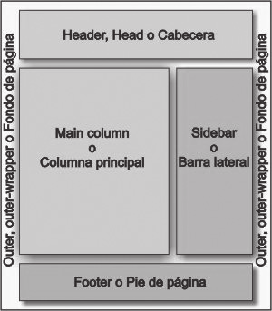

# 8. **Componentes de una interfaz web.**

Tabla de contenidos

- [8. **Componentes de una interfaz web.**](#8-componentes-de-una-interfaz-web)
  - [8.1. Elementos de identificación](#81-elementos-de-identificación)
  - [8.2. Elementos de navegación](#82-elementos-de-navegación)
  - [8.3. Elementos de contenidos](#83-elementos-de-contenidos)
  - [8.4. Elementos de interacción](#84-elementos-de-interacción)
  - [8.5. El pie de página](#85-el-pie-de-página)
  - [8.6. Los espacios en blanco](#86-los-espacios-en-blanco)

**Elementos de un sitio web**

Como dijimos al principio de esta unidad de trabajo, diseñar requiere principalmente consideraciones funcionales y estéticas. Se necesitan numerosas fases de investigación, análisis, modelado, ajustes y adaptaciones previas a la producción definitiva de cualquier objeto. Además, comprende multitud de disciplinas y oficios dependiendo del objeto a diseñar y del número de participantes en el diseño.

Dado que la interfaz Web es el medio de comunicación entre los usuarios que acceden a un sitio Web y todas las páginas que forman parte del sitio, deberemos tener en cuenta los elementos que compondrán nuestra interfaz. Todos estos elementos deberán permitir al usuario identificar la función que desempeñan de forma que pueda acceder a todos los contenidos sin necesidad de realizar complicados razonamientos.

Son muchos los elementos de los que puede estar compuesta una interfaz Web. El número de elementos empleados dependerá del objetivo del sitio. Así, un portal de noticias, o un portal de un organismo público seguramente utilizará un mayor número de elementos que una página Web de un restaurante o una página personal. Los más destacados son:

- Elementos de Identificación.
- Elementos de Navegación.
- Elementos de Contenidos.
- Elementos de Interacción.
- El pie de págiina
- Los espacios en blanco.

## 8.1. Elementos de identificación

Son aquellos que **identifican** plenamente al sitio Web. El usuario, a la vista de estos elementos, debe saber a quién pertenece el sitio Web. Algunos de estos elementos son: **título del sitio, logos, imágenes, persona u organismo propietario del sitio**, etc.

Estos elementos los encontramos generalmente en la **cabecera**, la cual sirve además como elemento separador entre el borde superior y el resto del contenido, además de ser **homogeneizadora** del sitio Web.

Si recordamos los conceptos comentados en el tema 1 entenderemos por qué la cabecera suele ir en la parte superior con el logo a la izquierda.

## 8.2. Elementos de navegación
Son aquellos que están presentes en cada una de las pantallas de un sitio Web. **Permiten al usuario moverse por las diferentes secciones del sitio y retornar de nuevo a la portada**. Estos elementos deben ser lo suficientemente intuitivos para que el usuario sepa qué es lo que hay que hacer para acceder a un contenido en concreto.

Generalmente se presentan como menús formados por diferentes opciones, con las que el usuario puede interaccionar al seleccionarlas, pasando a una nueva página o documento.

Un formato de menú muy extendido es el “estás aquí” (breadcrumbs o miga de pan). Este tipo de enlace presenta en forma textual una serie de enlaces que describen la ruta que ha seguido el usuario para llegar a la página actual a partir de la home o página de inicio, permitiendo regresar a cualquiera de ellas rápidamente. Estos menús poseen la ventaja adicional de ubicar al visitante en el total del sitio, con lo que éste sabe en cada momento dónde se encuentra y cómo ha llegado allí.

Los menús son un elemento principal en todo sitio web porque permite que el usuario sepa en todo momento cómo moverse por el sitio y saber también dónde está. Por lo tanto, la ubicación de los menús es un aspecto muy importante en el diseño. Ésta debe permitir un cómodo acceso a las opciones que lo forman, pero sin llegar a estorbar al resto de elementos.

**Los menús tipo lista y los de árbol se sitúan generalmente en la zona lateral izquierda de la página, mientras que el tipo pestaña o “estás aquí” es más habitual verlos en la parte superior**, debajo de la cabecera. Esta distribución se ha convertido en un estándar de facto entre los diseñadores, pero el origen de esta costumbre está más ligado a cuestiones técnicas (muy asociada a la resolución y a HTML) que a motivos de usabilidad, funcionalidad o estética.

Si la altura de la página es tal que el usuario tiene que utilizar la barra de desplazamiento vertical tanto que pierde de vista el menú, es conveniente situar una versión reducida del menú principal en el pie de página, para que pueda acceder directamente desde esa posición a las partes del sitio.

Si el menú ofrece un número excesivo de opciones (cinco o más), es aconsejable utilizar menús dobles o menús en forma de árbol que jerarquice las opciones. Esto permitirá que el usuario encuentre la opción deseada con mayor facilidad.

En caso de ser necesario, el segundo menú (menú secundario) deberá diseñarse de forma que se identifique claramente como tal, siendo habitual mantener el menú principal como elemento general de navegación del sitio web completo y utilizar el menú secundario para permitir la navegación entre las diferentes páginas de una sección o nivel concreto.

Ejemplo de un sistema doble muy común es el formado por un menú principal lateral y uno secundario ubicado en la zona superior del cuerpo principal de la página, que puede ser de tipo “estás aquí”. Otra modalidad común es la formada por un menú principal horizontal bajo la cabecera y uno secundario en el lateral, aunque es posible cualquier combinación lógica y funcional.

## 8.3. Elementos de contenidos

El cuerpo es la parte de la página web donde se presenta al usuario toda la información referente a los contenidos de la página. Lo que aparece en el **cuerpo suele ser el objetivo del sitio**, lo que el usuario quiere ver. Por lo tanto, el espacio destinado a ella debe ser el mayor de todos, ocupando generalmente entre el 50% y el 85% del total. **Su ubicación es siempre central**, bajo la cabecera (si la hay) y al lado del menú lateral de navegación (si lo hay).

Es habitual que el cuerpo central lleve un **título que identifique claramente la página** a la que ha accedido el usuario. Este título se situará en la parte superior de esta zona y puede ser reforzado mediante un menú de navegación tipo “estás aquí”.

## 8.4. Elementos de interacción

Son las zonas del sitio Web en las que se **ofrece la realización de acciones** a los usuarios del sitio Web. Algunas de estas acciones podrían ser cambiar de idioma, formularios de contacto, buscadores, etc.

## 8.5. El pie de página

Otro elemento común en el diseño de un sitio web es el pie de página. El pie de página es la parte de una interfaz web situada en la **parte inferior** de la misma, bajo el cuerpo de página. En principio no parece tener una misión muy importante, sin embargo tiene mucha utilidad por la información que muestra y por **ayudar a una percepción más estructurada del sitio**.

El pie de página suele tener elementos identificativos, de navegación y de interacción, además de presentar otros servicios particulares del sitio web que quizá no tengan cabida en otra parte de la página.

## 8.6. Los espacios en blanco
Aunque parezca mentira, un **elemento de especial importancia en un diseño web son los espacios en blanco**. Los espacios en blanco se definen como todas esas zonas de la interfaz en las que no hay ningún otro elemento gráfico.

Entre sus objetivos está el **compensar el peso visual** del resto de elementos, **crean márgenes o separaciones** entre ellos, **encuadrándolos** de forma adecuada, y **marcan los límites** que estructuran la composición, haciendo la interfaz más **equilibrada, limpia y bella**.

Para muchos expertos en diseño web, la forma correcta es diseñar considerando desde el principio a los espacios en blanco como **un elemento gráfico más**, concibiendo su presencia y su ubicación desde el principio. Los espacios en blanco establecen el lugar, la rejilla base de la composición, que delimita las zonas en las que vamos a situar el resto de elementos, los márgenes y separaciones que van a existir entre ellas. A continuación se muestran algunas consideraciones concretas sobre los espacios en blanco.

Si existe un menú lateral de navegación es conveniente dejar siempre un espacio blanco o libre entre éste y el cuerpo de la página. Habrá que dejar, al menos, el mismo espacio entre la cabecera y el cuerpo de página. Si no existe cabecera, la separación será entre el cuerpo y el borde superior de la ventana útil del navegador. Si hemos diseñado una página con dos menús laterales, uno a cada lado, la separación entre estos y el cuerpo de la página será la misma en ambos casos, así como la separación entre los dos menús y los bordes de la ventana. De la misma manera, deberá existir un espacio en blanco de margen entre el dintel o el menú superior y el cuerpo de la página, así como entre éste y el pie de página, que deben tender a ser del mismo alto, buscando la simetría en la composición.

Todas estas separaciones son necesarias para conseguir un diseño poco sobrecargado en el que se delimitan bien las partes de la página.