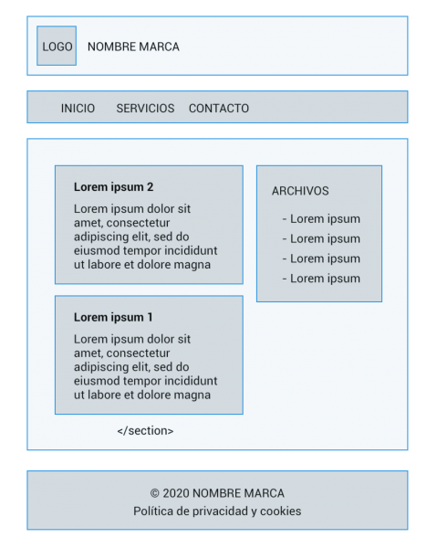

# **Etiquetas html de contenido y texto**

Tabla de contenidos

-   [3. Contenido y texto](/#3-Contenido-y-texto)
-   [3.1. Etiquetas de contenido](/#31-Etiquetas-de-contenido)
-   [3.2. Etiquetas de texto](/#32-Etiquetas-de-texto)
-   [3.3. Hiperenlaces](/#33_Hiperenlaces)
-   [Ejercicios propuestos](/#Ejercicios-propuestos)

# 3. Contenido y texto

En este apartado vamos a ver dos tipos de **etiquetas HTML**: las etiquetas que agrupan el **contenido** y las etiquetas que contienen fragmentos de **texto** (dan significado a esas palabras o fragmentos). Veamos cada una de ellas.

## 3.1. Etiquetas de contenido

| Elemento | Descripción |
| --- | --- |
| `<p>` | Define una parte que debe mostrarse como un párrafo. |
| `<hr>` | Representa un cambio temático entre párrafos. |
| `<pre>` | Indica que su contenido esta preformateado y que este formato debe ser preservado. |
| `<blockquote>` | Representa un contenido citado desde otra fuente. |
| `<ol>` | Define una lista ordenada de artículos. |
| `<ul>` | Define una lista de artículos sin orden. |
| `<li>` | Define un artículo de una lista ennumerada. |
| `<dl>` | Define una lista de definiciones, es decir, una lista de términos y sus definiciones asociadas. |
| `<dt>` | Representa un término definido por el siguiente `<dd>`. |
| `<dd>` | Representa la definición de los terminos listados antes que él. |
| `<figure>` | Representa una figura ilustrada como parte  del documento. |
| `<figcaption>` | Representa la leyenda de una figura. |
| `<div>` | Representa un contenedor genérico sin ningún significado especial. |
Tabla 3.1: Etiquetas de contenido

#### Ejemplo

```html
<!DOCTYPE html>
<html lang="es">  
  <head>    
    <title>Ejemplos Etiquetas de contenido</title>      
  </head>  
  <body>
        <h3>Etiqueta &lt;p&gt;</h3>
        <p>Párrafo Lorem ipsum dolor sit amet consectetur adipisicing elit. Officia beatae aliquam non natus aut id sint ea? Natus tempore hic reprehenderit temporibus minima nisi, quia, magnam omnis, officiis molestiae earum.</p>
        
        <h3>Etiqueta &lt;hr&gt;</h3>
        <hr>
        
        <h3>Etiqueta &lt;pre&gt;</h3>
        <pre>Contenido preformateado       Conserva los espacios,
            los saltos de línea y los tabuladores del texto original.
        </pre>
        
        <h3>Etiqueta &lt;blockquote&gt;</h3>
        <blockquote>Con blockquote representamos un contenido citado desde otra fuente.</blockquote>
        
        <h3>Etiqueta &lt;ul&gt;</h3>
        <ul>
            <li>Lista sin orden</li>
            <li>Lista sin orden</li>
            <li>Lista sin orden</li>
        </ul>
        
        <h3>Etiqueta &lt;ol&gt;</h3>
        <ol>
            <li>Lista ordenada</li>
            <li>Lista ordenada</li>
            <li>Lista ordenada</li>
        </ol>
        
        <h3>Etiquetas &lt;dl&gt; &lt;dt&gt; &lt;dd&gt;</h3>
        <dl>
            <dt>Término 1</dt>
            <dd>Definición del término 1.</dd>
        
            <dt>Término 2</dt>
            <dd>Definición del término 2.</dd>
        
            <dt>Término 3</dt>
            <dd>Definición del término 3.</dd>
        </dl>
        
        <h3>Etiqueta &lt;figure&gt;</h3>
        <figure>
            
            <figcaption>Esto es un figcaption</figcaption>
        </figure>
        
        <h3>Etiqueta &lt;div&gt;</h3>
        <div>Contenedor tipo div</div>     
    </body>  
</html>
```
[Estructura básica HTML (Codepen)](https://codepen.io/sergio-rey-personal/pen/xxZVBRv)


# 3.2. Etiquetas de texto

| Elemento | Descripción |
| --- | --- |
| `<a>` | Representa un *hiperenlace*. |
| `<em>` | Representa un texto *enfatizado*. |
| `<strong>` | Representa un texto importante. |
| `<small>` | Representa un comentario aparte, es decir, textos de políticas de responsabilidad o una nota de derechos de autoría, que no son esenciales para la comprensión del documento. |
| `<s>` | Representa contenido que no es exacto, tiene el estilo tachado. |
| `<cite>` | Representa el título de una obra. |
| `<q>` | Representa una cita textual entre comillas. |
| `<dfn>` | Sirve para marcar el término que se quiere definir. |
| `<abbr>` | Representa una abreviación o un acrónimo; mediante el atributo `title` se puede describir la abreviatura. El texto es usualmente representado como tooltip cuando se pasa el puntero sobre el elemento. |
| `<time>` | Representa un valor de fecha y hora. |
| `<code>` | Representa un código de programación. |
| `<var>` | Representa a una variable, es decir, una expresión matemática o una variable de un programa o similar. |
| `<samp>` | Representa la salida de un programa. |
| `<kbd>` | Representa el texto que debe introducir o la tecla que debe pulsar el usuario. |
| `<sub>``<sup>` | Representan un subíndice y un superíndice respectivamente. |
| `<i>` | Muestra el texto marcado con un estilo en cursiva o italica. |
| `<b>` | Muestra el texto marcado con un estilo en negrita. |
| `<u>` | Muestra el texto subrayado. |
| `<mark>` | Representa un texto marcado o resaltado como referencia o anotación, debido a su relevancia o importancia. |
| `<span>` | Representa texto en línea. Sirve para aplicar estilo al texto o agrupar elementos en línea. |
| `<br>` | Representa un salto de línea. |
| `<wbr>` | Representa una oportunidad de salto de línea, es decir, un punto sugerido donde el texto puede ser dividido para mejorar su legibilidad. |
Tabla 3.2: Etiquetas de texto

#### Ejemplo
```html
<h3>Etiqueta &lt;a&gt;</h3>
<a href="https://www.google.com">Esto es un hiperenlace</a>

<h3>Etiqueta &lt;em&gt;</h3>
<em>Esto es un texto enfatizado.</em>

<h3>Etiqueta &lt;strong&gt;</h3>
<strong>Esto es un texto importante.</strong>

<h3>Etiqueta &lt;small&gt;</h3>
<small>Nota de derechos</small>

<h3>Etiqueta &lt;s&gt;</h3>
<s>Este texto no es exacto</s>

<h3>Etiqueta &lt;cite&gt;</h3>
<cite>Este es el título de una obra</cite>
    
<h3>Etiqueta &lt;q&gt;</h3>
<q>Representa una cita textual entre comillas.</q>

<h3>Etiqueta &lt;dfn&gt;</h3>
<p>El <dfn>HTML</dfn> es un lenguaje de marcado.</p>

<h3>Etiqueta &lt;abbr&gt;</h3>
<p>Pasa el puntero por encima de la siguiente etiqueta abbr: <abbr title="Hypertext Markup Language">HTML</abbr></p>

<h3>Etiqueta &lt;time&gt;</h3>
<time>15s</time>

<h3>Etiqueta &lt;code&gt;</h3>
<code>h1{color:red;}</code>  

<h3>Etiqueta &lt;var&gt;</h3>
<p>El bucle no se detiene hasta que <var>centinela</var> sea igual a 0.</p> 

<h3>Etiqueta &lt;samp&gt;</h3>
<p>Al presionar e botón aparecerá una ventana con el mensaje: <samp>Bienvenido</samp></p>

<h3>Etiqueta &lt;kbd&gt;</h3>
<p> Si está conforme escriba presione <kbd>sí</kbd>. Si no, pulse <kbd>no</kbd>.</p>

<h3>Etiquetas &lt;sub&gt; &lt;sup&gt;</h3>
<p>La fórmula química de agua es H<sub>2</sub>O</p>
<p>Trade Mark <sup>TM</sup></p>

<h3>Etiqueta &lt;i&gt;</h3>
<i>Texto en italica</i>

<h3>Etiqueta &lt;b&gt;</h3>
<b>Texto en negrita</b>

<h3>Etiqueta &lt;u&gt;</h3>
<u>Texto subrayado</u>
    
<h3>Etiqueta &lt;mark&gt;</h3>
<p>El siguiente texto tiene mucha importancia y quiero resaltarlo: <mark>HTML5</mark></p>

<h3>Etiqueta &lt;span&gt;</h3>
<span>Texto </span><span>en </span><span>línea.</span>

<h3>Etiqueta &lt;br&gt;</h3>
<br>

<h3>Etiqueta &lt;wbr&gt;</h3>          
<p>https://www.google.com<wbr>/deeper<wbr>/level<wbr>/pages</p>
```
[HTML. Etiquetas de texto (Codepen)](https://codepen.io/sergio-rey-personal/pen/bGEwOjm)


## 3.3. Hiperenlaces

#### Valores del atributo href

Vamos a ver cómo crear un enlace para llamar por teléfono con `tel` y para enviar un correo con `mailto`

#### Ejemplo

```html
<a href="mailto:info@google.com">Enviar correo a info de Google</a><br>
<a href="tel:+34666666666">Llamar por teléfono a 666 666 666</a>
```

#### Valores del atributo target

Vamos a abrir un enlace en una página aparte mediante el atributo `target` y el valor `_blank`:

#### Ejemplo
```html
<!-- En una página aparte -->
<a href="https://www.google.com" target="_blank">Google</a>
<br>
<!-- En la misma página -->
<a href="https://www.google.com" target="_self">Google</a>
<br>
```
[Abrir un enlace en una página aparte (Codepen)](https://codepen.io/sergio-rey-personal/pen/WNrGLgL)

# Ejercicios propuestos

Partiendo del código de tu blog creado en el ejercicio del punto 2, incluye los siguientes elementos:

-   Añade en la cabecera el nombre del blog.
-   Incluye los siguientes enlaces en el menú: Inicio, Servicios, Contacto.
-   Añade en el Aside una lista de enlaces (historial y enlaces interesantes).
-   Incluye en el footer el nombre de la empresa y un enlace a la política de privacidad y cookies.

Ejemplo:




# Actividad extra

Investiga en la [siguiente página](https://faq.whatsapp.com/es/general/26000030/) cómo incluirías un enlace para llamar por Whatsapp. ¿y cómo añadirías un enlace para llamar por teléfono?