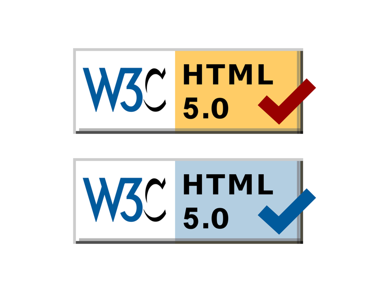

# Test de verificación HTML y herramientas útiles

Tabla de contenidos

-   [7.1. Test de verificación HTML](#71-Test-de-verificacion-HTML)
-   [7.2. Herramientas útiles de desarrollo en navegadores](#72-Herramientas-utiles-de-desarrollo-en-navegadores)
    -   [7.2.1. Firefox developer edition](#721-Firefox-developer-edition)
    -   [7.2.2. Web developer](#722-Web-developer)
-   [Ejercicios propuestos](#Ejercicios-propuestos)

# 7.1. Test de verificación HTML

***Validador HTML, W3C***

El **W3C es el encargado de estandarizar el lenguaje HTML** y en su plataforma nos ofrece varias herramientas e información muy valiosa para la elaboración de nuestros desarrollos. Entre las herramientas destacadas se encuentra el [validador HTML](https://validator.w3.org/#validate_by_upload+with_options) que nos permite encontrar errores en nuestros ficheros. Si los estilos se validan correctamente y no disponen de ningún error, se puede incluir en la página web desarrollada el icono que certifica que el código cumple con el estándar.

El validador HTML te permite subir tu propio fichero html o elegir la directamente la url publicada.

# 7.2. Herramientas útiles de desarrollo en navegadores

Hay una gran cantidad de **herramientas muy útiles** que se añaden a los navegadores en forma de extensiones o plugins y que nos permiten **funcionalidades extra**. A continuación comentamos algunas de ellas.

## 7.2.1. Firefox developer edition

Se trata de un **navegador creado específicamente para desarrolladores web**. Ofrece herramientas muy interesantes como por ejemplo: panel de tipografías, editor de formas, inspector, consola, depurador. [Saber más](https://www.mozilla.org/es-ES/firefox/developer/)

## 7.2.2. Web developer

Consiste en una **extensión disponible para Chrome, Firefox o IE** que nos ofrece **un control exhaustivo de varias partes de la web, tales como el CSS, los formularios o las imágenes**. Con Web Developer instalado podemos, por ejemplo, alterar casi cualquier elemento final de la web en tiempo real y así aplicarlo a los archivos finales.

# Ejercicios propuestos

- Realiza la **validación de tu código html** y corrige los errores encontrados.

- Instala la extensión **Web developer** en tu navegador web favorito y explora las herramientas que te ofrece.