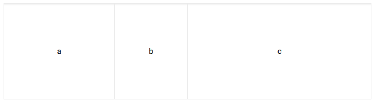
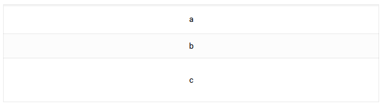
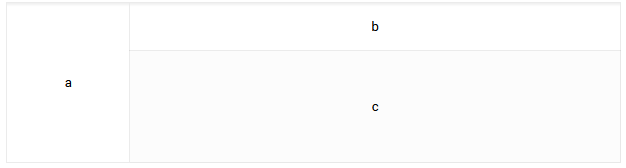
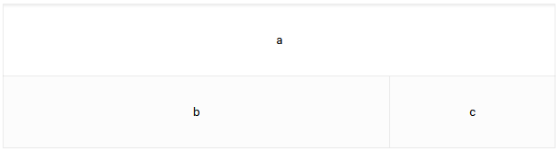

# Marcos o frames en html, una tecnología obsoleta

Tabla de contenidos

-   [14. Marcos o frames](#14-Marcos-o-frames)
-   [14.1. Algunos motivos por los que ya no se utilizan los marcos frames o framesets](#141-Algunos-motivos-por-los-que-ya-no-se-utilizan-los-marcos-frames-o-framesets)
-   [14.2. Marcos o frames en HTML](#142-Marcos-o-frames-en-HTML)

# 14. Marcos o *frames*

Aunque **HTML5 considera obsoleto el uso de marcos** y está **desaconsejado su uso**, es imprescindible conocer su funcionamiento ya que todavía hay una gran cantidad de sitios web implementados con este método.

Los marcos o frames nos permiten **dividir una web en varias ventanas** que pueden cargar otras páginas webs. Se trata de ventanas independientes incorporadas en una misma página y que nos permiten distribuir la información de forma organizada.

La ventana se puede dividir en **marcos horizontales o verticales**, pero no ambos. De todas formas, existe la posibilidad de que un marco contenga a su vez otros marcos. Así los marcos se pueden anidar para hacer todo tipo de distribuciones.

## 14.1. Algunos motivos por los que ya no se utilizan los marcos *frames* o *framesets*

1.  Los motores de búsqueda no indexan bien las páginas creadas con *framesets*.
2.  Ocupan espacio de la pantalla.
3.  Las funcionalidades de ir para adelante o para atrás en el historial de navegación del navegador no se pueden utilizar.
4.  Presentan problemas de usabilidad y accesibilidad web.

## 14.2. Marcos o frames en HTML

Se utiliza la etiqueta `<frameset>` para definir la división de la ventana. La pantalla se puede dividir en filas (**rows**) o en columnas (**cols**). El valor de la división se puede realizar de tres formas diferentes:

Dando un valor fijo del ancho del marco en píxeles:

```html
rows = 150, ...
```

Indicando un porcentaje del tamaño de la ventana:

```html
cols = 25%, ...
```

Mediante un valor relativo que dependa del espacio libre de la ventana. El asterisco (*) indica el resto del espacio.

```html
 rows = 100,*
```

En el ejemplo siguiente se crearán tres marcos. El marco superior tendrá 100 píxeles de alto, el segundo ocupará el 25% de la ventana y el tercero el ancho del espacio sobrante.

```html
rows = 100,25%,*
```

#### Ejemplo

#### 1) Marco de 3 ventanas verticales (cols)

Vista:



Código:

```html
<frameset **cols**=30%,20%,50%>
    <frame src="a.htm">
    <frame src="b.htm">
    <frame src="c.htm">
 </frameset>
```

#### 2) Marco de 3 ventanas horizontales (rows)

Vista:



Código:

```html
<frameset **rows**=30%,20%,50%>
    <frame src="a.htm">
    <frame src="b.htm">
    <frame src="c.htm">
 </frameset>
``` 

#### 3) Marco con un área vertical y dos horizontales

Vista:



Código:

```html
<frameset **cols**=20%,*>*
     <frame src="a.htm">
     <frameset **rows**=30%,>
          <frame src="b.htm">
          <frame src="c.htm">
     </frameset>
 </frameset>
```

#### 4) Marco con un área horizontal y dos verticales



```html
<frameset **rows**=50%,*>*
   <frame src="a.htm">
      <frameset **cols**=70%,>
          <frame src="b.htm">
          <frame src="c.htm">
       </frameset>
 </frameset>
```

[Ver más ejemplos](https://www.uv.es/jac/guia/frame.htm)