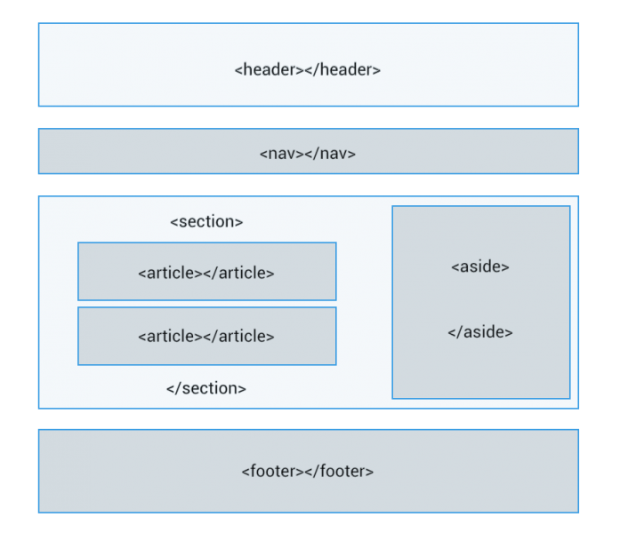

# **Resumen de etiquetas HTML**

Tabla de contenidos

-   [16. Resumen HTML](/#16_Resumen_HTML)
    -   [16.1. Elementos semánticos ](/#161_Elementos_semanticos)
    -   [16.2. Elementos raíz](/#162_Elementos_raiz)
    -   [16.3. Metadatos](/#163_Metadatos)
    -   [16.4. Scripting](/#164_Scripting)
    -   [16.5. Secciones](/#165_Secciones)
    -   [16.6. Contenido](/#166_Contenido)
    -   [16.7. Etiquetas de texto](/#167_Etiquetas_de_texto)
    -   [16.8. Formulario](/#168_Formulario)
    -   [16.9. Tablas de contenido](/#169_Tablas_de_contenido)
    -   [16.10. Contenido incrustrado](/#1610_Contenido_incrustrado)

# 16. Resumen HTML

## 16.1. Elementos semánticos 

## 16.2. Elementos raíz

| Elemento | Descripción |
| --- | --- |
| `<!DOCTYPE html>` | Indica que el documento está bajo el estándar de HTML5 |
| `<html>` | Representa la raíz de un documento HTML o XHTML. |
Tabla 15.1: Elementos HTML5 para la raíz del documento

## 16.3. Metadatos

| Elemento | Descripción |
| --- | --- |
| `<head>` | Colección de metadatos sobre el documento, incluyendo enlaces a scripts y hojas de estilo. |
| `<title>` | Título del documento. Se muestra en la barra superior del navegador o en las pestañas de página. |
| `<link>` | Usada para enlazar JavaScript y CSS externos con el documento HTML actual. |
| `<meta>` | Define los metadatos que no pueden ser definidos usando otro elemento HTML. |
| `<style>` | Etiqueta de estilo usada para escribir CSS en línea. |
Tabla 15.2: Metadatos

## 16.4. Scripting

| Elemento | Descripción |
| --- | --- |
| `<script>` | Define ya sea un script interno o un enlace hacia un script externo. El lenguaje de programación es JavaScript |
| `<noscript>` | Define un contenido alternativo a mostrar cuando el navegador no soporta scripting. |
Tabla 15.3: Scripting

## 16.5. Secciones

| Elemento | Descripción |
| --- | --- |
| `<body>` |Representa el contenido principal de un documento HTML. Solo hay un elemento `<body>` en un documento. |
| `<section>` | Define una sección en un documento. |
| `<nav>` | Define una sección que solamente contiene enlaces de navegación |
| `<article>` | Define contenido autónomo que podría existir independientemente del resto del contenido. |
| `<aside>` | Define algunos contenidos vagamente relacionados con el resto del contenido de la página. Si es removido, el contenido restante seguirá teniendo sentido |
| `<h1>,<h2>,<h3>,<h4>,<h5>,<h6>` | Los elemento de cabecera  implementan seis niveles de cabeceras de documentos; `<h1>` es la de mayor y `<h6>` es la de menor impotancia. Un elemento de cabecera describe brevemente el tema de la sección que introduce. |
| `<header>` | Define la cabecera de una página o sección. Usualmente contiene un logotipo, el título del sitio Web y una tabla de navegación de contenidos. |
| `<footer>` | Define el pie de una página o sección. Usualmente contiene un mensaje de derechos de autoría, algunos enlaces a información legal o direcciones para dar información de retroalimentación. |
| `<address>` | Define una sección que contiene información de contacto. |
| `<main>` | Define el contenido principal o importante en el documento. Solamente existe un elemento `<main>` en el documento. |
Tabla 15.4: Scripting

## 16.6. Contenido

| Elemento | Descripción |
| --- | --- |
| `
` | Define una parte que debe mostrarse como un párrafo. |
| `
` | Representa un quiebre temático entre parrafos de una sección o articulo o cualquier contenido. |
| `<pre>` | Indica que su contenido esta preformateado y que este formato debe ser preservado. |
| `<blockquote>` | Representa una contenido citado desde otra fuente. |
| `<ol>` | Define una lista ordenada de artículos. |
| `<ul>` | Define una lista de artículos sin orden. |
| `<li>` | Define un artículo de una lista ennumerada. |
| `<dl>` | Define una lista de definiciones, es decir, una lista de términos y sus definiciones asociadas. |
| `<dt>` | Representa un término definido por el siguiente `<dd>`. |
| `<dd>` | Representa la definición de los terminos listados antes que él. |
| `<figure>` | Representa una figura ilustrada como parte  del documento. |
| `<figcaption>` | Representa la leyenda de una figura. |
| `
` | Representa un contenedor genérico sin ningún significado especial. |
Tabla 15.5: Contenido

## 16.7. Etiquetas de texto

| Elemento | Descripción |
| --- | --- |
| `<a>` | Representa un *hiperenlace*. |
| `<em>` | Representa un texto *enfatizado*. |
| `<strong>` | Representa un texto importante. |
| `<small>` | Representa un comentario aparte, es decir, textos de políticas de responsabilidad o una nota de derechos de autoría, que no son esenciales para la comprensión del documento. |
| `<s>` | Representa contenido que no es exacto, tiene el estilo tachado. |
| `<cite>` | Representa el título de una obra. |
| `<q>` | Representa una cita textual entre comillas. |
| `<dfn>` | Sirve para marcar el término que se quiere definir. |
| `<abbr>` | Representa una abreviación o un acrónimo; mediante el atributo `title` se puede describir la abreviatura. El texto es usualmente representado como tooltip cuando se pasa el puntero sobre el elemento. |
| `<time>` | Representa un valor de fecha y hora. |
| `<code>` | Representa un código de programación. |
| `<var>` | Representa a una variable, es decir, una expresión matemática o una variable de un programa o similar. |
| `<samp>` | Representa la salida de un programa. |
| `<kbd>` | Representa el texto que debe introducir o la tecla que debe pulsar el usuario. |
| ```` | Representan un subíndice y un superíndice respectivamente. |
| `<i>` | Muestra el texto marcado con un estilo en cursiva o italica. |
| `<b>` | Muestra el texto marcado con un estilo en negrita. |
| `<u>` | Muestra el texto subrayado. |
| `<mark>` | Representa un texto marcado o resaltado como referencia o anotación, debido a su relevancia o importancia. |
| `` | Representa texto en línea. Sirve para aplicar estilo al texto o agrupar elementos en línea. |
| ` ` | Representa un salto de línea. |
| `<wbr>` | Representa una oportunidad de salto de línea, es decir, un punto sugerido donde el texto puede ser dividido para mejorar su legibilidad. |
Tabla 15.6: Etiquetas de texto

## 16.8. Formulario

| Elemento | Descripción |
| --- | --- |
| `<form>` | Define un formulario. |
| `<fieldset>` | Permite organizar en grupos los campos de un formulario. |
| `<legend>` | Representa el título de un `<fieldset>`. |
| `<label>` | Representa el título de un control de formulario. |
| `<input>` | Se usa para crear controles interactivos que reciben datos del usuario. |
| `<button>` | Representa un botón. |
| `<option>` | Representa una opción en un elemento `<select>` o `<datalist>`. |
| `<select>` | Representa un control que permite la selección entre un conjunto de opciones `<option>`. |
| `<optgroup>` | Representa un conjunto de opciones, agrupadas lógicamente. |
| `<datalist>` | Representa un control que permite la selección entre un conjunto de opciones `<option>`. |
| `<textarea>` | Representa un control de edición de texto multi-línea. |
| `<output>` | Representa el resultado de un cálculo. |
Tabla 15.7: Etiquetas para la creación de formularios

| Atributo | Ejemplo |
| --- | --- |
| placeholder | placeholder="Indica tu nombre" |
| required | required="true" |
| pattern | pattern="[a-z]{1,5}" |
| min | min="1" |
| max | max="100" |
| step | step="2" (saltos en un rango de números: 0, 2, 4...) |
| disabled | disabled="true" |
| autofocus | autofocus="true" |
| autocomplete | autocomplete="true" |
Tabla 15.8: Atributos para la validación de campos en los formularios

## 16.9. Tablas de contenido

| Elemento | Descripción |
| --- | --- |
| `<table>` | Representa datos con más de una dimensión. |
| `<caption>` | Representa el título de una tabla. |
| `<tr>` | Representa una fila de celdas en una tabla. |
| `<td>` | Representa una celda de datos en una tabla. |
| `<th>` |Representa una celda encabezado en una tabla. |
| `<colgroup>` | Representa un conjunto de una o más columnas de una tabla. |
| `<col>` | Representa una columna de una tabla. |
| `<tbody>` | Representa el bloque de filas que describen los datos concretos de una tabla. |
| `<thead>` | Representa el bloque de filas que describen las etiquetas de columna de una tabla. |
| `<tfoot>` | Representa los bloques de filas que describen los resúmenes de columna de una tabla. |
Tabla 15.9: Tablas de contenido

## 16.10. Contenido incrustrado

Tabla 15.10: Contenido incrustado
| Elemento | Descripción |
| --- | --- |
| `` | Representa una imagen. |
| `<iframe>` | Representa un contexto anidado de navegación, es decir, un documento HTML embebido. |
| `<embed>` | Representa un punto de integración para una aplicación o contenido interactivo externo que por lo general no es HTML. |
| `<object>` | Representa un recurso externo, que será tratado como una imagen, un sub-documento HTML o un recurso externo a ser procesado por un plugin. |
| `<param>` | Define parámetros para el uso por los plugins invocados por los elementos `<object>`. |
| `<video>` | Representa un vídeo, y sus archivos de audio y canciones asociadas, con la interfaz necesaria para reproducirlos. |
| `<audio>` | Representa un sonido o *stream de audio.* |
| `<source>` | Permite a autores especificar recursos multimedia alternativos para los elementos multimedia como  `<video>` o `<audio>`. |
| `<track>` | Permite a autores especificar una pista de texto temporizado para elementos multimedia como `<video> `o * `<audio>`.* |
| `<canvas>` | Representa un área de mapa de bits en el que se pueden utilizar scripts para renderizar gráficos. |
| `<map>` | En conjunto con `<area>`, define un mapa de imagen. |
| `<area>` | En conjunto con  `<map>`, define un mapa de imagen. |
| `<svg>` | Define una imagen vectorial embebida. |
| `<math>` | Define una fórmula matemática. |
