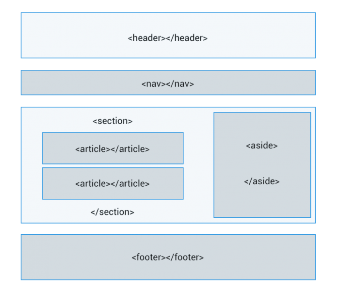

# 2. **HTML5, estructura básica y elementos semánticos**

Tabla de contenidos

- [2. **HTML5, estructura básica y elementos semánticos**](#2-html5-estructura-básica-y-elementos-semánticos)
  - [2.1. Elementos semánticos HTML5](#21-elementos-semánticos-html5)
  - [2.2. Estructura básica de un documento HTML5](#22-estructura-básica-de-un-documento-html5)
    - [2.2.1. Elementos raíz](#221-elementos-raíz)
    - [2.2.2. Metadatos](#222-metadatos)
    - [2.2.3. Scripting](#223-scripting)
    - [2.2.4. Secciones](#224-secciones)
- [Actividad](#actividad)


La última versión del lenguaje de programación HTML es **HTML5**. Las webs implementadas con lenguaje HTML5 no son correctamente visualizadas en los navegadores antiguos ya que esta versión incluye nuevas etiquetas que no son soportadas.

[HTML: de HTML4 a HTML5Historia de HTML (youtube)](https://www.youtube.com/embed/vRqQRrULSxI)

## 2.1. Elementos semánticos HTML5

Una de las principales ventajas de HTML5 es la inclusión de **elementos semánticos, o marcados semánticos**, que nos ayudan a definir las distintas divisiones de una página web. En las versiones anteriores se solía utilizar la etiqueta `<div>`, pero actualmente es recomendado utilizar los elementos semánticos ya que describen claramente su propósito. Veámos los elementos semánticos de HTML5.



Figura 2.1. Esquema básico de un documento HTML5

## 2.2. Estructura básica de un documento HTML5

Las páginas web tienen una misma estructura general que se muestra a continuación:

```html
<!DOCTYPE html>
<html lang="es">  
  <head>    
    <title>Título de la WEB</title>    
    <meta charset="UTF-8">
    <meta name="title" content="Título de la WEB">
    <meta name="description" content="Descripción de la WEB">    
    <link href="estilos.css" rel="stylesheet">    
  </head>  
  <body>    
    <header>
      <h1>Título de la WEB</h1>      
    </header>    
    <nav>
      <a href="#">IR SECCIÓN 2</a>
      <a href="#">IR SECCIÓN 3</a>
    </nav>
    <section>      
      <article>
        <h2>CONTENIDO PRINCIPAL</h2>
        <p>Este es el contenido principal de mi web</p>
        <div>
          <p>Aquí tenéis una imagen.</p>
             
        </div>
      </article>      
    </section>
    <aside>
      <h3>Banner de publicidad</h3>
      <a href="#">
        
      </a>
      <h3>Testimonios</h3>
      <p>Me gusta mucho esta página.</p>
    </aside>
    <footer>
      <h4>Aviso legal</h4>
      <a href="#">Política de cookies</a>
      <h4>Redes sociales</h4>
      <a href="#">Facebook</a>
      <a href="#">Tiwtter</a>
    </footer>
  </body>  
</html>
```

Puedes utilizar el código anterior para comenzar con el desarrollo de tus prácticas.

A continuación se explican los elementos básicos que contiene una página web:

### 2.2.1. Elementos raíz

| Elemento | Descripción |
| --- | --- |
| `<!DOCTYPE html>` | Indica que el documento está bajo el estándar de HTML5 |
| `<html>` | Representa la raíz de un documento HTML o XHTML. |
Tabla 2.1: Elementos HTML5 para la raíz del documento


### 2.2.2. Metadatos

| Elemento | Descripción |
| --- | --- |
| `<head>` | Colección de metadatos sobre el documento, incluyendo enlaces a scripts y hojas de estilo. |
| `<title>` | Título del documento. Se muestra en la barra superior del navegador o en las pestañas de página. |
| `<link>` | Usada para enlazar JavaScript y CSS externos con el documento HTML actual. |
| `<meta>` | Define los metadatos que no pueden ser definidos usando otro elemento HTML. |
| `<style>` | Etiqueta de estilo usada para escribir CSS en línea. |
Tabla 2.2: Metadatos


### 2.2.3. Scripting

| Elemento | Descripción |
| --- | --- |
| `<script>` | Define ya sea un script interno o un enlace hacia un script externo. El lenguaje de programación es JavaScript |
| `<noscript>` | Define un contenido alternativo a mostrar cuando el navegador no soporta scripting. |
Tabla 2.3: Scripting


### 2.2.4. Secciones

| Elemento | Descripción |
| --- | --- |
| `<body>` | Representa el contenido principal de un documento HTML. Solo hay un elemento `<body>` en un documento. |
| `<section>` | Define secciones de una web. |
| `<nav>` | Define una sección que contiene un menú de navegación. |
| `<article>` | Define unidades de contenido que podrían existir independientemente del resto del contenido. |
| `<aside>` | Define a barra lateral de una página web. Puede contener todo tipo de contenido. Sin embargo, se suele utilizar para mostrar enlaces. |
| `<h1>,<h2>,<h3>,<h4>,<h5>,<h6>` | Los elemento de cabecera  implementan seis niveles de cabeceras de documentos; `<h1>` es la de mayor importancia y `<h6>` es la de menor impotancia. Un elemento de cabecera describe brevemente el tema de la sección que introduce. |
| `<header>` | Define la cabecera de una web o de un elemento. |
| `<footer>` | Define el pie de página. También se puede utilizar para definir el pie otros elementos. |
| `<address>` | Define una sección que contiene información de contacto. |
| `<main>` | Define el contenido principal del documento. Solamente existe un elemento `<main>` en el documento. |
Tabla 2.4: Etiquetas estructurales para las secciones.


[¿Cerramos siempre las etiquetas HTML?](https://www.loopeando.com/etiquetas-html-cerrar-o-no-cerrar/)

# Actividad

Una vez creada la estructura de carpetas, implementa una página web tipo blog en código HTML que disponga de los siguientes elementos:

Página index.html:

    - Cabecera
    - Menú
    - Una sección con dos artículos
    - Footer
    - Aside