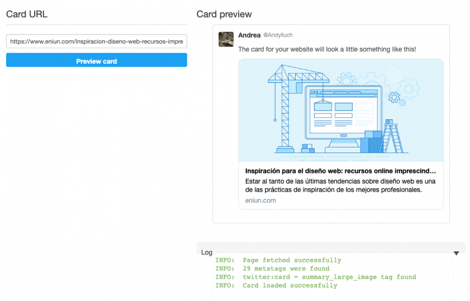
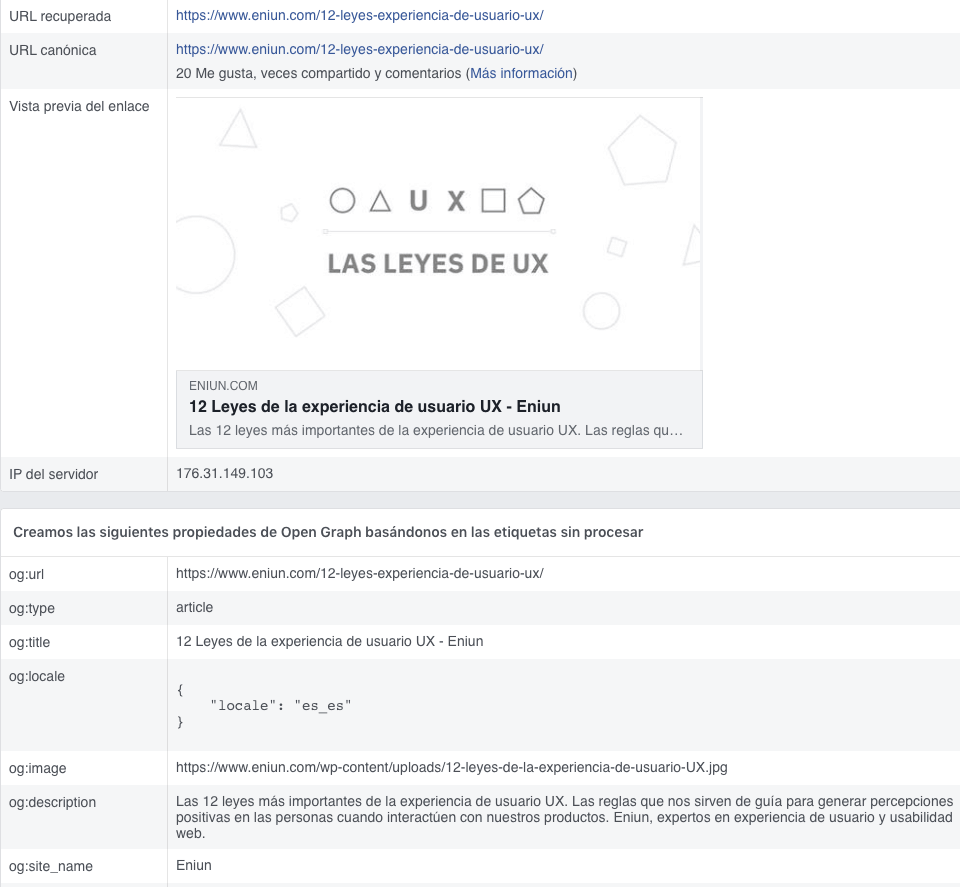

# **Metaetiquetas o metatags para redes sociales en HTML**

Tabla de contenidos

-   [10. Metaetiquetas o metatags para redes sociales en HTML](#10-Metaetiquetas-o-metatags-para-redes-sociales-en-HTML)
    -   [10.1. Metaetiquetas en Twitter](#101-Metaetiquetas-en-Twitter)
    -   [10.2. Metaetiquetas en Facebook o Pinterest, Open Graph](#102-Metaetiquetas-en-Facebook-o-Pinterest-Open-Graph)
    -   [10.3. Incluir los botones de para compartir tweets, momentos, likes...](#103-Incluir-los-botones-de-para-compartir-tweets-momentos-likes8230)
-   [Ejercicios propuestos](#Ejercicios-propuestos)

# 10. Metaetiquetas o *metatags* para redes sociales en HTML

A la hora de compartir una página web en una red social hay que tener en cuenta diferentes aspectos para **presentar el contenido de una forma atractiva**. Por ejemplo, es necesario **definir el título, una fotografía, la descripción o el autor,** entre otras cosas. Para ello **utilizaremos las metaetiquetas o** ***metatags*** (también conocidas por etiquetas *meta* o *meta tags*).

No existe un estándar de metaetiquetas para representar todas las redes sociales. Así por ejemplo, Linkedin, Pinterest o Facebook utilizan **Open Graph Protocol** y Twitter utiliza **Twitter Cards.** Veamos cómo representar cada una de ellas.

## 10.1. Metaetiquetas en Twitter

-   Selecciona la Twitter Card que quieres añadir en la [página de desarrolladores de Twitter](https://developer.twitter.com/en/docs/tweets/optimize-with-cards/guides/getting-started).
-   Incluye el código o metaetiquetas necesarias en tu sitio web.
-   Comprueba que tus Twitter Cards funcionan correctamente. Para ello, introduce la url en el [Validador de Cards de Twitter](https://cards-dev.twitter.com/validator).

**Ejemplo de código o metaetiquetas para Twitter:**
```html
<!DOCTYPE html>
<html lang="es">  
  <head>    
    <title>Etiquetas para Twitter</title>  
    <!-- Etiquetas para Twitter-->
    <meta name="twitter:card" content="summary_large_image">
    <meta name="twitter:description" content="Estar al tanto de las últimas tendencias sobre diseño web es una de las prácticas de inspiración de los mejores profesionales.">
    <meta name="twitter:title" content="Inspiración para el diseño web: recursos online imprescindibles">
    <meta name="twitter:site" content="@google_es">
    <meta name="twitter:image" content="https://www.gva.es/portal-gva-theme/images/GVA/logo_gva.png">
    <meta name="twitter:creator" content="@andylluch">
  </head>  
  <body>    
    Etiquetas para Twitter
  </body>  
</html>
```

[Etiquetas Twitter (Codepen)](https://codepen.io/sergio-rey-personal/pen/rNxMPKw)

**Aspecto validador de Twitter:**



Figura 1. Aspecto del validador de metaetiquetas de Twitter.

## 10.2. Metaetiquetas en Facebook o Pinterest, Open Graph

-   Realiza la misma operación para Facebook desde la [página para webmasters](https://developers.facebook.com/docs/sharing/webmasters/).
-   Verifica si está todo correcto mediante el [Depurador de contenido](https://developers.facebook.com/tools/debug/sharing/).

**Ejemplo de código o metaetiquetas Open Graph:**

```html
<!DOCTYPE html>
<html lang="es">  
  <head>    
    <title>Etiquetas Open Graph</title>  
    <!-- Etiquetas Open Graph-->
    <meta property="og:locale" content="es_ES">
    <meta property="og:type" content="article">
    <meta property="og:title" content="12 Leyes de la experiencia de usuario UX">
    <meta property="og:description" content="Las 12 leyes más importantes de la experiencia de usuario UX. Las reglas que nos sirven de guía para generar percepciones positivas en las personas cuando interactúen con nuestros productos. Expertos en experiencia de usuario y usabilidad web.">
    <meta property="og:url" content="https://github.com/Sergio-Rey-Personal/DIW/blob/master/UD01_Disenyo_web_Caractaristicas_elementos_basicos_y_etapas_para_su_desarrollo/UD01_10_LeyesGestalt.md">
    <meta property="og:site_name" content="google">
    <meta property="article:publisher" content="https://www.facebook.com/">
    <meta property="article:section" content="UX">
    <meta property="article:published_time" content="2018-02-28T09:00:04+00:00">
    <meta property="article:modified_time" content="2019-08-22T19:41:17+00:00">
    <meta property="og:updated_time" content="2019-08-22T19:41:17+00:00">
    <meta property="og:image" content="https://www.gva.es/portal-gva-theme/images/GVA/logo_gva.png">
    <meta property="og:image:secure_url" content="https://www.gva.es/portal-gva-theme/images/GVA/logo_gva.png">
    <meta property="og:image:width" content="1200">
    <meta property="og:image:height" content="600">
  </head>  
  <body>    
    Etiquetas Open Graph
  </body>  
</html>
```

[Etiquetas Open Graph (Codepen)](https://codepen.io/sergio-rey-personal/pen/wvMzNEv)

**Aspecto del validador de metaetiquetas de Facebook:**



Figura 2: Aspecto del validador de metaetiquetas de Facebook.

## 10.3. Incluir los botones de para compartir tweets, momentos, likes...

Además de los elementos anteriores, también nos puede interesar incluir en nuestra web los **botones para compartir en redes sociales.** Para ello, accederemos a las diferentes páginas para desarrolladores y generaremos el código correspondiente para posteriormente insertarlo en nuestra web.

En el caso de Twitter podemos agregar los botones para compartir tweets, perfiles, momentos, likes desde las siguiente [página para desarrolladores](https://help.twitter.com/es/using-twitter/twitter-buttons).

# Ejercicios propuestos

Incluye los siguientes elementos en tu proyecto HTML:

-   Metadatos: Twitter, Open Graph.
-   Botones para compartir en redes sociales.
-   Metadatos de imágenes para iOS y Android.