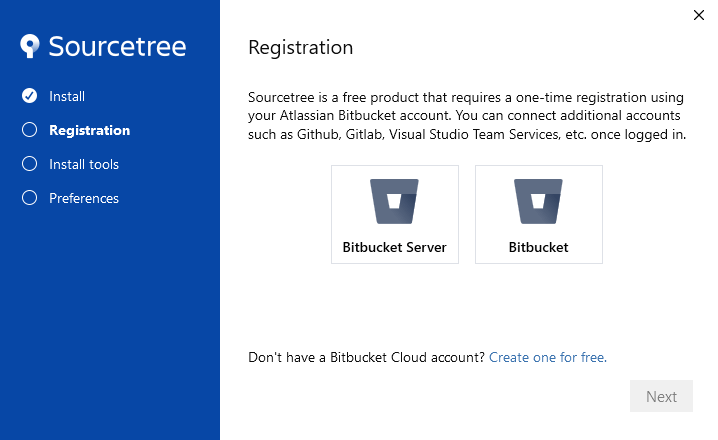
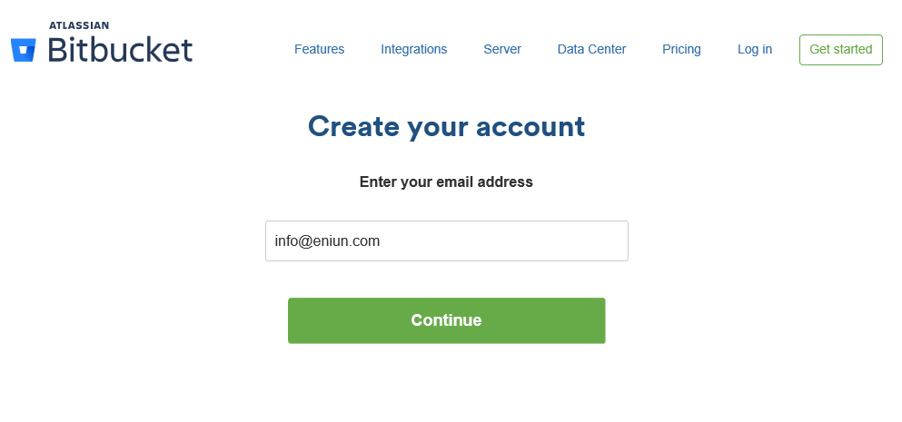
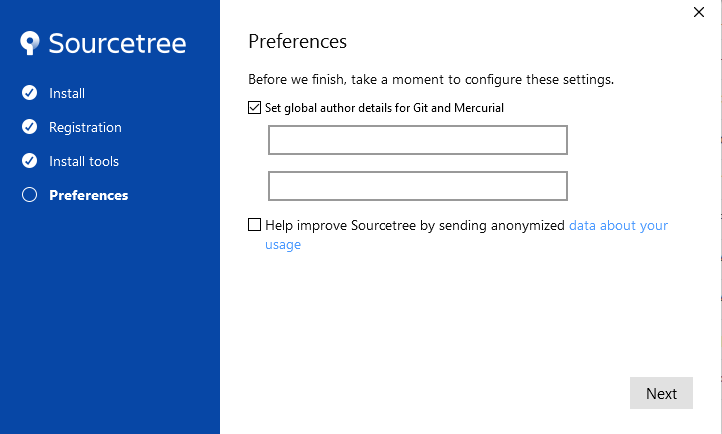
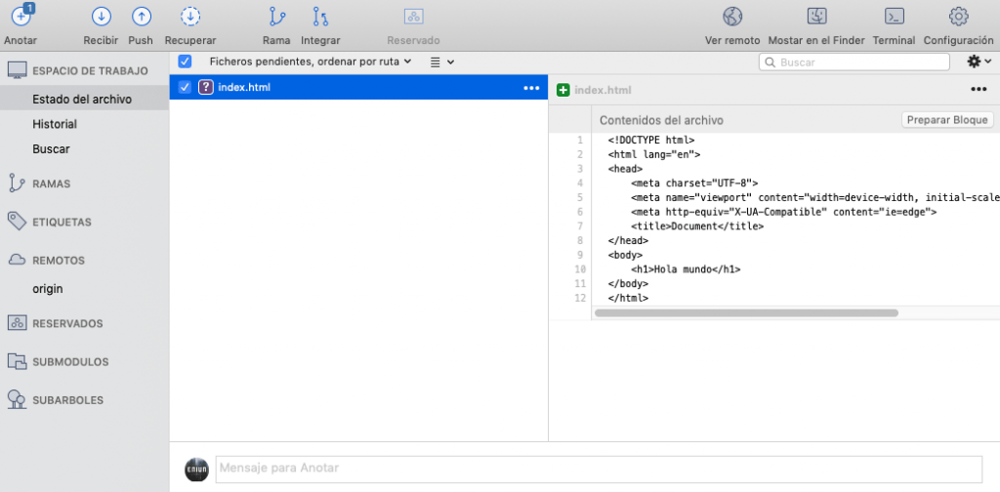
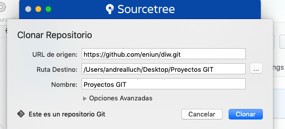
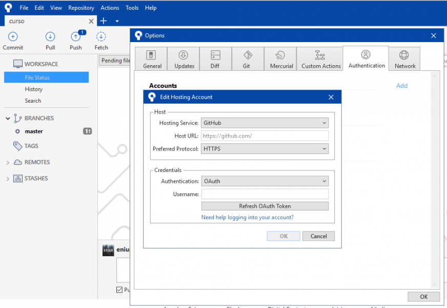
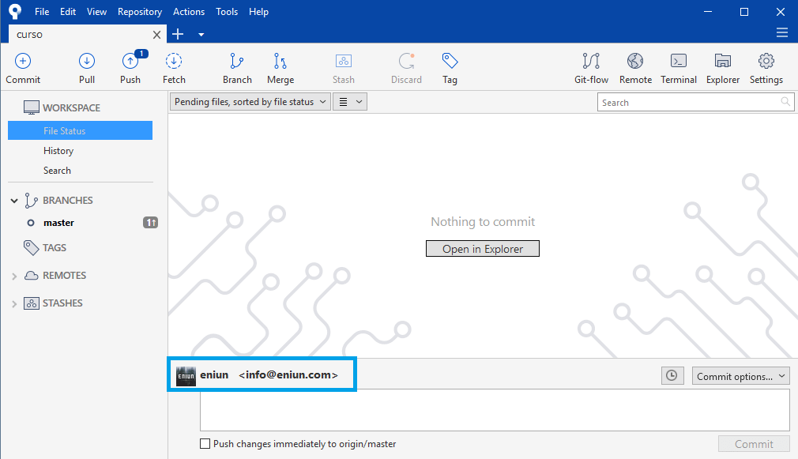

# Cómo usar Github y SourceTree para publicar contenido

Tabla de contenidos

-   [12. Usar Github y SourceTree para publicar contenido](#12-Usar-Github-y-SourceTree-para-publicar-contenido)
-   [12.1. Solución errores Github y SourceTree](#121-Solucion-errores-Github-y-SourceTree)
    -   [12.1.1. Errores en la configuración de la cuenta Github en SourceTree](#1211-Errores-en-la-configuracion-de-la-cuenta-Github-en-SourceTree)
    -   [12.1.2. Error de configuración de usuario](#1212-Error-de-configuracion-de-usuario)
    -   [12.1.3. Otros errores en la configuración de Github con SourceTree](#1213-Otros-errores-en-la-configuracion-de-Github-con-SourceTree)
-   [Ejercicios propuestos](#Ejercicios-propuestos)

[GitHub](https://github.com/) es una **plataforma de** ***social coding*** que te permite **subir repositorios de código** que se alojan en un **sistema de control de versiones** Git. Este sistema te ofrece la posibilidad de **colaborar en otros proyectos y crear los tuyos propios**. La plataforma es de **código abierto** por defecto, por lo que cualquier persona puede utilizar tu código y tú también puedes ver el código de otros proyectos. Este artículo es una **guía básica para publicar contenido usando GitHub y SourceTree**.


# 12. Usar Github y SourceTree para publicar contenido

1.  Accede a <https://github.com/> y **crea una cuenta**. Selecciona el plan personal gratuito con repositorio público. No te olvides de terminar la verificación mediante correo electrónico.
2.  Crea un proyecto en la opción "**Create a Proyect**". Incluye el nombre de tu repositorio y selecciona la opción "Create repository". No cierres esta ventana porque vas a necesitar algunos de los datos que ahí se muestran para clonar el repositorio mediante URL. (Si por error cierras esta página, puedes volver a entrar mediante una url con el siguiente aspecto: https://github.com/tunombredeusuario/nombredeturepositorio/ (en mi caso es la siguiente: https://github.com/Sergio-Rey-Personal/DIW/).

    

3.  **Descarga** [**SourceTree**](https://www.sourcetreeapp.com/) para clonar el repositorio que acabamos de crear a nuestra computadora.
4.  Crea una cuenta en **Bitbucket** y accede a SouceTree mediante esa cuenta.

    

    

5.  En el apartado "install tools" debes seleccionar la opción "Set Global author details from Git and Mercurial".

    

6.  En SourceTree selecciona la opción nuevo / **clonar repositorio**. Copia y pega la URL de origen que encontrarás en la ventana de github que dejaste abierta en el punto 2. Selecciona una ruta de destino, por ejemplo una carpeta que crees en el escritorio de tu computadora. Te pedirá tu cuenta de Github, pon el usuario y la contraseña de github (si te equivocas te dará el error fatal: Authentication failed for..." y tendrás que acceder a C:\Users\USERNAME\AppData\Local\Atlassian\SourceTree y eliminar el passwd file).

    

7.  Utiliza tu editor de código favorito para **crear un archivo index.html**. Súbelo en la carpeta de proyecto creada en el punto 5.
8.  Accede SouceTree. Verás que aparece el archivo index.html. Selecciónalo y dale a "anotar".
9.  Vuelve a tu proyecto github (ventana que dejaste abierta en el punto 2) y actualiza. Verás que aparece un nuevo archivo.

    

10. En GitHub dale a "Settings / Source y selecciona "**Master Branch**".
11. Visualiza tu web. La URL de visualización tendrá el siguiente aspecto: **https://nombredetucuenta/github.io/nombredeturepositorio/** (La página mostrada es la página index.html). En mi caso es la siguiente: https://sergio-rey-personal.github.io/diw/
12. Si quieres seguir aprendiendo funcionalidades de Github puedes comenzar haciendo el siguiente tutorial: <https://guides.github.com/activities/hello-world/>.

## 12.1. Solución errores Github y SourceTree

### 12.1.1. Errores en la configuración de la cuenta Github en SourceTree

Para agregar nuestra cuenta de Github en SourceTree accedemos a Tools/Options/Authentication seleccionamos "add" e incluimos los datos de nuestra cuenta Github tal y como puedes ver en la siguiente captura. En la opción "Authentication" en vez de "OAuth" tienes que seleccionar "basic".



Cómo agregar la cuenta de Github en SourceTree.

Además, deberás seleccionar la cuenta por defecto en la opción "set as default".

Comprueba que puedes ver tu cuenta de usuario en el panel de control de SourceTree. Puede ser que sea necesario que reinicies el equipo para poder ver los cambios correctamente.



Panel control SourceTree con tu cuenta de usuario.

### 12.1.2. Error de configuración de usuario

Para solucionar el error de usuario en SourceTree debemos instalar GIT e indicar por línea de comandos nuestro usuario e email. Por ejemplo pondríamos lo siguiente:

```
$ git config --global user.name "sergio"
$ git config --global user.email sergio@gmail.com
```

### 12.1.3. Otros errores en la configuración de Github con SourceTree

Si los errores persisten puede que te interese realizar la integración de [Github en Visual Studio Code](https://github.com/Sergio-Rey-Personal/DIW/blob/master/UD03_Disenyo_y_maquetacion_web_con_HTML5_y_CSS3/UD03_13_RepositorioGitEnVisualStudioCodeGithub.md).

# Ejercicios propuestos

Publica tu página web en Github y trabaja con esta herramienta de control de versiones.