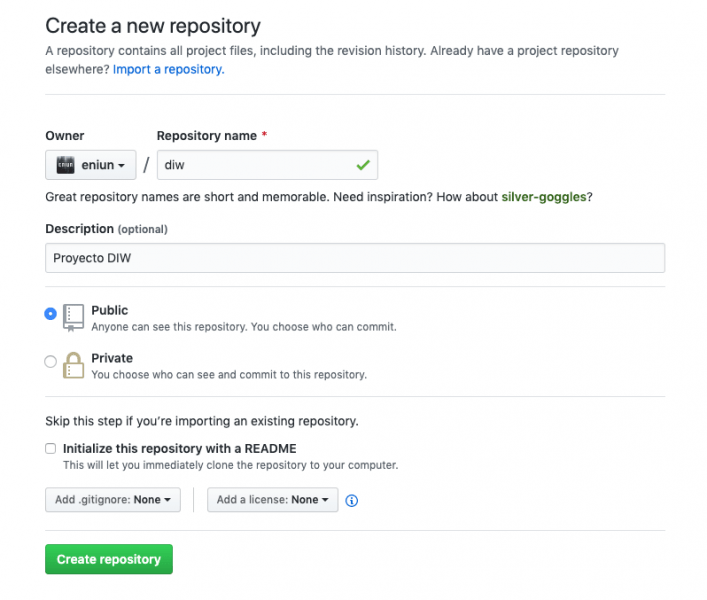
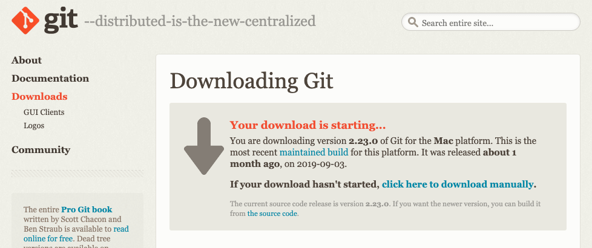
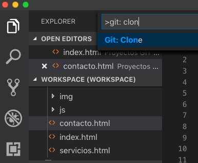
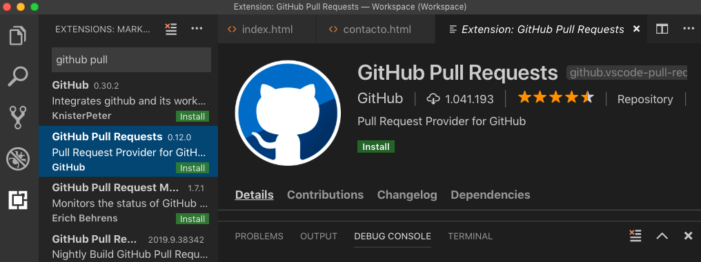
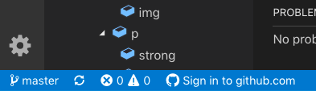

# Repositorio Git en Visual Studio Code con cuenta Github

Tabla de contenidos

-   [13. Usar Github y Visual Studio Code para publicar contenido](#13-Usar-Github-y-Visual-Studio-Code-para-publicar-contenido)
-   [13.1. Crear cuenta en Github](#131-Crear-cuenta-en-Github)
-   [13.2. Clonar el repositorio con Visual Studio Code](#132-Clonar-el-repositorio-con-Visual-Studio-Code)
-   [13.3. Ver los cambios en Github](#133-Ver-los-cambios-en-Github)
-   [13.4. Otros errores en la configuración de Github con Visual Studio Code](#134-Otros-errores-en-la-configuracion-de-Github-con-Visual-Studio-Code)

Mediante la plataforma de ***social coding*** [GitHub](https://github.com/) puedes **publicar repositorios de código** para que se alojen en un **sistema de control de versiones** Git. Este sistema te ofrece la posibilidad de **colaborar en otros proyectos y publicar los tuyos propios**. La plataforma es de **código abierto** por defecto, por lo que cualquier persona puede utilizar tu código y tú también puedes ver el código de otros proyectos. Este artículo es una **guía básica para publicar contenido usando GitHub y Visual Studio Code**.

# 13. Usar Github y Visual Studio Code para publicar contenido

## 13.1. Crear cuenta en Github

Accede a <https://github.com/> y **crea una cuenta**. Selecciona el plan personal gratuito con repositorio público. No te olvides de terminar la verificación mediante correo electrónico.

Crea un proyecto en la opción "**Create a Proyect**". Incluye el nombre de tu repositorio y selecciona la opción "Create repository". No cierres esta ventana porque vas a necesitar algunos de los datos que ahí se muestran para clonar el repositorio mediante URL. (Si por error cierras esta página, puedes volver a entrar mediante una url con el siguiente aspecto: https://github.com/tunombredeusuario/nombredeturepositorio/ (en mi caso es la siguiente: https://github.com/Sergio-Rey-Personal/DIW/).



## 13.2. Clonar el repositorio con Visual Studio Code

Antes de comenzar a clonar el repositorio debemos instalar Visual Studio Code y Git.



Dentro de Git debemos definir nuestro usuario e email de la siguiente manera:

```
$ git config --global user.name "sergio"
$ git config --global user.email sergio@gmail.com
```

Ahora vamos a clonar el proyecto creado en Github desde Visual Studio Code. Para ello, nos vamos al menú "view" seleccionamos "command palette". En ese punto buscamos "git: Clone". La herramienta nos pedirá la ruta y ahí es donde tenemos que pegar la URL del repositorio que hemos creado en el punto anterior en Github.



De esta forma ya se ha creado nuestro repositorio y la herramienta nos va marcando los ficheros que vamos modificando.

Antes de hacer un commit debemos instalar la extensión "GitHub pull request" desde el menú view/terminal.



Además debemos autorizar nuestra cuenta Github en Visual Studio Code. Para ello, vete a la barra inferior de Visual Studio y presiona sobre el icono de Git e introduce tu cuenta de Github.



Desde la pestaña de Git podemos hacer el "commit" de los ficheros. En primer lugar, incluiremos los ficheros a los que queremos hacer stage pulsando en "+" o "todos". Además debemos escribir el mensaje del Commit e Intro para terminar. 

Para hacer push de los cambios o pull para copiar los datos de servidor podemos hacerlo de dos maneras:

-   Podemos pulsar en la parte derecha de la barra de git (icono tres puntos) y elegir la opción *push* o *pull*.
-   Podemos pulsar en la parte inferior sobre sincronizar (en este caso haríamos *push* y *pull*).

## 13.3. Ver los cambios en Github


En GitHub dale a "Settings / Source y selecciona "**Master Branch**".\
Visualiza tu web. La URL de visualización tendrá el siguiente aspecto: **https://nombredetucuenta/github.io/nombredeturepositorio/** (La página mostrada es la página index.html). En mi caso es la siguiente: https://Sergio-Rey-Personal.github.io/diw/\
Si quieres seguir aprendiendo funcionalidades de Github puedes comenzar haciendo el siguiente tutorial: <https://guides.github.com/activities/hello-world/>.

## 13.4. Otros errores en la configuración de Github con Visual Studio Code

**Error: command 'git.clone' not found**

Para solucionar el error command 'git.clone' not found debemos instalar GIT e indicar por línea de comandos nuestro usuario e email:

```
$ git config --global user.name "sergio"
$ git config --global user.email sergio@gmail.com
```

Si los errores persisten puede que te interese [utilizar Github con SourceTree](https://github.com/Sergio-Rey-Personal/DIW/blob/master/UD03_Disenyo_y_maquetacion_web_con_HTML5_y_CSS3/UD03_12_ComoUsarGithubySourceTreeParaPublicarContenido.md) para publicar tu código mediante repositorios.