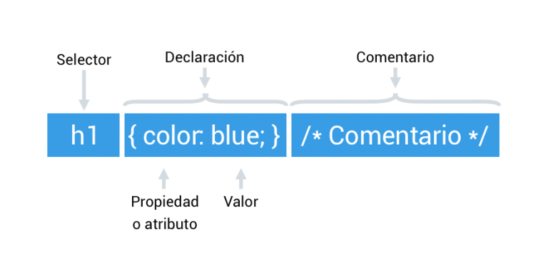

# **¿Qué es CSS (Cascading Style Sheets)?**

Tabla de contenidos

-   [1. ¿Qué es CSS?](#1-Que-es-CSS)
    -   [1.1. Soporte CSS en los navegadores más utilizados](#11-Soporte-CSS-en-los-navegadores-más-utilizados)
    -   [1.2. Sintaxis CSS](#12-Sintaxis-CSS)
# 1. ¿Qué es CSS?

**CSS (*****Cascading Style Sheets*****)** es un lenguaje que nos permite controlar el aspecto de las páginas web escritas en HTML o en cualquier lenguaje de marcado basado en XML.  El lenguaje CSS está creado por el [World Wide Web Consortium (W3C)](https://www.w3c.es/), la comunidad internacional que desarrolla estándares que aseguran el crecimiento futuro de la web y vela por conseguir webs disponibles para todo el mundo y desde cualquier dispositivo.

El lenguaje CSS se ha ido creando a lo largo del tiempo en varios niveles. Cada nivel de CSS se ha construido sobre el anterior, generalmente añadiendo funcionalidades nuevas. En el blog oficial de W3C se pueden consultar todas las publicaciones relacionadas con las novedades del estándar CSS.

## 1.1. Soporte CSS en los navegadores más utilizados

Cada navegador ofrece un soporte CSS distinto. Por este motivo, es de esencial importancia conocer las características de los diferentes navegadores. En este sentido, lo más importante es conocer el tipo de motor ya que es el encargado de interpretar los códigos HTML y CSS. La tabla siguiente detalla el soporte de CSS1, CSS2 y CSS3 de los navegadores más utilizados actualmente.

| Navegador | Motor | CSS1 | CSS2 | CSS3 |
| --- | --- | --- | --- | --- |
| Chrome | WebKit | Completo | Completo | Selectores, pseudo-clases y ciertas propiedades |
| Internet Explorer | Trident | Completo | Completo | Selectores, pseudo-clases y ciertas propiedades a partir de la versión 10.0 del navegador |
| Firefox | Gecko | Completo | Completo | Selectores, pseudo-clases y ciertas propiedades |
| Safari | WebKit | Completo | Completo | Selectores, pseudo-clases y ciertas propiedades |
| Opera | Presto | Completo | Completo | Selectores, pseudo-clases y ciertas propiedades |
Tabla 1.1: Soporte CSS1, CSS2 y CSS3 en los navegadores más utilizados.

Para la elaboración de la tabla 1.1 se ha tenido como referencia la web *[Comparison of layout engines](https://en.wikipedia.org/wiki/Comparison_of_layout_engines_(Cascading_Style_Sheets))*, donde se detallan las características CSS de cada navegador.

Los desarrolladores siempre deben comprobar que sus webs se visualizan correctamente en los diferentes navegadores. Ver más información en el apartado de ["Buenas prácticas CSS"](https://github.com/Sergio-Rey-Personal/DIW/blob/master/UD03_Disenyo_y_maquetacion_web_con_HTML5_y_CSS3/UD03_32_BuenasPracticasCSS.md).

## 1.2. Sintaxis CSS

En CSS se utiliza la siguiente sintaxis para asignar valores a las propiedades de cada selector:

-   **Selector:** indica sobre qué elemento se aplican los estilos CSS.
-   **Propiedad o atributo**: indica qué característica se va a cambiar.
-   **Valor:** indica el valor de la propiedad que se desea modificar.
-   **Comentario:** los comentarios se escriben entre el carácter de apertura "/*" y el carácter de cierre "*/".

El estándar **CSS2** define **más de 100 propiedades**, cada una de ellas con su lista de valores permitidos. Por su parte, el estándar **CSS3** ya incluye **más de 200 propiedades o atributos**.

A lo largo de todo el capítulo, se detallan en forma de tabla y mediante ejemplos las propiedades CSS más utilizadas en relación a los colores, el texto, los fondos, las listas, las tablas y el modelo de cajas. En el siguiente enlace puedes ver un [resumen de las propiedades](https://github.com/Sergio-Rey-Personal/DIW/blob/master/UD03_Disenyo_y_maquetacion_web_con_HTML5_y_CSS3/UD03_37_ResumenCSS.md) que se van a estudiar