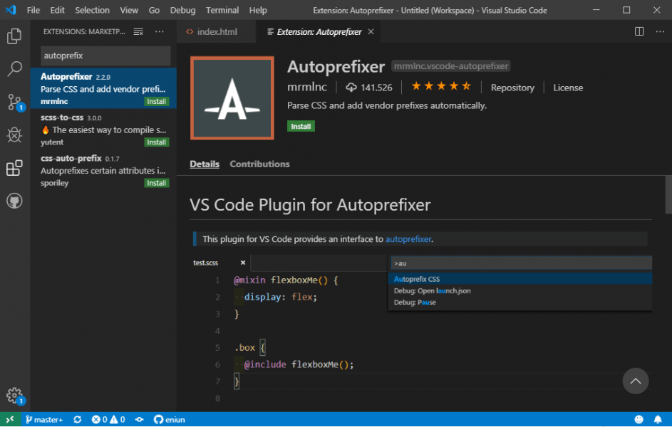

# **Prefijos CSS de los navegadores**

Tabla de contenidos

-   [11\. Prefijos CSS de los navegadores](#11-Prefijos-CSS-de-los-navegadores)
    -   [11.1. Prefijos para los navegadores más comunes](#111-Prefijos-para-los-navegadores-más-comunes)
    -   [11.2. Extensión Autoprefixer para Visual Studio Code](#112-Extension-Autoprefixer-para-Visual-Studio-Code)

# 11. Prefijos CSS de los navegadores

Actualmente los navegadores tienen implementadas muchas de las nuevas características de CSS3 utilizando sus **propias versiones de cada propiedad mediante prefijos**.

Puede parecer que esto limita los beneficios de CSS3, pero los desarrolladores de navegadores lo hacen por lo siguiente: las primeras implementaciones de nuevas especificaciones CSS tienden a tener errores, así que, se proporcionan valores utilizando los prefijos propios de cada navegador, y también se proporciona una versión permanente de cada propiedad a través de una declaración sin prefijo.

Después de un tiempo, cuando las especificaciones son estables, se eliminaran las propiedades con prefijo.

# 11.1. Prefijos para los navegadores más comunes

Los prefijos para los navegadores más comunes son los siguientes:

| **Prefijo** | **Navegador** |
| -moz- | Firefox |
| -webkit- | Safari y Chrome |
| -o- | Opera |
| -khtml- | Konqueror |
| -ms- | Internet Explorer |
| -chrome- | Google Chrome |

Así por ejemplo para transformar un elemento en Firefox, es necesario utilizar la propiedad -moz-transform; en los navegadores basados en WebKit, como Safari y Google Chrome, se utiliza la propiedad -webkit-transform. Por este motivo, no es de extrañar que en algunos casos, tengamos que añadir hasta cuatro líneas de código para una única propiedad CSS.

Puedes ver los navegadores que soportan una determinada propiedad CSS o un elemento HTML5 en la [siguiente página web](http://caniuse.com).

# 11.2. Extensión Autoprefixer para Visual Studio Code

Para ahorrar tiempo y facilitarnos la tarea de incluir los prefijos de las propiedades CSS que todavía no son estables podemos hacer uso de la **extensión "Autoprefixer" en Visual Studio Code**.

Figura 1. Extensión autoprefixer para Visual Studio Code.

Como vimos en la anterior unidad, para instalar una extensión en Visual Studio Code tenemos que acceder a view /extensions. Una vez instalada la extensión, en view /command palete (o Ctrl+shift+p) escribimos "autoprefix css". Seleccionando la opción correspondiente conseguiremos añadir todos los prefijos necesarios en la hoja de estilos seleccionada.