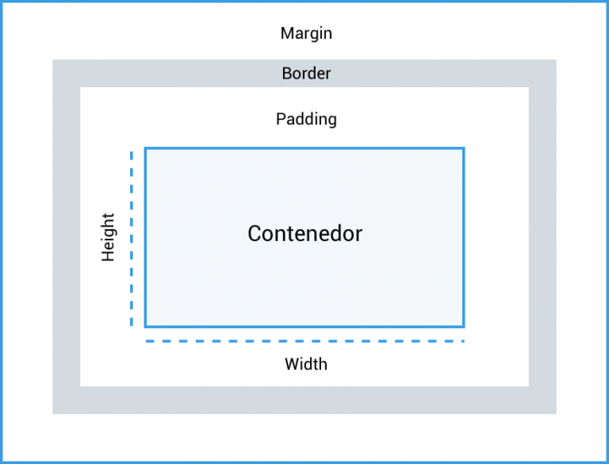

# 33. **Modelo de cajas: márgenes, relleno y bordes**

Tabla de contenidos

- [33. **Modelo de cajas: márgenes, relleno y bordes**](#33-modelo-de-cajas-márgenes-relleno-y-bordes)
  - [33.1. Padding o relleno](#331-padding-o-relleno)
  - [33.2. Margin](#332-margin)
  - [33.3. Bordes](#333-bordes)

Cualquier elemento incluido en un documento HTML dispone de una estructura tipo caja que se puede modificar usando las propiedades CSS. Las propiedades más importantes de las cajas o contenedores son las siguientes:



## 33.1. Padding o relleno

| Propiedad | Descripción | Valores |
| --- | --- | --- |
| `padding-top` `padding-right` `padding-bottom` `padding-left` | Tamaño del relleno superior, derecho, inferior e izquierdo | longitud \| porcentaje |
| `padding` | Tamaño del relleno | longitud \| porcentaje {1,4} |
Tabla 13.1: Padding

**Ejemplo `Padding`**

```css
div.a {
  padding-top: 30px;
  padding-bottom: 80px;
  padding-right: 50px;
  padding-left: 40px;
  border: 1px solid black;
  background-color: azure;
}
div.b { /*Propiedad corta*/
  padding: 30px 50px 80px 40px;
  border: 1px solid black;
  background-color: darkseagreen;
}
```

```html
<html>
<head>
    <meta charset="utf-8"> 
    <title>Propiedad padding</title> 
    <link rel="stylesheet" href="style.css"> 
</head>
<body>
   <h3>Propiedad padding</h3>
   <div class="a" border="1">
        <p>Contenedor con padding-top: 30px; padding-bottom: 80px; padding: 50px; padding: 40px;</p>
  </div></br>
   <div class="b" border="1">
        <p>Contenedor con padding: 30px 50px 80px 40px</p>
   </div>
</body>
</html>
```

<p class="codepen" data-height="265" data-theme-id="light" data-default-tab="html,result" data-user="sergio-rey-personal" data-slug-hash="yLeVpVR" style="height: 265px; box-sizing: border-box; display: flex; align-items: center; justify-content: center; border: 2px solid; margin: 1em 0; padding: 1em;" data-pen-title="CSS3. Propiedad padding">
  <span>See the Pen <a href="https://codepen.io/sergio-rey-personal/pen/yLeVpVR">
  CSS3. Propiedad padding</a> by Sergio-Rey-Personal (<a href="https://codepen.io/sergio-rey-personal">@sergio-rey-personal</a>)
  on <a href="https://codepen.io">CodePen</a>.</span>
</p>
<script async src="https://cpwebassets.codepen.io/assets/embed/ei.js"></script>

[CSS3. Propiedad padding](https://codepen.io/sergio-rey-personal/pen/yLeVpVR)

* * * * *

## 33.2. Margin

| Propiedad | Descripción | Valores |
| --- | --- | --- |
| `margin-top` `margin-right` `margin-bottom` `margin-left` | Tamaño del margen superior, derecho, inferior e izquierdo | longitud \| porcentaje \| auto |
| `margin` | Ancho de los margenes | longitud \| porcentaje \| auto {1,4} |
Tabla 13.2: Margin

***Ejemplo `margin`***

```css
div.a {
   margin-top: 30px;
   margin-bottom: 80px;
   margin-right: 50px;
   margin-left: 40px;
   border: 1px solid black;
   background-color: azure;
 }
 div.b { /* *Propiedad corta* */
   margin: 30px 80px 50px 40px;
   border: 1px solid black;
   background-color: darkseagreen;
 }
```

```html
<html>
<head>
    <meta charset="utf-8"> 
    <title>Propiedad margin</title> 
    <link rel="stylesheet" href="style.css"> 
</head>
<body>
   <h3>Propiedad margin</h3>
   
   <div class="a" border="1">
    <p>Contenedor con margin-top: 30px; margin-bottom: 80px; margin-right: 50px; margin-left: 40px;</p>
   </div>
   <div class="b" border="1">
    <p>Contenedor con margin: 30px 80px 50px 40px</p>
   </div>
</body>
</html>
```

[CSS3. Propiedad margin](https://codepen.io/sergio-rey-personal/pen/eYJBygX)

* * * * *

## 33.3. Bordes

| Propiedad | Descripción | Valores |
| --- | --- | --- |
| `border-top-width` `border-right-width` `border-bottom-width` `border-left-width` | Anchura del borde superior, derecho, inferior o izquierdo | thin \| medium \| thick \| longitud |
| `border-width` | Anchura del borde (reducida) | thin \| medium \| thick \| longitud {1,4} |
| `border-top-color border-right-color` `border-bottom-color` `border-left-color` | Color del borde superior, derecho, inferior e izquierdo | color \| transparent |
| `border-color` | Color del borde (reducida) | color \| transparent {1,4} |
| `border-top-style border-right-style` `border-bottom-style` `border-left-style` | Estilo del borde superior, derecho, inferior e izquierdo | none \| hidden \| dotted \| dashed \| solid \| double \| groove \| ridge \| inset \| outset |
| `border-style` | Estilo del borde (reducida) | none \| hidden \| dotted \| dashed \| solid \| double \| groove \| ridge \| inset \| outset {1,4} |
| `border-top` `border-right` `border-bottom` `border-left` | Ancho, estilo y color para el borde superior, derecho, inferior e izquierdo | border-top-width \| border-top-style \| border-top-color |
| `border` | Ancho, estilo y color para los bordes (reducida) | border-width \| border-style \| border-color |
| `border-radius` | Curvatura del borde | 1-4 \| length \| % |
Tabla 13.3: Bordes

**Ejemplo `border`**

```css
.a { border: 4px solid blue; }
.b { border: 6px dotted green; }
.c { border: 3px dashed purple; }
.d {
     border-top: 3px double orange;
     border-right: 3px double brown;
     border-bottom: 3px double brown;
     border-left: 3px double brown;
 }
```

```html
<html>
<head>
    <meta charset="utf-8"> 
    <title>Propiedad border</title> 
    <link rel="stylesheet" href="style.css"> 
</head>
<body>
   <h3>Propiedad border</h3>
   
    <p class="a">Párrafo con un borde sólido de color azul</p>
    <p class="b">Párrafo con borde verde punteado</p>
    <p class="c">Párrafo con borde violeta a rayas</p>
  <p class="d">Párrafo con borde mixto</p>
</body>
</html>
```

[CSS3. Propiedad border](https://codepen.io/sergio-rey-personal/pen/xxZRprx)