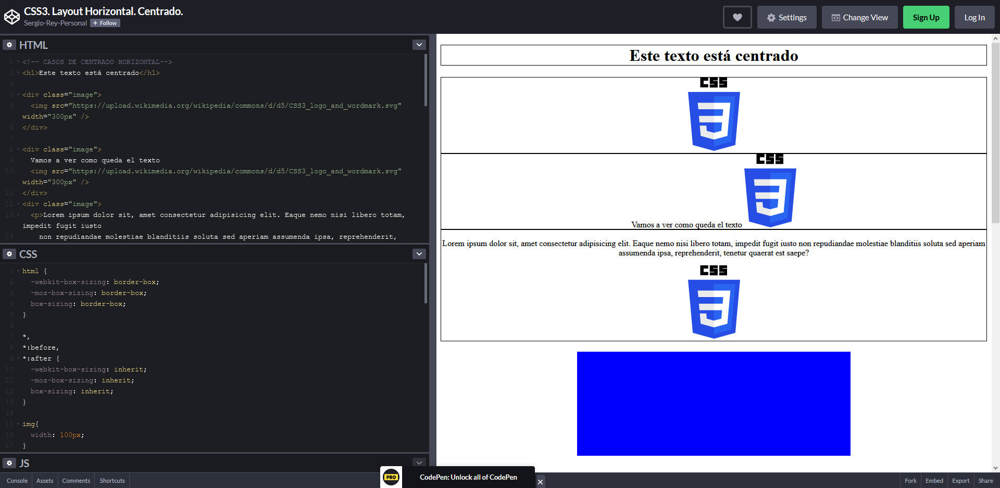
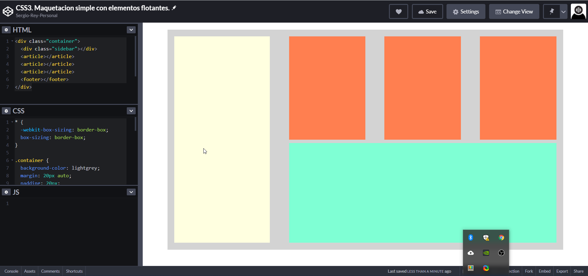

# 24. **Posición y comportamiento de contenedores en CSS**

Tabla de contenidos

- [24. **Posición y comportamiento de contenedores en CSS**](#24-posición-y-comportamiento-de-contenedores-en-css)
  - [24.1. Display](#241-display)
  - [24.2. Position](#242-position)
  - [24.3. Float](#243-float)
  - [24.4. Clear](#244-clear)
  - [24.5. Z-index](#245-z-index)
  - [24.6. Propiedad box-sizing](#246-propiedad-box-sizing)
  - [24.7. Diferencia entre visibility: hidden y display: none](#247-diferencia-entre-visibility-hidden-y-display-none)

En este apartado vamos a repasar el comportamiento de los contenedores en CSS. Antes de comenzar es interesante leer el artículo sobre [elementos de ordenación](https://github.com/Sergio-Rey-Personal/DIW/blob/master/UD03_Disenyo_y_maquetacion_web_con_HTML5_y_CSS3/UD03_15_ElementosOrdenacionHTML.md).


| Propiedad | Descripción | Valores |
| --- | --- | --- |
| `display` | Comportamiento del contenedor | inline | block | inline-block | none |
| `position` | Esquema de posicionamiento | static | relative | absolute | fixed |
| `top` `right` `bottom` `left` | Desplazamiento de la caja respecto al borde superior, derecho, inferior o izquierdo | longitud | porcentaje | auto |
| `float` | Posicionamiento flotante | left | right | none |
| `clear` | Control de cajas adyacentes a las float | none | left | right | both |
| `z-index` | Nivel de la capa | auto | numero entero |
| `box-sizing` | Control de bordes y relleno en el comportamiento del contenedor | content-box | border-box |
Tabla: Posición y comportamiento de las cajas o contenedores

## 24.1. Display

**Ejemplo `display`**

Valores:

-   **none:** No se muestran los elementos ni el espacio reservado.
-   **inline:** Muestra en la misma línea (respetando el flujo) todos los elementos y no acepta las propiedades width, height ni márgenes verticales.
-   **block:** Muestra los elementos en líneas independientes y acepta las propiedades width, height y márgenes verticales.
-   **inline-block:** Su comportamiento es una mezcla entre los dos anteriores, los elementos se muestran en la misma línea (respetando el flujo) y acepta las propiedades width, height y márgenes verticales.

```css
.a { display: none; }
.b { display: inline; }
.c { display: block; }
.d { display: inline-block; }
```

```html
<html>
<head>
    <meta charset="utf-8"> 
    <title>Propiedad display</title> 
    <link rel="stylesheet" href="style.css"> 
</head>
<body>  
    <h2>Propiedad Display</h2>

    <h3>display: none:</h3>
  <h4>none: No se muestran los elementos ni su espacio</h4>
    <p class="a">Bloque1 </p> 
    <p class="a">Bloque2 </p> 
    <p class="a">Bloque3 </p> 

    <h3>display: inline:</h3>
  <h4>inline: Muestra en la misma línea (respetando el flujo) todos los elementos y no acepta las propiedades width, height ni margenes verticales.</h4>
    <p class="b">a </p> 
    <p class="b">Bloque2 </p> 
    <p class="b">Bloque3</p> 

    <h3>display: block:</h3>
  <h4>block: Muestra los elementos en líneas independientes y acepta las propiedades width, height y margenes verticales.</h4>
    <p class="c">Bloque1 </p> 
    <p class="c">Bloque2 </p> 
    <p class="c">Bloque3 </p> 

    <h3>display: inline-block:</h3>
  <h4>inline-block: Su comportamiento es una mezcla entre los dos anteriores, se muestran en la misma línea (respetando el flujo) todos los elementos y además, acepta las propiedades width, height y margenes verticales.</h4>
    <p class="d">Bloque1 </p> 
    <p class="d">Bloque2 </p> 
    <p class="d">Bloque3 </p> 
</body>
</html>
```

[CSS3. Propiedad Display (Codepen)](https://codepen.io/sergio-rey-personal/pen/QWyGamV)

veamos otros ejemplo donde vamos a utilizar las mismas propiedades para ajustar horizontalmente los elementos en nuestro layout

```html
<!-- CASOS DE CENTRADO HORIZONTAL-->
<h1>Este texto está centrado</h1>

<div class="image">
  
</div>

<div class="image">
  Vamos a ver como queda el texto
  
</div>
<div class="image">
  <p>Lorem ipsum dolor sit, amet consectetur adipisicing elit. Eaque nemo nisi libero totam, impedit fugit iusto
    non repudiandae molestiae blanditiis soluta sed aperiam assumenda ipsa, reprehenderit, tenetur quaerat est
    saepe?</p>
  
</div>

<div class="main"></div>

<div class="bloques">
  <div></div>
  <div></div>
  <div></div>
</div>

<!-- CASOS DE CENTRADO VERTICAL-->
<div class="vpadding">
  
  
  
</div>

<div class="vdisplay">
  <p>Lorem, ipsum dolor sit amet consectetur adipisicing elit. Ut, iure obcaecati odit consequuntur magni ipsum
    repellat praesentium non assumenda autem quia amet libero eveniet numquam esse mollitia aliquid voluptatum
    maxime!</p>
</div>
``

```css
html {
  -webkit-box-sizing: border-box;
  -moz-box-sizing: border-box;
  box-sizing: border-box;
}

*,
*:before,
*:after {
  -webkit-box-sizing: inherit;
  -moz-box-sizing: inherit;
  box-sizing: inherit;
}

img{
  width: 100px;
}

h1,
.image,
.bloques {
  border: 1px solid black;
  text-align: center;
}

.main {
  background-color: blue;
  height: 200px;
  margin: 20px auto;
  width: 50%;
}

.bloques {
  background-color: red;
  height: 400px;
  margin: 40px auto;
  width: 60%;
}

.bloques div {
  background-color: chartreuse;
  display: inline-block;
  height: 200px;
  margin-top: 100px;
  width: 25%;
}

.vpadding {
  border: 1px solid black;
  padding: 50px;
  text-align: center;
}

.vdisplay {
  border: 1px solid black;
  display: table;
  height: 300px;
  margin: 30px auto;
  width: 60%;
}

.vdisplay p {
  display: table-cell;
  padding: 20px;
  vertical-align: middle;
}
```



> [Ejemplo de centrado horizontal en CSS3. Codepen](https://codepen.io/sergio-rey-personal/pen/YzqxXgL)

## 24.2. Position

**Ejemplo `position: static`**

- **static:** posición natural de los elementos:

En el ejemplo siguiente se puede comprobar que los elementos mantienen su posición natural.

```css
.a { position: static; }
.b { position: static; }
.c { position: static; }
```

```html
<html>
<head>
    <meta charset="utf-8"> 
    <title>Propiedad position static</title> 
    <link rel="stylesheet" href="style.css"> 
</head>
<body>  
    <h3>Propiedad position: static</h3>

    <p class="a">Bloque1 </p> 
    <p class="b">Bloque2 </p> 
    <p class="c">Bloque3 </p> 
</body>
</html>
```

> [CSS3. Propiedad Position Static (Codepen)](https://codepen.io/sergio-rey-personal/pen/bGEBaMK)

**Ejemplo `position: relative`**

- **relative:** toma como referencia la posición del elemento en el flujo normal de la página.

En el ejemplo siguiente se puede ver que con las propiedades `left: 20px` y `top: 10px` el elemento se desplaza 20px hacia la derecha y 10 px hacia abajo desde su posición por defecto.

```css
.a { position: relative; left: 20px; top: 10px;  }
```

```html
<html>
<head>
    <meta charset="utf-8"> 
    <title>Propiedad relative</title> 
    <link rel="stylesheet" href="style.css"> 
</head>
<body>  
    <h3>Propiedad position: relative</h3>
    <p>Bloque1 </p> 
    <p class="a">Bloque2 </p> 
    <p>Bloque3 </p> 
</body>
</html>
```

> [CSS3. Propiedad Position relative (Codepen)](https://codepen.io/sergio-rey-personal/pen/RwroxJg)

**Ejemplo `position: absolute`**

- **absolute:** toma como referencia la posición del elemento con respecto al documento html.

En el siguiente ejemplo se muestra cómo el elemento deja de seguir la posición del flujo normal de la página y tiene como referencia su posición con respecto a la del documento html.

```css
.b { position: absolute; left: 20px; top: 140px;}
```

```html
<html>
<head>
    <meta charset="utf-8"> 
    <title>Propiedad position absolute</title> 
    <link rel="stylesheet" href="style.css"> 
</head>
<body>  
    <h3>Propiedad position: absolute</h3>

    <p class="a">Bloque1 </p> 
    <p class="b">Bloque2 </p> 
    <p class="c">Bloque3 </p> 
</body>
</html>
```

> [CSS3. Propiedad Position absolute (Codepen)](https://codepen.io/sergio-rey-personal/pen/xxZRpJw)

**Ejemplo `position: fixed`**

- **fixed:** toma como referencia la ventana del navegador.

Tal y como puedes comprobar en el siguiente ejemplo, los elementos con `position: fixed` toman como referencia la ventana del navegador y no respetan el tener un contenedor padre que esté posicionado. 

```css
.b { position: fixed; top: 130px; left: 100px; }
```

```html
<html>
<head>
    <meta charset="utf-8"> 
    <title>Propiedad position fixed</title> 
    <link rel="stylesheet" href="style.css"> 
</head>
<body>  
    <h3>Propiedad position: fixed</h3>

    <p class="a">Bloque1 </p> 
    <p class="b">Bloque2 </p> 
    <p class="c">Bloque3 </p> 
</body>
</html>
```

> [CSS3. Propiedad Position fixed (Codepen)](https://codepen.io/sergio-rey-personal/pen/NWxbXLL)


**Ejemplo `position: sticky`**

**sticky** es un nuevo valor de la propiedad position, añadido como parte de las Especificaciones del Módulo de Diseño o Esquema. Funciona de manera similar al posicionamiento **relativo**, pero se diferencia del mismo al hacer un scroll vertical, puesto que el elemento quedará en la parte superior del navegador (al **top** designado)

```html
<h1>Título con position relative desplazado</h1>
<div class="sticky-menu">
  <div class="menu-element">
    Home
  </div>
  <div class="menu-element">
    Products
  </div>
  <div class="menu-element">
    Contact
  </div>
  <div class="menu-element">
    About us
  </div>
</div>

<div class="padre">
  <div class="hijo1"></div>
  <div class="hijo2"></div>
</div>

<div class="large"></div>

<div class="footer">
  <div class="menu-element">
    Home
  </div>
  <div class="menu-element">
    Products
  </div>
  <div class="menu-element">
    Contact
  </div>
  <div class="menu-element">
    About us
  </div>
</div>
```

```css
* {
  -webkit-box-sizing: border-box;
          box-sizing: border-box;
}

body {
  margin: 0px;
}
/** Ejemplo con position relative **/
h1 {
  left: 50px;
  position: relative;
  top: 10px;
  width: 80%;
}

/** Elementos con position absolute y z-index **/
.padre {
  background-color: lightblue;
  height: 200px;
  margin: 20px auto;
  position: relative;
  width: 60%;
}

.padre div {
  height: 50px;
  position: absolute;
  width: 50px;
}

.padre div.hijo1 {
  background-color: red;
  left: 100px;
  top: 50px;
  z-index: 2;
}

.padre div.hijo2 {
  background-color: chartreuse;
  left: 120px;
  top: 30px;
}

/** Elemento fixed **/
.footer {
  background-color: lightgrey;
  bottom: 0px;
  position: fixed;
  width: 100%;
}

.footer div,
.sticky-menu div {
  display: inline-block;
  padding: 20px;
  text-align: center;
  width: 100px;
}

/* Sticky Menu */
.sticky-menu {
  background-color: lightgrey;
  position: -webkit-sticky;
  position: sticky;
  top: 0px;
  z-index: 10;
}

/* Elemento large  para forzar scroll */
.large {
  background-color: burlywood;
  height: 1000px;
  margin: 20px auto;
  width: 60%;
}
```


> [Ejemplo de posicionamiento relativo con sticky. Codepen](https://codepen.io/sergio-rey-personal/pen/dyMzYPe)


## 24.3. Float

El comportamiento de los elementos se puede modificar haciendo que floten. Cuando a un elemento html se le aplica un estilo con la propiedad de `float`, el **elemento sale del flujo normal y aparece posicionado a la izquierda o a la derecha de su contenedor**, donde el resto de elementos de la página se posicionarán alrededor. 

```css
.float-container-left {
  float: left;
  padding: 10px;
}
.float-container-left div{
  height: 150px;
  width: 150px; 
  background-color: #2980B9;
}
.float-container-right {
  float: right;
  padding: 10px;
}
.float-container-right div{
  height: 150px;
  width: 150px; 
  background-color: #17A589;
}

h2{
  clear:both;
}
```

```html
<h2>Float-left</h2>
<div class="float-container-left">
    <div></div>
</div>
<div class="float-container-left">
    <div></div>
</div>
<div class="float-container-left">
    <div></div>
</div>
<div class="float-container-left">
    <div></div>
</div>

<h2>Float-right</h2>
<div class="float-container-right">
    <div></div>
</div>
<div class="float-container-right">
    <div></div>
</div>
<div class="float-container-right">
    <div></div>
</div>
<div class="float-container-right">
    <div></div>
</div>
```

> [CSS3. Contenedores con float (Codepen)](https://codepen.io/sergio-rey-personal/pen/NWxbXOL)

Veamos a continuación otro ejemplo, en este caso utilizaremos elementos flotantes para realizar la maquetación de esta web:

```html
<div class="container">
  <div class="sidebar"></div>
  <article></article>
  <article></article>
  <article></article>
  <footer></footer>
</div>
```

```css
* {
  -webkit-box-sizing: border-box;
  box-sizing: border-box;
}

.container {
  background-color: lightgrey;
  margin: 20px auto;
  padding: 20px;
  overflow-y: auto;
  width: 90%;
}

.sidebar {
  background-color: lightyellow;
  float: left;
  width: 25%;
  height: 600px;
}

article {
  background-color: coral;
  float: left;
  height: 300px;
  margin-left: 5%;
  width: 20%;
}

footer {
  background-color: aquamarine;
  float: left;
  height: 290px;
  margin-left: 5%;
  margin-top: 10px;
  width: 70%;
}
```



> [Ejemplo de maquetación sencilla utilizando elementos flotantes. Codepen](https://codepen.io/sergio-rey-personal/pen/VwazPvd)

## 24.4. Clear

La propiedad `clear` establece si un elemento debe estar al lado de los elementos flotantes que lo preceden o si debe situarse bajo de ellos. Se suele utilizar para restaurar el flujo normal del documento y así los elementos dejan de flotar hacia la izquierda, la derecha o ambos lados. Puede tener los siguientes valores:

clear: none [|](https://developer.mozilla.org/es/docs/CSS/Value_definition_syntax#Single_bar) left [|](https://developer.mozilla.org/es/docs/CSS/Value_definition_syntax#Single_bar) right [|](https://developer.mozilla.org/es/docs/CSS/Value_definition_syntax#Single_bar) both;

[Ver ejemplos](https://developer.mozilla.org/es/docs/Web/CSS/clear)

## 24.5. Z-index

Mediante el atributo `z-index` podemos organizar cada uno de los elementos del contenido de una página web.


**Ejemplo `z-index`**

```css
.a { width: 150px; height: 200px; background-color: purple; position: relative; z-index: 3;}
.b { width: 150px; height: 200px; background-color: black; position: relative; left: 50px;
top: -110px; z-index: 1;}
.c { width: 150px; height: 200px; background-color: grey; position: relative; left: 100px;
top: -210px; z-index: 2;}

```

```html
<html>
<head>
    <meta charset="utf-8"> 
    <title>Propiedad z-index</title> 
    <link rel="stylesheet" href="style.css"> 
</head>
<body>  
    <h3>Propiedad z-index</h3>
    <div class="a"></div> 
    <div class="b"></div> 
    <div class="c"></div> 
</body>
</html>
```

> [CSS3. Propiedad Position Z-index (Codepen)](https://codepen.io/sergio-rey-personal/pen/wvMopRx)

## 24.6. Propiedad box-sizing

Por defecto en el [modelo de cajas de CSS](https://github.com/Sergio-Rey-Personal/DIW/blob/master/UD03_Disenyo_y_maquetacion_web_con_HTML5_y_CSS3/UD03_33_ModeloDeCajasCSS.md), el ancho y alto asignado a un elemento es aplicado solo al contenido de la caja del elemento. Si el elemento tiene algún borde (border) o relleno (padding), este es entonces añadido al ancho y alto del tamaño de la caja o contenedor. Esto significa que cuando se define el ancho y alto, se tiene que ajustar el valor para permitir cualquier borde o relleno que se pueda añadir.

La propiedad `box-sizing` puede ser usada para ajustar el siguiente comportamiento:

-   `content-box` es el comportamiento CSS por defecto para el tamaño de la caja (box-sizing). Si se define el ancho de un elemento en 100 pixeles, la caja del contenido del elemento tendrá 100 pixeles de ancho, y el ancho de cualquier borde o relleno será añadido al ancho final desplegado.
-   `border-box` toma en cuenta cualquier valor que se especifique de borde o de relleno para el ancho o alto de un elemento. Es decir, si se define un elemento con un ancho de 100 pixeles. Esos 100 pixeles incluirán cualquier borde o relleno que se añada, y la caja de contenido se encogerá para absorber ese ancho extra. Esta propiedad es especialmente útil para redimensionar cualquier elemento.

**Vamos a ver un ejemplo:** creamos un contenedor con tres imágenes que estarán en línea y el conjunto ocupará el 100% del ancho de la pantalla. Definimos que cada imagen ocupe el 33,333%. Si les dotamos de un padding el conjunto ocupará más del 100%. Por este motivo deberemos establecer un "**box-sizing: border-box**".

Realiza la prueba quitando y añadiendo la propiedad "box-sizing: border-box" del siguiente ejemplo:

```css
.img-container {
  box-sizing: border-box;
  -webkit-box-sizing: border-box;
  float: left;
  width: 33.33%;
  padding: 5px;
}
.img-container img{
  width: 100%;
}
```

```html
<div class="img-container">
  
</div>
<div class="img-container">
  
</div>
<div class="img-container">
  
</div>
  ```

> [CSS3. Box-sizing (Codepen)](https://codepen.io/sergio-rey-personal/pen/mdVOpvq)

Como puedes ver en el código, se han añadido los [prefijos para navegadores](https://github.com/Sergio-Rey-Personal/DIW/blob/master/UD03_Disenyo_y_maquetacion_web_con_HTML5_y_CSS3/UD03_31_PrefijosNavegadoresCSS.md) necesarios para esta nueva propiedad.

```css
-webkit-box-sizing: border-box;
box-sizing: border-box;
```

## 24.7. Diferencia entre visibility: hidden y display: none

La diferencia principal es que **`display: none` no reserva el espacio del elemento mientras que `visibility: hidden` sí**. A continuación se muestra un ejemplo:

```css
body {
  background: #a64b00;
  color: #eee;
  font-family: verdana;
}

p {
  padding: 0;
  margin: 0 0 15px 0;
  font-size: 12px;
  width: 1000px;
}
#hide-me {
  width: 100px;
  height: 100px;
  background: #bf7130;
  display: block;
  padding: 10px;
  margin: 0 15px 0 0;
  font-size: 14px;
  font-weight: bold;
  float: left;
  text-align: center;
  background: rgba(0, 0, 0, .15);
}
```

```html
<div>
  <div id="hide-me">¿Me ves?
  </div>
  <p>Esconder/mostrar con <button id="displayNone">diplay: none / block</button> <button id="visibilityHidden">visibility: hidden / visible</button>
  </p>
  <p>
    Lorem ipsum dolor sit amet, consectetur adipiscing elit. Vestibulum vel scelerisque elit. Etiam facilisis risus ac elit eleifend facilisis. Mauris ut eleifend felis. Vestibulum lobortis a augue non viverra. Proin rutrum felis quis erat semper condimentum. Vestibulum quam nisl, commodo vitae metus ac, volutpat pellentesque mi. Fusce hendrerit sem eu dolor mattis, sit amet volutpat erat elementum. Nam eu enim sit amet purus volutpat mattis. Nunc sed adipiscing erat. Suspendisse sapien nisl, euismod at aliquet sed, scelerisque quis mauris. Nunc ac mattis lorem, ac semper urna.
  </p>
<div>
```

```javascript
//JQuery
$('#displayNone').click(function(e) {
  
  // Resetear, por si acaso has estado jugando con la otra propiedad
  $('#hide-me').css('visibility', 'visible');
  
  if( $('#hide-me').is(":visible") ) {
    $('#hide-me').css('display', 'none'); 
  } else {
    $('#hide-me').css('display', 'block');
  }
});

$('#visibilityHidden').click(function(e) {
  
  // Resetear, por si acaso has estado jugando con la otra propiedad
  $('#hide-me').css('display', 'block');
  
  if( $('#hide-me').css('visibility') != 'hidden' ) {
    $('#hide-me').css('visibility', 'hidden');
  } else {
    $('#hide-me').css('visibility', 'visible');
  }
});
```

> [CSS3. display: none vs. visibility: hidden (Codepen)](https://codepen.io/sergio-rey-personal/pen/WNrodWL)