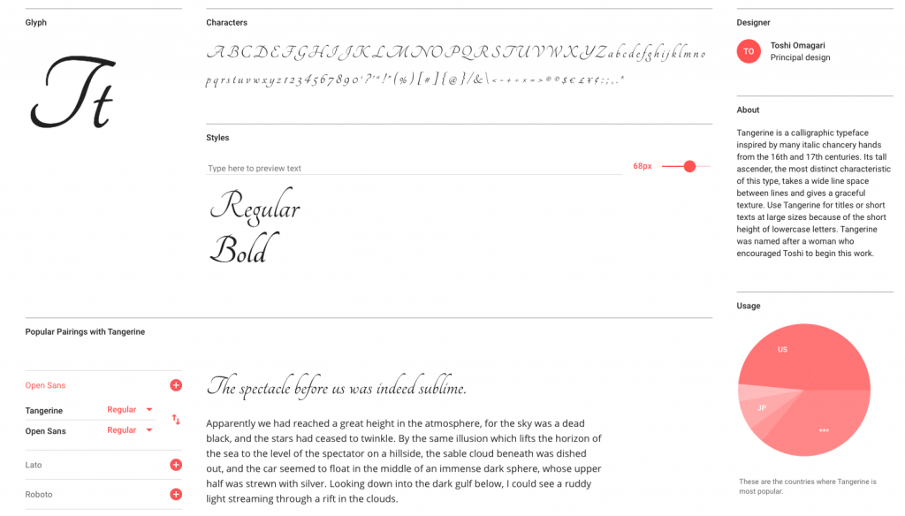
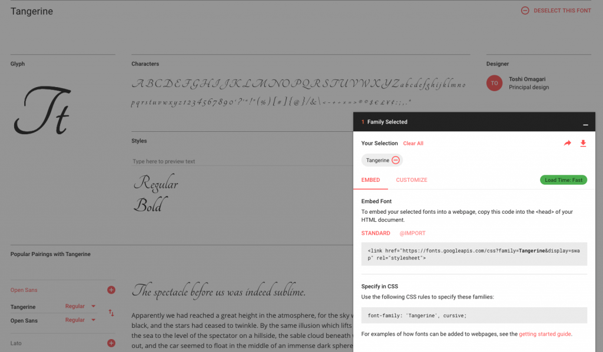

# 35. **Formatos de las fuentes en CSS y utilización de repositorios**

Tabla de contenidos

- [35. **Formatos de las fuentes en CSS y utilización de repositorios**](#35-formatos-de-las-fuentes-en-css-y-utilización-de-repositorios)
  - [35.1. La regla @font-face en CSS](#351-la-regla-font-face-en-css)
- [2. Incorporar una fuente utilizando el repositorio de fuentes de Google Fonts](#2-incorporar-una-fuente-utilizando-el-repositorio-de-fuentes-de-google-fonts)
  - [35.3. Fuentes web online](#353-fuentes-web-online)
  - [35.4. Convertidores de fuentes online](#354-convertidores-de-fuentes-online)
  - [35.5. Repositorios de iconos](#355-repositorios-de-iconos)
- [Ejercicios propuestos](#ejercicios-propuestos)

En la unidad 2 vimos la [importancia de elegir bien las fuentes que se van a utilizar en nuestros sitios web](https://github.com/Sergio-Rey-Personal/DIW/blob/master/UD02%20Guia%20de%20estilo%20web/UD02_05_Colores.md). Además, en este mismo tema también hemos repasado las [propiedades CSS para las fuentes](https://github.com/Sergio-Rey-Personal/DIW/blob/master/UD03_Disenyo_y_maquetacion_web_con_HTML5_y_CSS3/UD03_27_PropiedadesFuentesCSS.md) que nos permiten controlar el tamaño, el tipo, el grosor o el estilo de las letras entre otras cosas. Veamos ahora los diferentes formatos de las fuentes y qué métodos tenemos para incorporarlos en nuestros proyectos web.

Actualmente no todas las fuentes están instaladas en los dispositivos y tampoco hay un formato único para todos los navegadores. Por lo tanto, debemos incluir las fuentes en todos los formatos para que sean visibles en todos los navegadores. Los formatos más famosos son los siguientes:

| **Formato** | **Descripción** |
| --- | --- |
| **EOT** | Embedded OpenType, Explorer |
| **TTF** | TrueType Font, IOS |
| **WOFF** | Web Open Font Format, Chrome |
| **WOFF2** | Mejora de WOFF |
| **SVG** (obsoleto) | Scalar Vector Graphics |

## 35.1. La regla @font-face en CSS

La regla `@font-face` nos permite descargar una fuente o tipografía, cargarla en el navegador y utilizarla en nuestras páginas. Así pues, tendríamos el siguiente código para incluir la fuente Open Sans:

```css
@font-face {
    font-family: 'Open Sans';
    src: local('Open Sans'),
        url(opensans.woff2) format('woff2'),
        url(opensans.woff) format('woff'),
        url(opensans.ttf) format('truetype'),
        url(opensans.otf) format('opentype'),
        url(opensans.eot) format('embedded-opentype');
}
```

# 2. Incorporar una fuente utilizando el repositorio de fuentes de Google Fonts

Hoy en día es muy común utilizar [Google Fonts](http://fonts.google.com/) como repositorio proveedor de tipografías por los siguientes motivos:

-   **Gratuitas**: Disponen de un amplio catálogo de fuentes y tipografías gratuitas.
-   **Cómodo**: Es muy fácil su uso.
-   **Rápido**: El servicio está muy extendido y utiliza un CDN que proporciona ventajas en cuanto a la velocidad.



Interfaz Google Fonts. Fuente Tangerine.

En la página de **Google Fonts** podemos seleccionar las fuentes con las características deseadas y generar un código HTML con las tipografías que vamos a utilizar.



Interfaz de Google Fonts, Fuente Tangerine.

Vamos a ver un ejemplo añadiendo la fuente *Tangerine* a nuestro proyecto web. En primer lugar tendremos que incorporar la hoja de estilos en nuestro documento de la siguiente forma:

```html
<link rel="stylesheet" type="text/css" href="http://fonts.googleapis.com/css?family=Tangerine">
```

Y a continuación definir el estilo CSS:

```css
p{ font-family: 'Tangerine', cursive;}
```

Ver código y resultado en Code Pen: [CSS3. Incorporar una fuente utilizando el repositorio de Google Fonts (Codepen)](https://codepen.io/sergio-rey-personal/pen/YzwpeGe)

## 35.3. Fuentes web online

| **Nombre** | **URL** |
| --- | --- |
| Font Squirrel | fontsquirrel.com |
| Da Font | dafont.com |
| Google Fonts | google.com/fonts |

## 35.4. Convertidores de fuentes online

| **Nombre** | **URL** |
| --- | --- |
| Font Squirrel converter | fontsquirrel.com/tools/webfont-generator |
| Online Font Converter | onlinefontconverter.com |
| Files conversion | files-conversion.com/font-converter.php |
| Font converter | fontconverter.org |

## 35.5. Repositorios de iconos

Al igual que con las fuentes, podemos utilizar repositorios de iconos para representar cualquier parte de nuestra interfaz. A continuación ponemos un ejemplo utilizando el repositorio de **[Font Awesome](https://fontawesome.com)**.

# Ejercicios propuestos

-   Añade un nuevo tipo de fuente en tu proyecto web mediante la regla @font-face.
-   Incluye también una fuente desde el repositorio de Google Fonts.