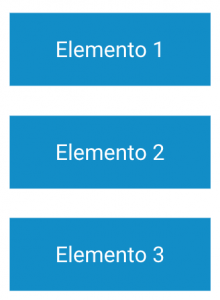

# **Elementos de ordenación**

Tabla de contenidos

-   [13. Elementos de ordenación en HTML5](#13-Elementos-de-ordenacion-en-HTML5)
    -   [13.1. Elementos en bloque o block](#131-Elementos-en-bloque-o-block)
    -   [13.2. Elementos en línea o inline](#132-Elementos-en-linea-o-inline)
    -   [13.3. Elementos flotantes o float](#133-Elementos-flotantes-o-float)
    -   [13.4. Posicionamiento absoluto y relativo](#134-Posicionamiento-absoluto-y-relativo)

# 13. Elementos de ordenación en HTML5

En el proceso de **maquetación de una web** es necesario organizar **elementos tales como imágenes, textos o tablas**. Tal y como vimos en el punto de la [**evolución de la web**](https://github.com/Sergio-Rey-Personal/DIW/blob/master/UD01%20Dise%C3%B1o%20web.%20Caractar%C3%ADsticas%2C%20elementos%20b%C3%A1sicos%20y%20etapas%20para%20su%20desarrollo/UD01_01_Edici%C3%B3n%20del%20dise%C3%B1o%20web.md), en un primer momento los elementos de una página web se organizaban en tablas. En ese momento no había ni [**hojas de estilo CSS**](https://www.eniun.com/que-es-css-cascading-style-sheets/) ni ninguna otra herramienta que nos permitiera poner varios elementos seguidos uno detrás del otro.

En la actualidad, gracias a las **hojas de estilo** podemos crear nuestros propios estilos para maquetar cualquier página web. Para ello, necesitaremos conocer **cómo se ordenan los elementos en un documento web**.

## 13.1. Elementos en bloque o *block*

En un documento web lo más normal es ir posicionando los elementos de izquierda a derecha y de arriba a abajo dentro de la etiqueta `<body>`. En el caso de elementos en bloque o *block* como `
`, `<table>`, `<list>`, etc., estos **ocupan todo el ancho del contenedor o elemento padre**.

Figura 13.1. Elementos en bloque

## 13.2. Elementos en línea o *inline*

Los elementos en línea o *inline* como ``, `<a>`, ``, etc., **ocupan sólo el espacio delimitado por las etiquetas que definen el elemento en línea.**

Figura 13.2. Elementos en línea

## 13.3. Elementos flotantes o *float*

El comportamiento de los elementos se puede modificar haciendo que floten. Cuando a un elemento html se le aplica un estilo con la propiedad de flotar o *float*, el **elemento sale del flujo normal y aparece posicionado a la izquierda o a la derecha de su contenedor**, donde el resto de elementos de la página se posicionarán alrededor. Las propiedades de los elementos flotantes se verán a fondo en la siguiente unidad.

## 13.4. Posicionamiento absoluto y relativo

Los elementos pueden estar posicionados de forma absoluta o relativa.

-   **Posicionamiento absoluto**: el elemento siempre se encuentra en el mismo lugar.
-   **Posicionamiento relativo**: el elemento se posiciona según otros elementos.