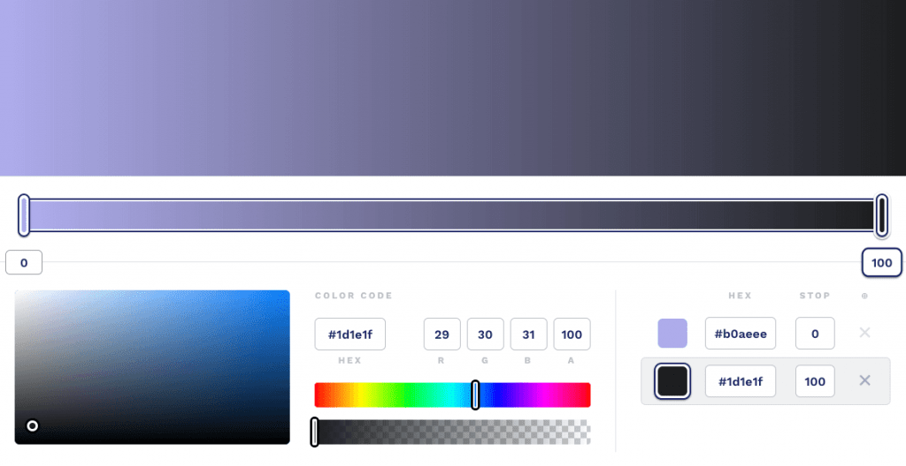
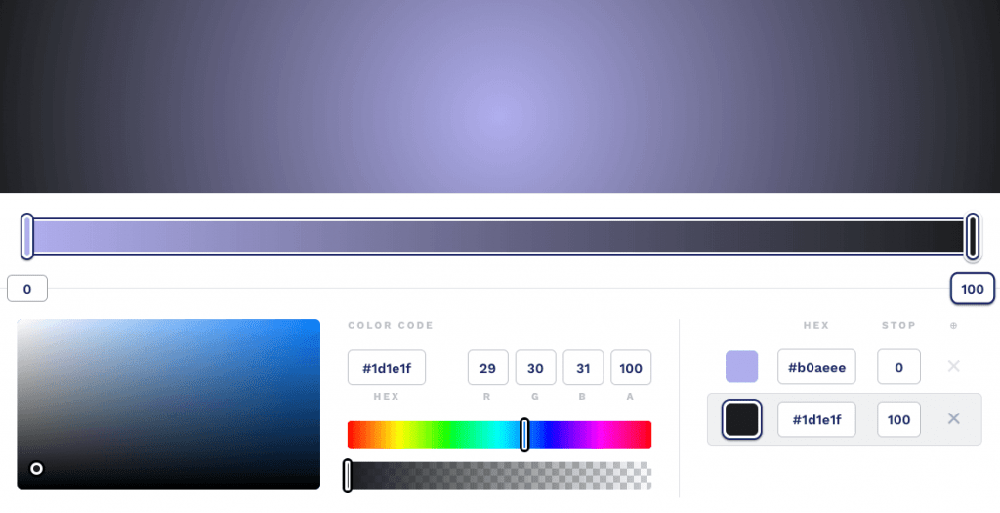

# 3. **Gradientes en CSS: gradiente lineal y radial**

Tabla de contenidos

- [3. **Gradientes en CSS: gradiente lineal y radial**](#3-gradientes-en-css-gradiente-lineal-y-radial)
  - [3.1. Gradiente lineal](#31-gradiente-lineal)
      - [Ejemplo](#ejemplo)
  - [3.2. Gradiente radial](#32-gradiente-radial)
      - [Ejemplo](#ejemplo-1)
  - [3.3. Generadores de gradientes](#33-generadores-de-gradientes)
  - [3.4. Patrones de gradientes](#34-patrones-de-gradientes)
- [Ejercicios propuestos](#ejercicios-propuestos)

Los **gradientes** nos permiten añadir efectos de **colores degradados** en nuestros diseños. Los gradientes se configuran como fondos, por lo que tendremos que usar la propiedad "**background**". Disponemos de dos tipos de gradientes: "l**inear-gradient**" y "**radial-gradient**".

## 3.1. Gradiente lineal

El formato es el siguiente:

background: linear-gradient(top, #fff, #ccc);
background: linear-gradient(30deg, #fff, #cecece 100%);

-   **Punto de comienzo:** indica el punto donde comenzará el gradiente. Puede ser especificado en píxeles, porcentajes o usando las palabras clave top, bottom, left y right. También puede ser reemplazado por un ángulo para declarar una dirección específica del gradiente.
-   **Color inicial:** indica con qué color comenzará el gradiente.
-   **Color intermedio:** permite crear una lista con varias paradas para ir cambiando de gradientes. Este parámetro se puede omitir.
-   **Color final:** indica con qué color terminará el gradiente.

Recuerda utilizar la extensión que te facilita la tarea de crear los [**prefijos para navegadores**](https://github.com/Sergio-Rey-Personal/DIW/blob/master/UD03_Disenyo_y_maquetacion_web_con_HTML5_y_CSS3/UD03_31_PrefijosNavegadoresCSS.md). En estas propiedades hay diferencias entre las funciones estándar y las especificadas por los navegadores.

#### Ejemplo



```css
background: rgb(176,174,238);
background: linear-gradient(90deg, rgba(176,174,238,1) 0%, rgba(29,30,31,1) 100%);
```

## 3.2. Gradiente radial

El formato para los **gradientes radiales** es muy parecido al anterior. En este caso, debemos usar la función radial-gradient() y un nuevo atributo para la forma.

Existen dos posibles valores para la forma: *circle* y *ellipse* (el valor por defecto será *ellipse*). Además, para cada color es necesario indicar la posición en la que comienzan las transiciones (en el ejemplo siguiente, el gradiente comenzaría en la posición 0% y terminaría en la posición 100%).

#### Ejemplo


```css
background: rgb(176,174,238);
background: radial-gradient(circle, rgba(176,174,238,1) 0%, rgba(29,30,31,1) 100%);
```

## 3.3. Generadores de gradientes

Para facilitarnos la tarea de la **creación de gradientes** podemos utilizar un **generador de gradientes online** que nos proporcione el código CSS necesario para nuestro diseño. Algunas herramientas online útiles son las siguientes:

-   [cssgradient.io](https://cssgradient.io/)
-   [css3gen.com/gradient-generator](http://css3gen.com/gradient-generator/)

## 3.4. Patrones de gradientes

Podemos aplicar diseños muy trabajados creando **patrones** sin necesidad de cargar imágenes con mucho peso. Existen diversos artistas dedicados a hacer este tipo de diseños. Algunos ejemplos de diseños de este tipo se pueden obtener en la siguiente plataforma:

-   [leaverou.github.io/css3patterns](https://leaverou.github.io/css3patterns/)

# Ejercicios propuestos

Aplica un gradiente en uno de los contenedores de tu proyecto web.