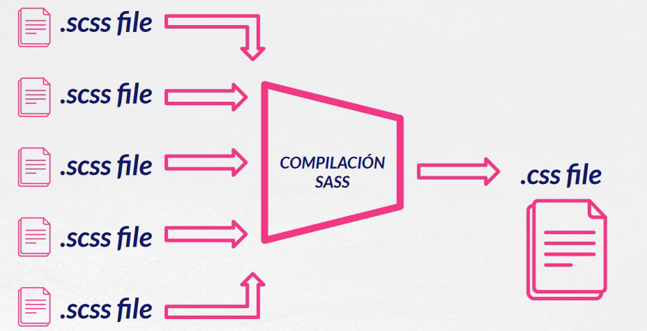

# **Preprocesadores CSS**

 Los **preprocesadores CSS** son herramientas para los desarrolladores de sitios web, que permiten traducir un código de hojas de estilo no estándar, específico del preprocesador en cuestión, a un código CSS estándar, entendible por los navegadores.

# 9. Preprocesacores CSS

Los preprocesadores básicamente nos ofrecen diversas utilidades que a día de hoy no se encuentran en el lenguaje CSS, o bien no son compatibles con todos los navegadores. Ejemplos pueden ser variables, anidación de selectores, funciones (denominadas mixins), etc.

Al desarrollar con un preprocesador se consigue principalmente un ahorro de tiempo, ya que tenemos que escribir menos código para hacer las cosas. Pero también conseguimos una mayor facilidad de mantenimiento del código, gracias a una mejor organización del código y la posibilidad de editar una vez ciertos valores y que afecten a decenas, o cientos, de lugares del código CSS generado.

No todo son ventajas cuando hablamos de preprocesadores, ya que nos obligan a aprender un nuevo lenguaje y escribir código no estándar. Ese código no estándar debe ser compilado en CSS, lo que afecta también al flujo de desarrollo. El código del preprocesador no lo entiende el navegador y por lo tanto nos tenemos que dar el trabajo de traducirlo, antes de llevar un sitio web a producción. Afortunadamente, ese flujo está bastante depurado y existen diversas alternativas para la optimización de esa traducción, de modo que no tengamos que intervenir manualmente y nos ahorre tiempo.
Por qué Sass

Cualquier preprocesador es perfectamente válido. Podríamos sin duda elegir otras alternativas como Less o Stylus y estaría estupendo para nosotros y nuestro proyecto, ya que al final todos ofrecen más o menos las mismas utilidades. Pero sin embargo, Sass se ha convertido en el preprocesador más usado y el más demandado.

Al haber recibido un mayor apoyo de la comunidad es más factible que encuentres ofertas de trabajo con Sass o que heredes proyectos que usan Sass, por lo que generalmente te será más útil aprender este preprocesador.

Además, varios frameworks usan Sass, como el caso de Bootstrap. Por ello, si tienes que trabajar con ellos te vendrá mejor aprender Sass. 

Así pues, Un preprocesador CSS es una herramienta que nos permite generar, de manera automática, hojas de estilo, añadiéndoles características que no tiene CSS, y que son propias de los lenguajes de programación, como pueden ser variables, funciones, selectores anidados, herencia, etcétera.

Estas características de los procesadores nos permiten, además, que el CSS que se genera sea más fácil de mantener y más reutilizable.

## 9.1. Ventajas de utilizar Sass

El uso de una herramienta como Sass proporciona una serie de ventajas, como son las siguientes:

-   Reduce el tiempo para crear y mantener el CSS.

-   Permite tener una organización modular de los estilos, lo cual es vital para proyectos grandes.

-   Proporciona estructuras avanzadas propias de los lenguajes de programación, como variables, listas, funciones y estructuras de control.

-   Permite generar distintos tipos de salida, comprimida, normal o minimizada, trabajando tanto en desarrollo como en producción, además se hace una forma muy fácil.

-   Permite vigilar los ficheros, de tal manera que, si ha habido un cambio en la hoja de estilos, se regenera automáticamente (modo watch).

-   Tiene muy pocas dependencias, sobre todo la nueva versión, que es dart-sass. En las anteriores versiones se dependía de muchas librerías de Ruby y era un poco engorroso de instalar, pero con la nueva versión, la instalación es muy fácil.

-   Existen muchas herramientas asociadas, muchas librerías hechas con Sass y una comunidad muy importante de usuarios.

## 9.2. Desventajas de utilizar Sass

Como todo, Sass tiene algunas desventajas, que son extensibles a cualquier otro preprocesador que se utilice:

-   Hay que aprender a utilizar una nueva herramienta, lo que para algunos supone una desventaja.

-   Hay un tiempo de consumo en el proceso de generación o compilación del CSS, sobre todo si es el archivo SCSS es muy grande. No es mucho tiempo, pero sí que existe esa pequeña demora.

-   Tiene una sintaxis más compleja que CSS.

## 9.3. Como funciona SASS

El funcionamiento de un preprocesador, se basa en la creación de los archivos que posteriormente serán procesados y generarán los ficheros css.



## 9.4. SASS vs SCSS

La principal diferencia de ambos viene dada por su sintaxis.

### Sintaxis Scss

La sintaxis de Scss a diferencia de la sintaxis de Sass usa archivos con extensión .scss, a pesar de esto nos provee de las mismas características.

Esta sintaxis suele ser la más utilizada ya que es muy parecida a la sintaxis de CSS, por lo que suele ser más fácil de usar para programadores que vienen de usar css tradicional.

Un ejemplo de sintaxis en Scss sería:

```scss
@mixin button-base() {
  @include typography(button);

  display: inline-flex;
  position: relative;
  height: $button-height;
  border: none;

  &:hover { cursor: pointer; }

}
```

### La sintaxis indentada (Sass)

Aquí es donde podemos ver una mayor diferencia, la sintaxis indentada es la sintaxis original de Sass y al contrario que los archivos Scss, utilizan la extensión .sass.

Esta sintaxis nos ofrece las mismas características que nos ofrece la sintaxis de Scss, la gran diferencia es que se dejan de usar las llaves { } para pasar a usar la indentación y se dejan de usar los punto y coma “ ; ” tras cada instrucción.

El mismo ejemplo anterior en .sass nos quedaría de la siguiente manera.

```less
@mixin button-base()
  @include typography(button)

  display: inline-flex
  position: relative
  height: $button-height
  border: none

  &:hover
    cursor: pointer
```