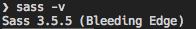
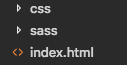
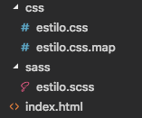

# **Cómo usar Sass**


# 10. Cómo usar Sass

Para usar Sass tienes dos alternativas fundamentales.

1.  **Preprocesar con alguna herramienta de interfaz gráfica**, como el caso de Prepros, CodeKit o Scout-App. En principio puede ser más sencillo, ya que no requiere trabajar con la línea de comandos, pero necesitas usar un programa en concreto y no siempre puede estar disponible para ti, o no integrarse en otro flujo de trabajo que puedas tener ya asumido en tu proyecto. Además, las mejores herramientas de interfaz gráfica tienen la desventaja de ser de pago, o necesitar una licencia para desbloquear todo su poder.
2.  **Usar la línea de comandos para preprocesar**. Esta es la opción preferida por la mayoría de desarrolladores. No sólo porque no requiere la compra de una licencia por el software de interfaz gráfica, sino principalmente porque la puedes integrar con todo un ecosistema de herramientas para optimizar multitud de aspectos en un sitio web. Además, está al alcance de cualquier desarrollador, ya que todos tenemos un terminal en nuestro sistema operativo y finalmente, permite personalizar completamente el comportamiento del preprocesador.
3.  **Usar herramientas de automatización**. Como tercera opción es muy común también usar herramientas que permiten automatizar el flujo de trabajo frontend, compilando archivos CSS, Javascript, optimizando imágenes, etc. Nos referimos a paquetes como Gulp, Grunt o Webpack (aunque este último es más un empaquetador). Estos sistemas tienen la particularidad que sirven para cubrir todas las necesidades de trabajo con los lenguajes de la web y no solamente se usan para compilar el código Sass. Sería la opción más potente de las tres comentadas, aunque requiere mayor formación para poder usarlas. En este grupo también podríamos unir a PostCSS, aunque esta herramienta solamente nos sirve para convertir el CSS, aplicando diversos plugins, entre los que podría estar la compilación de Sass, y no entra en áreas como el Javascript.

Las anteriores alternativas pueden marear un poco si no estás acostumbrado a oir acerca de tantas tecnologías. No te preocupes demasiado porque vamos a irnos a una opción sencilla que te permita comenzar a usar Sass, sin demasiado esfuerzo ni configuración. En concreto te vamos a explicar ahora a usar Sass desde tu terminal, con las herramientas "oficiales" del propio preprocesador (la alternativa planteada en el punto 2 anterior). Es una posibilidad al alcance de cualquier lector. Nuestro siguiente paso entonces será comenzar por instalar el preprocesador.

## 10.1. Instalar Sass

La instalación de Sass depende del sistema operativo con el que estás trabajando. Aunque todos requieren comenzar instalando el lenguaje Ruby, ya que el compilador de Sass está escrito en Ruby.

Veamos, para cada sistema, cómo hacernos con Ruby.

-   **Windows**: Existe un instalador de Ruby para Windows. https://rubyinstaller.org/ Puedes usarlo para faciltar las cosas.
-   **Linux**: tendrás que instalar Ruby usando tu gestor de paquetes de la distribución con la que trabajes, apt-get, yum, etc.
-   **Mac**: Ruby está instalado en los sistemas Mac, por lo que no necesitarías hacer ningún paso adicional.

Una vez instalado el lenguaje Ruby tendremos el comando "gem", que instala paquetes (software) basados en este lenguaje. Así que usaremos ese comando para instalar Sass. De nuevo, puede haber diferencias entre los distintos sistemas operativos.

### Windows

Tendrás que abrir un terminal, ya sea Power Shell, "cmd" o cualquiera que te guste usar. Si no usas ninguno simplemente escribe "cmd" después de pulsar el botón de inicio. Luego tendrás que lanzar el comando.

```
gem install sass
```

### Linux

Para instalar Sass, una vez tienes Ruby anteriormente, podrás hacerlo con el siguiente comando en tu terminal.

```
sudo gem install sass --no-user-install
```

### Mac OS X

En Mac usarás generalmente "sudo", igual que en Linux. Aunque puedes probar antes sin sudo y usar sudo si realmente te lo pide la consola por no tener los suficientes permisos.

```
sudo gem install sass
```

**Nota importante para usuarios de Mac:** En Mac OS X es posible que tengas que hacer algunas otras operaciones. En una instalación limpia de Mac quizás tengas que instalar las extensiones de Xcode:\
`xcode-select --install`\
O bien instalar el propio Xcode desde el App Store (no te preocupes, porque es gratuito). Luego además tendrás que abrir el Xcode, una vez instalado, para completar la instalación de todos los componentes necesarios.

Para cualquier sistema, una vez instalado Sass, podemos ver si realmente está disponible, haciendo el siguiente comando:

```
sass -v
```

Eso nos debería devolver la versión de Sass instalada en nuestro sistema.



### Compilar archivos de Sass a CSS

Ahora que tienes Sass instalado querrás compilar el código de Sass para convertirlo a CSS estándar. Para ese paso, necesitamos partir de un archivo con código Sass.

Antes en este artículo hemos visto cómo podría ser un pedazo de código en Sass, con sintaxis SCSS. Puedes copiar ese código y guardarlo en un archivo en tu ordenador. Usa cualquier carpeta para hacer esta primera prueba y guarda el archivo con el nombre "ej.scss" (o cualquier otra cosa que te apetezca).

Ahora te debes situar con el terminal en la carpeta donde tengas el archivo que acabas de crear con el código SCSS. Entonces lanzarás el comando para compilar, de esta manera:

```
sass ej.scss ej-compilado.css
```

Como puedes observar, al comando "sass" le indicamos el archivo origen (con código SCSS) y el archivo de destino, donde nos colocará el código CSS estándar.

Podrás observar también, una vez ejecutado el comando, que nos crea el archivo "ej-compilado.sass". Además que ha creado un archivo ej-compilado.css.map, que sirve para que el navegador pueda corresponder (en las herramientas de desarrollo) el código compilado con la referencia donde está el código original, permitiendo ayudarte a la hora de depurar. Hablaremos de mapas más adelante, de modo que no necesitas preocuparte de ese segundo archivo ".map".

Las compilaciones de Sass pueden ser: 
- **SIMPLE**
```
sass file.scss output_file.scss
```
- **MÚLTIPLE**
```
sass file1.scss:output1.css … fileN.scss:outputN.css
```
- **EXPANDIDA** (1 Selector - 1 Línea de salida – por defecto)
```
sass --style = expanded file.scss output_file.scss
```
- **COMPRIMIDA**. Quita la mayor cantidad de caracteres posible
```
sass --style = compressed file.scss output_file.scss
```
- **Vigilando** los cambios y actualizando ficheros automáticamente

```
sass --watch file.scss output_file.scss
```

### Compilar Sass de manera automática con un "watcher"

Habrás observado lo rápido que se ha compilado el archivo Sass para convertirse en código CSS estándar. Pero sin embargo, ejecutar ese comando para compilación cada vez que cambia tu código es un poco tedioso, porque te obliga ir a la consola y lanzar nuevamente el comando con cada pequeña edición que hagas.

Lo que generalmente querrás es tener un vigilante "watcher" que se encargue de compilar automáticamente el fichero cada vez que guardes el archivo original. Así, tu código compilado estará siempre fresco y podrás ahorrar unos segundos preciosos con cada compilación. Al cabo del día significará mucho tiempo y optimizará tu trabajo, haciéndote más feliz.

Paralelamente, el watch nos permite observar un archivo en concreto, o todos los archivos de una carpeta.

### Vigilar las modificaciones de un archivo en concreto

Lo consigues con la opción --watch, indicando el archivo origen y destino, igual que hacíamos antes.

```
sass --watch origen.scss destino.css
```

### Vigilar todos los archivos de una carpeta

En este caso puedes decirle a Sass la carpeta de origen y la carpeta de destino, donde colocará el código CSS estándar. Separas la carpeta origen de la carpeta de destino con el caracter dos puntos ":".

```
sas --watch carpetaorigen:carpetadestino
```

Ten en cuenta que esas carpetas existirán en tu proyecto y que el comando lo debes invocar desde la raíz del proyecto.

Ya los nombres de las carpetas podrán variar según tus preferencias. Para comenzar, si no tienes ningún requisito en este sentido, te sugerimos crear dos carpetas. Una llamada "sass" donde colocarás tu código fuente, con archivos de extensión ".scss". Otra llamada "css", donde se colocará el código compilado.

El esquema de carpetas sería parecido a esto:



Ahora, lanzarás el watcher con un comando como este (Situado en la raíz del proyecto, donde has visto que está el archivo index.html).

```
sass --watch sass:css
```

Una vez que crees código SCSS en la carpeta "sass", se irán generando los archivos compilados en la carpeta de destino. Por ejemplo, así te quedaría la estructura de archivos y carpetas al crear tu código Sass en la ruta "sass/estilo.scss".



cuando abordemos la organización del código mediante diversos archivos fuente de SCSS, explicaremos cómo puedes evitar que se compilen todos los archivos de Sass y sólo se compile uno de ellos, el raíz. Te adelantamos que puedes evitar que el watcher los procese simplemente nombrando esos archivos con un guión bajo en su inicio. Algo como "_variables.css".

### Usar los archivos de código generado

Como hemos dicho, el código SCSS no es compatible con los navegadores, por lo que tenemos que usar el código compilado. Esto quiere decir que, en tu index.html, así como en cualquier otro archivo HTML de tu proyecto, tendrás que enlazar con el código generado y nunca con el código fuente Sass.

Por tanto, en el index.html que has visto en las anteriores imágenes, tendríamos que enlazar con la hoja de estilos compilada, de esta manera:

```
<link rel="stylesheet" href="css/estilo.css">
```

Si has hecho todo bien, deberías ver como te pilla los estilos generados y funciona todo perfectamente.

Con esto ya has aprendido a dar los primeros pasos con Sass y has hecho lo más difícil, crear un entorno de desarrollo amigable, que permita la compilación automática de los archivos Sass cada vez que vamos introduciendo cambios.

Ahora nos queda aprender bien el lenguaje y sacarle todo el partido, manteniendo las buenas prácticas. 

