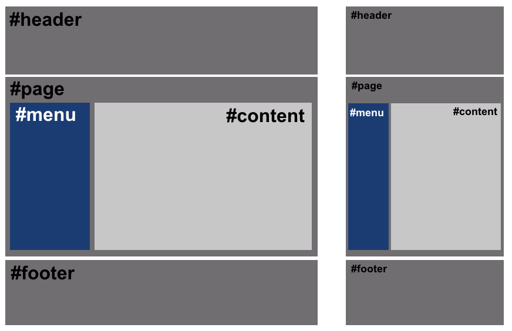

# **Bases del Responsive Web Design**

Tabla de contenidos

- [3. Bases del diseño responsive](2-Bases-del-diseño-responsive)
  - [3.1. Diseño con porcentajes](#31-Diseño-con-porcentajes)
  - [3.2. Tamaños máximos y mínimos](#32-Tamaños-máximos-y-mínimos)
  - [3.3. El viewport](#33-El-viewport)

Como explicamos en el punto anterior, hay ciertos conceptos que hay que tener claros antes de comenzar con el **Responsive Design**. En esta sección vamos a ver como llevarlos a la práctica con código.

# 3. Bases del diseño responsive

## 3.1. Diseño con porcentajes

El primer paso para crear un diseño que se adapte correctamente, es comenzar a familiarizarse con un tipo de unidades relativas: **los porcentajes**. Recordemos que los porcentajes son relativos al contenedor padre, por lo que si especificamos un porcentaje a un elemento, el navegador va a tomar dicho porcentaje del contenedor.

> > **Nota:** Al comenzar, algunos diseñadores tienen una percepción incorrecta de que los porcentajes toman el tamaño dependiendo de lo que mide la ventana del navegador. Realmente los porcentajes dependen siempre del tamaño del elemento padre que los contiene. Si queremos basarnos en el tamaño del navegador, hay que usar [unidades de viewport](https://lenguajecss.com/css/modelo-de-cajas/unidades-css/#unidades-flexibles-viewport).

Podemos comenzar usando porcentajes con las propiedades `width` en un ejemplo sencillo. Si establecemos un ancho de `100%` (*valor por defecto en elementos de tipo block, no hace falta indicarlo*) a los elementos grises que vemos a continuación (*#header, #page y #footer*), un `30%` al azul (*#menu*) y un `70%` al gris claro (*#content*) podríamos obtener este diseño:



El código utilizado sería algo parecido a lo siguiente:

```html
<div id="header"></div>
<div id="page">
  <div id="menu"></div>
  <div id="content"></div>
</div>
<div id="footer"></div>
```

Nótese que los elementos `#menu` y `#content` se encuentran dentro de `#page`. Tengan en cuenta que, estamos utilizando **`id`** en este ejemplo, aunque habíamos comentado que lo ideal quizás sería utilizar clases.

Por su parte, el código CSS tendría esta pinta:

```css
div {
  /* Ponemos un alto mínimo, por defecto es 0 */
  min-height: 200px;
  /* Dibujamos un borde para ver límites */
  border: 2px solid black;
}

#header, #page, #footer {
  background: grey;
}

#menu, #content {
  /* Necesario para que los elementos estén en horizontal */
  display: inline-block;
}

#menu {
  background: blue;
  width: 30%;
}

#content {
  background: lightgrey;
  width: 70%;
}
```
> [Responsive Web Design. Diseño con porcentajes (Codepen)](https://codepen.io/sergio-rey-personal/pen/XWXzbQP)

Sin embargo, utilizar porcentajes no nos garantiza un diseño adaptativo de calidad, hay que comprender otros detalles. El primer problema que encontraremos será que si sumamos el tamaño de los elementos (*70% + 30%*) junto a los bordes (*2px por cada lado*), la suma es superior al 100% del contenedor padre, por lo que **no cabe en su interior** y el segundo elemento se desplaza a la zona inferior, descuadrando todo el diseño. Lo mismo puede ocurrir si intentamos añadir `margin` o `padding`. Esto es algo muy habitual en CSS. Y frustrante al principio.

Hay varias formas de solucionar esto:

-   Eliminar los bordes y reducir los porcentajes hasta que quepan en el 100% del padre.
-   Usar `box-sizing: border-box` para cambiar el modo en el que se gestionan los tamaños.
-   Utilizar un sistema moderno como [Flexbox](https://lenguajecss.com/css/maquetacion-y-colocacion/flexbox/) o [Grid](https://lenguajecss.com/css/maquetacion-y-colocacion/grid-css/) (*recomendado*).

Una forma simple de solucionar el problema en el ejemplo anterior, es hacer los siguientes cambios en el CSS del documento:

```css
/* Eliminamos este bloque */
#menu, #content {
  display: inline-block;
}

/* Añadimos este */
#page {
  display: flex;
}
```
> [Responsive Web Design. Diseño con porcentajes 2 (Codepen)](https://codepen.io/sergio-rey-personal/pen/KKVydPZ)

De esta forma, conseguimos que nuestro diseño se adapte de forma adecuada a la página, sin necesidad de tener que ajustar los márgenes, rellenos, bordes o tamaño de los contenidos.

## 3.2. Tamaños máximos y mínimos

Si buscamos un cierto grado de control aún mayor, podríamos recurrir a las propiedades `max-width` y `min-width` , con las que podemos indicar el ancho de un elemento como máximo y el ancho de un elemento como mínimo respectivamente, consiguiendo así garantizar cierto control del diseño:

```css
.picture {
  min-height: 200px;    /* Por defecto, height es 0 */
  background: grey;     /* Simplemente, para verlo visualmente */

  max-width: 1024px;
  min-width: 800px;
}
```

En este caso, el elemento tiene un tamaño máximo de 1024 píxeles, y un tamaño mínimo de 800 píxeles, por lo que si ajustamos el ancho de la ventana del navegador, dicho elemento iría variando en un rango de 800 a 1024 píxeles, nunca haciéndose más pequeño de 800 o más grande de 1024.

> **Nota**: Es importante darse cuenta de que este ejemplo funciona porque no hay definido un `width` (*por omisión, es igual a `width: 100%`*). Desde que exista un `width`, las otras propiedades pierden efecto porque se está obligando a que tenga un tamaño fijo concreto.

Con las imágenes, videos y contenidos multimedia, se puede hacer lo mismo, consiguiendo así que las imágenes se escalen y adapten al formato especificado o incluso al tamaño de pantalla de los diferentes dispositivos utilizados:

```css
img,
video,
object,
embed {
    max-width: 100%;
    height: auto;
}

```

## 3.3. El viewport

En muchos casos puede que oigas hablar del **viewport** del navegador. Esa palabra hace referencia a la **región visible del navegador**, o sea, la parte de la página que está visualizándose actualmente en el navegador. Los usuarios podemos redimensionar la ventana del navegador para reducir el tamaño del viewport y simular que se trata de una pantalla y dispositivo más pequeño.

Si queremos editar ciertos comportamientos del viewport del navegador, podemos editar el documento HTML para especificar el siguiente campo meta, antes de la parte del `</head>`:

```html
<meta name="viewport" content="initial-scale=1, width=device-width">

```

Con esta etiqueta `<meta>`, estamos estableciendo unos parámetros de comportamiento para el **viewport** del navegador. Veamos que significan y cuales más existen:

| Propiedades | Valor | Significado |
| --- | --- | --- |
| width | device-width | Indica un ancho para el viewport. |
| height | device-height | Indica un alto para el viewport. |
| initial-scale | 1 | Escala inicial con la que se visualiza la página web. |
| minimum-scale | 0.1 | Escala mínima a la que se puede reducir al hacer zoom. |
| maximum-scale | 10 | Escala máxima a la que se puede aumentar al hacer zoom. |
| user-scalable | no/fixed | **yes/zoom** | Posibilidad de hacer zoom en la página web. |

Las propiedades `initial-scale` , `minimum-scale` y `maximum-scale` permiten valores desde el `0.1` al `10` , aunque ciertos valores se traducen automáticamente a ciertos números determinados:

-   yes = 1
-   no = 0.1
-   device-width = 10
-   device-height = 10

Por otra parte, `user-scalable` permite definir si es posible que el usuario pueda «pellizcar» la pantalla para ampliar o reducir el zoom.

> > > **Ojo:** Aunque es posible utilizar algunos de estos parámetros, es aconsejable revisar detalladamente las consecuencias de especificar estos parámetros. Lo recomendable es utilizar sólo los que se mencionan en el fragmento de código superior, para evitar problemas de accesibilidad que impidan ciertas acciones.

### Ejemplo de la etiqueta *viewport* que no permite escalar la página

Lo más habitual es definir la anchura con el valor "device-width", que es una medida que hace referencia a la anchura de la pantalla del dispositivo, y no con una medida fija. Por lo tanto, con **width=device-width** conseguimos que el ***viewport* sea igual a la anchura real de la pantalla** del dispositivo, de modo que no se tratará de emular una pantalla mayor de lo que realmente es y veremos los píxeles reales.

Con **initial-scale=1** conseguimos **definir la escala inicial** del documento para evitar transformaciones.

Con **user-scalable=no** o con **maximum-scale con un valor igual al de initial-scale** conseguimos que el usuario **no pueda hacer zoom** en la página, con lo que siempre se mantendrán las medidas que nosotros hemos definido al construir la web.

```html
<meta name="viewport" content="width=device-width, initial-scale=1, maximum-scale=1">

<meta name="viewport" content="user-scalable=no, width=device-width, initial-scale=1">
```

### Ejemplo etiqueta *viewport* que permite escalar la página

Para no limitar al usuario el uso del zoom en nuestra página web y darle la posibilidad de agrandar y empequeñecer cualquier parte que necesite ver mejor lo ideal es **no definir ni el maximum-scale ni el user-scalable=no**.

```html
<meta name="viewport" content="width=device-width,initial-scale=1.0">
```

Por lo tanto, es interesante que el usuario pueda hacer zoom en la página web (en un smartphone será con los dedos sobre la pantalla táctil). En este caso, el usuario no está cambiando los valores de *viewport*, sino la escala con la que se visualiza el documento.

[Más datos sobre etiquetas meta para dispositivos móviles](https://developer.mozilla.org/es/docs/M%C3%B3vil/Viewport_meta_tag).