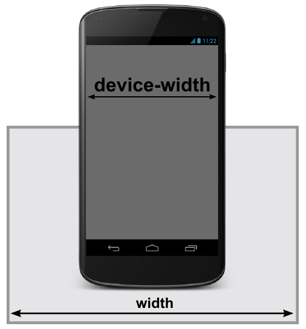

# 4. **Media queries en CSS3**

Tabla de contenido

- [4. **Media queries en CSS3**](#4-media-queries-en-css3)
  - [4.1. ¿Qué son las media queries?](#41-qué-son-las-media-queries)
  - [4.2. Ejemplos de media queries](#42-ejemplos-de-media-queries)
    - [Ejemplo](#ejemplo)
  - [4.3. Propiedades o condiciones](#43-propiedades-o-condiciones)
  - [4.4. Condicionales CSS](#44-condicionales-css)
  - [4.5. Operadores lógicos en media queries](#45-operadores-lógicos-en-media-queries)
    - [Operador AND](#operador-and)
    - [Operador NOT](#operador-not)
- [Ejercicios propuestos](#ejercicios-propuestos)

Una vez nos adentramos en el mundo del **Responsive Design**, nos damos cuenta en que hay situaciones en las que determinados aspectos o componentes visuales deben aparecer en un tipo de dispositivos, o deben existir ciertas diferencias.

Por ejemplo, una zona donde se encuentra el buscador de la página puede estar colocada en un sitio concreto en la versión de escritorio, pero en móvil quizás nos interesa que ocupe otra zona (*o que tenga otro tamaño o forma*) para aprovechar mejor el poco espacio que tenemos en la versión móvil de la página.

Para ello, utilizaremos un concepto denominado **media queries**, con los que podemos hacer esas excepciones para que sólo se apliquen a un tipo de diseño concreto.

Las media queries se introdujeron en CSS3 para dar respuesta a las necesidades del diseño web responsive. Mediante ellas podemos definir estilos condicionales, aplicables únicamente en determinadas situaciones. El uso más extendido de las media queries es para establecer estilos diferentes para cada ancho de pantalla.

## 4.1. ¿Qué son las media queries?

Las reglas **media queries** (*también denominadas **MQ** a veces*) son un tipo de reglas de CSS que permiten crear un bloque de código que sólo se procesará en los dispositivos que cumplan los criterios especificados como condición:

```css
@media screen and (*condición*) {
  /* reglas CSS */
  /* reglas CSS */
}

@media screen and not (*condición*) {
  /* reglas CSS */
  /* reglas CSS */
}

```

Con este método, especificamos que queremos aplicar los estilos CSS para tipos de medios concretos (*`screen`: sólo en pantallas, en este caso*) que cumplan las condiciones especificadas entre paréntesis. De esta forma, una estrategia aconsejable es crear reglas CSS generales (*como hemos hecho hasta ahora*) aplicadas a todo el documento: colores, tipo de fuente, etc. y luego, las particularidades que se aplicarían sólo en el dispositivo en cuestión.

Aunque suele ser menos habitual, también se pueden indicar reglas `@media` negadas mediante la palabra clave `not`, que aplicará CSS siempre y cuando no se cumpla una determinada condición. Tambien pueden separarse por comas varias condiciones de media queries.

> **Truco:** Al igual que `not`, también existe una palabra clave `only` que, suele usarse a modo de **hack**. El comportamiento por defecto ya incluye los dispositivos que encajan con la condición, pero con la palabra clave `only` conseguimos que navegadores antiguos que no la entienden, no procesen la información, dejándola sólo para navegadores modernos.

Existen los siguientes **tipos de medios**:

| Tipo de medio | Significado |
| --- | --- |
| **screen** | Monitores o pantallas de ordenador. Es el más común. |
| print | Documentos de [medios impresos](https://lenguajecss.com/css/responsive-web-design/medios-impresos/) o pantallas de previsualización de impresión. |
| speech | Lectores de texto para invidentes (Antes **aural**, el cuál ya está obsoleto). |
| all | Todos los dispositivos o medios. El que se utiliza **por defecto**. |

Otros tipos de medios como `braille`, `embossed`, `handheld`, `projection`, `tty` o `tv` aún son válidos, pero están marcados como obsoletos a favor de utilizar tipos de medios de la lista anterior y restringir sus características posteriormente.

Recordemos que con el siguiente fragmento de código HTML estamos indicando que el nuevo ancho de la pantalla es **el ancho del dispositivo**, por lo que el aspecto del viewport se va a adaptar consecuentemente:

``` html
<meta name="viewport" content="initial-scale=1, width=device-width">

```



Con esto conseguiremos preparar nuestra web para dispositivos móviles y prepararnos para la introducción de reglas **media query** en el documento CSS.

## 4.2. Ejemplos de media queries

Veamos un ejemplo clásico de **media queries** en el que definimos diferentes estilos dependiendo del dispositivo que estamos utilizando. Observese que en el código existen 3 bloques `@media` donde se definen estilos CSS para cada uno de esos tipos de dispositivos.

El código sería el siguiente:

```css
@media screen and (max-width: 640px) {
  .menu {
    background: blue;
  }
}

@media screen and (min-width: 640px) and (max-width: 1280px) {
  .menu {
    background: red;
  }
}

@media screen and (min-width: 1280px) {
  .menu {
    background: green;
  }
}

```

El ejemplo anterior muestra un elemento (*con clase `menu`*) con un color de fondo concreto, dependiendo del tipo de medio con el que se visualice la página:

-   **Azul** para resoluciones menores a **640 píxeles** de ancho (*móviles*).
-   **Rojo** para resoluciones entre **640 píxeles** y **1280 píxeles** de ancho (*tablets*).
-   **Verde** para resoluciones mayores a **1280 píxeles** (*desktop*).

El número de bloques de reglas `@media` que se utilicen depende del desarrollador web, ya que no es obligatorio utilizar un número concreto. Se pueden utilizar desde un sólo media query, hasta múltiples de ellos a lo largo de todo el documento CSS.

### Ejemplo 

Supongamos ahora que queremos aplicar un estilo diferente en pantallas de ancho superior a 1024px, inferior a 1024px e inferior a 480px, tendríamos las siguientes media queries:

```css
.click:after {
    content:"En pantalla grande";
}
@media screen and (max-width: 1024px) {
    .click:after {
        content:"Tablet";
    }
}
@media screen and (max-width: 480px) {
    .click:after {
        content:"Movil";
    }
}
```

> [Ejemplo Media queries (Codepen)](https://codepen.io/sergio-rey-personal/pen/BajmoRd)

La siguiente media query especifica una hoja de estilo para ser utilizada cuando la ventana tiene un ancho entre 450 y 800 pixeles:

```css
@media screen and (min-width: 450px) and (max-width: 800px) { 
      ... 
}
```

Hay que tener en cuenta que los **media queries** también es posible indicarlos desde HTML, utilizando la etiqueta `<link>`:

```html
<link rel="stylesheet" href="mobile.css"
      media="screen and (max-width: 640px)">

<link rel="stylesheet" href="tablet.css"
      media="screen and (min-width: 640px) and (max-width: 1280px)">

<link rel="stylesheet" href="desktop.css"
      media="screen and (min-width: 1280px)">
```

Estos estilos quedarán separados en varios archivos diferentes. Ten en cuenta que todos serán descargados al cargar la página, sólo que no serán aplicados al documento hasta que cumplan los requisitos indicados en el atributo `media`.

## 4.3. Propiedades o condiciones

A parte del ancho hay muchas otras propiedades que se pueden comprobar para aplicar o no los estilos. Las siguientes son algunas de ellas:

| Nombre | Descripción |
| --- | --- |
| `width` | Anchura del viewport |
| `height` | Altura del viewport |
| `aspect-ratio` | Relación de aspecto anchura-altura del viewport |
| `orientation` | Orientación del viewport |
| `resolution` | Densidad de pixeles del dispositivo |
| `scan` | Proceso de escaneo del dispositivo |
| `grid` | Si el dispositivo es grid o bitmap |
| `update-frequency` | Velocidad de actualización del dispositivo para modificar la apariencia del contenido |
| `overflow-block` | Cómo maneja el dispositivo el contenido que excede los límites del viewport a lo largo del eje de bloque |
| `overflow-inline` | Cómo maneja el dispositivo el contenido que excede los límites del eje *inline* |
| `color` | Componente de número de bits por color del dispositivo, o cero si el dispositivo no es a color. |
| `color-index` | Número de entradas en la tabla de búsqueda de color del dispositivo, o cero si el dispositivo no usa una tabla. |
| `monochrome` | Bits por pixel en el buffer de marco monocromático del dispositivo, o 0 si el dispositivo no es monocromático. |
| `hover` | Si se puede posicionar el puntero sobre los elementos |

## 4.4. Condicionales CSS

Aunque no forman parte de las media queries en sí, podemos utilizar la regla `@supports` para establecer condicionales y crear reglas similares a `@media` pero dependiendo de si el navegador del usuario soporta una característica concreta.

```css
@supports not (display: grid) and (display: flex) {
  .content {
    display: flex;
    justify-content: center;
  }
}

@supports not (display: flex) {
  .content {
    display: block;
  }
}

```

Estas reglas son muy interesantes para casos particulares donde queremos dar soporte a navegadores antiguos, pero hay que tener en cuenta que navegadores como **Internet Explorer** (*quizás uno de los más interesantes para utilizarlo*) no tienen soporte para la regla `@supports`, aún ni en su versión 11.

[](https://lenguajecss.com/css/responsive-web-design/bases-responsive/ "Bases del Responsive Design")


## 4.5. Operadores lógicos en media queries

Las *media queries* nos permiten utilizar operadores lógicos para comprobar si se cumple una condición.

### Operador AND

El siguiente código aplicará estilos cuando la pantalla tenga un ancho mínimo de 700px y la orientación de la misma sea horizontal (*landscape*).

```css
@media (min-width: 700px) and (orientation: landscape) { ... }
```

### Operador NOT

El siguiente código aplicará estilos cuando no se cumpla la condición especificada, es decir a cualquier elemento que no sea una pantalla convencional ni sea monocromo.

```css
@media not screen and (monochrome) { ... }
```

# Ejercicios propuestos

Define las media queries de tu proyecto web. Aplica un mínimo de tres puntos de ruptura.
