# **Flexbox CSS**

Tabla de contenidos

- [5. Flexbox CSS](#5-Flexbox-CSS)
  - [5.1. Conceptos](#51-Conceptos)
  - [5.2. Dirección de los eje](#52-Dirección-de-los-ejes)
    - [5.2.1. Atajo: Dirección de los ejes](#521-Atajo-Dirección-de-los-ejes)
  - [5.3. Propiedades de alineación](#53-Propiedades-de-alineación)
    - [5.3.1. Sobre el eje principal](#531-Sobre-el-eje-principal)
    - [5.3.2. Sobre el eje secundario](#532-Sobre-el-eje-secundario)
    - [5.3.3. Atajo: Alineaciones](#533-Atajo-Alineaciones)
  - [5.4. Propiedades de hijos](#54-Propiedades-de-hijos)
    - [5.4.1. Atajo: Propiedades de hijos](#541-Atajo-Propiedades-de-hijos)
  - [5.5. Huecos (gaps)](#55-Huecos-gaps)
    - [5.5.1. Atajo: Huecos](#551-Atajo-Huecos)
  - [5.6. Orden de los ítems](#56-Orden-de-los-ítems)

Tradicionalmente, en CSS se ha utilizado el posicionamiento (*static, relative, absolute...*), los elementos en línea o en bloque (*y derivados*) o los **float**, lo que a grandes rasgos no dejaba de ser un sistema de creación de diseños bastante tradicional que no encaja con los retos que tenemos hoy en día: sistemas de escritorio, dispositivos móviles, múltiples resoluciones, etc...

# 5. Flexbox CSS

**Flexbox** es un sistema de **elementos flexibles** que llega con la idea de olvidar estos mecanismos y acostumbrarnos a una mecánica más potente, limpia y personalizable, en la que los elementos HTML se adaptan y colocan automáticamente y es más fácil personalizar los diseños. Está especialmente diseñado para crear, mediante CSS, estructuras de **una sóla dimensión**.

## 5.1. Conceptos

Para empezar a utilizar **flexbox** lo primero que debemos hacer es conocer algunos de los elementos básicos de este nuevo esquema, que son los siguientes:


- **Contenedor**: Existe un elemento padre que es el contenedor que tendrá en su interior cada uno de los ítems flexibles y adaptables. (`display:flex`)

  - **Eje principal**: Los contenedores flexibles tendrán una orientación principal específica. Por defecto, es en horizontal (*fila*).
  - **Eje secundario**: De la misma forma, los contenedores flexibles tendrán una orientación secundaria, perpendicular a la principal. Si la principal es en horizontal, la secundaria será en vertical, y viceversa.
- **Ítem**: Cada uno de los hijos flexibles que tendrá el contenedor en su interior.

Imaginemos el siguiente escenario:

```html
<div id="contenedor"> <!-- contenedor flex -->
  <div class="item item-1">1</div> <!-- cada uno de los ítems flexibles -->
  <div class="item item-2">2</div>
  <div class="item item-3">3</div>
</div>
```

Para activar el modo **`flexbox`** hay que utilizar sobre el elemento contenedor la propiedad `display` que vimos en un puntos antarior, y especificar el valor **`flex`** o **`inline-flex`** dependiendo de como queramos que se comporte el contenedor: si como un elemento en línea, o como un elemento en bloque.

| Tipo de elemento | Descripción |
| --- | --- |
| inline-flex | Establece un contenedor de ítems flexible en línea, de forma equivalente a inline-block. |
| flex | Establece un contenedor de ítems flexible en bloque, de forma equivalente a block. |

```css
* {
  box-sizing: border-box;
}

#contenedor {
  background-color: lightyellow;
  height: 200px;
  margin: 20px auto;
  padding: 10px;
  width: 60%;
  border: 1px solid yellow;
  
  display: flex;
}

.item{
  background-color: blue;
  border: 1px solid black;
  height: 50%;
}
```


> [Comprueba el uso de `display: flex` (Codepen)](https://codepen.io/sergio-rey-personal/pen/jOWYydK)

Por defecto, y sólo con esto, observaremos que los elementos se disponen todos sobre una misma línea. Esto ocurre porque estamos utilizando el modo **`flexbox`** y estaremos trabajando con ítems flexibles básicos, garantizando que no se desbordarán ni mostrarán los problemas que, por ejemplo, tienen los porcentajes sobre elementos que no utilizan flexbox.

## 5.2. Dirección de los ejes

Existen dos propiedades principales para manipular la dirección y comportamiento de los ítems a lo largo del eje principal del contenedor. Son las siguientes:

| Propiedad | Valor | Significado |
| --- | --- | --- |
| `flex-direction` | `row` \| `row-reverse` \| `column` \| `column-reverse` | Cambia la orientación del eje principal. |
| `flex-wrap` | `nowrap` \| `wrap` \| `wrap-reverse` | Evita o permite el desbordamiento (multilinea). |

Mediante la propiedad `flex-direction` podemos modificar la dirección del **eje principal** del contenedor para que se oriente en horizontal (*por defecto*) o en vertical. Además, también podemos incluir el sufijo `-reverse` para indicar que coloque los ítems en orden inverso.

| Valor | Descripción |
| --- | --- |
| `row` | Establece la dirección del eje principal en horizontal. |
| `row-reverse` | Establece la dirección del eje principal en horizontal (invertido). |
| `column` | Establece la dirección del eje principal en vertical. |
| `column-reverse` | Establece la dirección del eje principal en vertical (invertido). |

Esto nos permite tener un control muy alto sobre el orden de los elementos en una página. Veamos la aplicación de estas propiedades sobre el ejemplo anterior, para modificar el flujo del eje principal del contenedor:

```css
#contenedor {
  display: flex;
  flex-direction: column-reverse;
}
```


Por otro lado, existe otra propiedad llamada `flex-wrap` con la que podemos especificar el comportamiento del contenedor respecto a evitar que se desborde (*nowrap, valor por defecto*) o permitir que lo haga, en cuyo caso, estaríamos hablando de un **contenedor flexbox multilinea**.

| Valor | Descripción |
| --- | --- |
| `nowrap` | Establece los ítems en una sola línea (no permite que se desborde el contenedor). |
| `wrap` | Establece los ítems en modo multilínea (permite que se desborde el contenedor). |
| `wrap-reverse` | Establece los ítems en modo multilínea, pero en dirección inversa. |

Teniendo en cuenta estos valores de la propiedad `flex-wrap`, podemos conseguir cosas como la siguiente:

En el caso de especificar **nowrap** (*u omitir la propiedad `flex-wrap`*) en el contenedor, los 3 ítems se mostrarían en una misma línea del contenedor. En ese caso, cada ítem debería tener un 50% de ancho (*o sea, 100px de los 200px del contenedor*). Un tamaño de **100px** por ítem, sumaría un total de **300px**, que no cabrían en el contenedor de **200px**, por lo que **flexbox** reajusta los ítems flexibles para que quepan todos en la misma línea, manteniendo las mismas proporciones.

```css
#contenedor {
  display: flex;
  flex-direction: row;
  flex-wrap: wrap;  /* Comportamiento por defecto: nowrap */
}
```
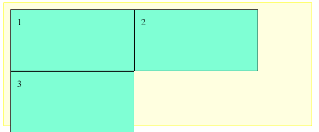

Sin embargo, si especificamos **wrap** en la propiedad `flex-wrap`, lo que permitimos es que el contenedor se pueda desbordar, pasando a ser un contenedor **multilínea**, que mostraría el **ítem 1 y 2** en la primera linea (*con un tamaño de 100px cada uno*) y el **ítem 3** en la línea siguiente, dejando un espacio libre para un posible **ítem 4**.

```css
#contenedor {
  display: flex;
  flex-direction: row-reverse;
  flex-wrap: wrap-reverse;  /* Comportamiento por defecto: nowrap */
}
```
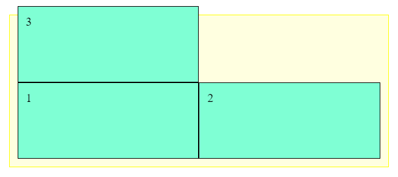

Observa si cambiamos el orden a `row-reverse`

```css
#contenedor {
  display: flex;
  flex-direction: row-reverse;
  flex-wrap: wrap-reverse;  /* Comportamiento por defecto: nowrap */
}
```
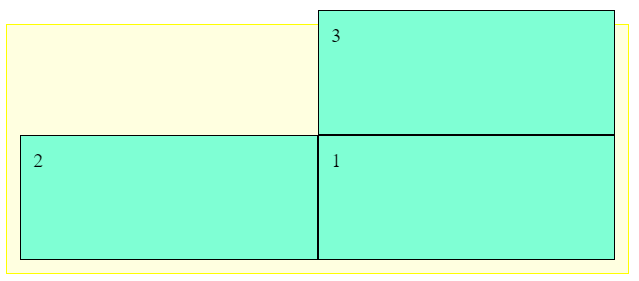


## 5.2.1. Atajo: Dirección de los ejes

Recuerda que existe una propiedad de atajo (short-hand) llamada `flex-flow`, con la que podemos resumir los valores de las propiedades `flex-direction` y `flex-wrap`, especificándolas en una sola propiedad y ahorrándonos utilizar las propiedades concretas:

```css
#contenedor {
  display: flex;
  /* flex-flow: <flex-direction> <flex-wrap>; */
  flex-flow: column wrap;
}
```
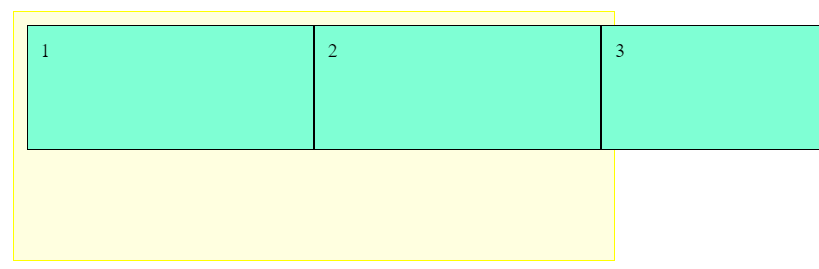

En este caso, como el alto del elemento no cabe en el contenedor, el `wrap` provoca que se ponga uno al lado del otro al no caber ninguno debajo del anterior.

## 5.3. Propiedades de alineación

Ahora que tenemos un control básico del contenedor de estos ítems flexibles, necesitamos conocer las propiedades existentes dentro de flexbox para disponer los ítems dependiendo de nuestro objetivo. Vamos a echar un vistazo a cuatro propiedades interesantes para ello:

| Propiedad | Valor | Actúa sobre |
| --- | --- | --- |
| `justify-content` | `flex-start` \| `flex-end` \| `center` \| `space-between` \| `space-around` | Eje principal |
| `align-content` | `flex-start` \| `flex-end` \| `center` \| `space-between` \| `space-around` | stretch | Eje secundario |
| `align-items` | `flex-start` \| `flex-end` \| `center` \| `stretch` \| `baseline` | Eje secundario |
| `align-self` | `auto` \| `flex-start` \| `flex-end` \| `center` \| `stretch` \| `baseline` | Eje secundario |

De esta pequeña lista, hay que centrarse en primer lugar en la primera y la tercera propiedad, que son las más importantes (*las otras dos son casos particulares que explicaremos más adelante*):

-   `justify-content`: Se utiliza para alinear los ítems del **eje principal** (*por defecto, el horizontal*).
-   `align-items`: Usada para alinear los ítems del **eje secundario** (*por defecto, el vertical*).

### 5.3.1. Sobre el eje principal

La primera propiedad, `justify-content`, sirve para colocar los ítems de un contenedor mediante una disposición concreta a lo largo del **eje principal**:

| Valor | Descripción |
| --- | --- |
| `flex-start` | Agrupa los ítems al principio del eje principal. |
| `flex-end` | Agrupa los ítems al final del eje principal. |
| `center` | Agrupa los ítems al centro del eje principal. |
| `space-between` | Distribuye los ítems dejando (el mismo) espacio entre ellos. |
| `space-around` | Distribuye los ítems dejando (el mismo) espacio a ambos lados de cada uno de ellos. |

Con cada uno de estos valores, modificaremos la disposición de los ítems del contenedor donde se aplica, pasando a colocarse como se ve en la imagen siguiente (*nótense las diferentes tonalidades azules para indicar las posiciones de cada ítem*):

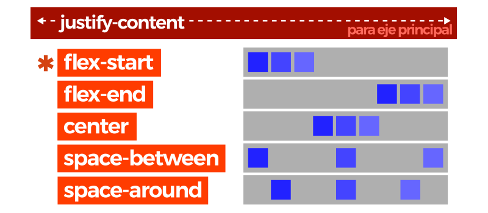

```css
#contenedor {
  display: flex;
  flex-wrap: wrap;
  justify-content: flex-end;
}
```
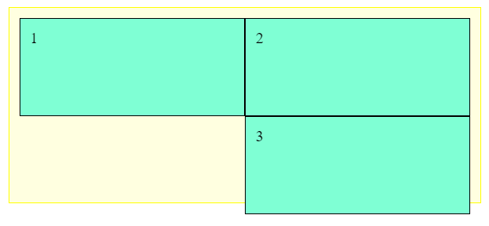

Ejemplo con `space-between` para el que reducimos el tamaño de los items y así verlo mejor.
```css
#contenedor {
  display: flex;
  flex-wrap: wrap;
  justify-content: space-between;
}

.item{
  width: 20%;
}
```

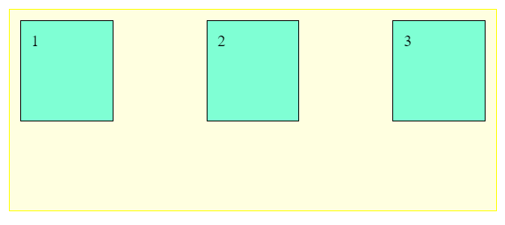

Una vez entendido este caso, debemos atender a la propiedad `align-content`, que es un caso particular del anterior. Nos servirá cuando estemos tratando con un ***contenedor flex multilinea***, que es un contenedor en el que los ítems no caben en el ancho disponible, y por lo tanto, el eje principal se divide en múltiples líneas.

De esta forma, `align-content` servirá para alinear cada una de las líneas del contenedor multilinea. Los valores que puede tomar son los siguientes:

| Valor | Descripción |
| --- | --- |
| `flex-start` | Agrupa los ítems al principio del eje principal. |
| `flex-end` | Agrupa los ítems al final del eje principal. |
| `center` | Agrupa los ítems al centro del eje principal. |
| `space-between` | Distribuye los ítems desde el inicio hasta el final. |
| `space-around` | Distribuye los ítems dejando el mismo espacio a los lados de cada uno. |
| `stretch` | Estira los ítems para ocupar de forma equitativa todo el espacio. Los items no deben tener asignada **height** |

Con estos valores, vemos como cambiamos la disposición en vertical (*porque partimos de un ejemplo en el que estamos utilizando flex-direction: row, y el eje principal es horizontal*) de los ítems que están dentro de un contenedor multilinea.

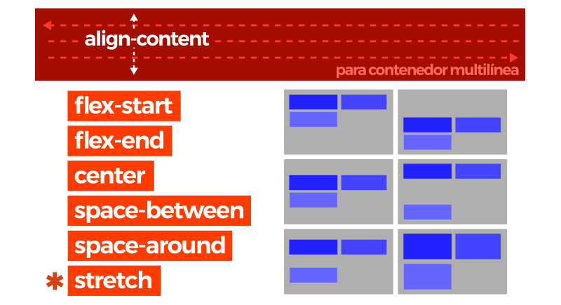

En el ejemplo siguiente, veremos que al indicar un contenedor de **200 píxels de alto** con ítems de **50px** de alto y un **flex-wrap** establecido para tener contenedores multilinea, podemos utilizar la propiedad `align-content` para alinear los ítems de forma vertical de modo que se queden en la zona inferior del contenedor:

```css
#contenedor {
  height: 200px;

  display: flex;
  flex-wrap: wrap;
  align-content: flex-end;
}

.item{
  height: 50px;
}
```

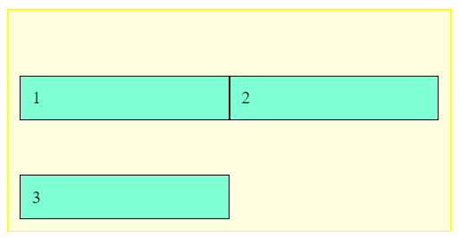

Ojo. Para el valor `stretch`, los elementos no deben tener asignada altura;

```css
#contenedor {
  height: 200px;

  display: flex;
  flex-wrap: wrap;
  align-content: stretch;
}

.item{
  //height: 50px;
}
```

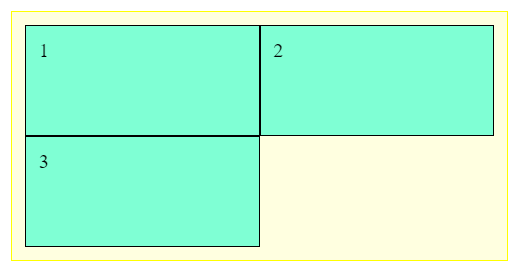

### 5.3.2. Sobre el eje secundario

La otra propiedad importante de este apartado es `align-items`, que se encarga de alinear los ítems en el eje secundario del contenedor. Hay que tener cuidado de no confundir `align-content` con `align-items`, puesto que el primero actúa sobre cada una de las líneas de un contenedor multilinea (*no tiene efecto sobre contenedores de una sola línea*), mientras que `align-items` lo hace sobre la línea actual. Los valores que puede tomar son los siguientes:

| Valor | Descripción |
| --- | --- |
| `flex-start` | Alinea los ítems al principio del eje secundario. |
| `flex-end` | Alinea los ítems al final del eje secundario. |
| `center` | Alinea los ítems al centro del eje secundario. |
| `stretch` | Alinea los ítems estirándolos de modo que cubran desde el inicio hasta el final del contenedor. |
| `baseline` | Alinea los ítems en el contenedor según la base del contenido de los ítems del contenedor. |

Veamos un ejemplo usadno `baseline`, alineando la base de los items.

```css
#contenedor {
  display: flex;
  flex-wrap: wrap;
  justify-content: space-around;
  align-items: baseline;
}

.item-2{
  padding-top: 30px;
}

.item-3{
  padding-top: 60px;
}
```

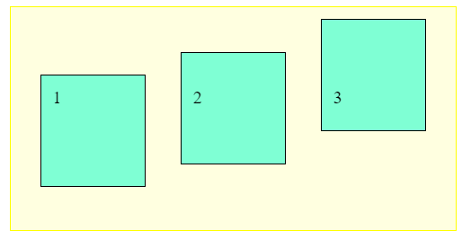

Por otro lado, la propiedad `align-self` actúa exactamente igual que `align-items`, sin embargo es la primera propiedad de flexbox que vemos que ***se utiliza sobre un ítem hijo*** específico y no sobre el elemento contenedor. Salvo por este detalle, funciona exactamente igual que `align-items`.

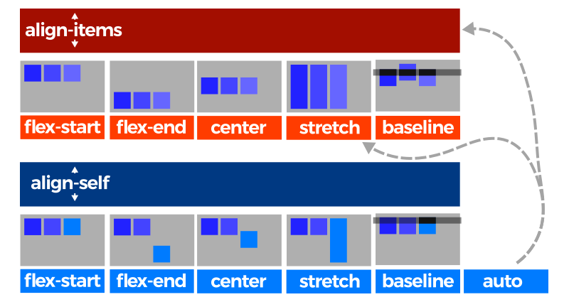

Gracias a ese detalle, `align-self` nos permite cambiar el comportamiento de `align-items` y sobreescribirlo con comportamientos específicos para ítems concretos que no queremos que se comporten igual que el resto. La propiedad puede tomar los siguientes valores:

| Valor | Descripción |
| --- | --- |
| `flex-start` | Alinea los ítems al principio del contenedor. |
| `flex-end` | Alinea los ítems al final del contenedor. |
| `center` | Alinea los ítems al centro del contenedor. |
| `stretch` | Alinea los ítems estirándolos al tamaño del contenedor. |
| `baseline` | Alinea los ítems en el contenedor según la base de los ítems. |
| `auto` | Hereda el valor de **align-items** del padre (o si no lo tiene, **stretch**). |

Si se especifica el valor **auto** a la propiedad `align-self`, el navegador le asigna el valor de la propiedad `align-items` del contenedor padre, y en caso de no existir, el valor por defecto: **stretch**.

```css
#contenedor {
  display: flex;
}

.item-2{
  align-self: center;
}

.item-3{
  align-self: flex-end;
}
```

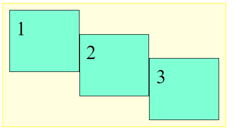

### 5.3.3. Atajo: Alineaciones

Existe una propiedad de atajo con la que se pueden establecer los valores de `align-content` y de `justify-content` de una sola vez, denominada `place-content`:

```css
#contenedor {
  display: flex;
  place-content: flex-start flex-end;

  /* Equivalente a... */
  align-content: flex-start;
  justify-content: flex-end;
}
```

## 5.4. Propiedades de hijos

A excepción de la propiedad `align-self`, todas las propiedades que hemos visto hasta ahora se aplican sobre el elemento **contenedor**. Las siguientes propiedades, sin embargo, se aplican sobre los ítems hijos. Echemos un vistazo:

| Propiedad | Valor | Descripción |
| --- | --- | --- |
| `flex-grow` | `0` \| `número` | Número que indica el factor de crecimiento del ítem respecto al resto. |
| `flex-shrink` | `1` \| `número` | Número que indica el factor de decrecimiento del ítem respecto al resto. |
| `flex-basis` | `size` \| `content` | Tamaño base de los ítems antes de aplicar variación. |
| `order` | `0` \| `número` | Número (peso) que indica el orden de aparición de los ítems. |

En primer lugar, tenemos la propiedad `flex-grow` para indicar el factor de crecimiento de los ítems en el caso de que no tengan un ancho específico. Por ejemplo, si con `flex-grow` indicamos un valor de **1** a todos sus ítems, tendrían el mismo tamaño cada uno de ellos. Pero si colocamos un valor de **1** a todos los elementos, salvo a uno de ellos, que le indicamos **2**, ese ítem será más grande que los anteriores. Los ítems a los que no se le especifique ningún valor, tendrán por defecto valor de **0**.

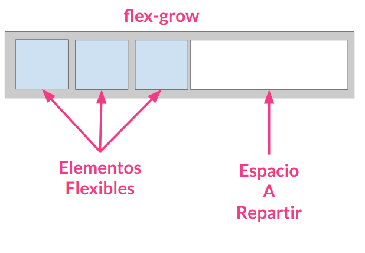

En segundo lugar, tenemos la propiedad `flex-shrink` que es la opuesta a `flex-grow`. Mientras que la anterior indica un factor de crecimiento, `flex-shrink` hace justo lo contrario, aplica un factor de decrecimiento. De esta forma, los ítems que tengan un valor numérico más grande, serán más pequeños, mientras que los que tengan un valor numérico más pequeño serán más grandes, justo al contrario de como funciona la propiedad `flex-grow`.

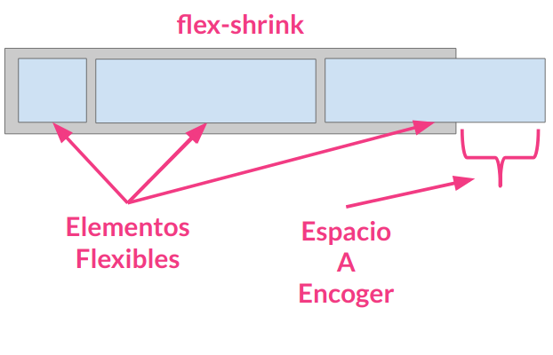

Por último, tenemos la propiedad `flex-basis`, que define el tamaño por defecto (*de base*) que tendrán los ítems antes de aplicarle la distribución de espacio. Generalmente, se aplica un tamaño (*unidades, porcentajes, etc...*), pero también se puede aplicar la palabra clave **content** que ajusta automáticamente el tamaño al contenido del ítem, que es su valor por defecto.

En el siguiente **ejemplo** cambiamos el orden de los elementos, y aplicamos diferentes tasas de crecimiento y decrecimiento a cada unos de los elementos.

```css
#contenedor {
  display: flex;
}

.item{
  //width: 25%;
  flex-basis: 100px;
}

.item-1{
  flex-grow: 1;
  order: 1;
}

.item-2{
  flex-grow: 0;
  flex-shrink: 2;
  order: 2;
}

.item-3{
  flex-grow: 2;
  flex-shrink: 5;
  order: 0;
}
```

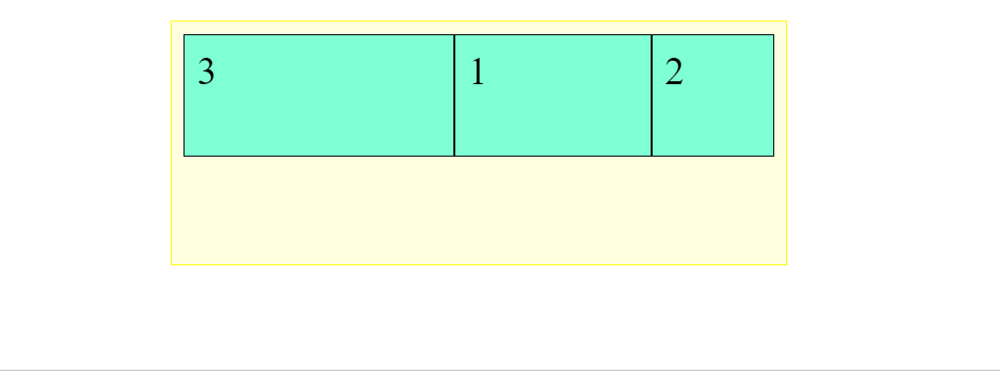

### 5.4.1. Atajo: Propiedades de hijos

Existe una propiedad llamada `flex` que sirve de atajo para estas tres propiedades de los ítems hijos. Funciona de la siguiente forma:

```css
.item {
  /* flex: <flex-grow> <flex-shrink> <flex-basis> */
  flex: 1 3 35%;
}

```

## 5.5. Huecos (gaps)

Existen dos propiedades de flexbox que han surgido recientemente: `row-gap` y `column-gap`. Dichas propiedades, permiten establecer el tamaño de un «hueco» entre ítems desde el elemento padre contenedor, y sin necesidad de estar utilizando `padding` o `margin` en los elementos hijos.

| Propiedad | Valor | Descripción |
| --- | --- | --- |
| `row-gap` | `normal` \| `size` | Espacio entre filas (sólo si `flex-direction: column`) |
| `column-gap` | `normal` \| `size` | Espacio entre columnas (sólo si `flex-direction: row`) |

Ten en cuenta que sólo una de las dos propiedades tendrá efecto, dependiendo de si la propiedad `flex-direction` está establecida en `column` o en `row`. Eso sí, es posible usar ambas si tenemos la propiedad `flex-wrap` definida a `wrap` y, por lo tanto, disponemos de multicolumnas flexbox.

### 5.5.1. Atajo: Huecos

En el caso de que queramos utilizar una propiedad de atajo para los huecos, podemos utilizar la propiedad `gap`. Eso sí, ten en cuenta que estas propiedades de huecos en flexbox, aún no tienen un soporte demasiado extendido entre navegadores:

```css
#contenedor {
  /* gap: <row> <column> */
  gap: 4px 8px;

  /* 1 parámetro: usa el mismo para ambos */
  gap: 4px;
}

```

## 5.6. Orden de los ítems

Por último, y quizás una de las propiedades más interesantes, es `order`, que modificar y establece el orden de los ítems según una secuencia numérica.

Por defecto, todos los ítems flex tienen un `order: 0` implícito, aunque no se especifique. Si indicamos un `order` con un valor numérico, irá recolocando los ítems según su número, colocando antes los ítems con número más pequeño (*incluso valores negativos*) y después los ítems con números más altos.

De esta forma podemos recolocar fácilmente los ítems incluso utilizando media queries o responsive design.
