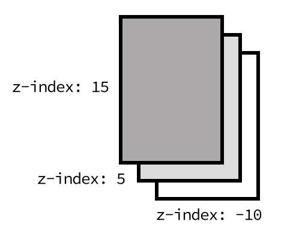

# 5. **Revisión de posiciónamiento de elementos en CSS**

Tabla de contenidos
- [5. **Revisión de posiciónamiento de elementos en CSS**](#5-revisión-de-posiciónamiento-de-elementos-en-css)
  - [5.1. Posicionamiento CSS](#51-posicionamiento-css)
  - [5.2. Posicionamiento relativo](#52-posicionamiento-relativo)
  - [5.3. Posicionamiento absoluto](#53-posicionamiento-absoluto)
  - [5.4. Posicionamiento fijo](#54-posicionamiento-fijo)
  - [5.5. Otros posicionamientos](#55-otros-posicionamientos)
  - [5.6. Profundidad (niveles)](#56-profundidad-niveles)
  - [5.7. Float. Elementos Flotantes](#57-float-elementos-flotantes)
  - [5.8. Limpiar flujo flotante](#58-limpiar-flujo-flotante)

A grandes rasgos, y como aprendimos en temas anteriores, si tenemos varios **elementos en línea** (*uno detrás de otro*) aparecerán colocados de **izquierda hacia derecha**, mientras que si son **elementos en bloque** se verán colocados desde **arriba hacia abajo**. Estos elementos se pueden ir combinando y anidando (*incluyendo unos dentro de otros*), construyendo así esquemas más complejos.

## 5.1. Posicionamiento CSS

Hasta ahora, hemos estado trabajando sin saberlo en lo que se denomina posicionamiento **estático** (*static*), donde todos los elementos aparecen con un orden natural según donde estén colocados en el HTML. Este es el **modo por defecto** en que un navegador renderiza una página.

Sin embargo, existen otros modos alternativos de posicionamiento, que podemos cambiar mediante la propiedad `position`, que nos pueden interesar para modificar la posición en donde aparecen los diferentes elementos y su contenido.

A la propiedad `position` se le pueden indicar los siguientes valores:

| Valor | Significado |
| --- | --- |
| **static** | Posicionamiento estático. Utiliza el orden natural de los elementos HTML. |
| relative | Posicionamiento relativo. Los elementos se mueven ligeramente en base a su posición estática. |
| absolute | Posicionamiento absoluto. Los elementos se colocan en base al contenedor padre. |
| fixed | Posicionamiento fijo. Idem al absoluto, pero aunque hagamos scroll no se mueve. |

Si utilizamos un modo de posicionamiento diferente al estático (*absolute, fixed o relative*), podemos utilizar una serie de propiedades para modificar la posición de un elemento. Estas propiedades son las siguientes:

| Propiedad | Valor | Significado |
| --- | --- | --- |
| top: | `auto` - `size` | Empuja el elemento una distancia desde la parte superior hacia el inferior. |
| bottom: | `auto` - `size` | Empuja el elemento una distancia desde la parte inferior hacia la superior. |
| left: | `auto` - `size` | Empuja el elemento una distancia desde la parte izquierda hacia la derecha. |
| right: | `auto` - `size` | Empuja el elemento una distancia desde la parte derecha hacia la izquierda. |
| z-index: | `auto` - `número` | Coloca un elemento en el eje de profundidad, más cerca o más lejos del usuario. |

Antes de pasar a explicar los tipos de posicionamiento, debemos tener claras las propiedades `top`, `bottom`, `left` y `right`, que sirven para mover un elemento desde la orientación que su propio nombre indica hasta su extremo contrario. Esto es, si utilizamos `left` e indicamos `20px`, estaremos indicando mover **desde la izquierda** 20 píxeles **hacia la derecha**.

Pero pasemos a ver cada tipo de posicionamiento por separado y su comportamiento:

## 5.2. Posicionamiento relativo

Si utilizamos la palabra clave `relative` activaremos el modo de **posicionamiento relativo**, que es el más sencillo de todos. En este modo, los elementos se colocan exactamente igual que en el posicionamiento estático (*permanecen en la misma posición*), pero dependiendo del valor de las propiedades `top`, `bottom`, `left` o `right` variaremos ligeramente la posición del elemento.

> **Ejemplo**: Si establecemos `left:40px`, el elemento se colocará 40 píxeles a la derecha **desde la izquierda** donde estaba colocado en principio, mientras que si especificamos `right:40px`, el elemento se colocará 40 píxeles a la izquierda **desde la derecha** donde estaba colocado en principio.

## 5.3. Posicionamiento absoluto

Si utilizamos la palabra clave `absolute` estamos indicando que el elemento pasará a utilizar **posicionamiento absoluto**, que no es más que utilizar el documento completo como referencia. Esto no es exactamente el funcionamiento de este modo de posicionamiento, pero nos servirá como primer punto de partida para entenderlo.

> **Ejemplo**: Si establecemos `left:40px`, el elemento se colocará 40 píxeles a la derecha del extremo izquierdo de la página. Sin embargo, si indicamos `right:40px`, el elemento se colocará 40 píxeles a la izquierda del extremo derecho de la página.

Como mencionaba anteriormente, aunque este es el funcionamiento del posicionamiento absoluto, hay algunos detalles más complejos en su modo de trabajar. Realmente, este tipo de posicionamiento coloca los elementos **utilizando como punto de origen el primer contenedor con posicionamiento diferente a estático**.

Por ejemplo, si el contenedor padre tiene posicionamiento estático, pasamos a mirar el posicionamiento del padre del contenedor padre, y así sucesivamente hasta encontrar un contenedor con posicionamiento no estático o llegar a la etiqueta `<body>`, en el caso que se comportaría como el ejemplo anterior.

## 5.4. Posicionamiento fijo

Por último, el **posicionamiento fijo** es hermano del **posicionamiento absoluto**. Funciona exactamente igual, salvo que hace que el elemento se muestre en una posición fija **dependiendo de la región visual del navegador**. Es decir, aunque el usuario haga scroll y se desplace hacia abajo en la página web, el elemento seguirá en el mismo sitio posicionado.

> **Ejemplo**: Si establecemos `top:0` y `right:0`, el elemento se colocará justo en la esquina superior derecha y se mantendrá ahí aunque hagamos scroll hacia abajo en la página.

## 5.5. Otros posicionamientos

Existen otros valores de `position` como `sticky`, `page` o `center`, sin embargo, su soporte e implementación aún es muy temprana y no se sabe si su funcionalidad terminará ofreciéndose desde los diferentes navegadores.

## 5.6. Profundidad (niveles)

Es interesante conocer también la existencia de la propiedad `z-index`, que establece el **nivel de profundidad** en el que está un elemento sobre los demás. De esta forma, podemos hacer que un elemento se coloque encima o debajo de otro.

Su funcionamiento es muy sencillo, sólo hay que indicar un número que representará el nivel de profundidad del elemento. Los elementos un número más alto estarán por encima de otros con un número más bajo, que permanecerán ocultos detrás de los primeros.



> > **Nota**: Los niveles `z-index`, así como las propiedades `top`, `left`, `bottom` y `right` no funcionan con elementos que estén utilizando posicionamiento estático. Deben tener un tipo de posicionamiento diferente a estático.

## 5.7. Float. Elementos Flotantes

Es posible que en algún momento necesitemos algo más de control sobre nuestra página y realizar cambios en determinados elementos. Existe una propiedad denominada `float` que tiene un funcionamiento peculiar con el que cambiamos el flujo de ordenación de elementos.

Con **`float`** podemos conseguir que un elemento «flote» a la izquierda o a la derecha de otro elemento. Para ello podemos utilizar las siguientes propiedades:

| Propiedad | Valor | Significado |
| --- | --- | --- |
| `float` | **none** | left | right | Cambia el flujo para que el elemento flote a la izquierda o derecha. |
| `clear` | **none** | left | right | both | Impide que los elementos puedan flotar en la orientación indicada. |

Con la propiedad `float` puedes conseguir que los elementos que quieras, alteren su comportamiento y floten a la izquierda (*left*) o a la derecha (*right*). Con el valor `none` (*valor por defecto*) eliminas esta característica de desplazamiento.

Imaginemos que tenemos un párrafo de texto, seguido de una lista, seguida de otro párrafo de texto:

```css
ul {
  background: grey;
}

li {
  background: blue;
  width: 100px;
  padding: 8px;
  margin: 8px;
  color: white;
}

ul, li {
  float: left;
}

```

Con esto conseguimos que los ítems de la lista floten uno a continuación de otro. No obstante, para conseguir este comportamiento siempre recomiendo utilizar `display` en lugar de `float`. Cambiando la representación de elementos se suele conseguir una solución más limpia y organizada.

## 5.8. Limpiar flujo flotante

Por otro lado, la propiedad `clear` se encarga de impedir elementos flotantes en la zona indicada, a la izquierda del elemento (*left*), a la derecha (*right*) o en ambos lados (*both*).

En el ejemplo anterior, el segundo párrafo de texto aparecería a continuación de la lista, cuando probablemente, nuestra intención es que apareciera en la parte inferior. Se podría solucionar simplemente añadiendo el siguiente texto:

```css
p {
  clear:both
}

```

> > **OJO**: La propiedad `float` es una propiedad que podría ser interesante en determinadas condiciones, sin embargo, el código resultante suele ser más sucio y complejo de lo que sería mediante otros métodos actuales, por lo que se recomienda sólo utilizarlo por razones de retrocompatibilidad y darle preferencia a métodos como [Flexbox](https://lenguajecss.com/css/propiedades/flexbox) o [Grid CSS](https://lenguajecss.com/css/maquetacion-y-colocacion/grid-css/).