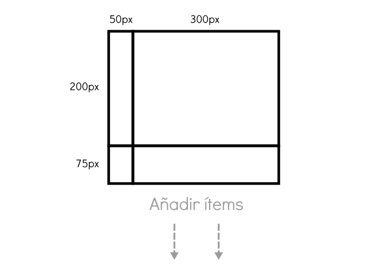
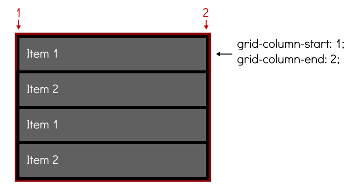

# **Grid CSS**

Tabla de contenidos


Uno de los procesos más problematicos y frustrantes de CSS, sobre todo para novatos o principiantes, es el proceso de colocar y distribuir los elementos a lo largo de una página. Mecanismos como posicionamiento, floats o elementos en bloque o en línea, suelen ser insuficientes (*o muy complejos*) para crear un layout o estructuras para páginas web actuales.

El sistema **flexbox** es una gran mejora, sin embargo, está orientado a estructuras de una sola dimensión, por lo que aún necesitamos algo más potente para estructuras web más específicas o complejas. Con el paso del tiempo, muchos frameworks y librerías utilizan un **sistema grid** donde definen una cuadrícula determinada, y modificando los nombres de las clases de los elementos HTML, podemos darle tamaño, posición o colocación.

# 6. Grid CSS

**Grid CSS** nace de esa necesidad, y recoge las ventajas de ese sistema, añadiendole numerosas mejoras y características que permiten crear rápidamente cuadrículas sencillas y potentes de forma prácticamente instantánea.

## 6.1. Conceptos

Antes de comenzar con **Grid CSS**, quizás sería conveniente dominar el sistema **Flexbox**, ya que Grid toma la filosofía y bases de él. Para utilizar **Grid CSS** necesitaremos tener en cuenta una serie de conceptos que utilizaremos a partir de ahora y que definiremos a continuación:


-   **Contenedor**: El elemento padre contenedor que definirá la cuadrícula o rejilla.
-   **Ítem**: Cada uno de los hijos que contiene la cuadrícula (*elemento contenedor*).
-   **Celda (grid cell)**: Cada uno de los cuadritos (*unidad mínima*) de la cuadrícula.
-   **Area (grid area)**: Región o conjunto de celdas de la cuadrícula.
-   **Banda (grid track)**: Banda horizontal o vertical de celdas de la cuadrícula.
-   **Línea (grid line)**: Separador horizontal o vertical de las celdas de la cuadrícula.

Para utilizar cuadriculas **Grid CSS**, trabajaremos bajo el siguiente escenario:

```html
<div class="grid"> <!-- contenedor -->
  <div class="a">Item 1</div> <!-- cada uno de los ítems del grid -->
  <div class="b">Item 2</div>
  <div class="c">Item 3</div>
  <div class="d">Item 4</div>
</div>
```

Para activar la cuadrícula **grid** hay que utilizar sobre el elemento contenedor la propiedad `display` y especificar el valor **grid** o **inline-grid**. Este valor influye en como se comportará la cuadrícula con el contenido exterior. El primero de ellos permite que la cuadrícula aparezca encima/debajo del contenido exterior (*en bloque*) y el segundo de ellos permite que la cuadrícula aparezca a la izquierda/derecha (*en línea*) del contenido exterior.

| Tipo de elemento | Descripción |
| --- | --- |
| `inline-grid` | Establece una cuadrícula con ítems en línea, de forma equivalente a inline-block. |
| `grid` | Establece una cuadrícula con ítems en bloque, de forma equivalente a block. |

Una vez elegido uno de estos dos valores, y establecida la propiedad `display` al elemento contenedor, hay varias formas de configurar nuestra cuadrícula grid. Comencemos con las propiedades que se aplican al elemento contenedor (*padre*).

## 6.2. Grid con filas y columnas

Es posible crear cuadrículas con un tamaño explícito. Para ello, sólo tenemos que usar las propiedades CSS `grid-template-columns` y `grid-template-rows`, que sirven para indicar las dimensiones de cada **celda** de la cuadrícula, diferenciando entre columnas y filas. Las propiedades son las siguientes:

| Propiedad | Valor | Descripción |
| --- | --- | --- |
| `grid-template-columns` | [*c1*] [*c2*] ... | Establece el de cada columna (*col 1, col 2...*). |
| `grid-template-rows` | [*f1*] [*f2*] ... | Establece el de cada fila (*fila 1, fila 2...*). |

Conociendo estas dos propiedades, asumamos el siguiente código CSS:

```css
.grid {
  display: grid;
  grid-template-columns: 50px 300px;
  grid-template-rows: 200px 75px;
}
```

Esto significa que tendremos una cuadricula con **2 columnas** (*la primera con 50px de ancho y la segunda con 300px de ancho*) y con **2 filas** (*la primera con 200px de alto y la segunda con 75px de alto*). Ahora, dependiendo del número de ítems (*elementos hijos*) que tenga el contenedor **grid**, tendremos una cuadrícula de 2x2 elementos (*4 ítems*), 2x3 elementos (*6 ítems*), 2x4 elementos (*8 ítems*) y así sucesivamente. Si el número de ítems es impar, la última celda de la cuadrícula se quedará vacía.



### 6.2.1. Unidad fracción restante (fr)

En el ejemplo anterior he utilizado **píxels** como unidades de las celdas de la cuadrícula, sin embargo, también podemos utilizar otras unidades (*o incluso combinarlas*) como porcentajes, la palabra clave **auto** (*que obtiene el tamaño restante*) o la unidad especial de Grid CSS **fr** (*fraction*), que simboliza una **fracción de espacio restante en el grid**. Veamos un código de ejemplo en acción:

```css
.grid {
  display: grid;
  grid-template-columns: 1fr 1fr;
  grid-template-rows: 2fr 1fr;
}
```

Este nuevo ejemplo, se crea una cuadrícula de 2x2, donde el tamaño de ancho de la cuadrícula se divide en **dos columnas** (*mismo tamaño de ancho para cada una*), y el tamaño de alto de la cuadrícula se divide en **dos filas**, donde la primera ocupará el doble (*2 fr*) que la segunda (*1 fr*):


De esta forma, podemos tener un mejor control del espacio restante de la cuadrícula, y como utilizarlo.

> **Nota**: Se pueden combinar varias unidades diferentes, pudiendo utilizar píxeles (*px*) y fracciones restantes (*fr*), porcentajes (*%*) y fracciones restantes (*fr*) o combinaciónes similares.

### 6.2.2. Filas y columnas repetitivas

En algunos casos, en las propiedades `grid-template-columns` y `grid-template-rows` podemos necesitar indicar las mismas cantidades un número alto de veces, resultando repetitivo y molesto. Se puede utilizar la expresión `repeat()` para indicar repetición de valores, indicando el número de veces que se repiten y el tamaño en cuestión.

La expresión a utilizar sería la siguiente: `repeat([núm de veces], [valor o valores])`:

```css
.grid {
  display: grid;
  grid-template-columns: 100px repeat(2, 50px) 200px;
  grid-template-rows: repeat(2, 50px 100px);
}
```

Asumiendo que tuvieramos un contenedor grid con 8 ítems hijos (*o más*), el ejemplo anterior crearía una cuadrícula con **4 columnas** (*la primera de 100px de ancho, la segunda y tercera de 50px de ancho y la cuarta de 200px de ancho*). Por otro lado, tendría **2 filas** (*la primera de 50px de alto, y la segunda de 100px de alto*). En el caso de tener más ítems hijos, el patrón se seguiría repitiendo.

El ejemplo anterior sería equivalente al código CSS siguiente:

```css
.grid {
  display: grid;
  grid-template-columns: 100px 50px 50px 200px;
  grid-template-rows: 50px 100px 50px 100px;;
}
```

## 6.3. Grid con líneas nombradas

Con Grid CSS también tenemos la posibilidad de usar «**linenames**», o lo que es lo mismo, ponerle nombre a las líneas de nuestro sistema grid. Vamos a verlo con un ejemplo, donde probablemente se vea mucho mejor. Partamos de esta estructura HTML:

```html
<div class="grid">
  <div class="header">Header</div>
  <div class="sidebar">Sidebar</div>
  <div class="content">Content</div>
  <div class="footer">Footer</div>
</div>
```

Los nombres de las clases ya dan una idea del contenido que tendrán. Ahora, mediante Grid CSS lo que haremos es darle una estructura definida. Para ello, vamos a considerar los siguientes nombres para las lineas de nuestro grid, utilizando **X** para las posiciones en el **eje X** y utilizando **Y** para las posiciones en el **eje Y**:


Teniendo esto en cuenta, lo único que tenemos que hacer es indicar estos nombres entre corchetes, justo antes de la medida que establecimos como vimos en apartados anteriores. Obsérvese que también se coloca una nombre de línea final sin medida a continuación, que representa la línea final:

```css
.grid {
  display: grid;
  grid-template-columns: [x0] 1fr [x1] 1fr [x2] 1fr [x3];
  grid-template-rows: [y0] 1fr [y1] 1fr [y2] 1fr [y3];
}
```

En este caso, los nombres utilizados son tan sólo un ejemplo didáctico. Si se considera más adecuado, se podrían utilizar otros nombres quizás más amigables como `top-line`, `top-medium-line`, `bottom-medium-line` y `bottom-line`, por ejemplo, en lugar de `y0`, `y1`, `y2` y `y3` respectivamente.

Ahora, teniendo los nombres, sólo quedaría delimitar que zonas del grid queremos que ocupe cada uno de nuestros bloques `<div>` del grid. Para ello utilizaremos las propiedades `grid-column-start`, `grid-column-end` y `grid-row-start`, `grid-row-end`. También podriamos utilizar sus propiedades de atajo `grid-column` y `grid-row`.

```css
.header {
  background: darkred;
  grid-column-start: x0;
  grid-column-end: x3;

  /* Equivalente a */
  grid-column: x0 / x3;
}

.sidebar {
  background: black;
  grid-row: y1 / y2;
  color: white;
}

.content {
  background: orange;
  grid-column: x1 / x3;
  grid-row: y1 / y3;
}

.footer {
  background: green;
  grid-column: x0 / x3;
  grid-row: y2;
}
```

Hemos aplicado la siguiente estructura:

-   Zona `.header` desde la columna **x0** a **x3**.
-   Zona `.sidebar` desde la fila **y1** a **y2**.
-   Zona `.content` desde la columna **x1** a **x3** y desde la fila **y1** a **y3**.
-   Zona `.footer` desde la columna **x0** a **x3** en la fila **y2**.

Por lo que nuestra estructura grid quedaría así:


Un poco más adelante veremos más detalladamente estas últimas propiedades.

> > **Nota:** Ten en cuenta que sería necesario darle un tamaño de alto con `height` al contenedor padre para que el navegador sepa cuanto ocupará la estructura completa. También podemos modificar las medidas `1fr` para dar menos proporción, por ejemplo utilizando en `grid-template-rows` un `[y0] 0.5fr` y un `[y2] 0.25fr`.

## 6.4. Grid por áreas

Mediante los **grids CSS** es posible indicar el nombre y posición concreta de cada área de una cuadrícula. Para ello utilizaremos la propiedad `grid-template-areas`, donde debemos especificar el orden de las áreas en la cuadrícula. Posteriormente, en cada ítem hijo, utilizamos la propiedad `grid-area` para indicar el nombre del área del que se trata:

| Propiedad | Descripción |
| --- | --- |
| `grid-template-areas` | Indica la disposición de las áreas en el grid. Cada texto entre comillas simboliza una fila. |
| `grid-area` | Indica el nombre del área. Se usa sobre ítems hijos del grid. |

De esta forma, es muy sencillo crear una cuadrícula altamente personalizada en apenas unas cuantas líneas de CSS, con mucha flexibilidad en la disposición y posición de cada área:

```css
.grid {
  display: grid;
  grid-template-areas: "head head"
                       "menu main"
                       "foot foot";
}

.a { grid-area: head; background: blue }
.b { grid-area: menu; background: red }
.c { grid-area: main; background: green }
.d { grid-area: foot; background: orange }
```

Aplicando este código, conseguiríamos una cuadrícula donde:

-   El **Item 1**, la cabecera (*head*), ocuparía toda la parte superior.
-   El **Item 2**, el menú (*menu*), ocuparía el área izquierda del grid, debajo de la cabecera.
-   El **Item 3**, el contenido (*main*), ocuparía el área derecha del grid, debajo de la cabecera.
-   El **Item 4**, el pie de cuadrícula (*foot*), ocuparía toda la zona inferior del grid.


> **OJO**: Ten en cuenta añadir contenido de texto en cada celda del grid, para que Grid CSS detecte que esa celda no está vacía.

En la propiedad `grid-template-areas`, en lugar de indicar el nombre del área a colocar, también podemos indicar una palabra clave especial:

-   La palabra clave **none**: Indica que no se colocará ninguna celda en esta posición.
-   Uno o más puntos (*.*): Indica que se colocará una celda vacía en esta posición.

## 6.5. Huecos en grid

Por defecto, la cuadrícula tiene todas sus celdas pegadas a sus celdas contiguas. Aunque sería posible darle un `margin` a las celdas dentro del contenedor, existe una forma más apropiada, que evita los problemas clásicos de los modelos de caja: los huecos (*gutters*).

Para especificar los **huecos** (*espacio entre celdas*) podemos utilizar las propiedades `grid-column-gap` y/o `grid-row-gap`. En ellas indicaremos el tamaño de dichos huecos:

| Propiedad | Descripción |
| --- | --- |
| `grid-column-gap` | Establece el de los huecos entre columnas (*líneas verticales*). |
| `grid-row-gap` | Establece el de los huecos entre filas (*líneas horizontales*). |

Tomemos el ejemplo anterior como base. En él, le indicamos estas propiedades para colocar **huecos** entre las celdas de la cuadrícula. El código a añadir al ejemplo anterior sería el siguiente:

```css
.grid {
  grid-column-gap: 100px;
  grid-row-gap: 10px;
}
```

Con esto, obtendríamos un resultado como el siguiente, indicando huecos entre columnas de 100px y huecos entre filas de 10px:


### 6.5.1. Atajo: Grid con huecos

Existe una propiedad de atajo para las propiedades `grid-column-gap` y `grid-row-gap`, permitiéndonos la posibilidad de no tener que indicarlas por separado.

La propiedad en cuestión sería `grid-gap` y se utilizaría de la siguiente forma:

```css
.grid {
  /* grid-gap: <row-gap> <column-gap> */
  grid-gap: 20px 80px;

  /* Equivalente a grid-gap: 40px 40px; */
  /* grid-gap: <rowcolumn-gap> */
  grid-gap: 40px;
}
```

## 6.6. Posición en el grid

Existen una serie de propiedades que se pueden utilizar para colocar los ítems dentro de la cuadrícula. Con ellas podemos distribuir los elementos de una forma muy sencilla y cómoda. Dichas propiedades son `justify-items` y `align-items`, que ya conocerás del módulo CSS **flexbox**:

| Propiedad | Valores | Descripción |
| --- | --- | --- |
| `justify-items` | `start` \| `end` \| `center` \| `stretch` | Distribuye los elementos en el eje horizontal. |
| `align-items` | `start` \| `end` \| `center` \| `stretch` | Distribuye los elementos en el eje vertical. |

Estas propiedades se aplican sobre el elemento contenedor padre, pero afectan a los ítems hijos, por lo que actuan sobre la distribución de cada uno de los hijos. En el caso de que queramos que uno de los ítems hijos tengan una distribución diferente al resto, aplicamos la propiedad `justify-self` o `align-self` sobre el ítem hijo en cuestión, sobreescribiendo su distribución.

Estas propiedades funcionan exactamente igual que sus análogas `justify-items` o `align-items`, sólo que en lugar de indicarse en el elemento padre contenedor, se hace sobre un elemento hijo. Las propiedades sobre ítems hijos las veremos más adelante.

También podemos utilizar las propiedades `justify-content` o `align-content` para modificar la distribución de todo el contenido en su conjunto, y no sólo de los ítems por separado:

| Propiedad | Valores |
| --- | --- |
| `justify-content` | `start` \| `end` \| `center` \| `stretch` \| `space-around` \| `space-between` \| `space-evenly` |
| `align-content` | `start` \| `end` \| `center` \| `stretch` \| `space-around` \| `space-between` \| `space-evenly` |

De esta forma, podemos controlar prácticamente todos los aspectos de posicionamiento de la cuadrícula directamente desde los estilos CSS de su contenedor padre:


### 6.6.1. Atajo de posiciones grid

Si vamos a crear estructuras grid donde necesitamos utilizar las cuatro propiedades anteriores, quizás sería mejor utilizar un atajo donde simplificaríamos mucho el código resultante. Es el caso de las siguientes propiedades:

| Propiedad | Valores | Descripción |
| --- | --- | --- |
| `place-items` | [*align-items*] [*justify-items*] | Propiedad de atajo para ***-items** |
| `place-content` | [*align-content*] [*justify-content*] | Propiedad de atajo para ***-content** |

Con ellas conseguiremos que nuestro código sea menos verboso.

## 6.7. Ajuste automático de celdas

Es posible utilizar las propiedades `grid-auto-columns` y `grid-auto-rows` para darle un tamaño automático a las celdas de la cuadrícula. Para ello, sólo hay que especificar el tamaño deseado en cada una de las propiedades. Además, también podemos utilizar `grid-auto-flow` para indicar el flujo de elementos en la cuadrícula, y especificar por donde se irán añadiendo. Las propiedades son las siguientes:

| Propiedad | Valores | Descripción |
| --- | --- | --- |
| `grid-auto-columns` | `size` | Indica el tamaño automático de ancho que tendrán las columnas. |
| `grid-auto-rows` | `size` | Indica el tamaño automático de alto que tendrán las filas. |
| `grid-auto-flow` | `row` \| `column` \| `dense` | Utiliza un algoritmo de autocolocación (intenta rellenar huecos). |

Un ejemplo de como se insertarían los elementos en una cuadrícula de 2x2 utilizando `grid-auto-flow` por columnas o por filas:


## 6.8. Atajo: Grid

Por último, existe una propiedad `grid` que sirve de atajo para la mayoría de propiedades CSS relativas a cuadrículas. Su esquema de utilización sería el siguiente, junto a algunos ejemplos:

```css
.grid {
  /* grid: <grid-template> <grid-auto-flow> <grid-auto-rows> / <grid-auto-columns> */

  grid: 100px 20px;
  grid: 200px repeat(2, 100px) 300px;
  grid: row;
  grid: column dense;
  grid: row 200px;
  grid: row 400px / 150px;
}
```

## 6.8. Propiedades para ítems hijos

Hasta ahora, salvo algunas excepciones como `justify-self`, `align-self` o `grid-area`, hemos visto propiedades CSS que se aplican solamente al contenedor padre de una cuadrícula. A continuación, vamos a ver ciertas propiedades que en su lugar, se aplican a cada ítem hijo de la cuadrícula, para alterar o cambiar el comportamiento específico de dicho elemento, que no se comporta como la mayoría.

Algunas de las propiedades vistas hasta ahora son las siguientes:

| Propiedad | Descripción |
| --- | --- |
| `justify-self` | Altera la justificación del ítem hijo en el eje horizontal. |
| `align-self` | Altera la alineación del ítem hijo en el eje vertical. |
| `grid-area` | Indica un nombre al área especificada, para su utilización con `grid-template-areas`. |

Sin embargo, existen algunas propiedades más, referentes en este caso, a la posición de los hijos de la cuadrícula donde va a comenzar o terminar una fila o columna. Las propiedades son las siguientes:

| Propiedad | Descripción |
| --- | --- |
| `grid-column-start` | Indica en que columna empezará el ítem de la cuadrícula. |
| `grid-column-end` | Indica en que columna terminará el ítem de la cuadrícula. |
| `grid-row-start` | Indica en que fila empezará el ítem de la cuadrícula. |
| `grid-row-end` | Indica en que fila terminará el ítem de la cuadrícula. |

Con dichas propiedades, podemos indicar el siguiente código CSS sobre el primer ítem de una cuadrícula de 4 ítems:

```css
.grid {
  display:grid;
}

.a {
  grid-column-start: 1;
  grid-row-end: 2;
}
```

De esta forma, tenemos una cuadrícula de 4 elementos, en el que indicamos la posición del ítem 1 (*elemento con clase `.a`*): comenzando en la columna 1 y acabando en el inicio de la columna 2:



Ese sería el funcionamiento normal. Donde se ve la utilidad de estas propiedades, es si variamos los valores de forma que tomen posiciones diferentes, como por ejemplo, si indicamos que el ítem 1 debe comenzar en la columna 1, pero acabar en la columna 3 (*ocupando la hipotética primera y segunda celda*):


En este nuevo ejemplo, comenzamos el primer ítem en la columna 2 y lo acabamos al principio de la columna 3, por lo que la celda permanecerá en la posición de la segunda columna. Además, añadimos la propiedad `grid-row-start` que hace lo mismo que hasta ahora, pero con las filas. En este caso, le indicamos que comience en la fila 3, por lo que el **ítem 1** se desplaza a una nueva fila de la cuadrícula, dejando en la anterior el **ítem 4**:


También es posible utilizar la palabra clave **span** seguida de un número, que indica que abarque hasta esa columna o celda.

### 6.8.1. Atajo: grid-column y grid-row

El módulo grid de CSS proporciona las propiedades de atajo `grid-column` y `grid-row` donde se nos permite escribir en un formato abreviado las propiedades anteriores. Su sintaxis sería la siguiente:

```css
.grid {
  display: grid;
}

.a {
  /* grid-column: <grid-column-start> <grid-column-end> */
  /* grid-row: <grid-row-start> <grid-row-end> */
  grid-column: auto;
  grid-column: 4 / 6;
  grid-column: span 3;
  grid-column: span 3 / 6;
}

```