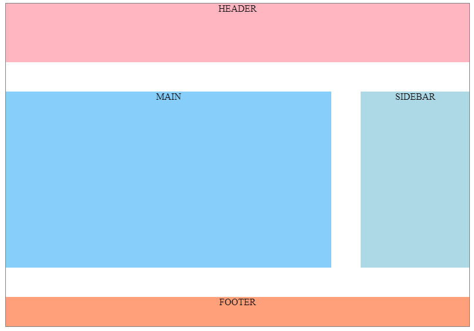
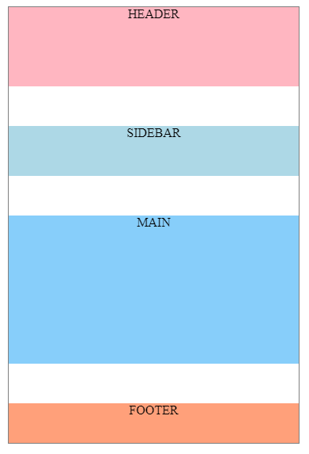

# **Ejemplo de uso Responsive de maquetacion en Flexbox y CSS Grid**

Tabla de contenidos

- [8. Ejemplo práctico responsive con media queries](#8-Ejemplo-práctico-responsive-con-media-queries)
  - [8.1. Flexbox](#81-Flexbox)
  - [8.2. CSS Grid](#82-CSS-Grid)

# 8. Ejemplo práctico responsive con media queries

A continuación, veremos un ejemplo práctico para resolver tanto en Flexbox como en Grid, situaciones que se nos pueden dar a la hora de realizar un proyecto.

Realzaremos el siguiente diseño: 



y lo haremos responsive con la ayuda de media queries



## 8.1. Flexbox

### Posición de las secciones de la página

**En Flexbox.** Situamos todas las secciones, una debajo de otra:

```html
<div class="container">
  <header>HEADER</header>
  <div class="main-and-sidebar-wrapper">
    <section class="main">MAIN</section>
    <aside class="sidebar">SIDEBAR</aside>
  </div>
  <footer>FOOTER</footer>
</div>
```

```css
.container {
  border: 1px solid grey;
  margin: 0px auto;
  width: 80%;
  text-align: center;
  
  display: flex;
  flex-direction: column;
}

header{
  background-color: lightpink;
  height: 100px;
}

.main-and-sidebar-wrapper {
  height: 300px;  
  margin: 50px 0px;
  
  display: flex;
  flex-direction: row;
}

.main {
  background-color: lightskyblue;
  
  flex: 3;
  margin-right: 50px;
 }

.sidebar {
  background-color: lightblue;
  flex: 1;
 }

footer {
  background-color: lightsalmon;
  height: 50px;
}
```

### Hacer Responsive una página

```css
@media (max-width: 600px) {
  .main-and-sidebar-wrapper {
    flex-direction: column;
  }
   
  .main {
    margin-right: 0px;
    margin-top: 50px;
    order: 1;
  }
}
```

> [Ejemplo maquetación responsive con media queries y Flexbox (Codepen)](https://codepen.io/sergio-rey-personal/pen/GRodqre)

## 8.2. CSS Grid

### Posición de las secciones de la página

```html
<div class="container">
  <header>HEADER</header>
  <section class="main">MAIN</section>
  <aside class="sidebar">SIDEBAR</aside>
  <footer>FOOTER</footer>
</div>
```
Observar como no hemos hecesitado el wrapper para ajustar la parte central.

```css
.container {
  border: 1px solid grey;
  margin: 0px auto;
  width: 80%;
  text-align: center;
  
  display: grid;
  grid-template-columns: 3fr 1fr;
  grid-template-areas:
    "header header"
    "main sidebar"
    "footer footer";
  grid-gap: 50px;
}

header {
  background-color: lightpink;
  height: 100px;

  grid-area: header;
}

.main {
  height:300px;
  background-color: lightskyblue;
  grid-area: main;
}

.sidebar {
  background-color: lightblue;
  grid-area: sidebar;
}

footer {
  background-color: lightsalmon;
  height: 50px;

  grid-area: footer;
}
```

### Hacer Responsive una página

En este caso, la mejor opción es redefinir el grid

```css
@media (max-width: 600px) {
  .container {
  /*  Redefine la cuadrícula en un solo diseño de columna. */
    grid-template-columns: 1fr;
    grid-template-areas:
      "header"
      "sidebar"
      "main"
      "footer";
  }
  .sidebar{
    height: 60px; 
  }
  .main{
    height: 200px;
  }
}
```

> [Ejemplo maquetación responsive con media queries y CSS Grid (Codepen)](https://codepen.io/sergio-rey-personal/pen/bGEMpzZ)