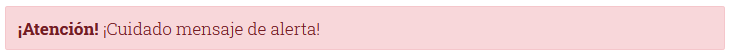

# **Introducción e instalación de Bootstrap**

Tabla de contenidos

- [2. Instroducción e instalación de Bootstrap](#2. Instroducción e instalación de Bootstrap)
  - [2.1. ¿Qué es Bootstrap?](#21-¿Qué-es-Bootstrap?)
  - [2.2. Funciomamiento de Bootstrap](#22-Funciomamiento-de-Bootstrap)
  - [2.3. Funcionalidades de Bootstrap](#23-Funcionalidades-de-Bootstrap)
  - [2.4. Configuración y uso de Bootstrap](#24-Configuración-y-uso-de-Bootstrap)
  - [2.5. Descargando Bootstrap](#25-Descargando-Bootstrap)


# 2. Introducción e instalación de Bootstrap

## 2.1. ¿Qué es Bootstrap?

Bootstrap es un ***framework*** CSS desarrollado por Twitter en 2010, para estandarizar las herramientas de la compañía.

Inicialmente, se llamó Twitter Blueprint y, un poco más tarde, en 2011, se transformó en código abierto y su nombre cambió para Bootstrap. Desde entonces fue actualizado varias veces y ya se encuentra en la versión 4.4.

El framework combina ***CSS*** y ***JavaScript*** para estilizar los elementos de una página HTML. Permite mucho más que, simplemente, cambiar el color de los botones y los enlaces.

Esta es una herramienta que proporciona interactividad en la página, por lo que ofrece una serie de componentes que facilitan la comunicación con el usuario, como menús de navegación, controles de página, barras de progreso y más.

Además de todas las características que ofrece el framework, **su principal objetivo es permitir la construcción de sitios web responsive para dispositivos móviles**.

Esto significa que las páginas están diseñadas para funcionar en desktop, tablets y smartphones, de una manera muy simple y organizada.

## 2.2. Funciomamiento de Bootstrap
-------------------------

Bootstrap está constituido por una serie de archivos CSS y JavaScript responsables de asignar características específicas a los elementos de la página.

**Hay un archivo principal llamado `bootstrap.css`, que contiene una definición para todos los estilos utilizados. Básicamente, la estructura del framework se compone de dos directorios:**

-   **css:** contiene los archivos necesarios para la estilización de los elementos y una alternativa al tema original;
-   **js:** contiene la parte posterior del archivo `bootstrap.js` (original y minificado), responsable de la ejecución de aplicaciones de estilo que requieren manipulación interactiva.

Para asignarle una característica a un elemento, simplemente debemos informar la clase correspondiente en la propiedad "class" del elemento que será estilizado, como mostramos e el siguiente ejemplo:

```css


```

En este ejemplo, fue asignado el contenido "rounded-sm" para una propiedad de imagen. Es un estilo que agrega bordes redondeados y no un elemento.

Por lo tanto, al cargar la imagen, se aplicarán al elemento las características que se refieren a esta clase.

## 2.3. Funcionalidades de Bootstrap

Bootstrap ofrece una serie de características que se pueden implementar en un sitio web. A continuación hablaremos de las posibilidades de esta herramienta.

### Diseño responsive

Una de las características principales de Bootstrap es permitir que la adaptación de la página se realice según el tipo de dispositivo utilizado. Para garantizar la responsividad, el framework funciona con:

- la estilización del elemento `<div>`;
- el uso del class container.

En la práctica, el elemento `<div>`, funciona para crear una serie de notas, similar a una tabla, capaz de estructurar la página de forma adaptable.

Ya hubo un intento de utilizar tablas para crear diseños responsivos, sin embargo existían limitaciones para definir la longitud de las columnas lo que hizo imposible su uso en dispositivos más pequeños, como smartphones.

El elemento `<div>` es más flexible, ya que permite definir y cambiar el tamaño de la longitud fácilmente.

Bootstrap le ha asignado al elemento `<div>` una característica de class container, que funciona para determinar las dimensiones apropiadas para los elementos insertados en ese espacio.

Básicamente, o framework funciona con tres tipos de containers:

-   **Container:** como un conjunto con una propiedad de ancho máximo, que determina qué tamaño de tela es ideal para crear el diseño de página.
-   **Container-fluid:** considera la longitud total de la tela del dispositivo para definir el diseño. Para esto, se considera la propiedad width ---100% en todos los límites de tamaño de tela---.
-   **Container-{ breakpoint}:** considera width ---100% hasta alcanzar un cierto tamaño---.

### Biblioteca de componentes

Otra interesante función de este framework es la cantidad de componentes que pueden ser usados para **proporcionar una mejor interacción y perfeccionar la comunicación con el usuario**.

Enseguida mencionaremos los principales.

#### Alertas

O Bootstrap permite una configuración simple y rápida de diferentes tipos de alertas, con colores específicos, según la situación.

Para mostrarle al usuario un alerta que indique atención, por ejemplo, simplemente debemos usar `.alert-danger` y aparecerá un cuadro de texto con un fondo rojo:



#### Carrusel

Un componente ampliamente utilizado en Bootstrap es el *Carrusel*, una presentación de diapositivas, es decir, una herramienta que permite la visualización de imágenes de manera receptiva.

También permite la inclusión de efectos especiales para la transición de imágenes y controles de visualización, como por ejemplo los indicadores de "*siguiente*" y "*anterior*".

#### Barra de navegación

Otro poderoso componente de la estructura es la *NavBar* (barra de navegación), que permite la construcción de un sistema de navegación sensible.

Es posible configurar diferentes formas de presentar el menú, elegir entre posicionamiento lateral o superior y, también, definir una forma de visualización que se pueda extender o contraer.

También es posible determinar cómo mostrar los enlaces del menú, que pueden ser en forma de botón, enlace, menú suspenso, entre otras configuraciones, **para facilitar la implementación de la navegación del sitio**.

## 2.4. Configuración y uso de Bootstrap

Hay diferentes formas de configurarlo o estructurarlo para usarlo en una aplicación web. Sin embargo, para que funcione correctamente, es necesario agregar las bibliotecas JQuery y Popper.js, necesarias para la ejecución de algunos componentes de Bootstrap.

Para comenzar a usar Bootstrap en una página, **es necesario agregar las referencias de los principales archivos del framework en la página principal de la aplicación**.

A continuación, puedes ver el código de una página HTML con todas las referencias necesarias para que la estructura funcione:

```html
<!doctype html>
<html lang="en">
  <head>
    <!-- Required meta tags -->
    <meta charset="utf-8">
    <meta name="viewport" content="width=device-width, initial-scale=1, shrink-to-fit=no">

    <!-- Bootstrap CSS -->
    <link rel="stylesheet" href="https://stackpath.bootstrapcdn.com/bootstrap/4.5.0/css/bootstrap.min.css" integrity="sha384-9aIt2nRpC12Uk9gS9baDl411NQApFmC26EwAOH8WgZl5MYYxFfc+NcPb1dKGj7Sk" crossorigin="anonymous">

    <title>Hello, world!</title>
  </head>
  <body>
    <h1>Hello, world!</h1>

    <!-- Optional JavaScript -->
    <!-- jQuery first, then Popper.js, then Bootstrap JS -->
    <script src="https://code.jquery.com/jquery-3.4.1.slim.min.js" integrity="sha384-J6qa4849blE2+poT4WnyKhv5vZF5SrPo0iEjwBvKU7imGFAV0wwj1yYfoRSJoZ+n" crossorigin="anonymous"></script>
    <script src="https://cdn.jsdelivr.net/npm/popper.js@1.16.0/dist/umd/popper.min.js" integrity="sha384-Q6E9RHvbIyZFJoft+2mJbHaEWldlvI9IOYy5n3zV9zzTtmI3UksdQRVvoxMfooAo" crossorigin="anonymous"></script>
    <script src="https://stackpath.bootstrapcdn.com/bootstrap/4.4.1/js/bootstrap.min.js" integrity="sha384-wfSDF2E50Y2D1uUdj0O3uMBJnjuUD4Ih7YwaYd1iqfktj0Uod8GCExl3Og8ifwB6" crossorigin="anonymous"></script>
  </body>
</html>
```

<**Fuente: **[Getbootstrap.com](https://getbootstrap.com/docs/4.4/getting-started/introduction/#starter-template)>

Es importante seguir las referencias en el orden establecido en el ejemplo. Por lo tanto, la primera referencia debe ser el archivo bootstrap.css ubicado en la etiqueta <head>.

```html
<link rel="stylesheet" href="https://stackpath.bootstrapcdn.com/bootstrap/4.4.1/css/bootstrap.min.css" integrity="sha384-Vkoo8x4CGsO3+Hhxv8T/Q5PaXtkKtu6ug5TOeNV6gBiFeWPGFN9MuhOf23Q9Ifjh" crossorigin="anonymous">
```

Las referencias a los archivos JavaScript deben colocarse en la parte inferior de la página, antes de cerrar la etiqueta </body>. El valor predeterminado para los scripts debe ser: JQuery, Popper.js y Bootstrap.js.

```html
<script src="https://code.jquery.com/jquery-3.4.1.slim.min.js" integrity="sha384-J6qa4849blE2+poT4WnyKhv5vZF5SrPo0iEjwBvKU7imGFAV0wwj1yYfoRSJoZ+n" crossorigin="anonymous"></script>
<script src="https://cdn.jsdelivr.net/npm/popper.js@1.16.0/dist/umd/popper.min.js" integrity="sha384-Q6E9RHvbIyZFJoft+2mJbHaEWldlvI9IOYy5n3zV9zzTtmI3UksdQRVvoxMfooAo" crossorigin="anonymous"></script>
<script src="https://stackpath.bootstrapcdn.com/bootstrap/4.4.1/js/bootstrap.min.js" integrity="sha384-wfSDF2E50Y2D1uUdj0O3uMBJnjuUD4Ih7YwaYd1iqfktj0Uod8GCExl3Og8ifwB6" crossorigin="anonymous"></script>
```

## 2.5. Descargando Bootstrap

Además de enlazar directamente los archivos CSS y JavaScript ofrecidos por BootstrapCDN (tal y como se explicó [en la primera sección de este capítulo](https://uniwebsidad.com/libros/bootstrap-4/capitulo-1)), existen otras formas de integrar Bootstrap en tus proyectos.

### Descargando los archivos CSS y JavaScript compilados

Visita la [página oficial de descargas de Bootstrap](https://getbootstrap.com/docs/4.1/getting-started/download/) para descargar un archivo ZIP comprimido con los archivos CSS y JavaScript listos para usar. Los archivos se entregan compilados y minimizados, pero no incluyen ni documentación, ni el código fuente, ni las dependencias JavaScript como jQuery y Popper.js.

### Descargando el código fuente

Visita la [página oficial de descargas de Bootstrap](https://getbootstrap.com/docs/4.1/getting-started/download/) para descubrir la forma en la que puedes descargar el código fuente original de los archivos CSS y JavaScript de Bootstrap.

Para integrar esos archivos en tu aplicación, necesitarás herramientas adicionales como un compilador Sass, la librería [Autoprefixer](https://github.com/postcss/autoprefixer), etc.

### Gestores de paquetes

Otra alternativa para incluir el código fuente de Bootstrap en tus aplicaciones es añadir Bootstrap como dependencia de tu proyecto usando cualquiera de los siguientes gestores de paquetes.

#### npm

Permite integrar Bootstrap en tus proyectos Node.js y JavaScript en general mediante [npm](https://www.npmjs.com/) o [yarn](https://yarnpkg.com/en/):

```
$ npm install bootstrap
```

Después, en tu código JavaScript utiliza `require('bootstrap')` para cargar todos los plugins de Bootstrap. También puedes cargar los plugins individualmente cargando cada uno de sus archivos `/js/*.js`.

El archivo `package.json` de Bootstrap contiene otros metadatos que te pueden ser útiles:

- `sass`: define el path al archivo Sass principal de Bootstrap.
- `style`: define el path al archivo CSS no minimizado y que ha sido compilado usando todos los valores por defecto recomendados.

#### RubyGems

Permite integrar Bootstrap en tus proyectos Rails y Ruby en general mediante [Bundler](https://bundler.io/) (que es lo que recomendamos que utilices) y [RubyGems](https://rubygems.org/):

```
$ gem 'bootstrap', '~> 4.1.3'
```

Si no usas Bundler, instala la gema mediante el siguiente comando:

```
$ gem install bootstrap -v 4.1.3
```

Lee el [README de la gema](https://github.com/twbs/bootstrap-rubygem/blob/master/README.md) para obtener más detalles.

#### Composer

Permite integrar Bootstrap en tus proyectos PHP mediante [Composer](https://getcomposer.org/):

```
$ composer require twbs/bootstrap 4.1.3
```

#### NuGet

Permite integrar Bootstrap en tus proyectos .NET mediante [NuGet](https://www.nuget.org/):

```
# instala la versión CSS de Bootstrap
PM> Install-Package bootstrap

# instala la versión Sass de Bootstrap
PM> Install-Package bootstrap.sass
```