# 3. **Sistema de rejilla en bootstrap**

Tabla de contenidos

- [3. **Sistema de rejilla en bootstrap**](#3-sistema-de-rejilla-en-bootstrap)
  - [3.1. Elemento contenedor](#31-elemento-contenedor)
  - [3.2. El sistema de rejilla](#32-el-sistema-de-rejilla)
  - [3.3. Columnas de tamaño especifico](#33-columnas-de-tamaño-especifico)
    - [3.3.1. Selección de tamaño de las columnas solo para pantallas medianas](#331-selección-de-tamaño-de-las-columnas-solo-para-pantallas-medianas)
    - [3.3.2. Selección de dos tamaños de columna: pequeño y mediano](#332-selección-de-dos-tamaños-de-columna-pequeño-y-mediano)
    - [3.3.3. Selección de tres tamaños: extra pequeño, pequeño y mediano](#333-selección-de-tres-tamaños-extra-pequeño-pequeño-y-mediano)
  - [3.4. Columnas de ancho automático](#34-columnas-de-ancho-automático)
    - [3.4.1. Modo mixto](#341-modo-mixto)
    - [3.4.2. Ancho de columna variable](#342-ancho-de-columna-variable)
  - [3.5. Forzar cambio de fila](#35-forzar-cambio-de-fila)
  - [3.6. Anidamiento de columnas](#36-anidamiento-de-columnas)
  - [3.7. Márgenes o espaciado entre columnas](#37-márgenes-o-espaciado-entre-columnas)
    - [3.7.1. offset](#371-offset)
    - [3.7.2. Márgenes](#372-márgenes)
  - [3.8. Ordenación de columnas](#38-ordenación-de-columnas)
  - [3.9. Alineación](#39-alineación)
    - [3.9.1. Alineación vertical](#391-alineación-vertical)
    - [3.9.2. Alineación horizontal](#392-alineación-horizontal)
    - [3.9.3. Alineación responsive](#393-alineación-responsive)

El sistema de rejilla de Bootstrap se basa en la creación o disposición del contenido de nuestra web dentro de rejillas flexibles, las cuales se escalarán al tamaño y posición adecuada de forma automática dependiendo del tamaño de la pantalla en la que se rendericen.

El sistema de rejilla de Bootstrap se basa en la creación o disposición del contenido de nuestra web dentro de rejillas flexibles, las cuales se escalarán al tamaño y posición adecuada de forma automática dependiendo del tamaño de la pantalla en la que se rendericen.

## 3.1. Elemento contenedor 

El sistema de rejilla tiene que ser utilizado dentro de uno de los dos elementos contenedores que provee Bootstrap: `container` ó `container-fluid`. Es importante tener en cuenta que estos elementos se utilizan como raíz de la rejilla y no se podrán anidar unos dentro de otros.

Si lo que queremos es que el contenido de nuestra web aparezca centrado y con un ancho fijo entonces podemos utilizar la etiqueta `.container`, de la forma:

```html
<body>

  <div class="container">

  </div>

</body>
```

Por el contrario, si queremos que el contenido de nuestra web pueda ocupar todo el ancho disponible (hay que tener en mente todos los tamaños de pantalla, incluso las muy grandes), podemos usar la etiqueta `.container-fluid`:

```html
<body>

  <div class="container-fluid">

  </div>

</body>
```

En las siguientes imágenes se ejemplifica el resultado obtenido para un mismo ancho al aplicar los dos tipos de contenedores, container en el primer caso y container-fluid en el segundo. El comportamiento de estos elementos ante distintos tamaños de pantalla es el siguiente: el elemento "container-fluid" siempre se adapta al 100% del tamaño de la pantalla, mientras que el tipo "container" tiene un tamaño máximo, por lo que si el ancho de la pantalla es superior a este ancho el contenido aparecerá centrano, dejando un margen a cada lado, y si el ancho de la pantalla es igual o inferior al tamaño máximo del contenedor, entonces se adaptará al ancho disponible.

​​

> **IMPORTANTE:** Aunque los contenedores se pueden anidar unos dentro de otros son pocas las páginas que son tan complejas para necesitar contenedores anidados.


## 3.2. El sistema de rejilla

El sistema de rejilla está pensado para ayudarnos en la disposición de los contenidos de nuestra web y su adaptación a los diferentes tamaños de pantalla de forma automática. Para ello tenemos que poner el contenido dentro de celdas o columnas que irán dentro de filas. Cada fila se puede dividir hasta en 12 columnas, pero seremos nosotros los que definiremos el número de columnas deseado para cada tamaño de pantalla.

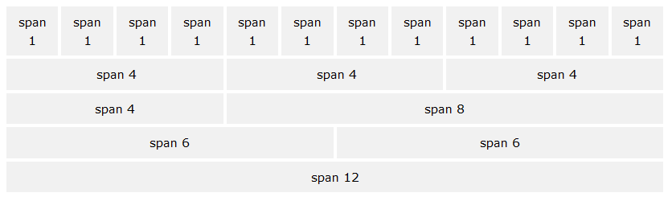

A continuación se detalla el funcionamiento de este sistema:

- Las columnas irán agrupadas dentro de filas (`.row`).
- Las filas (`.row`) se deben colocar dentro de una etiqueta contenedora: `.container` (para ancho fijo) o `.container-fluid` (para poder ocupar todo el ancho), esto permitirá alinear las celdas y asignarles el espaciado correcto.
-   El contenido se debe disponer dentro de columnas o celdas, las cuales deben de ser el único hijo posible de las filas (`.row`), las cuales, a su vez, serán el único hijo posible del contenedor (`.container` o `.container-fluid`).
-   Al seguir este orden el sistema de rejilla funcionará correctamente, creando el espaciado interior y los márgenes apropiados dependiendo de las dimensiones de la pantalla.
-   Cada fila se puede dividir hasta un máximo de 12 columnas, pero somos nosotros los que tendremos que definir el número de columnas en el que queremos dividir cada fila y su ancho para cada tamaño de pantalla. Por ejemplo: 3 columnas de igual ancho.
-   Si el tamaño total de las columnas de una fila excede de 12 el tamaño sobrante se colocará en la siguiente fila.
-   El tamaño de las columnas se especificará con clases css que Bootstrap define para cada tamaño de pantalla, por ejemplo `.col-md-XX`, donde `XX` es el tamaño de la columna, que podrá tomar valores entre 1 y 12.

En la siguiente tabla se muestra un resumen del sistema de rejilla de Bootstrap, su comportamiento según el tamaño del dispositivo y las clases CSS que nos permiten controlarlo:

| Pantalla | Dimensiones | Prefijo de la clase | Ancho del contenedor |
| --- | --- | --- | --- |
| Tamaño extra pequeño | < 576 px | `.col-` | Ninguno (automático) |
| Tamaño pequeño | ≥ 576 px | `.col-sm-` | 540px |
| Tamaño medio | ≥ 768 px | `.col-md-` | 720px |
| Tamaño grande | ≥ 992 px | `.col-lg-` | 960px |
| Tamaño extra grande | ≥ 1200 px | `.col-xl-` | 1140px |

Es importante destacar que al definir estas clases no solo se aplican para ese tamaño de pantalla sino para los superiores también. Por ejemplo, al indicar el tamaño de las columnas con las clases para *tablets* (*.col-sm-*), también se aplicará para los tamaños de pantalla medianos y grandes (si no hubieran otras clases para estos tamaños que los sobreescribieran). Es decir, nos tenemos que fijar que en la tabla anterior el tamaño se indica con el símbolo de mayor o igual (≥) (o de menor para el caso de xs) a un tamaño dado, y por lo tanto se aplicará esa disposición a partir de ese tamaño, a no ser que se indique otra cosa.

Bootstrap está diseñado pensando en los dispositivos móviles primero (o como ellos indican: siguiendo la estrategia mobile first). Por lo tanto todos los tamaños y dimensiones están pensadas para los dispositivos móviles, y para tamaños más grandes lo que hacen es adaptar o escalar estos tamaños.

Si nos fijamos en la tabla anterior podremos ver que para el tamaño extra pequeño el prefijo de la clase que se define es "**.col-**" (a diferencia de los demás que añaden un sufijo para el tamaño de pantalla). Cuando indiquemos el tamaño de las columnas usando esta clase se aplicará para todos los tamaños, a no ser, como ya hemos dicho, que se indique otra clase para otro tamaño mayor que defina otra disposición.

A continuación veremos diferentes formas de indicar el número de columnas que conforman cada fila, usando el sistema automático, especificando el ancho o bien usando un sistema mixto.

## 3.3. Columnas de tamaño especifico

### 3.3.1. Selección de tamaño de las columnas solo para pantallas medianas

En el siguiente ejemplo se han creado 3 filas, la primera dividida en 2 columnas de tamaño desigual, la segunda en 3 columnas de igual tamaño y la tercera en 2 columnas también de igual tamaño.

```html
<div class="container">
  <h1> Bootstrap. Ejemplo Rejillas</h1>
  <div class="row">
    <div class="col-md-8">.col-md-8 1.1</div>
    <div class="col-md-4">.col-md-4 1.2</div>
  </div>
  <div class="row">
    <div class="col-md-4">.col-md-4 2.1</div>
    <div class="col-md-4">.col-md-4 2.2</div>
    <div class="col-md-4">.col-md-4 2.3</div>
  </div>
  <div class="row">
    <div class="col-md-6">.col-md-6 3.1</div>
    <div class="col-md-6">.col-md-6 3.2</div>
  </div>
</div>
```

> [Ejemplo rejilla BootStrap (Codepen)](https://codepen.io/sergio-rey-personal/pen/WNrJyog)

En la siguiente imagen se puede ver el resultado para pantallas de tamaño mediano (tamaños de md en adelante):

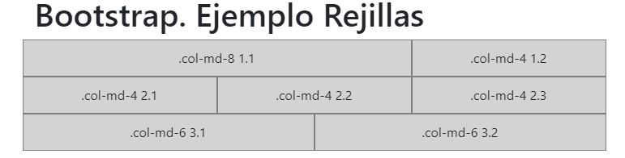

> Para poder visualizar las columnas se ha añadido una clase CSS que establece color para el borde y el fondo de las cajas. Por defecto, ni la etiqueta DIV ni las etiquetas .col-* establecen apariencia (ni color de borde ni de fondo), solamente establecen la anchura, y por lo tanto al renderizar el código anterior tal cual las cajas se verán transparentes.

Dado que las columnas se han especificado únicamente mediante las clases `.col-md-*` esto creará estas divisiones solo para las pantallas medianas y grandes, pero no para los tamaños de pantalla más pequeños. En este último caso las columnas se ampliarán para ocupar todo el ancho y por lo tanto se mostrarán apiladas de la forma:

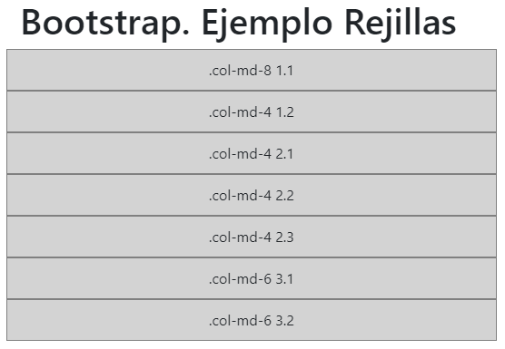

### 3.3.2. Selección de dos tamaños de columna: pequeño y mediano

Si no queremos que las columnas se muestren apiladas para tamaños de pantalla pequeños podemos indicar también la disposición para esos casos mediante las clases .col-* además de las que ya teníamos con .`col-md-*`. Por ejemplo:

```html
<div class="container">
  <h1> Bootstrap. Ejemplo Rejillas</h1>

  <!-- En pantallas pequeñas aparecerá una columna que ocupará todo el ancho
y otra que ocupará la mitad de la pantalla -->
  <div class="row">
    <div class="col-12 col-md-8">.col-12 .col-md-8 1.1</div>
    <div class="col-6 col-md-4">.col-6 .col-md-4 1.2</div>
  </div>

  <!-- En pantallas medianas se indica que cada columna ocupe la mitad
del ancho disponible -->
  <div class="row">
    <div class="col-6 col-md-4">.col-6 .col-md-4 2.1</div>
    <div class="col-6 col-md-4">.col-6 .col-md-4 2.2</div>
    <div class="col-6 col-md-4">.col-6 .col-md-4 2.3</div>
  </div>

  <!-- Como no se indica el tamaño para pantallas grandes las columnas
siempre ocuparán el 50% -->
  <div class="row">
    <div class="col-6">.col-6 3.1</div>
    <div class="col-6">.col-6 3.2</div>
  </div>
</div>
```

> [Ejemplo rejilla BootStrap (Codepen)](https://codepen.io/sergio-rey-personal/pen/vYLjaLr)

En la siguiente imagen se puede ver como quedaría el código de ejemplo para pantallas medianas y grandes (tamaños de md en adelante):

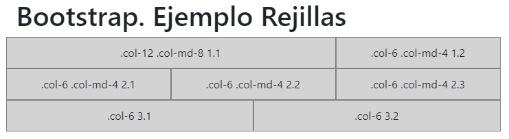

En el caso de pantallas pequeñas las columnas se verían de la forma:

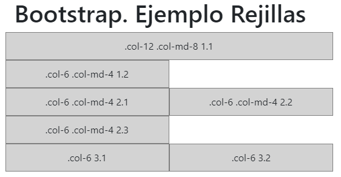

### 3.3.3. Selección de tres tamaños: extra pequeño, pequeño y mediano

Si queremos tener un mayor control podemos especificar también el tamaño de las columnas para las pantallas tipo small con las clases `.col-sm-*`. Por ejemplo:

```html
<div class="container">
  <h1>Bootstrap. Ejemplo Rejillas</h1>

  <div class="row">
    <div class="col-12 col-sm-6 col-md-8">.col-12 .col-sm-6 .col-md-8 1.1</div>
    <div class="col-6 col-md-4">.col-6 .col-md-4 1.2</div>
  </div>
  <div class="row">
    <div class="col-6 col-sm-4">.col-6 .col-sm-4 2.1</div>
    <div class="col-6 col-sm-4">.col-6 .col-sm-4 2.2</div>
    <div class="col-6 col-sm-4">.col-6 .col-sm-4 2.3</div>
  </div>
</div>
```

> [Ejemplo rejilla BootStrap (Codepen)](https://codepen.io/sergio-rey-personal/pen/mdVLjrz)

A continuación se incluye una previsualización de este código de ejemplo para pantallas medianas y grandes (tamaños md, lg y xl):

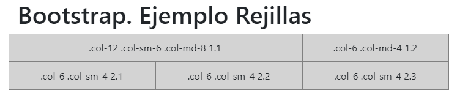

El mismo código pero en pantallas tipo small (tamaño sm) se mostraría como:

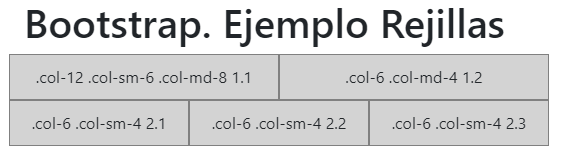

Y en el caso de pantallas pequeñas se vería de la forma:

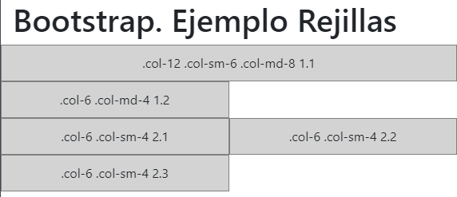

Además de los tres tamaños indicados en este último ejemplo para la primera columna (`.col-12 .col-sm-6 .col-md-8`) podríamos añadir también, si lo necesitamos, el tamaño para pantallas grandes y extra grandes con `col-lg` y `col-xl-`. Por ejemplo, podríamos haber definido la siguiente columna:

```html
<div class="col-12 col-sm-6 col-md-8 col-lg-9 col-xl-10">...</div>
```

En resumen, podemos indicar para cada columna todos los tamaños que queramos de entre los disponibles (con `.col-`, `.col-sm-`, `.col-md-`, `.col-lg-` y `.col-xl-`). Sin embargo, esto solo lo tendremos que hacer cuando necesitemos establecer un ancho de columna distinto para cada tamaño de pantalla. Si para todos los tamaños de pantalla necesitamos el mismo ancho entonces utilizaremos solamente la clase `.col-`. Es decir, no tendría sentido escribir algo como "`col-6 col-sm-6 col-md-6 col-lg-6 col-xl-6`", ya que se conseguiría el mismo efecto que si hubieramos puesto solamente "`col-6`".

Por lo tanto, solo añadiremos más de una clase cuando necesitemos establecer anchos distintos entre esos tamaños, y además si solo vamos a diferenciar entre 2 tamaños solo será necesario usar 2 etiquetas. Por ejemplo si queremos diferenciar solamente entre movil y escritorio solamente tendríamos que añadir la clase `.col-` y la clase `.col-md-`.

## 3.4. Columnas de ancho automático

A partir de la versión 4 de Bootstrap podemos utilizar las columnas de ancho automático, es decir, indicar únicamente el número de columnas que queremos y el sistema calculará automáticamente su anchura. Para esto podremos usar la clase "`.col`", sin número de columnas ni tamaño de pantalla, por ejemplo:

```html
<div class="container">
  <h1>Bootstrap. Ejemplo Rejillas</h1>

  <div class="row">
    <div class="col">1 of 2</div>
    <div class="col">2 of 2</div>
  </div>
  <div class="row">
    <div class="col">1 of 3</div>
    <div class="col">2 of 3</div>
    <div class="col">3 of 3</div>
  </div>
</div>
```

> [Ejemplo rejilla BootStrap (Codepen)](https://codepen.io/sergio-rey-personal/pen/abdGjLV)

Con este código obtendríamos un resultado similar al de la siguiente figura, donde en primer lugar se crea una fila con dos columna de igual ancho, y a continuación se añade una segunda fila con tres columnas de igual ancho.

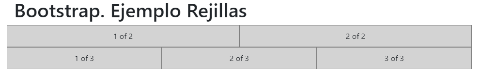

El número de columnas del ejemplo anterior se mantendrá para todos los tamaños de pantalla, adaptando el ancho de las columnas para cada uno de ellos.

A esta clase podemos añadir el sufijo para establecer el tamaño de pantalla, por lo que disponemos de las clases `.col`, `.col-sm`, `.col-md`, `.col-lg`, `.col-xl`. En todos los casos estaremos indicando que queremos una columna de ancho automático desde el tamaño de pantalla indicado en adelante. Debemos de tener en cuenta que si indicamos algo como `<div class="col col-sm col-md">` el resultado que obtendríamos sería el mismo en todos los tamaños, una columna de ancho automático, equivalente a haber indicado únicamente `<div class="col">`. Por lo tanto, el uso de estos sufijos solo se justicará cuando queramos una columna de ancho automático solamente de un tamaño en adelante, y que por lo tanto, para los tamaños inferiores se cree una columna que ocupe todo el ancho. Por ejemplo, veamos el siguiente código:

```html
<div class="row">
  <div class="col-sm">col-sm</div>
  <div class="col-sm">col-sm</div>
  <div class="col-sm">col-sm</div>
</div>
```

Estamos indicando que queremos una fila con tres columnas de ancho automático para los tamaños desde sm en adelante, y por lo tanto, para el tamaño extra pequeño estas tres columnas pasarán a ocupar todo el ancho, transformándose en tres filas completas.

### 3.4.1. Modo mixto

Estas columnas de ancho automático se pueden mezclar en una misma fila con las columnas de ancho específico que hemos visto antes. La forma de calcular el ancho de cada columna será el siguiente: En primer lugar se calculará el tamaño de las columnas de ancho específico y a continuación se rellenará el espacio restante usando las columnas de ancho automático. Por ejemplo, a continuación vamos a definir dos filas mezclando ambos tipos de columnas:

```html
<div class="container">
  <h1>Bootstrap. Ejemplo Rejillas</h1>

  <div class="row">
    <div class="col">1 of 3</div>
    <div class="col-6">2 of 3 (wider)</div>
    <div class="col">3 of 3</div>
  </div>
  <div class="row">
    <div class="col-5">1 of 3 (wider)</div>
    <div class="col">2 of 3</div>
    <div class="col">3 of 3</div>
  </div>
</div>
```
> [Ejemplo rejilla  bootstrap ancho automático mixto (Codepen)](https://codepen.io/sergio-rey-personal/pen/rNxvrdw)

Con lo que obtendríamos un resultado similar al de la siguiente figura:


Como podemos ver en este ejemplo, los sistemas para de definir las columnas **se pueden mezclar como queramos**, por ejemplo usando el de ancho fijo entre dos columnas de ancho automático, o establenciendo una columna de ancho específico al principio y después dos de ancho automático.

### 3.4.2. Ancho de columna variable

Con Bootstrap 4 también se introdujeron las columnas de ancho variable, las cuales ocuparán el ancho justo que se necesite según el contenido de la columna. Para utilizarlas disponemos de las clases "`.col-*-auto`", donde `*` puede ser culquiera de los sufijos de tamaño de pantalla que hemos visto antes `sm`, `md`, `lg`, `xl`, o ningún sufijo (`.col-auto`) para indicar todos los tamaños.

Estas etiquetas, igual que las de ancho automático, se pueden mezclar con las de ancho específico, por ejemplo:

```html
<div class="container">
  <h1>Bootstrap. Ejemplo Rejillas</h1>

  <div class="row justify-content-md-center">
    <div class="col col-lg-2">1 of 3</div>
    <div class="col-md-auto">Variable width content</div>
    <div class="col col-lg-2">3 of 3</div>
  </div>
  <div class="row">
    <div class="col">1 of 3</div>
    <div class="col-md-auto">Variable width content</div>
    <div class="col col-lg-2">3 of 3</div>
  </div>
</div>
```
> [Ejemplo rejilla  bootstrap ancho variable (Codepen)](https://codepen.io/sergio-rey-personal/pen/QWyrBBN)

Con lo que obtendríamos un resultado similar al de la siguiente figura:

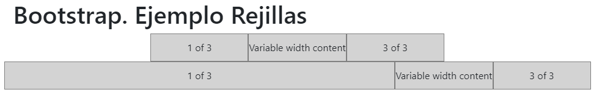

Mientras que si reducimos, tenemos el siguiente resultado:

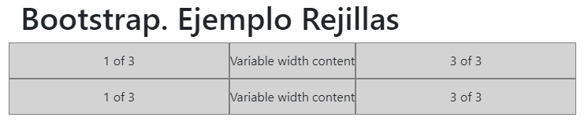

En el código anterior se ha usado la clase "`.justify-content-md-center`" para alinear el contenido dentro de una fila, estas etiquetas las veremos en la sección "Alineación". A continuación vamos a ver otras utilidades del sistema de rejilla, como el anidamiento de columnas, o cómo forzar el cambio de fila.

## 3.5. Forzar cambio de fila

Mediante la clase `.w-100` podemos forzar el cambio de fila cuando nosotros queramos:

```html
<div class="container">
  <h1>Bootstrap. Ejemplo Rejillas</h1>

  <div class="row">
    <div class="col-6 col-sm-3">.col-6 .col-sm-3</div>
    <div class="col-6 col-sm-3">.col-6 .col-sm-3</div>

    <!-- Force next columns to break to new line at md breakpoint and up -->
    <div class="w-100"></div>

    <div class="col-6 col-sm-3">.col-6 .col-sm-3</div>
    <div class="col-6 col-sm-3">.col-6 .col-sm-3</div>
  </div>
</div>
```
> [Ejemplo rejilla bootstrap forzando salto de línea (Codepen)](https://codepen.io/sergio-rey-personal/pen/NWxMBex)

Con lo que obtendríamos dos filas con dos columnas cada una:

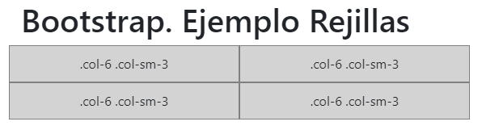

Esta clase también nos puede ser útil para forzar el cambio de fila solo para determinados tamaños de pantalla. Para esto tenemos que combinarla con otras clases de Bootstrap que nos permiten mostrar u ocultar elementos según el tamaño de pantalla. A continuación se incluye un ejemplo:

```html
<!-- Force next columns to break to new line at md breakpoint and up -->
<div class="w-100 d-none d-md-block"></div>
```

Donde la clase "`.d-none`" significa que no se muestre ese elemento (para ningún tamaño), y la clase "`.d-md-block`" indica que se muestre a partir del tamaño de pantalla "`md`" en adelante. Por lo tanto, el campo div marcado con "`w-100`" permanecerá oculto para los tamaños extra pequeño y pequeño, y por lo tanto no se activará el cambio de fila para esos dos tamaños, pero sí para los tamaños desde "`md`" en adelante.

En la sección "Utilidades Responsive" se explicarán las etiquetas "`.d-*`" que nos permirán controlar la visibilidad de cualquier elemento HTML en función del tamaño de pantalla.

## 3.6. Anidamiento de columnas

Una característica muy potente del sistema de rejilla es que se pueden anidar columnas dentro de otras columnas. Para esto solamente tenemos que crear una nueva fila dentro de una columna, y dentro de esta nueva fila podremos subdividirla usando también hasta 12 columnas.

Por ejemplo, en el siguiente código se crea una primera fila con una columna de tamaño 9, dentro de la cual se añade una segunda fila con dos columnas:

```html
<div class="row">
  <div class="col-sm-9">
    Level 1: .col-sm-9
    <div class="row">
      <div class="col-8 col-sm-6">Level 2: .col-8 .col-sm-6</div>
      <div class="col-4 col-sm-6">Level 2: .col-4 .col-sm-6</div>
    </div>
  </div>
</div>
```

Al visualizar este código obtendríamos:

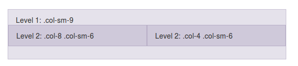

## 3.7. Márgenes o espaciado entre columnas

### 3.7.1. offset
Es posible crear un espaciado entre las columnas o dicho de otra forma, mover o desplazar una columna hacia la derecha, añadiendo un offset inicial mediante las clases: ``.offset-*``. Por ejemplo ``.offset-4`` creará un espacio a la izquierda de la columna de tamaño 4 (como si se creara una columna oculta de tipo ``.col-4``). En el siguiente código podemos ver un ejemplo más completo:

```html
<div class="row">
  <div class="col-md-4">.col-md-4</div>
  <div class="col-md-4 offset-md-4">.col-md-4 .offset-md-4</div>
</div>
<div class="row">
  <div class="col-md-3 offset-md-3">.col-md-3 .offset-md-3</div>
  <div class="col-md-3 offset-md-3">.col-md-3 .offset-md-3</div>
</div>
<div class="row">
  <div class="col-md-6 offset-md-3">.col-md-6 .offset-md-3</div>
</div>
```
> [Ejemplo rejilla bootstrap con offsets (Codepen)](https://codepen.io/sergio-rey-personal/pen/JjGvepp)

Al visualizar este código obtendríamos:

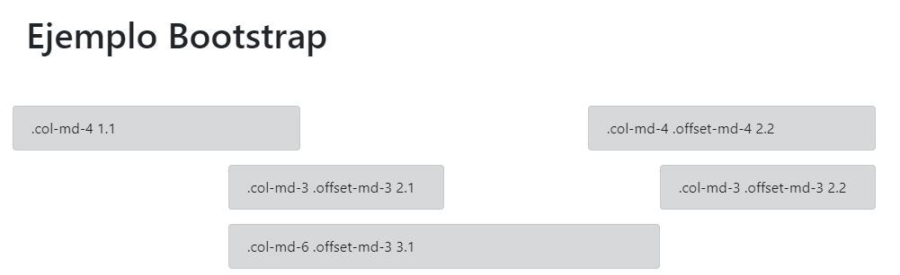

Como se puede ver en el ejemplo anterior, también podemos especificar el offset según el tamaño de pantalla. Si usamos, por ejemplo, la clase "`offset-4`" estaremos indicando que se cree un espacio de 4 para todos los tamaños de pantalla; mientras que con "`offset-md-4`" se creará este espacio a partir del tamaño de pantalla "md" en adelante.

Si en algún caso necesitamos eliminar el offset podemos utilizar el tamaño cero (0). Por ejemplo, si especificamos un offset de 2 para tamaños pequeños y no queremos que dicho offset se aplique para pantallas medianas ni grandes tendríamos que hacer:

```html
  <div class="col-sm-5 offset-sm-2 col-md-7 offset-md-0">...</div>
  ```

  ### 3.7.2. Márgenes

Además de la clase offset también disponemos de las clases para crear márgenes de espacio variable tanto al lado izquierdo (con "`.ml-auto`") como al lado derecho (con `.mr-auto`) de una columna. 

Para establecer los márgenes entre las columnas usaremos la claes `m{lado}-{tamaño}` o si queremos distinguir según los distintos tamaños de pantalla:

- `m{lado}-sm-{tamaño}` Para pantallas entre 576px y 768px.
- `m{lado}-md-{tamaño}` Para pantallas entre 768px y 992px.
- `m{lado}-lg-{tamaño}` Para pantallas entre 992px y 1200px.
- `m{lado}-xl-{tamaño}` Para pantallas de más de 1200px.

Pudiendo ser ***lado***:
- `t` para margen superior (top).
- `b` para margen inferior (bottom).
- `l` para margen izquierdo (left).
- `r` para margen derecho (right).
- `y` para los márgenes superior e inferior.
- x` para los márgenes izquierdo y derecho.
- ***En blanco*** si es para todos los lados.

Y pudiendo ser ***tamaño***:
- `0` : No hay margen
- `1` : 0.25rem
- `2` : 0.25rem
- `3` : 1rem
- `4` : 1.25rem
- `5` : 3rem
- `auto` : Para clases que establecen una margen auto

A continuación se incluye un ejemplo:

```html
<div class="row">
  <div class="col-md-4">.col-md-4</div>
  <div class="col-md-4 ml-auto">.col-md-4 .ml-auto</div>
</div>
<div class="row">
  <div class="col-md-3 ml-md-auto">.col-md-3 .ml-md-auto</div>
  <div class="col-md-3 ml-md-auto">.col-md-3 .ml-md-auto</div>
</div>
<div class="row">
  <div class="col-auto mr-auto">.col-auto .mr-auto</div>
  <div class="col-auto">.col-auto</div>
</div>
```
> [Ejemplo rejilla bootstrap con offsets (Codepen)](https://codepen.io/sergio-rey-personal/pen/YzwLdPb)

Al visualizar este código obtendríamos:

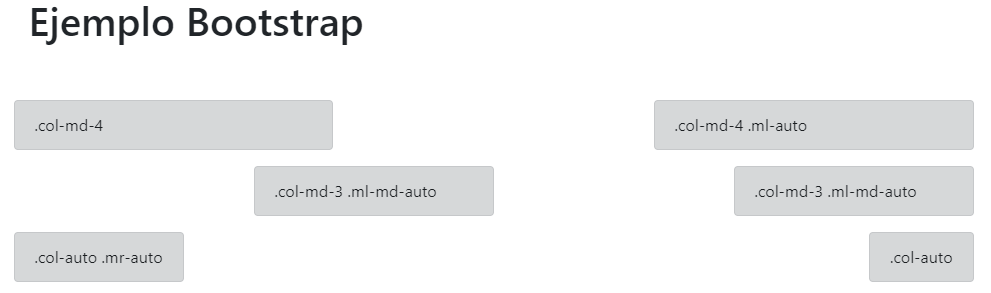

Como se puede ver, en la primera fila se crea un marge automático por la izquierda (y para todos los tamaños) de la segunda columna, lo que provoca el desplazamiento de esta hasta alinearla a la derecha. En la segunda fila se añade margen por la izquierda a las dos columnas para tamaños de pantalla de "`md`" en adelante. Y en la última fila se crea un margen automático por la derecha de la primera columna (para todos los tamaños), esto provoca un efecto similar al obtenido en la primera fila.

## 3.8. Ordenación de columnas 

También podemos modificar el orden visual de las columnas mediante la clase `.order-`. Esta clase permite indicar la posición a la cual queremos desplazar la columna (del 1 al 12, por ejemplo `.order-1`, `.order-2`, etc.). También podemos especificar el tamaño de pantalla para el que queremos que se aplique (por ejemplo `.order-md-12`). A continuación se incluye un ejemplo:

```html
<div class="container">
  <div class="row">
    <div class="col">First, but unordered</div>
    <div class="col order-12">Second, but last</div>
    <div class="col order-1">Third, but first</div>    <!-- ¡¡CUIDADO!! -->
  </div>
</div>
```

> [Ejemplo rejilla bootstrap alternando orden de columnas (Codepen)](https://codepen.io/sergio-rey-personal/pen/RwryEpN)

Obteniendo como resultado:

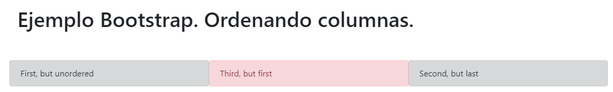

Si nos fijamos en el resultado obtenido podemos ver que no se obtiene el resultado esperado, la tercera columna (en color rojo) aparece en la segunda posición en lugar de en la primera como se había indicado con "`order-1`". Esto es debido a un pequeño error al cambiar el orden de derecha izquierda. En los casos en los que simplemente queramos mover una columna hacia la derecha no se producirá este error, pero si queremos mover hacia la izquierda será necesario que establezcamos el order de todas las columnas. Por lo tanto, para que funcione correctamente el ejemplo anterior tendríamos que escribir el siguiente código:

```html
<div class="container">
  <div class="row">
    <div class="col order-2">First, but unordered</div>   <!-- Añadimos el orden de esta columna -->
    <div class="col order-12">Second, but last</div>
    <div class="col order-1">Third, but first</div>
  </div>
</div>
```

Obteniendo ahora sí el resultado esperado:

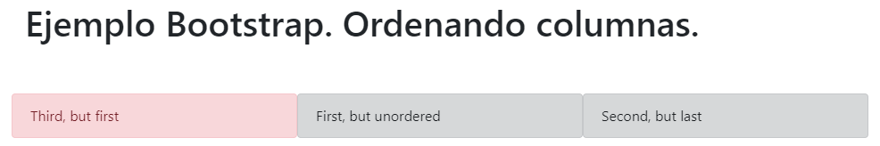

Como se puede ver también en este ejemplo, no es necesario que los números de columna para la ordenación sean consecutivos, simplemente se ordenarán de mayor a menor.

Hay que tener cuidado con estas clases si hay un salto de línea dentro de una misma fila (debido a que el número de columnas ocupe más de 12), ya que en estos casos el orden no funcionarán correctamente.

También disponemos de la clase "`.order-first`", la cual nos permitirá situar cualquier elemento en primer lugar. Además, esta clase sí que funciona aunque haya un salto de línea.

## 3.9. Alineación

Con la nueva versión de Bootstrap también han aparecido nuevas clases que nos permiten especificar la alineación de las columnas tanto en horizontal como en vertical.

### 3.9.1. Alineación vertical

Para indicar la alineación en vertical tenemos dos opciones: indicar la misma alineación para todos los elementos de una fila o indicar la alineación a nivel de columna, lo que nos permitirá establecer distintas alineaciones para cada columna.

En el primer caso la clase CSS para la alineación la tendremos que añadir a la fila usando la etiqueta "`.align-items-*`", donde "`*`" podrá ser "`start`" (al principio o pegada a la parte superior de la fila), "`center`" (alineación centrada en vertical) o "`end`" (alineación pegada al final o a la parte inferior de la fila). A continuación se incluye un ejemplo de los tres tipos de alineación:

```html
<div class="container">
  <div class="row align-items-start">
    <div class="col">One of three columns</div>
    <div class="col">One of three columns</div>
    <div class="col">One of three columns</div>
  </div>
  <div class="row align-items-center">
    <div class="col">One of three columns</div>
    <div class="col">One of three columns</div>
    <div class="col">One of three columns</div>
  </div>
  <div class="row align-items-end">
    <div class="col">One of three columns</div>
    <div class="col">One of three columns</div>
    <div class="col">One of three columns</div>
  </div>
</div>
```

> [Ejemplo de alinación de elementos en vertial (Codepen)](https://codepen.io/sergio-rey-personal/pen/ZEQoVoj)

y el resultado sería: 

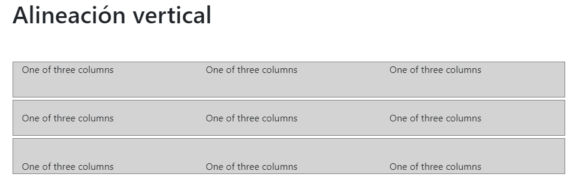


En el segundo caso, si queremos indicar por separado la alineación vertical de cada una de las columnas de una fila, tendremos que usar la clase CSS `.align-self-*`, donde "`*`" podrá adoptar los mismos valores: `start`, `center` o `end`. A continuación se incluye un ejemplo en el que se indican los tres tipos de alineaciones dentro de una misma fila:

```html
<div class="container">
  <div class="row">
    <div class="col align-self-start">One of three columns</div>
    <div class="col align-self-center">One of three columns</div>
    <div class="col align-self-end">One of three columns</div>
  </div>
</div>
```

Con lo que el resultado es el siguiente:

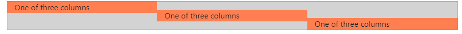

> Es importante destacar que al utilizar cualquierda de estas etiquetas de alineación, la altura de las columnas **se ajustará al contenido**, mientras que si no utilizamos ninguna etiqueta de alineación, la altura de la celda se **extenderá hasta ocupar todo el espacio disponible** en la fila.

### 3.9.2. Alineación horizontal

También podemos especificar la alineación horizontal de los elementos de una fila. Para esto disponemos de la clase "`.justify-content-*`", donde "`*`" podrá ser "`start`" (izquierda), "`center`" (centrado), "`end`" (derecha), "`around`" (añadirá el mismo espacio a ambos lados de la columna) y "`between`" (añade espacio entre las columnas). 

A continuación se incluye un ejemplo de cada uno de estos tipos de alineación horizontal:

```html
<div class="container">
  <div class="row justify-content-start">
    <div class="col-4">One of two columns</div>
    <div class="col-4">One of two columns</div>
  </div>
  <div class="row justify-content-center">
    <div class="col-4">One of two columns</div>
    <div class="col-4">One of two columns</div>
  </div>
  <div class="row justify-content-end">
    <div class="col-4">One of two columns</div>
    <div class="col-4">One of two columns</div>
  </div>
  <div class="row justify-content-around">
    <div class="col-4">One of two columns</div>
    <div class="col-4">One of two columns</div>
  </div>
  <div class="row justify-content-between">
    <div class="col-4">One of two columns</div>
    <div class="col-4">One of two columns</div>
  </div>
</div>
```
> [Ejemplo de alineación horizontal de contenidos con bootstrap](https://codepen.io/sergio-rey-personal/pen/OJMZdPx)

Con lo que obtendríamos un resultado similar al de la siguiente figura, con la fila alineada a la izquerda, la segunda centrada, la tercera alineada a la derecha, la cuarta con el espaciado "al rededor" (o a ambos lados) de las columnas, y la última con el espaciado entre las columnas.

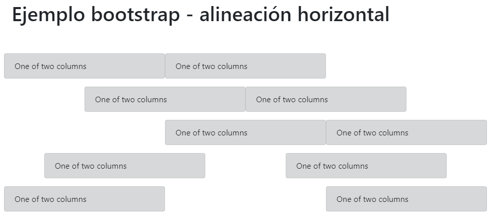

### 3.9.3. Alineación responsive

En caso de que lo necesitemos podremos añadir también el tamaño de pantalla a las distintas clases de alineación que hemos visto: `align-items-*`, `align-self-*` y `justify-content-*`. Para esto tendremos que añadir primero el tamaño de pantalla (`sm`, `md`, `lg` o `xl`), a continuación un guión (`-`), y después el tipo de alineación deseado (de entre los que hemos visto), por ejemplo: `align-items-md-center`, `align-self-sm-end`, `justify-content-lg-end`, etc.

Al indicar el tamaño de pantalla dicha alineación se aplicará solamente a partir de dicho tamaño en adelante, aunque también podemos indicar distintas alineaciones para un mismo campo según el tamaño de la pantalla, por ejemplo:

```html
<div class="row justify-content-center justify-content-md-start">
     ...
</div>
```

En el ejemplo anterior el contenido se alinearía de forma centrada para los tamaños de pantalla extra pequeños y pequeños, y cambiará a alineazión izquierda a partir del tamaño de pantalla "`md`".
