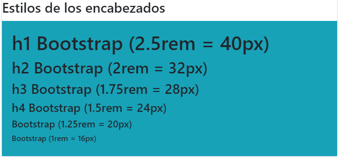

# **Texto, tipografía y colores en Bootstrap 4**

Tabla de contenidos

- [4. Texto, tipografía y colores en Bootstrap 4](#4-Texto-tipografía-y-colores-en-Bootstrap-4)
  - [4.1. Configuración predeterminada de Bootstrap 4](#41-Configuración-predeterminada-de-Bootstrap-4)
  - [4.2. Estilos de los encabezados `<h1>` -- `<h6>`](#42-Estilos-de-los-encabezados-h1-h6)
  - [4.3. Clase display-x](#43-Clase-display-x)
  - [4.4. Clases h1, h2, h3...](#44-Clases-h1-h2-h3)
  - [4.5. Etiqueta `<small>`](#45-Etiqueta-small)
  - [4.6. Etiqueta `<mark>`](#46-Etiqueta-mark)
  - [4.7. Etiqueta `<abbr>`](#47-Etiqueta-abbr)
  - [4.8. Etiqueta `<blockquote>`](#48-Etiqueta-ltblockquotegt)
  - [4.9. Más clases para tipografías](#49-Más-clases-para-tipografías)
  - [4.10. Etiquetas HTML y su estilo predefinido](#410-Etiquetas-HTML-y-su-estilo-predefinido)
  - [4.11. Colores de texto y fondo](#411-Colores-de-texto-y-fondo)
    - [4.11.1. Colores de texto](#4111-Colores-de-texto)
    - [4.11.2. Colores de fondo](#4112-Colores-de-fondo)


# 4. Texto, tipografía y colores en Bootstrap 4

## 4.1. Configuración predeterminada de Bootstrap 4

Consideraciones a tener en cuenta sobre los estilos de los textos:

- Bootstrap 4 define por defecto un **`font-size de 16px`** y un **`line-height de 1.5 rem`**.
- Dispone de una **`font-family`** predeterminada de tipo "**`Helvetica Neue", Helvetica, Arial, sans-serif.`**
- Además, las etiquetas **`<p>`** tienen **`margin-top: 0 y margin-bottom: 1rem`** (16px por defecto).

> Si el `font-size` se define con 16px, 1rem sería igual a 16px en cualquier parte del documento.

## 4.2. Estilos de los encabezados `<h1>` -- `<h6>`

Los encabezados `<h1>` -- `<h6>` disponen de estilos predefinidos:

- h1 Bootstrap (2.5rem = 40px)
- h2 Bootstrap (2rem = 32px)
- h3 Bootstrap (1.75rem = 28px)
- h4 Bootstrap (1.5rem = 24px)
- h5 Bootstrap (1.25rem = 20px)
- h6 Bootstrap (1rem = 16px)

```html
<h1>h1 Bootstrap (2.5rem = 40px)</h1>
<h2>h2 Bootstrap (2rem = 32px)</h2>
<h3>h3 Bootstrap (1.75rem = 28px)</h3>
<h4>h4 Bootstrap (1.5rem = 24px)</h4>
<h5>h5 Bootstrap (1.25rem = 20px)</h5>
<h6>h6 Bootstrap (1rem = 16px)</h6>
```



> [Textos, tipografías y colores (codepen)](https://codepen.io/sergio-rey-personal/pen/LYGrppj)

> [Cuando trabajamos con Bootstrap lo ideal es utilizar sus propias clases y recursos, en lugar de duplicar estilos o crear nuevos.](https://www.w3schools.com/cssref/css_colors.asp)

## 4.3. Clase display-x

Bootstrap nos ofrece **diferentes clases para crear encabezados de mayor tamaño**. Hay cuatro clases:

`.display-1` , `.display-2` , `.display-3` , `.display-4`

Ejemplo:

```html
<h1 class="display-1">display-1</h1>
<h1 class="display-2">display-2</h1>
<h1 class="display-3">display-3</h1>
<h1 class="display-4">display-4</h1>
<h1 class="display-5">display-5</h1>
```


## 4.4. Clases h1, h2, h3...

Bootstrap nos ofrece **diferentes clases para crear encabezados con los mismos estilos que otros encabezados h1, h2, h3...**

.**h1 , .h2 , .h3 , .h4...**

Ejemplo:

```html
<h1 class="h2">Encabezado h1 con estilo h2</h1>
<h1 class="h3">Encabezado h1 con estilo h3</h1>
<h1 class="h4">Encabezado h1 con estilo h4</h1>
<h1 class="h5">Encabezado h1 con estilo h5</h1>
```


## 4.5. Etiqueta `<small>`

Gracias a la etiqueta **`<small>`** podemos **crear un texto secundario más claro** en cualquier encabezado:

Ejemplo:

```html
<h1>h1 Encabezado <small>texto secundario</small></h1>
```


## 4.6. Etiqueta `<mark>`

La etiqueta **`<mark>`** es representada con un color de **fondo amarillo** y algo de relleno:

Ejemplo:

```html
<p>Párrafo con <mark>etiqueta de marcado</mark> en un texto.</p>
```


## 4.7. Etiqueta `<abbr>`

La etiqueta **`<abbr>`** es representada mediante un **borde inferior punteado**:

Ejemplo:

```html
<p>Esto es una etiqueta <abbr title="La etiqueta abbr se representa con un borde inferior punteado">abbr</abbr> en Bootstrap.</p>
```


## 4.8. Etiqueta `<blockquote>`

Agregando la **clase .blockquote** a `<blockquote>` obtenemos un estilo personalizado.

Ejemplo:

```html
<blockquote class="blockquote">
  <p>Un buen desarrollador de software trabaja con disciplina y constancia desde el primer día.</p>
  <footer class="blockquote-footer">Omar Bradley</footer>
</blockquote>
```


## 4.9. Más clases para tipografías

Las siguientes clases de Bootstrap 4 se pueden agregar a los elementos HTML de estilo:

- **`.font-weight-bold`** Negrita
- **`.font-weight-normal`** Normal
- **`.font-weight-light`** Fina
- **`.font-italic`** Italica
- **`.lead`** Destaca un párrafo
- **`.small`** Más pequeño (85% del tamaño del padre)
- **`.text-left`** Alineado izquierda
- **`.text-center`** Alineado centro
- **`.text-right`** Alineado derecha
- **`.text-justify`** Justificado
- **`.text-nowrap`** Texto nowrap
- **`.text-lowercase`** Texto en minúsculas
- **`.text-uppercase`** Texto en mayúsculas.text-capitalize Texto capitalizado
- **`.initialism`** Muestra el texto en un elemento <abbr> con tamaño más pequeño
- **`.list-unstyled`** Quita el list-style y margin-left en elementos de lista (funciona en `<ul>` y `<ol>` ). 
- **`.list-inline`** Coloca todos los elementos de una lista en una única línea.


## 4.10. Etiquetas HTML y su estilo predefinido

Casi todas las etiquetas HTML5 tienen su estilo predefinido en Bootstrap. Puedes hacer la prueba incluyendo algunas de las etiquetas de [contenido](https://github.com/Sergio-Rey-Personal/DIW/blob/master/UD03_Disenyo_y_maquetacion_web_con_HTML5_y_CSS3/UD03_03_EtiquetasHTMLDeContenidoyTexto.md), [formularios](https://github.com/Sergio-Rey-Personal/DIW/blob/master/UD03_Disenyo_y_maquetacion_web_con_HTML5_y_CSS3/UD03_04_EtiquetasParaCreacionFormulariosHTML.md) o [tablas](https://github.com/Sergio-Rey-Personal/DIW/blob/master/UD03_Disenyo_y_maquetacion_web_con_HTML5_y_CSS3/UD03_05_EtiquetasHTMLParaCrearTablas.md) y viendo su resultado.

## 4.11. Colores de texto y fondo

[Bootstrap también tiene unos colores predefinidos](https://getbootstrap.com/docs/4.4/utilities/colors/) que hacen que los diseños sean homogéneos en cuanto al color 

### 4.11.1. Colores de texto

Las clases para los colores del texto son: **`.text-primary`, `.text-secondary`, `.text-muted`, `.text-success`, `.text-danger`, `.text-warning`, `.text-info`, `.text-white`, `.text-dark` y `.text-light`.**

#### Ejemplo

```html
<p class="text-primary">.text-primary</p>
<p class="text-secondary">.text-secondary</p>
<p class="text-success">.text-success</p>
<p class="text-danger">.text-danger</p>
<p class="text-warning">.text-warning</p>
<p class="text-info">.text-info</p>
<p class="text-light bg-dark">.text-light</p>
<p class="text-dark">.text-dark</p>
<p class="text-body">.text-body</p>
<p class="text-muted">.text-muted</p>
<p class="text-white bg-dark">.text-white</p>
<p class="text-black-50">.text-black-50</p>
<p class="text-white-50 bg-dark">.text-white-50</p>
```


Las clases anteriores también se pueden usar en enlaces y tendrán un color más oscuro al hacer `:hover` con el ratón.

#### Ejemplo

```html
<p><a href="#" class="text-primary">Primary link</a></p>
<p><a href="#" class="text-secondary">Secondary link</a></p>
<p><a href="#" class="text-success">Success link</a></p>
<p><a href="#" class="text-danger">Danger link</a></p>
<p><a href="#" class="text-warning">Warning link</a></p>
<p><a href="#" class="text-info">Info link</a></p>
<p><a href="#" class="text-light bg-dark">Light link</a></p>
<p><a href="#" class="text-dark">Dark link</a></p>
<p><a href="#" class="text-muted">Muted link</a></p>
<p><a href="#" class="text-white bg-dark">White link</a></p>
```


### 11.2. Colores de fondo

Las clases de colores de fondo son: **`.bg-primary` , `.bg-success` , `.bg-info` , `.bg-warning` , `.bg-danger` , `.bg-secondary` , `.bg-dark` y `.bg-light` .**

Cuando utilizamos los colores de fondo es muy usual combinarlo junto con las clases de los colores de texto para configurar un buen contraste entre ellos.

```html
<div class="p-3 mb-2 bg-primary text-white">.bg-primary</div>
<div class="p-3 mb-2 bg-secondary text-white">.bg-secondary</div>
<div class="p-3 mb-2 bg-success text-white">.bg-success</div>
<div class="p-3 mb-2 bg-danger text-white">.bg-danger</div>
<div class="p-3 mb-2 bg-warning text-dark">.bg-warning</div>
<div class="p-3 mb-2 bg-info text-white">.bg-info</div>
<div class="p-3 mb-2 bg-light text-dark">.bg-light</div>
<div class="p-3 mb-2 bg-dark text-white">.bg-dark</div>
<div class="p-3 mb-2 bg-white text-dark">.bg-white</div>
<div class="p-3 mb-2 bg-transparent text-dark">.bg-transparent</div>
```

