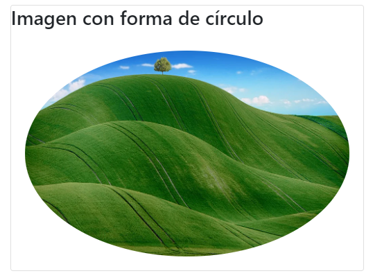

# 5. **Imágenes y figuras en Bootstrap 4**

Tabla de contenido

- [5. **Imágenes y figuras en Bootstrap 4**](#5-imágenes-y-figuras-en-bootstrap-4)
  - [5.1. Imágenes](#51-imágenes)
    - [5.1.1. Imagen responsive](#511-imagen-responsive)
  - [5.1.2. Imagen con esquinas redondeadas](#512-imagen-con-esquinas-redondeadas)
  - [5.1.3. Imagen con forma de círculo](#513-imagen-con-forma-de-círculo)
  - [5.1.4. Imagen tipo miniatura](#514-imagen-tipo-miniatura)
    - [5.1.5. Alineación de imágenes](#515-alineación-de-imágenes)
  - [5.2. Figuras](#52-figuras)

Para aquellos que no tengan claro la diferencia entre imágenes y figuras podemos resumirlo de la siguiente manera:

- Una **imagen** es únicamente el elemento gráfico el cual hemos añadido mediante las etiquetas `img` o `picture`.

```html

````

- Una **figura** (etiqueta `figure`) es un conjunto compuesto de una imagen (etiqueta `img`) y de un texto descriptivo sobre la imagen (etiqueta `caption`). Esta etiqueta es una de las novedades en HTML5.Tradicionalmente es lo que se usa en libros para hacer posteriormente un índice de figuras.

```html
<figure>
  
  <figcaption>Texto descriptivo de la imagen</figcation>
</figure>
```

BootStrap 4, por supuesto, nos proporciona una serie de clases para tratar y dar estilos a este tipo de contenidos.

**Ejemplos**

> [Ejemplos de uso de imágenes y figuras (Codesite)](https://codepen.io/sergio-rey-personal/pen/YzwvqLV?editors=1010)

## 5.1. Imágenes

En relación a las imágenes las clases de interés son:

### 5.1.1. Imagen responsive

Bootstrap 4 nos ofrece la clase **`.img-fluid`** para que las imágenes se adapten correctamente a los distintos dispositivos.

Ejemplo:

```html

```


## 5.1.2. Imagen con esquinas redondeadas

La clase **`.rounded`** agrega esquinas redondeadas a una imagen:

Ejemplo:

```html

```


## 5.1.3. Imagen con forma de círculo

La clase **`.rounded-circle`** da forma de círculo a la imagen:

Ejemplo:

```html

```



## 5.1.4. Imagen tipo miniatura

La clase **`.img-thumbnail`** da forma de miniatura a la imagen. Añadir un marco redondeado a la imagen. Para esto podríamos también usar las clases relativas a bordes:

Ejemplo:

```html

```


### 5.1.5. Alineación de imágenes

Desplace una imagen hacia la derecha con la clase **`.float-right`** o hacia la izquierda con .**`float-left`**:

Ejemplo:

```html


```


## 5.2. Figuras

En relación a las figuras las clases de interés para dar estilos con BootStrap 4 son:

- `figure` : Clase a añadir a la etiqueta figure.
- `figure-img` : Clase a añadir a la etiqueta img que contiene la figura.
- `figure-caption` : Clase añadir a la etiqueta figcation que contiene la figura. El texto se podrá adicionalmente alinear de distintas maneras usando text-justify, text-left, text-right o text-center.

> IMPORTANTE : Si queremos que esto siga siendo responsivo debemos añadir `.img-fluid` a la imagen de la figura.

```html
<figure class="figure">
  
  <figcaption class="figure-caption text-right">A caption for the above image.</figcaption>
</figure>
```

