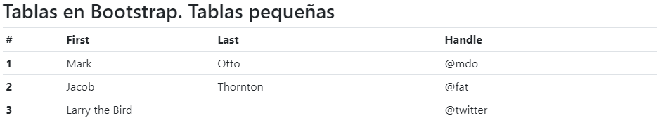

# 6. **Tablas en Bootstrap 4**

Tabla de contenidos

- [6. **Tablas en Bootstrap 4**](#6-tablas-en-bootstrap-4)
  - [6.1. Definición de tablas en Bootstrap](#61-definición-de-tablas-en-bootstrap)
  - [6.2. Tablas pequeñas](#62-tablas-pequeñas)
  - [6.3. Colores alternos](#63-colores-alternos)
  - [6.4. Tablas con bordes](#64-tablas-con-bordes)
  - [6.5. Clases contextuales para colores en tablas](#65-clases-contextuales-para-colores-en-tablas)
  - [6.6. Tablas Responsive](#66-tablas-responsive)

En este punto veremos el uso de clases para tablas en bootstrap

> [Bootstrap. Tablas (Codepen)](https://codepen.io/sergio-rey-personal/pen/bGEKePV?editors=1000)

## 6.1. Definición de tablas en Bootstrap

Bootstrap también define una serie de clases para aplicar estilos sobre las tablas de HTML. La más básica es la clase `.table`:

```html
<table class="table">
  ...
</table>
```

Veamos un ejemplo de definición de tabla:

```html
<table class="table">
  <thead>
    <tr>
      <th scope="col">#</th>
      <th scope="col">First</th>
      <th scope="col">Last</th>
      <th scope="col">Handle</th>
    </tr>
  </thead>
  <tbody>
    <tr>
      <th scope="row">1</th>
      <td>Mark</td>
      <td>Otto</td>
      <td>@mdo</td>
    </tr>
    <tr>
      <th scope="row">2</th>
      <td>Jacob</td>
      <td>Thornton</td>
      <td>@fat</td>
    </tr>
    <tr>
      <th scope="row">3</th>
      <td>Larry</td>
      <td>the Bird</td>
      <td>@twitter</td>
    </tr>
  </tbody>
</table>
```

La cual configura los estilos de las tablas básicas de HTML para que adopten el siguiente aspecto:


## 6.2. Tablas pequeñas

Si queremos compactar el tamaño de la tabla para que deje un padding (o espaciado interior) inferior, podemos aplicar la clase `.table-sm` de la forma:

```html
<table class="table table-sm">
  <thead>
    <tr>
      <th scope="col">#</th>
      <th scope="col">First</th>
      <th scope="col">Last</th>
      <th scope="col">Handle</th>
    </tr>
  </thead>
  <tbody>
    <tr>
      <th scope="row">1</th>
      <td>Mark</td>
      <td>Otto</td>
      <td>@mdo</td>
    </tr>
    <tr>
      <th scope="row">2</th>
      <td>Jacob</td>
      <td>Thornton</td>
      <td>@fat</td>
    </tr>
    <tr>
      <th scope="row">3</th>
      <td colspan="2">Larry the Bird</td>
      <td>@twitter</td>
    </tr>
  </tbody>
</table>
```


## 6.3. Colores alternos

Si además aplicamos la clase `.table-striped` a nuestra tabla conseguiremos que las filas presenten colores alternos:

```html
<table class="table table-striped">
  <thead>
    <tr>
      <th scope="col">#</th>
      <th scope="col">First</th>
      <th scope="col">Last</th>
      <th scope="col">Handle</th>
    </tr>
  </thead>
  <tbody>
    <tr>
      <th scope="row">1</th>
      <td>Mark</td>
      <td>Otto</td>
      <td>@mdo</td>
    </tr>
    <tr>
      <th scope="row">2</th>
      <td>Jacob</td>
      <td>Thornton</td>
      <td>@fat</td>
    </tr>
    <tr>
      <th scope="row">3</th>
      <td>Larry</td>
      <td>the Bird</td>
      <td>@twitter</td>
    </tr>
  </tbody>
</table>
```


## 6.4. Tablas con bordes

También podemos dibujar un borde al rededor de la tabla añadiendo la clase `.table-bordered`, de la forma:

```html
<table class="table table-bordered">
  <thead>
    <tr>
      <th scope="col">#</th>
      <th scope="col">First</th>
      <th scope="col">Last</th>
      <th scope="col">Handle</th>
    </tr>
  </thead>
  <tbody>
    <tr>
      <th scope="row">1</th>
      <td>Mark</td>
      <td>Otto</td>
      <td>@mdo</td>
    </tr>
    <tr>
      <th scope="row">2</th>
      <td>Jacob</td>
      <td>Thornton</td>
      <td>@fat</td>
    </tr>
    <tr>
      <th scope="row">3</th>
      <td colspan="2">Larry the Bird</td>
      <td>@twitter</td>
    </tr>
  </tbody>
</table>
```


## 6.5. Clases contextuales para colores en tablas

Podemos utilizar clases contextuales para poder dar color a filas o a celdas individuales;

- `table-active`
- `table-primary`
- `table-secondary`
- `table-success`
- `table-danger`
- `table-warning`
- `table-info`
- `table-light`
- `table-dark`

Ejemplo: 

```html
  <table class="table table-bordered">
    <thead class="thead-dark">
      <tr>
        <th colspan="9">thead-dark o thead-light</th>
      </tr>
    </thead>
    <tbody>
      <tr class="table-active">
        <td colspan="9">table-active</td>
      </tr>
      <tr class="table-primary">
        <td colspan="9">table-primary</td>
      </tr>
      <tr class="table-secondary">
        <td colspan="9">table-secondary</td< /tr>
      <tr class="table-success">
        <td colspan="9">table-success</td< /tr>
      <tr class="table-danger">
        <td colspan="9">table-danger</td< /tr>
      <tr class="table-warning">
        <td colspan="9">table-warning</td< /tr>
      <tr class="table-info">
        <td colspan="9">table-info</td< /tr>
      <tr class="table-light">
        <td colspan="9">table-light</td< /tr>
      <tr class="table-dark">
        <td colspan="9">table-dark</td< /tr>

          <!-- On cells (`td` or `th`) -->
      <tr>
        <td class="table-active">active</td>

        <td class="table-primary">primary</td>
        <td class="table-secondary">secondary</td>
        <td class="table-success">success.</td>
        <td class="table-danger">danger</td>
        <td class="table-">warning</td>
        <td class="table-info">info</td>
        <td class="table-light">light</td>
        <td class="table-dark">dark</td>
      </tr>
    </tbody>
  </table>

```


## 6.6. Tablas Responsive

Bootstrap proporciona una forma de crear tablas responsive que se basa en crear un ***scroll horizontal*** para que se vean correctamente. Para que esto funcione simplemente tenemos que añadir la etiqueta `.table-responsive` a la propia tabla:

```html
<div class="table-responsive">
  <table class="table table-striped table-hover table-bordered">
    <caption class="text-center">
      Horario de Clase
    </caption>
    <thead class="thead-dark">
      <tr>
        <th>Hora</th>
        <th>Lunes</th>
        <th>Martes</th>
        <th>Miércoles</th>
        <th>Jueves</th>
        <th>Viernes</th>
      </tr>
    </thead>
    <tbody>
      <tr>
        <td>8:15</td><td>Matemáticas</td><td>Lengua</td><td>Física</td><td>Ciencias</td><td>Matemáticas</td>
      </tr>
      <tr>
        <td>9:15</td><td>Informática</td><td>Ciencias</td><td>Inglés</td><td>Lengua</td><td>Matemáticas</td>
      </tr>
      <tr>
        <td>10:15</td><td>Inglés</td><td>Lengua</td><td>Física</td><td>Matemáticas</td><td>Ciencias</td>
      </tr>
      <tr>
        <td>11:15</td><td colspan="5"><h1 class="text-center">RECREO</h1></td>
      </tr>
      <tr>
        <td>11:45</td><td>Matemáticas</td><td>Lengua</td><td>Física</td><td>Ciencias</td><td>Matemáticas</td>
      </tr>
      <tr>
        <td>12:45</td><td>Inglés</td><td>Lengua</td><td>Física</td><td>Matemáticas</td><td>Ciencias</td>
      </tr>
      <tr>
        <td>13:45</td><td>Informática</td><td>Ciencias</td><td>Inglés</td><td>Lengua</td><td>Matemáticas</td>
      </tr>
    </tbody>
  </table>
</div>
```

Teniendo el resultado inicial 


y cuando el tamaño hace que la tabla sea responsive, aparece el scroll horizontal.


> Puedes ver más información sobre diseños de tablas con bootstrap en la web de [w3school](https://www.w3schools.com/bootstrap4/bootstrap_tables.asp)