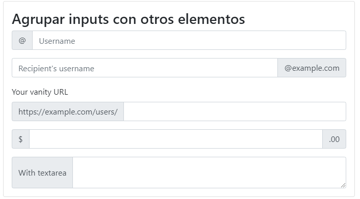

# 7. **Formularios**

Tabla de contenidos

- [7. **Formularios**](#7-formularios)
  - [7.1. Formularios responsive. `form-group` y `form-control`](#71-formularios-responsive-form-group-y-form-control)
  - [7.2. Formulario inline](#72-formulario-inline)
  - [7.3. Formulario horizontal](#73-formulario-horizontal)
  - [7.4. Estados de validación de un formulario](#74-estados-de-validación-de-un-formulario)
  - [7.5. Agrupar inputs con otros elementos](#75-agrupar-inputs-con-otros-elementos)

Aunque en la documentación oficial los formularios se encuentran en la sección de componentes lo cierto es que son un elemento fundamental que se incluye en páginas de registro, de consulta, de búsqueda etc. Por esa razón se ha decidido tratarlos de manera breve en este punto.

BootStrap proporciona una serie de clases para dar estilos a los distintos elementos de los formularios. De manera general podemos describir estas clases y la jerarquía que deben ocupar de la siguiente manera:


Además, se le añadirá al final un input de tipo submit o button con las clases correspondientes a los botones cuyos ejemplos más comunes (hay muchos más) son:

- btn btn-primary
- btn btn-secondary
- btn btn-success
- btn btn-danger
- btn btn-warning

Podemos además modificar ciertos aspectos de estos componentes del formulario. Los más interesantes son los siguientes.

- Modificar el tamaño en altura del control. Añadiendo clases como `form-control-lg` (grande) o `form-control-sm` (pequeños) en los `form-control`.

- Modificar el tamaño en altura de la etiqueta del control. Usando clases como col-label-lg (grandes) o col-label-sm (pequeños).

- Hacer que todos los elementos del formulario se vean en la misma línea añadiendo la clase `form-inline` a la etiqueta form.

- Hacer que las distintas opciones para elementos radio o checkbox se vean en la misma línea añadiendo al div que tenía la clase `form-check` la clase `form-check-inline`

- Añadir texto de ayuda a los diferentes elementos usando un etiqueta small dentro del `form-group` o `form-check` y dando a esa etiqueta las clases `form-text` y `text-mute`.

En cuanto a su disposición, los formularios por defecto ocupan en anchura lo que ocupen el contenedor padre al que corresponden pero podemos adaptar su tamaño jugando con el grid de BootStrap 4 que hemos visto anteriormente añadiendo clases `col-X` (o atendiendo a distintos breakpoints) al elemento que contenga la clase `form-group` o `form-check`.

Para hacer los formularios más compactos hay una nueva clase que suprime el gutter, `form-row` que debe ser usada en vez de `row`.

## 7.1. Formularios responsive. `form-group` y `form-control`

Bootstrap aplica estilos a los elementos de tipo formulario para convertirlos en elementos responsive, mejorar su apariencia y permitirnos crear diferentes alineaciones. La estructura básica de un formulario es la siguiente:

```html
<form>
  <div class="form-group">
    <label for="exampleInputEmail1">Email address</label>
    <input type="email" class="form-control" id="exampleInputEmail1" 
           aria-describedby="emailHelp" placeholder="Enter email">
  </div>
</form>
```

Con lo que obtendríamos un formulario **en vertical** como el de la siguiente figura, es decir, los elementos del formulario se dispondrán en vertical, unos debajos de otros.


Para permitir que Bootstrap ajuste correctamente el espaciado, cada bloque o grupo de un formulario (normalmente formado por una etiqueta label y algún elemento de entrada de datos como un input, textarea, etc.) tendrá que estar agrupado por una caja contenedora con la clase `.form-group`. Además a cada input se le tiene que aplicar la clase `.form-control`.

Bootstrap sobrecarga y aplica estilos a los principales elementos de formulario definidos en HTML 5, como son: `text`, `password`, `datetime`, `datetime-local`, `date`, `month`, `time`, `week`, `number`, `email`, `url`, `search`, `tel` y `color`.

## 7.2. Formulario inline

Mediante la utilización de la clase **`.form-inline`** sobre la etiqueta <form> podemos crear formularios que se dispondrán en una sola línea. A continuación se incluye un ejemplo de este tipo de formularios:

```html
<form class="form-inline">
   <div class="form-group mx-sm-3">
       <label for="inputUser" class="sr-only">User</label>
       <input type="password" class="form-control" id="inputUser" placeholder="User">
   </div>
   <div class="form-group mx-sm-3">
       <label for="inputPass" class="sr-only">Password</label>
       <input type="password" class="form-control" id="inputPass" placeholder="Pass">
   </div>
   <button type="submit" class="btn btn-primary">Confirm</button>
</form>
```

Obteniendo el siguiente resultado:


Aunque los campos del formulario no contengan etiquetas (labels) es necesario incluirlas por cuestiones de accesibilidad, para dar soporte a los lectores de pantalla. Por este motivo se han incluido en el ejemplo anterior con la clase `.sr-only` (screen readers only).

Esta alineación tipo "inline" solo será visible para pantallas grandes. En pantallas pequeñas los elementos cambiarán a alineación vertical.

En el ejemplo se ha añadido la etiqueta "`.mx-sm-3`" para crear un pequeño margen en los laterales de cada elemento del formulario. Para más información sobre este tipo de etiquetas consultad la documentación oficial.

## 7.3. Formulario horizontal

Mediante el uso del sistema de rejilla de Bootstrap podemos crear formularios con disposición en horizontal. Para esto tendremos que crear una fila (`.row`) por cada grupo, y situar la etiqueta y el input cada uno en una columna. A continuación se incluye un ejemplo:

```html
<form>
  <div class="form-group row">
    <label for="inputEmail3" class="col-sm-2 col-form-label">Email</label>
    <div class="col-sm-10">
      <input type="email" class="form-control" id="inputEmail3" placeholder="Email">
    </div>
  </div>
  <div class="form-group row">
    <label for="inputPassword3" class="col-sm-2 col-form-label">Password</label>
    <div class="col-sm-10">
      <input type="password" class="form-control" id="inputPassword3" placeholder="Password">
    </div>
  </div>
  <div class="form-group row">
    <div class="col-sm-2">Checkbox</div>
    <div class="col-sm-10">
      <div class="form-check">
    <label class="form-check-label">
      <input class="form-check-input" type="checkbox"> Check me out
    </label>
      </div>
    </div>
  </div>
  <div class="form-group row">
    <div class="col-sm-10">
      <button type="submit" class="btn btn-primary">Sign in</button>
    </div>
  </div>
</form>
```
Con lo que obtendríamos:


Es importante que nos fijemos que la etiqueta `.row` se añade al div de cada grupo, manteniendo también la etiqueta `.form-group`. Además, podemos aplicar la clase de las columnas para las etiquetas label directamente sobre dicho elemento, sin necesidad de crear una caja contenedora.

## 7.4. Estados de validación de un formulario

Bootstrap también incluye clases para aplicar diferentes estados de validación a un formulario. Para utilizarlo simplemente tenemos que añadir las clases: `.is-valid` o `.is-invalid` sobre el propio input. De esta forma, el color de los elementos del formulario cambiará. A continuación podemos ver un ejemplo:

```html
<form>
  <div class="form-group">
      <label for="validation01">First name</label>
      <input type="text" class="form-control is-valid" id="validation01" 
             placeholder="First name" value="Mark" required>
  </div>
  <div class="form-group">
      <label for="validation02">City</label>
      <input type="text" class="form-control is-invalid" id="validation02" placeholder="City" required>
  </div>
</form>
```

Que se mostraría de la forma:


## 7.5. Agrupar inputs con otros elementos

Podemos añadir texto o botones al principio, final o a ambos lados de campo tipo `<input>`. Para esto tenemos que agrupar dicho input dentro de un `.input-group` y añadir dentro del grupo el elemento que queremos agrupar con la etiqueta `.input-group-addon`. A continuación se incluye un ejemplo:

```html
<div class="input-group mb-3">
  <div class="input-group-prepend">
    <span class="input-group-text" id="basic-addon1">@</span>
  </div>
  <input type="text" class="form-control" placeholder="Username" aria-label="Username" aria-describedby="basic-addon1">
</div>

<div class="input-group mb-3">
  <input type="text" class="form-control" placeholder="Recipient's username" aria-label="Recipient's username" aria-describedby="basic-addon2">
  <div class="input-group-append">
    <span class="input-group-text" id="basic-addon2">@example.com</span>
  </div>
</div>

<label for="basic-url">Your vanity URL</label>
<div class="input-group mb-3">
  <div class="input-group-prepend">
    <span class="input-group-text" id="basic-addon3">https://example.com/users/</span>
  </div>
  <input type="text" class="form-control" id="basic-url" aria-describedby="basic-addon3">
</div>

<div class="input-group mb-3">
  <div class="input-group-prepend">
    <span class="input-group-text">$</span>
  </div>
  <input type="text" class="form-control" aria-label="Amount (to the nearest dollar)">
  <div class="input-group-append">
    <span class="input-group-text">.00</span>
  </div>
</div>

<div class="input-group">
  <div class="input-group-prepend">
    <span class="input-group-text">With textarea</span>
  </div>
  <textarea class="form-control" aria-label="With textarea"></textarea>
</div>
```

Con lo que obtendríamos el siguiente resultado:



> [Consulta todos los ejemplos (Codepen)](https://codepen.io/sergio-rey-personal/pen/ZEQjJJJ?editors=1010)

Para más información sobre formuarios, consulta la documentación oficial de [bootstrap](https://getbootstrap.com/docs/4.4/components/forms/)