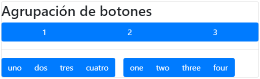

# **Componentes Bootstrap**

Tabla de contenidos


# 8. Componentes responsive
Además del sistema de rejilla, Bootstrap incluye un completo conjunto de componentes para facilitarnos aún más el diseño de una web responsive. Estos componentes aplican estilos a los elementos HTML existentes para crear un diseño más moderno y además adaptable a todos los dispositivos como hemos visto en tablas y formularios.

Algunos de estos componentes son:
- Botones 
- Desplegables 
- Navegación
- Barras de navegación 

y muchos más... 

A continuación se explica el funcionamiento de los componentes más utilizados.

## 8.1. Botones

Mediante la clase `.btn` podemos aplicar estilo a los elementos tipo button. 

Siempre debemos asignar la clase `.btn` y alguna de las otras clases con un significado propio indicado por su color.

Cada una de estas clases define un estilo particular para un botón y tiene un significado que nos ayudan a definir en que caso los debemos utilizar:

| Tipo | Descripción | 
| --- | --- |
| `btn-primary` | Es un botón que se destaca entre un conjunto de botones. |
| `btn-secondary` | Es un botón no tan importante como btn-primary. |
| `btn-success` | Se utiliza para indicar una acción exitosa (por ejemplo luego de registrarse a un servicio donde se muestra un botón para ir a la página principal del sitio) |
| `btn-info` | Es un botón para información. |
| `btn-warning` | Es un botón que nos informa que debemos tener cuidado con la acción que tiene asociado el botón. |
| `btn-danger` | Indica que la acción que tiene asociado el botón es peligrosa. |
| `btn-dark` | Muestra un botón oscuro. |
| `btn-light` | Muestra un botón claro. |
| `btn-link` | Convierte al botón como un hipervínculo, haciendo que disminuya su importancia. |

```html
    <form>
      <div class="form-group">
        <button type="submit" class="btn btn-primary">
        btn-primary : Es un botón que se destaca entre un conjunto de botones.</button>       
      </div> 
      <div class="form-group">
        <button type="submit" class="btn btn-secondary">
        btn-secondary : Es un botón no tan importante como btn-primary.</button>       
      </div>       
      <div class="form-group">
        <button type="submit" class="btn btn-success">
        btn-success : Se utiliza para indicar una acción exitosa.</button>       
      </div> 
      <div class="form-group">
        <button type="submit" class="btn btn-info">
        btn-info : Es un botón para información.</button>       
      </div> 
      <div class="form-group">
        <button type="submit" class="btn btn-warning">
        btn-warning : Es un botón que nos informa que debemos tener 
        cuidado con la acción que tiene asociado el botón.</button>       
      </div> 
      <div class="form-group">
        <button type="submit" class="btn btn-danger">
        btn-danger : Indica que la acción que tiene asociado el botón 
        es peligrosa.</button>       
      </div> 
      <div class="form-group">
        <button type="submit" class="btn btn-dark">
        btn-dark : Muestra un botón oscuro.</button>       
      </div>       
      <div class="form-group">
        <button type="submit" class="btn btn-light">
        btn-light : Muestra un botón claro.</button>       
      </div>             
      <div class="form-group">
        <button type="submit" class="btn btn-link">
        btn-link : Convierte al botón como un hipervínculo, haciendo
        que disminuya su importancia.</button>       
      </div> 
    </form>
```


### 8.1.1. Elemento tipo botón.

Estas clases no son exclusivas para las etiquetas button sino que también funcionarán de la misma forma con `<a>` y `<input>`:

```html
<a class="btn btn-primary" href="#" role="button">Link</a>
<button class="btn btn-primary" type="submit">Button</button>
<input class="btn btn-primary" type="button" value="Input">
<input class="btn btn-primary" type="submit" value="Submit">
<input class="btn btn-primary" type="reset" value="Reset">
```


### 8.1.2. Tamaño de los botones

Podemos variar el tamaño de los botones simplemente añadiendo las clases `.btn-lg`, `.btn-sm` o `.btn-block`, para obtener botones con un tamaño más grande, más pequeño, o un botón que ocupe todo el ancho. Por ejemplo, con el siguiente código:

```html
<button type="button" class="btn btn-primary btn-lg">Large button</button>
<button type="button" class="btn btn-primary btn-sm">Small button</button>
<button type="button" class="btn btn-primary btn-block">Block button</button>
```


### 8.1.3. Botones deshabilitados

Para que un botón aparezca activado o desactivado utilizamos las siguientes clases: .active y .disabled. Se pueden usar para botones, inputs y enlaces.

```html
<button type="button" class="btn btn-primary active">Active Primary</button>
<button type="button" class="btn btn-primary" disabled>Disabled Primary</button>
<a href="#" class="btn btn-primary disabled">Disabled Link</a> 
```


### 8.1.4. Agrupación de botones.

Boostrap nos provee la posibilidad de agrupar un conjunto de botones mediante la clase "btn-group". Los botones se agrupan pegados en la misma fila.

En algunas situaciones podemos agrupar un conjunto de grupos de botones y crear una barra de herramientas.

```html
<div class="btn-group">
  <button type="button" class="btn btn-primary">1</button>
  <button type="button" class="btn btn-primary">2</button>
  <button type="button" class="btn btn-primary">3</button>
</div>
<hr>
<div class="btn-toolbar">
  <div class="btn-group mr-3">
    <button type="button" class="btn btn-primary">uno</button>
    <button type="button" class="btn btn-primary">dos</button>
    <button type="button" class="btn btn-primary">tres</button>
    <button type="button" class="btn btn-primary">cuatro</button>
  </div> 
  <div class="btn-group">
    <button type="button" class="btn btn-primary">one</button>
    <button type="button" class="btn btn-primary">two</button>
    <button type="button" class="btn btn-primary">three</button>
    <button type="button" class="btn btn-primary">four</button>
  </div>
  </div>
  ```
  


> Más sobre botones, en la página oficial de [bootstrap](https://getbootstrap.com/docs/4.4/components/buttons/)


## 8.2. Desplegables

Bootstrap nos facilita la creación de botones con listas de opciones desplegables mediante la clase `.dropdown`. Este elemento requiere que el plugin JavaScript de Bootstrap esté incluido en la plantilla. La estructura básica para crear un elemento de este tipo es la siguiente:

```html
<div class="dropdown">
  <button class="btn btn-secondary dropdown-toggle" type="button" id="dropdownMenuButton" data-toggle="dropdown" aria-haspopup="true" aria-expanded="false">
    Dropdown button
  </button>
  <div class="dropdown-menu" aria-labelledby="dropdownMenuButton">
    <a class="dropdown-item" href="#">Action</a>
    <a class="dropdown-item" href="#">Another action</a>
    <a class="dropdown-item" href="#">Something else here</a>
  </div>
</div>
```

Con lo que obtendríamos el siguiente resultado:


Sobre el botón principal podemos aplicar todos los colores de botones que hemos visto en el anterior punto, por ejemplo "`.btn-success`" o "`.btn-dange`r". También podemos añadir los modificadores de tamaño "`.btn-lg`" y "`.btn-sm`" para aumentar o disminuir el tamaño del botón del desplegable.

Si nos fijamos en el código anterior, para el botón principal se ha usado la etiqueta `<button>` y para los elementos del desplegable la etiqueta `<a>`, sin embargo podríamos haber usado solamente la etiqueta `<a>` o solamente la etiqueta `<button>`, es decir, funcionan exactamente igual y su apariencia es la misma.

Los atributos que empiezan con "aria" son para crear contenido accesible, para que los lectores de pantalla pueden encontrar las etiquetas correctas a la hora de interpretar el contenido. Para más información consultar la documentación sobre [HTML 5 ARIA](https://developers.google.com/web/fundamentals/accessibility/semantics-aria?hl=es).

Para alinear un menú a la derecha se puede añadir la clase .dropdown-menu-right a la lista "dropdown-menu", por ejemplo:

```html
<div class="dropdown-menu dropdown-menu-right">
```

### 8.2.1. Encabezados en un desplegable

Para añadir un encabezado (o varios) y dividir en secciones un desplegable podemos utilizar la clase `.dropdown-header` de la siguiente forma:

```html
<div class="dropdown">
  <button type="button" class="btn btn-primary dropdown-toggle" data-toggle="dropdown">
    Dropdown button
  </button>
  <div class="dropdown-menu">
    <h5 class="dropdown-header">Dropdown header</h5>
    <a class="dropdown-item" href="#">Link 1</a>
    <a class="dropdown-item" href="#">Link 2</a>
    <a class="dropdown-item" href="#">Link 3</a>
    <h5 class="dropdown-header">Dropdown header</h5>
    <a class="dropdown-item" href="#">Another link</a>
  </div>
</div>
```


### 8.2.2. Separadores en un desplegable

También podemos añadir separadores en un desplegable mediante la clase `.dropdown-divider` de la forma:

```html
<div class="dropdown">
  <button type="button" class="btn btn-primary dropdown-toggle" data-toggle="dropdown">
    Dropdown button
  </button>
  <div class="dropdown-menu">
    <h5 class="dropdown-header">Dropdown header</h5>
    <a class="dropdown-item" href="#">Link 1</a>
    <a class="dropdown-item" href="#">Link 2</a>
    <a class="dropdown-item" href="#">Link 3</a>
    <div class="dropdown-divider"></div>
    <h5 class="dropdown-header">Dropdown header</h5>
    <a class="dropdown-item" href="#">Another link</a>
  </div>
</div>
```


> Más sobre desplegables, en la página oficial de [bootstrap](https://getbootstrap.com/docs/4.4/components/dropdowns/)


## 8.3. Navegación

Los elementos de navegación de Bootstrap comparten la etiqueta `.nav` para su marcado en la clase contenedora. Estos elementos necesitan la librería JavaScript para su correcto funcionamiento. Algunos de los elementos de navegación que podemos utilizar son las fichas o pestañas y las "píldoras".

### 8.3.1. Fichas o pestañas

Mediante la clase `.nav-tabs` podemos crear un grupo de pestañas o fichas, para ello tenemos que seguir la siguiente estructura:

```html
<ul class="nav nav-tabs">
  <li class="nav-item">
    <a class="nav-link active" href="#">Active</a>
  </li>
  <li class="nav-item">
    <a class="nav-link" href="#">Link</a>
  </li>
  <li class="nav-item">
    <a class="nav-link" href="#">Link</a>
  </li>
  <li class="nav-item">
    <a class="nav-link disabled" href="#">Disabled</a>
  </li>
</ul>
```

Es importante que nos fijemos en cómo se usan las clases CSS `.nav`, `.nav-tabs`, `.nav-item` y `.nav-link`. Cada elemento del menú será un `.nav-item`, los cuales contienen un enlace tipo `.nav-link` a la sección a mostrar. Para marcar el elemento del menú que está activo o seleccionado se utiliza la clase `.active`. Además disponemos de la clase `.disabled` para deshabilitar elementos del menú.

Si visualizamos el código de ejemplo anterior obtendríamos un menú en forma de pestañas como el siguiente:


### 8.3.2. Pildoras

La clase `.nav-pills` se define de igual forma que la `.nav-tab` pero sus elementos adoptarán una apariencia más similar a botones o "píldoras":

```html
<ul class="nav nav-pills">
  <li class="nav-item">
    <a class="nav-link active" href="#">Active</a>
  </li>
  <li class="nav-item">
    <a class="nav-link" href="#">Link</a>
  </li>
  <li class="nav-item">
    <a class="nav-link" href="#">Link</a>
  </li>
  <li class="nav-item">
    <a class="nav-link disabled" href="#">Disabled</a>
  </li>
</ul>
```


También podemos crear un menú vertical o apilado añadiendo la clase `.flex-column` a la etiqueta contenedora:

```html
<ul class="nav nav-pills flex-column">
  <li class="nav-item">
    <a class="nav-link active" href="#">Active</a>
  </li>
  <li class="nav-item">
    <a class="nav-link" href="#">Link</a>
  </li>
  <li class="nav-item">
    <a class="nav-link" href="#">Link</a>
  </li>
  <li class="nav-item">
    <a class="nav-link disabled" href="#">Disabled</a>
  </li>
</ul>
```


### 8.3.3. Ancho justificado

También podemos indicar que el ancho de las pestañas o de las píldoras se distribuya equitativamente según el ancho disponible. Para esto simplemente tenemos que aplicar la clase `.nav-fill` a la etiqueta contenedora, de la forma:

```html
<ul class="nav nav-pills nav-fill">
  <li class="nav-item">
    <a class="nav-link active" href="#">Active</a>
  </li>
  <li class="nav-item">
    <a class="nav-link" href="#">Longer nav link</a>
  </li>
  <li class="nav-item">
    <a class="nav-link" href="#">Link</a>
  </li>
  <li class="nav-item">
    <a class="nav-link disabled" href="#">Disabled</a>
  </li>
</ul>
```


> Este estilo no funcionará para pantallas con un ancho menor a 768px, que son las pantallas definidas como extra pequeñas o de smartphone. Para estos tamaños cada elemento del menú ocupará el ancho justo que necesite

### 8.3.4. Elementos de navegación con desplegables

También podemos añadir elementos desplegables a nuestros menús de navegación, tanto al de tipo tabs como al de píldoras. Para esto simplemente añadiremos el dropdown como un elemento del menú más, usando la notación que vimos en la sección "Desplegables", pero llevan cuidado de que para la etiqueta incicial (que en el dropdown normal era `<div class="dropdown">`) se utilice el propio elemento `.nav-item` del menú, añadiendo la clase `.dropdown` de la forma: `<li class="nav-item dropdown">`. A continuación se incluye un ejemplo completo:

```html
<ul class="nav nav-tabs">
  <li class="nav-item">
    <a class="nav-link active" href="#">Active</a>
  </li>
  <li class="nav-item dropdown">
    <a class="nav-link dropdown-toggle" data-toggle="dropdown" href="#" role="button" 
       aria-haspopup="true" aria-expanded="false">Dropdown</a>
    <div class="dropdown-menu">
      <a class="dropdown-item" href="#">Action</a>
      <a class="dropdown-item" href="#">Another action</a>
      <a class="dropdown-item" href="#">Something else here</a>
      <div class="dropdown-divider"></div>
      <a class="dropdown-item" href="#">Separated link</a>
    </div>
  </li>
  <li class="nav-item">
    <a class="nav-link" href="#">Link</a>
  </li>
  <li class="nav-item">
    <a class="nav-link disabled" href="#">Disabled</a>
  </li>
</ul>
```


## 8.3. Barra de navegación

Bootstrap nos facilita la creación de la barra principal de navegación de nuestra web mediante la clase `.navbar`. Esta barra se adaptará al tamaño de pantalla, mostrando los elementos colapsados en un botón en pantallas pequeñas y de forma normal para pantallas más grandes.

Para añadir esta barra a nuestro sitio web utilizaremos la etiqueta "`<nav>`", que es la etiqueta de HTML 5 que identifica un elemento de navegación. En caso de no usar esta etiqueta también podemos crear la barra de navegación usando un "`<div>`", pero en este caso tendremos que añadir el atributo `role="navigation"` por cuestiones de accesibilidad. Además, en esta etiqueta también añadiremos dos etiquetas para indicar el estilo y los colores a aplicar con "`.navbar-light` `.bg-light`" (más adelante veremos qué otros colores podemos usar), y la etiqueta `.navbar-expand-lg` para indicar el tamaño a partir del cual la barra se mostrará de forma expandida. La etiqueta `.navbar-expand-lg` indica que la barra se mostrará en su tamaño completo a partir del tamaño de pantalla grande (***lg***), colapsándose para tamaños más pequeños. Este sería el comportamiento por defecto, pero si queremos lo podemos modificar cambiando el tamaño "`lg`" por otro de los posibles tamaños definidos por Bootstrap: "`sm`", "`md`", "`lg`" o "`xl`".

Dentro de la etiqueta "`<nav>`" el contenido de la barra estará dividido en tres secciones:
- Nombre o logotipo de la web, marcado con la etiqueta "`.navbar-brand`". 
- Botón toggler marcado con "`.navbar-toggler`", que se mostrará únicamente cuando el menú se colapse y se ocultará cuando el menú aparezca expandido. Cuando sea visible podremos pulsar sobre él para mostrar u ocultar el menú. 
- Las opciones de menú, las cuales las añadiremos dentro de una lista tipo "`<lu>`" con la clase "`.navbar-nav`". Además, esta lista la tendremos que meter dentro de una caja "`<div>`" con las clases "`.collapse` `.navbar-collapse`", que definirá la zona que se colapsará (u ocultará) para pantallas pequeñas. 
Cada elemento de la lista de menú `<lu>` se definirá mediante una etiqueta `<li>` sobre la que aplicaremos la clase `.nav-item`. Además, como ya veremos más adelante, podremos añadir otros elementos dentro de las opciones de menú, como por ejemplo un formulario. 

A continuación se incluye un ejemplo completo de una barra de navegación:

```html
<nav class="navbar navbar-expand-lg navbar-light bg-light">
  <a class="navbar-brand" href="#">Navbar</a>
  <button class="navbar-toggler" type="button" data-toggle="collapse" 
          data-target="#navbarSupportedContent" aria-controls="navbarSupportedContent" 
          aria-expanded="false" aria-label="Toggle navigation">
    <span class="navbar-toggler-icon"></span>
  </button>

  <div class="collapse navbar-collapse" id="navbarSupportedContent">
    <ul class="navbar-nav mr-auto">
      <li class="nav-item active">
        <a class="nav-link" href="#">Home <span class="sr-only">(current)</span></a>
      </li>
      <li class="nav-item">
        <a class="nav-link" href="#">Link</a>
      </li>
      <li class="nav-item dropdown">
        <a class="nav-link dropdown-toggle" href="#" id="navbarDropdown" role="button" 
           data-toggle="dropdown" aria-haspopup="true" aria-expanded="false">
          Dropdown
        </a>
        <div class="dropdown-menu" aria-labelledby="navbarDropdown">
          <a class="dropdown-item" href="#">Action</a>
          <a class="dropdown-item" href="#">Another action</a>
          <div class="dropdown-divider"></div>
          <a class="dropdown-item" href="#">Something else here</a>
        </div>
      </li>
      <li class="nav-item">
        <a class="nav-link disabled" href="#">Disabled</a>
      </li>
    </ul>
    <form class="form-inline my-2 my-lg-0">
      <input class="form-control mr-sm-2" type="search" placeholder="Search" aria-label="Search">
      <button class="btn btn-outline-success my-2 my-sm-0" type="submit">Search</button>
    </form>
  </div>
</nav>
```

Si añadimos este código a nuestro sitio Web y lo visualizamos con un navegador, obtendremos el siguiente resultado cuando lo visualicemos en pantallas medianas y grandes:


En las pantallas pequeñas los elementos de navegación se colapsarían en un botón (toggler), de la forma:


### 8.3.1. Imagen en la barra de navegación.

Para incluir el logotipo de nuestra web en la barra de navegación tenemos que modificar la sección `.navbar-brand` del ejemplo anterior para incluir la etiqueta ``, de la forma:

```html
<nav class="navbar navbar-light bg-light">
  <a class="navbar-brand" href="#">
    
  </a>
  ...
</nav>

<!-- O si queremos incluir un logotipo y texto... -->
<nav class="navbar navbar-light bg-light">
  <a class="navbar-brand" href="#">
    
    Bootstrap
  </a>
</nav>
```

