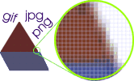
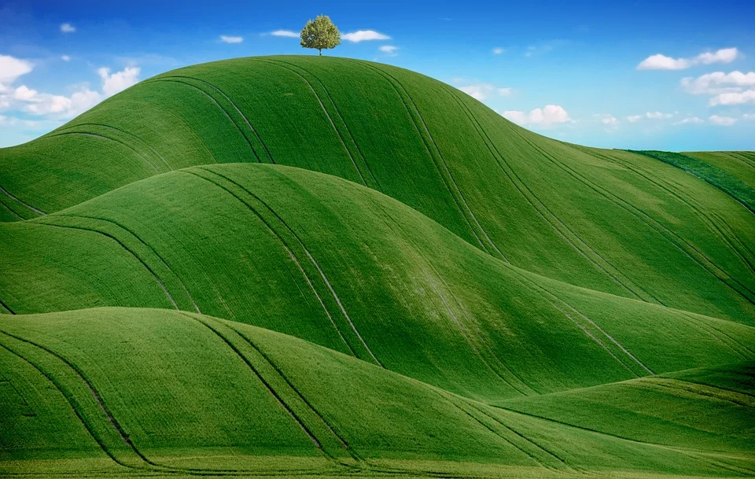
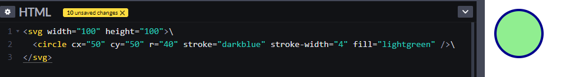

# 1. **Imágenes en las páginas web**

Tabla de contenidos

- [1. **Imágenes en las páginas web**](#1-imágenes-en-las-páginas-web)
  - [1.1. Tipos de imágenes](#11-tipos-de-imágenes)
  - [1.2. Mapas de bits](#12-mapas-de-bits)
    - [1.2.1. Imágenes JPG](#121-imágenes-jpg)
    - [1.2.2. Imágenes GIF](#122-imágenes-gif)
    - [1.2.3. Imágenes PNG](#123-imágenes-png)
    - [1.2.4. Imágenes WebP](#124-imágenes-webp)
    - [1.2.5  diferencias entre JPG, PNG, GIF y WepP:](#125-diferencias-entre-jpg-png-gif-y-wepp)
    - [1.2.5 Optimizar imágenes](#125-optimizar-imágenes)
  - [1.3. Imágenes vectoriales (svg)](#13-imágenes-vectoriales-svg)
  - [1.4. Uso en la web](#14-uso-en-la-web)
  - [1.5. Uso y abuso de imágenes](#15-uso-y-abuso-de-imágenes)


Bien sea para ilustrar la información contenida en nuestras páginas o para integrar un largo texto o, por que no, por cuestiones estéticas, es prácticamente imposible (y poco aconsejable) evitar colocar alguna que otra imagen en nuestras páginas. 

Al emplear las imágenes debemos guiarnos por unas cuantas reglas básicas:

- Procurar que las **imágenes sirvan para algo**, que cuenten una historia. En el tutor HTML verás que las imágenes tienen un atributo (alt) que se usa como descriptor de la imagen. Este atributo ayuda a los buscadores para indexar nuestras páginas y a mecanismos de accesibilidad para leerla. Importante para que el **usuario tenga un buena experiencia** al visitar vuestro sitio
- Usa el atributo title para dar alguna información cuando se pasa el ratón por encima de la imagen. Las orientaciones al usuario siempre son de agradecer, mejoran su experiencia en el sitio.
- Es importante controlar el tamaño de las imágenes que vayamos a colocar en nuestras páginas. Aunque la red es rápida siempre son preferibles páginas con timepos de carga mínimos.
- Procurar un equilibrio entre tamaño del archivo de imagen y calidad de ésta. A veces una imagen muy grande requiere una compresión tal que al final tenemos una calidad pésima. Así que debemos plantearnos el tipo de imagen a usar.
- Una buena infografía puede sustituir o complementar a un texto. El ojo humano adquiere una enorme cantidad de información visual en tiempos increiblemetne cortos.

Las páginas aparte de imágenes, tienen scripts u hojas de estilo *css*, por ello es necesario controlar que la página no pese demasiado. Un visitante que tiene que esperar más de 2 o 5 seg para obtener un resultado en su pantalla es seguro que se marchará a otro sitio más rápido y, lo que es peor, probablemente no volverá.

La información visual llega a nuestros cerebros a velocidades increíblemente rápidas y de forma inconsciente, no se filtran.

## 1.1. Tipos de imágenes

Fíjate en las imágenes mostradas en tu monitor. Estas imágenes están formadas por unos puntos muy pequeños llamados pixels. Si tu monitor fuera de aquellos en blanco y negro utilizados en la época de los pioneros, cada pixel podía estar encendido (color blanco) o apagado (color negro).

En los monitores de color actuales cada pixel o punto de pantalla no representa esos dos únicos colores, como sabes pueden mostrar millones de colores y tonalidades. Pero la idea es la misma. La imagen está formada por puntos y el ordenador los maneja como bits.

A la hora de almacenar una imagen en un archivo se deberían guardar todos esos bits, uno a uno, pero esto podría ocupar mucho espacio por eso se guardan comprimidos de alguna manera. Te vas a encontrar con diferentes formas de hacer esto, básicamente exitsten dos formas: los mapas de bits y las imágenes vectoriales

Las imágenes se basan en puntos de color combinados

## 1.2. Mapas de bits

Por simplificar, en un monitor en blanco y negro, cada punto de la pantalla es o blanco o negro, almacenar esa imagen en un archivo es sumamente fácil: cada punto (blanco o negro) es un bit (1 o 0). Si la imagen tiene 240 puntos ocupa 240 bits (240:8 = 30 bytes). Pero en realidad cada punto representa más de dos colores, 16 millones (si usamos 24 bits para cada pixel). En este caso la imagen anterior ocupará algo más: 240 puntos x 24 bits : 8 son 720 bytes. Ten en cuenta que 240 puntos es una imagen pequeñita, de 15 pixels de alto por 16 pixels de ancho por ejemplo.



En este método se basan los formatos JPG, PNG o GIF utilizados en las páginas web y que usan diferentes algoritmos para comprimir los archivos y ocupar así menos espacio. Si estas imágenes se escalan (se se les varía el tamaño) la calidad se ve degradada.

### 1.2.1. Imágenes JPG

Usando este formato pueden almacenarse imágenes de hasta 24 bits de color. Es recomendable para fotografías o imágenes con degradados. Cualquier programa editor de gráficos permite guardar una imagen en este formato con diferentes grados de compresión. Lógicamente cuanto más comprimamos la imagen menor es su calidad. Si queremos imágenes de alta calidad debemos soportar archivos de tamaños elevados. Recientemente ha aparecido una variación de este formato denominada JP2 o JPG2000, especialmente destinado a la red. Pero aún no es admitido por todos los exploradores.


### 1.2.2. Imágenes GIF

Este otro formato se usa para imágenes con hasta 256 colores ( 8 bits de color). Frente a esta limitación nos ofrece la posibilidad de definir zonas transparentes y además existe una variante que permite imágenes animadas, muy útil para llamar la atención sobre algo en concreto como puedan ser las novedades de nuestro sitio o un anuncio de algún servicio. Pero conviene no abusar de las animaciones, son archivos muy grandes y pueden llegar a resultar pesados. En nuestro sitio [Gifsanimados](http://gifsanimados.espaciolatino.com) tienes una excelente colección para elegir


### 1.2.3. Imágenes PNG

El formato PNG es el un formato con un magnífico comportamiento para la web. Realmente existen varios formatos PNG: PNG8, que almacena imágenes de hasta 256 colores, PNG24 para imágnes de 24 bits y PNG32 para imágenes de 32 bits. **Permite transparencias** como los GIF y transparencia graduada (colores cuya opacidad van desde el 0%, opacos, hasta el 100%, transparente). Por contra **no admiten animaciones**., no obstante existe una apliación del formato (aPng) que si es capaz de mostrar animaciones, la extensión de estos archivos es también .png.



### 1.2.4. Imágenes WebP

WebP es el **formato de imagen** más reciente en el mundo de la web. Nació 2010 e la mano de Google y pretende convertirse en un estándard desbancado a JPG, Png o Gifs. Soporta **compresión** superior **sin pérdida y con pérdida** para imágenes en la web. Admite transparencias y animaciones. Puede llegar a logra compresiones de alrededor de un 25% superiores a las conseguidas en el formato png. Con respecto al formato Jpg, sus resultados son muy parecidos en fotografías, en imágnes prediseñadas si que mejora los resultados. Sin embargo si presenta una clara ventaja frente a a png y gif.


Los diferentes tipos de imágenes permiten tener más o menos colores y distintos grados de compresión

### 1.2.5  diferencias entre JPG, PNG, GIF y WepP:

- `JPG`: 
  - para imágenes fotográficas 
  - pérdida de calidad acumulativa 
  - no admite transparencias 
  - CMYK y RGB sí 
  - no utilizar para logotipos o imágenes con texto 
  - poco peso.
  
- `PNG`: 
  - perfecto para el logotipo en tu página web, para ilustraciones o dibujos 
  - compresión sin pérdida de calidad 
  - admite transparencias y degradado en las mismas 
  - RGB sí, CMYK no 
  - va muy bien para ilustraciones o imágenes con texto 
  - archivos más pesados.
  
- `GIF`: 
  - para ilustraciones sencillas con bloques de colores planos y sobre todo para crear imágenes con movimiento 
  - admite 256 colores 
  - transparencias absolutas (sin degradado) 
  - poco peso en el disco.

- `WepP`: 
  - Para todo tipo de ilustraciones
  - Permite animaciones
  - Permite transparencias
  - Poco peso

En principio las fotografías quedan mejor en formato JPG, PNG24 o WebP), mientras que las imágenes con colores muy definidos y sin degradados puedes colocarlas en formato GIF o PNG. Evidentemente si lo que necesitas son imágenes animadas estas obligado a usar archivos GIF (SVG permite animación, pero no en cualquier navegador, por ahora). Los formatos SVG funcionan mejor en cliparts y en imágenes geométricas.

### 1.2.5 Optimizar imágenes

El editor de imágnes que uses seguramente posee un optimizador, puede aparecer como exportar para web. Si no es así necesitas un [optimizador independiente](https://creatuweb.espaciolatino.mio/inicio/otras_herramientas.htm). Verás que los distintos formatos admiten varios grados de compresión como el número de colores (si tu imagen tiene 8 colores no uses 256), grado de calidad final (en el caso del JPG, un 80% es alta calidad), guardar la paleta de colores con el archivo (esto aumenta) entre otras, dependerá del optimizador que uses. A veces apurando los parámetros del JPG se obtienen resultados similares al formato WebP.

Deberás probar dioferentes opciones siempre buscando un compromiso entre **tamaño reducido y buena calidad.**

También depende de la finalidad de tus imágenes. Si tu sitio web requiere una alta calidad tendrás que sacrificar el tamaño. Sin embargo si tus imágenes son un elemento auxiliar puedes sacrificar la claidad en pro de un tamaño más reducido.

> Lectura: [Como optimizar imágenes para Web y mejor rendimiento](https://kinsta.com/es/blog/optimizar-imagenes-para-la-web/)

## 1.3. Imágenes vectoriales (svg)

Ese es un método especial para almacenar imágenes. Se basa en **funciones matemáticas para describir la imagen complet**a. Este método no sólo se usa para figuras regulares (rectángulos, cuadrados, círculos) tambien se puede usar para imágenes tipo fotografía. Si alguno de los que leeis estas líneas ha oido hablar de una cosa llamada figuras de Mandelbrot sabrá que es eso de encontrar una función matemática para representar la formas tan poco regulares como un paisaje de montaña y similares. Estas imágenes dan una calidad excelente y **permiten ser escaladas** (modificar su tamaño) sin pérdida de calidad. Un ejemplo son los archivos DXF y otros usados en programas CAD. Esta normallizado por el **W3C**, el mismo que regula el **CSS** o el **HTML**, y soporta animaciones

En las páginas web los verás como archivos **SVG** (**S**calable **V**ector **G**raphics) y es soportado por casi todos los navegadores. Estos gráficos se editan con programas al efecto, incluso de código abierto como el **Draw** de **Libre Office**. Pueden incluirse en una página como archivo SVG, como los restantes formatos o (lo más interesante) **pueden definirse en la propa pagina** como cualquier otro elemento (párrafo, enlace...). Un ejemplo sencillo de una imagen SVG:

```html
<svg width="100" height="100">\
  <circle cx="50" cy="50" r="40" stroke="darkblue" stroke-width="4" fill="lightgreen" />\
</svg>
```

Que daría lugar a



Si aplicas el zoom al navegador veras que en las imágnes superiores se empiezan a distingir los pixels mientras que esta la calidad de esta última no cambia nada.

## 1.4. Uso en la web

- Logos
  - Ayudan a identificar la marca
  - Sirven como enlace al inicio del sitio web
  - Pueden servir para hacer una declaración de conformidad de la página (W3C)
  - Suele usarse formato GIF o PNG

- Iconos.
  - Deben contener el menor detalle posible sin perder significado.
  - Complementan los textos de los enlaces
  - Suele usarse formato GIF o PNG

- Banners
  - Son formatos publicitarios
  - Suele usarse formato GIF, PNG, JPEG o bien animaciones hechas con Java, Flash,
etc.

- Imágenes
  - Aportan información a los artículos de la página
  - Suele usarse formato JPEG.

## 1.5. Uso y abuso de imágenes

Las imágenes debe ser tratadas antes de subirlas a la red; deben estar ***comprimidas*** y no es recomendable que ocupen mas de 100KB, puesto que en caso contrario podrían ralentizar y sobrecargar la conexión del servidor.

Si es necesario, redimensiona la imagen para que se adapte correctamente a tu web y haz que todas tu imágenes tengan el mimos formato y tamaño. 

Recuerda que por ejemplo, los tamaños recomendados de imágenes para las redes sociales son: :

- Youtube: 1280px x 720px
- Facebook: 1200px x 628px
- Twitter: 1024px x 512px
- Instagram: 1080px x 1080px
- Pinterest: 735px x 1102px

Como nota final recuerda que lo aconsejable es que las imágenes cuenten alguna historia, lógicametne relacionada con el contenido del sitio. En eta línea decir que las infografías son muy útiles y apreciadas.

No hay que renunciar a las imágnes decorativas, pero procurando qeu tengan una utilidad clara como llmar la atención sobre algo, descansar la vista entre mucho texto y similares.

Y por supuesto **no abuses de las imágenes no imprescindibles**, sin más motivo que el hecho de que quedan bonitas. Cuida el peso de tu página y procura qu no distragian del contenido que quieres transmitir.

